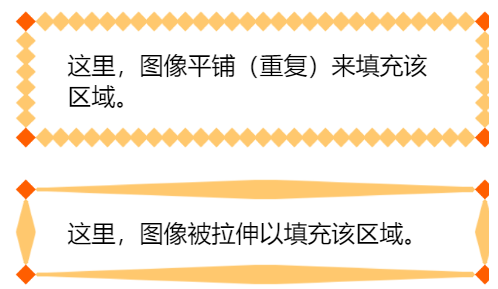
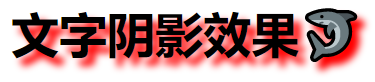
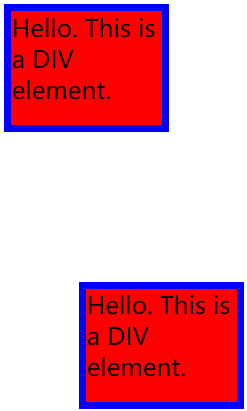
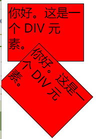
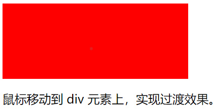
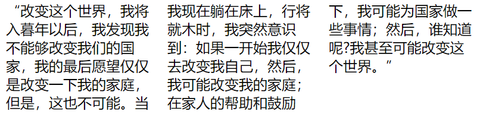
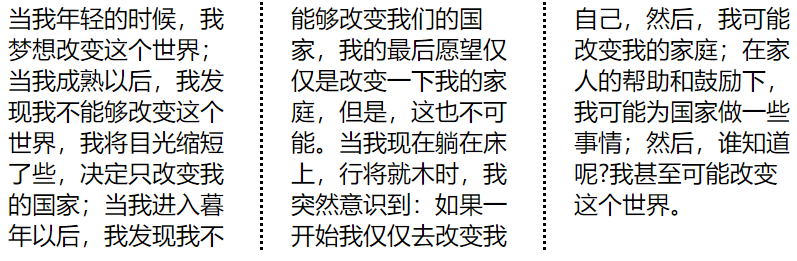
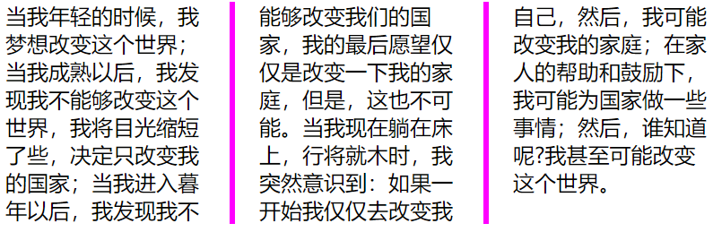
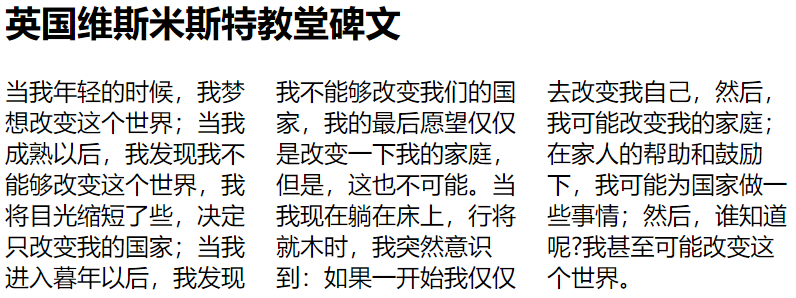

一些最重要 CSS3 模块如下：

- 选择器
- 盒模型
- 背景和边框
- 文字特效
- 2D/3D转换
- 动画
- 多列布局
- 用户界面

# 1. 边框

**边框属性：**

- border-radius
- box-shadow
- border-image

**border-image使用图像创建一个边框**

* 使得绘制复杂的外观组件更加简单，也不用在某些情况下使用九宫格了

* 语法
  border-image: image-source image-height image-width image-repeat
  repeat以重复、平铺的方式创建边框；
  stretch以拉伸的方式创建边框

  ```html
  <style>
  /* border-image: image-source image-height image-width image-repeat */
  border-image: url("/images/border.png") 30 30 repeat;
  border-image: url("/images/border.png") 30 30 stretch;
  </style>
  ```

  

  

# 2. 文本效果

**文本属性：**

- text-shadow
- box-shadow
- text-overflow
- word-wrap
- word-break

**1. text-shadow**
为文字添加阴影。
可以为文字与  [`text-decorations`](https://developer.mozilla.org/zh-CN/docs/Web/CSS/text-decoration)  添加多个阴影，阴影值之间用逗号隔开。每个阴影值由元素在X和Y方向的偏移量、模糊半径和颜色值组成

语法：
offset-x | offset-y | blur-radius | color

```html
<style>
  h1
  {
    text-shadow: 5px 5px 5px #FF0000;
  }
</style>
<body>
  <h1>Text-shadow effect!</h1>
</body>
```



**2. text-overflow**

确定如何向用户发出未显示的溢出内容信号。它可以被剪切，显示一个省略号（'...'）或显示一个自定义字符串。
一般在容器的极限处进行截断。如果想在裁剪处显示空白符，可以使用 (`''`).
这个属性只对那些在块级元素溢出的内容有效，但是必须要与块级元素内联(inline)方向一致。

* 可选值
  **clip**此为默认值。这个关键字的意思是"在内容区域的极限处截断文本"，因此在字符的中间可能会发生截断。
  **ellipsis**这个关键字的意思是“用一个省略号 (`'…'`,)来表示被截断的文本”。这个省略号被添加在内容区域中，因此会减少显示的文本。如果空间太小到连省略号都容纳不下，那么这个省略号也会被截断。
  **'<string>'**用来表示被截断的文本。字符串内容将被添加在内容区域中，所以会减少显示出的文本。如果空间太小到连省略号都容纳不下，那么这个字符串也会被截断。---只在 Firefox 浏览器下有效，其他浏览器仍然是clip截断效果。

  ```html
  <style>
    div.test {
      white-space: nowrap;
      width: 12em;
      overflow: hidden;
      border: 1px solid #000000;
    }
  </style>
  <body>
    <p>以下 div 容器内的文本无法完全显示，可以看到它被裁剪了。</p>
    <p>div 使用 &quot;text-overflow:ellipsis&quot;:</p>
  
    <div class="test" style="text-overflow:ellipsis;">
      This is some long text that will not fit in the box
    </div>
    <p>div 使用 &quot;text-overflow:clip&quot;:</p>
    <div class="test" style="text-overflow:clip;">
      This is some long text that will not fit in the box
    </div>
    <p>div 使用自定义字符串 &quot;text-overflow: &gt;&gt;&quot;(只在 Firefox 浏览器下有效):</p>
    <div class="test" style="text-overflow:'>>';">
      This is some long text that will not fit in the box
    </div>
  </body>
  ```

**3.word-break** 
指定了怎样在单词内断行。

**4.word-wrap**
对长的不可分割的单词进行分割并换行到下一行。

# 3. 2D、3D转换

## 3.1 2D变换方法

- translate()
- rotate()
- scale()
- skew()
- matrix()

**translate()方法**
根据左(X轴)和顶部(Y轴)位置给定的参数，从当前元素位置移动。---把当前元素复制一份到另一位置。

```html
<style>
  div {
    width: 100px;
    height: 75px;
    background-color: red;
    border: 5px solid blue;
  }
  div#div2 {
    transform: translate(50px, 100px);
    -ms-transform: translate(50px, 100px);
    /* IE 9 */
    -webkit-transform: translate(50px, 100px);
    /* Safari and Chrome */
  }
</style>
</head>
<body>
  <div>Hello. This is a DIV element.</div>
  <div id="div2">Hello. This is a DIV element.</div>
</body>
```



**rotate()方法**
将元素旋转；在一个给定度数顺时针旋转的元素。负值是允许的，这样是元素逆时针旋转。

```html
<style>
  div {
    width: 100px;
    height: 75px;
    background-color: red;
    border: 1px solid black;
  }
  div#div2 {
    transform: rotate(30deg);
    -ms-transform: rotate(30deg);/* IE 9 */
    -webkit-transform: rotate(45deg);/* Safari and Chrome */
  }
</style>
</head>

<body>
  <div>你好。这是一个 DIV 元素。</div>
  <div id="div2">你好。这是一个 DIV 元素。</div>
</body>
```



**scale()方法**
该元素增加或减少的大小，取决于宽度（X轴）和高度（Y轴）的参数：

**skew()方法**
包含两个参数值，分别表示X轴和Y轴倾斜的角度，如果第二个参数为空，则默认为0，参数为负表示向相反方向倾斜。

skewX(<angle>);表示只在X轴(水平方向)倾斜。
skewY(<angle>);表示只在Y轴(垂直方向)倾斜。

**2D变换方法合并**

**matrix() 方法**
matrix()方法和2D变换方法合并成一个。
matrix 方法有六个参数，包含旋转，缩放，移动（平移）和倾斜功能。

```html
<style>
  div{
    transform:matrix(0.866,0.5,-0.5,0.866,0,0);
    -ms-transform:matrix(0.866,0.5,-0.5,0.866,0,0); /* IE 9 */
    -webkit-transform:matrix(0.866,0.5,-0.5,0.866,0,0); /* Safari and Chrome */
  }
</style>
```

## 3.2 3D转换

使用 3D 转换来对元素进行格式化

3D 转换方法：

- rotateX()
- rotateY()

**rotateX()方法**
围绕其在一个给定度数X轴旋转的元素。

**rotateY()方法**
围绕其在一个给定度数Y轴旋转的元素。

# 4. 过渡

transition属性添加某种效果可以从一种样式转变到另一个

必须规定两项内容：

- 指定要添加效果的CSS属性
- 指定效果的持续时间。
  如果未指定的期限，transition将没有任何效果，因为默认值是0。

```html
<style>
  div {
    width: 100px;
    height: 100px;
    background: red;
    transition: width 2s;
    -webkit-transition: width 2s;
    /* Safari */
  }
  div:hover {
    width: 300px;
  }
</style>
</head>
<body>
  <div></div>
  <p>鼠标移动到 div 元素上，实现过渡效果。</p>
</body>
```



要添加多个样式的变换效果，添加的属性由逗号分隔：
transition: width 2s, height 2s, transform 2s;

# 5. 多列

将文本内容设计成像报纸一样的多列布局

多列属性:

- `column-count`
- `column-gap`
- `column-rule-style`
- `column-rule-width`
- `column-rule-color`
- `column-rule`
- `column-span`
- `column-width`

* **column-count 属性指定了需要分割的列数。---创建多列**

```html
<style> 
  .newspaper{
    -moz-column-count:3; /* Firefox */
    -webkit-column-count:3; /* Safari and Chrome */
    column-count:3;
  }
</style>
<body>
  <div class="newspaper">
    “改变这个世界，我将入暮年以后，我发现我不能够改变我们的国家，我的最后愿望仅仅是改变一下我的家庭，但是，这也不可能。当我现在躺在床上，行将就木时，我突然意识到：如果一开始我仅仅去改变我自己，然后，我可能改变我的家庭；在家人的帮助和鼓励下，我可能为国家做一些事情；然后，谁知道呢?我甚至可能改变这个世界。”
  </div>
</body>
```



* **column-gap 属性指定了列与列间的间隙**

```html
<body>
  div {
  -webkit-column-gap: 40px; /* Chrome, Safari, Opera */
  -moz-column-gap: 40px; /* Firefox */
  column-gap: 40px;
  }
</body>
```

**column-rule-style 属性指定了列与列间的边框样式：实线、虚线**

```html
<body>
  div {
  -webkit-column-rule-style: solid; /* Chrome, Safari, Opera */
  -moz-column-rule-style: solid; /* Firefox */
  column-rule-style: solid;
  }
  </bod
```




**column-rule-width属性指定了两列的边框厚度:**

**column-rule-color属性指定了两列的边框颜色：**

**column-rule属性是 column-rule-* 所有属性的简写。**
可以直接设置列的边框的厚度，样式及颜色：

```html
<style> 
  .newspaper{
    column-count:3;

    column-gap:40px;
    column-rule:4px outset #ff00ff;
  }
</style>
```



 **column-span:指定元素跨越多少列**

```html
<style>
  .newspaper{
    column-count:3;
  }
  h2{
    column-span:all;
  }
</style>
```



**column-width 属性指定了列的宽度**

