# 引入

## CSS层叠样式表

网页实际上是一个多层的结构，通过CSS可以分别为网页的每一个层来设置样式，而最终我们能看到只是网页的最上边一层

CSS用来设置网页中元素的样式

## 样式引入的三种方式

**一、内联样式，行内样式**
不推荐使用（仅支持一行元素，其他还需要重新设置，在标签内部通过style属性来设置元素的样式
**存在问题**：使用内联样式，样式只能对一个标签生效，如果希望影响到多个元素必须在每一个元素中都复制一遍，并且当样式发生变化时，我们必须要一个一个的修改，非常的不方便

**注意**：开发时绝对不要使用内联样式，样式写在了标签里面。

```html
<p style="color:red; font-size: 20px;">少小离家老大回，乡音无改鬓毛衰</p>
<!-- style为属性 color值就是css样式名字， red是值
属性="样式名：样式值；"
-->
<p style="color: red; font-size: 60px;">今天天气真不错！</p>
```

**二、内部样式表**

将样式编写到head中的style标签里，然后通过CSS的选择器来选中元素并为其设置各种样式，可以同时为多个标签设置样式，并且修改时只需要修改一处即可全部应用，内部样式表更加方便对样式进行复用。

**存在问题**：
我们的内部样式表只能对一个网页起作用，它里边的样式不能跨页面进行复用

```html
<head>
  <meta charset="UTF-8">
  <meta http-equiv="X-UA-Compatible" content="IE=edge">
  <meta name="viewport" content="width=device-width, initial-scale=1.0">
  <title>Document</title>
  <style>
    p{  /*p表示对页面里的所有p元素都生效;  格式化：每一行写一个样式  font字体 */
      color: green;
      font-size: 20px;
    }
  </style>
</head>
<body>
  <p style="color:red; font-size: 20px;">少小离家老大回，乡音无改鬓毛衰</p>
  <p style="color: red; font-size: 60px;">今天天气真不错！</p>
  <p>落霞与孤鹜齐飞，秋水共长天一色</p>
</body>
```

三、外部样式表

最佳实践 ==》谁想用 link引入一下就可以

- 可以将CSS样式编写到一个外部的CSS文件中，然后通过link标签来引入外部的CSS文件
- 外部样式表需要通过link标签进行引入，意味着只要想使用这些样式的网页都可以对其进行引用，使样式可以在不同页面之间进行复用
- 将样式编写到外部的CSS文件中，可以使用到浏览器的缓存机制，（第一次慢需要访问服务器，访问过之后直接在浏览器加载内容，所以快），从而加快网页的加载速度，提高用户的体验。

在页面外部创建一个css样式

```css
p{
    color: tomato;
    font-size: 40px;
}
```

在页面中引入定义好的样式

```html
<head>
  <link rel="stylesheet" href="./style.css">
  <!-- rel 即relation联系、关系  stylesheet样式表href引用-->
</head>
```

# 1. CSS语法

CSS的基本语法:
选择器 声明块

**选择器**

通过选择器可以选中页面中的指定元素，比如 p 的作用就是选中页面中所有的p元素

**声明块**

通过声明块来指定要为元素设置的样式，声明块由一个一个的声明组成，声明是一个名值对结构，一个样式名对应一个样式值，名和值之间以:连接，以;结尾   
用法：样式名:样式值;

理解：选择器就是选择样改变的结构，然后声明对其样式进行设置。

```html
<head>
  <meta charset="UTF-8">
  <meta http-equiv="X-UA-Compatible" content="IE=edge">
  <meta name="viewport" content="width=device-width, initial-scale=1.0">
  <title>Document</title>
  <style>
    p{
      color: red;
    }
    h1{
      color: green;
    }    
  </style>
</head>
<body>
  <h1>我是H1</h1>
  <p>我是段落！</p>
  <p>今天天气真不错！</p>
  <p>今天天气真不错！</p>
</body>
```

# 2. 选择器

## 2.1 常用选择器

常用选择器：元素选择器、id选择器、类选择器、通配选择器

给定HTML结构

```html
<body>
  <!-- 注意多个class之间用空格进行隔开 -->
  <h1 class="blue abc">我是标题</h1>
  <p>少小离家老大回</p>
  <p>乡音无改鬓毛衰</p>
  <p id="black" >儿童相见不相识</p>
  <p>笑问客从何处来</p>
  <!-- 
class 是一个标签的属性，它和id类似，不同的是class可以重复使用
可以通过class属性来为元素分组
可以同时为一个元素指定多个class属性
-->
  <p class="blue">秋水共长天一色</p>
  <p class="blue">落霞与孤鹜齐飞</p>
</body>
```


* **元素选择器**

  作用：根据标签名来选中指定的元素
  语法：标签名{}
  例子：p{}  h1{}  div{}    p h1 div是元素 标签

  ```css
  <style>
    h1{
      color: green;
    }
    p{
      color: red;
    }
  </style>
  ```

* id选择器 "#"
  作用：根据元素的id属性值选中一个元素
  语法：#id属性值{}
  例子：#box{} #red{}  

  ```html
  <style>
    #black{
      color: black;
    }
  </style>
  ```

* 类选择器 "."
  作用：根据元素的class属性值选中一组元素
  语法：.class属性值
  例子：.blue{}

  ```html
  <style>
   .blue{
     color: blue;
    }
    .abc{
      font-size: 50px;
    }
  </style>
  ```

* 通配选择器
  作用：选中页面中的所有元素
  语法: *

  ```html
  <style>
    *{
      color: chartreuse;
    }
  </style>
  ```

## 2.2 复合选择器

给定HTML结构

```html
<body>
  <div class="red">我是div</div>
  <p class="red">我是p元素</p>
  <div class="red2 a b c">我是div2</div>
  <h1>标题</h1>
  <span>哈哈</span>
</body>
```

* 交集选择器
  作用：选中同时复合多个条件的元素（满足所设置的所有选择器才能被定义
  语法：选择器1选择器2选择器3选择器n{}
  注意点：交集选择器中如果有元素选择器，必须使用元素选择器开头

  ```html
  <style>
    div.red{
      font-size: 30px;
    }
    .a.b.c{/*一个元素即是a类又是b类还是c类才能被定义*/
      color: blue;
    }
    /* div#box1{}   也是交集选择器*/
  </style>
  ```

  

* 选择器分组（并集选择器）
  作用：同时选择多个选择器对应的元素   (然后可以对多个选择器进行一起定义)
  语法：选择器1,选择器2,选择器3,选择器n{}
  #b1,.p1,h1,span,div.red{}

  ```html
  <style>
    h1,span{
      color: green;
    }
  
  </style>
  ```

## 2.3关系选择器（父子兄弟）

**补充：**
非语义元素
**div** 没有语义，就用来表示一个区块，目前来讲div还是我们主要的布局元素
**span** 行内元素，没有任何的语义，一般用于在网页中选中文字

给定HTML结构

```html
<body>
  <div class="box">
    我是一个div
    <p>
      我是div中的p元素
      <span>我是p元素中的span</span>
    </p>
    <div></div>
    <span>我是div中的span元素</span>
    <span>我是div中的span元素</span>
  </div>
  
  <span>
    我是div外的span
  </span>
</body>
```

* **子元素选择器**
  作用：选中指定父元素的指定子元素
  语法：父元素 > 子元素

  ```html
  <style>
    /*选中div.box下的所有span元素*/
    div.box > span{
      color: orange;
    }
  </style>
  ```

* **后代元素选择器**
  作用：选中指定元素内的指定后代元素
  语法：祖先 后代

  ```html
  <style>
    /*选择div下的所有span元素*/
    div span{
      color: skyblue
    }
    div > p > span{
      color: red;
    }
  </style>
  ```

  

* **选择下一个兄弟**
  语法：前一个 + 下一个

  ```html
  <style>
    p + span{
      color: red;
    }
  </style>
  ```

  

* **选择下边所有的兄弟**
  语法：兄 ~ 弟

  ```html
  <style>
    p ~ span{
      color: red;
    }
  </style>
  ```

## 2.4 属性选择器

定义HTML结构

```html
<body>
  <!-- title是属性名，后面是属性值 -->
  <p title="abc">少小离家老大回</p>
  <p title="abcdef">乡音无改鬓毛衰</p>
  <p title="helloabc">儿童相见不相识</p>
  <p>笑问客从何处来</p>
  <p>秋水共长天一色</p>
  <p>落霞与孤鹜齐飞</p>
</body>
```

**用法：**

[属性名] 选择含有指定属性的元素
[属性名=属性值] 选择含有指定属性和属性值的元素
[属性名^=属性值] 选择属性值以指定值开头的元素
[属性名$=属性值] 选择属性值以指定值结尾的元素
[属性名*=属性值] 选择属性值中含有某值的元素的元素

**注意：**

1.从上往下执行，后面的代码语句会覆盖上面所设置的内容
2.=等号前后最好不要有空格
p[title] 编程复合选择器 p为元素选择器 title为属性选择器

```html
<style>
  p[title]{
    color: red;
  }
  p[title=abc]{
    color:blue;
  }
  p[title^=a] {
    color: orange;
  }
  p[title$=f]{
    color: gray;
  }
  p[title*=b]{
    color: green;
  }
</style>
```

## 2.5 伪类选择器

定义HTML结构

```html
<body>
  <!-- ul>li  ul>li*5 快速生成结构  tab键快速切换到下一行的位置-->
  <ul>
    <span>我是一个span</span>
    <li>第〇个</li>
    <li>第一个</li>
    <li>第二个</li>
    <li>第三个</li>
    <li>第四个</li>
    <li>第五个</li>
  </ul>
</body>
```

### **常用伪类（不存在的类，特殊的类）**

- 伪类用来描述一个元素的特殊状态
    比如：第一个子元素、被点击的元素、鼠标移入的元素...

- 伪类一般情况下都是使用冒号":"开头

    儿子女儿一起排序
    :first-child 第一个子元素   (总能确保第一个子元素)
    :last-child 最后一个子元素
    :nth-child() 选中第n个子元素
        特殊值：
            n 第n个 n的范围0到正无穷  (全选中)
            2n 或 even 表示选中偶数位的元素
            2n+1 或 odd 表示选中奇数位的元素
    以上这些伪类都是根据所有的子元素进行排序

    

    儿子女儿分开排序

    :first-of-type
    :last-of-type
    :nth-of-type()

    - 这几个伪类的功能和上述的类似，不同点是他们是==在同类型元素中进行排序==

    :not() 否定伪类  （除了）

    - 将符合条件的元素从选择器中去除

```css
<style>
  ul>li:first-child {
    color: tomato;
  }

  ul>li:last-child {
    color: tomato;
  }

  ul>li:nth-child(4) {
    color: yellow;
  }

  ul>li:nth-child(even) {
    color: teal;
  }

  /* 找同类型的 */
  ul>li:first-of-type {
    color: blue;
  }

  ul>li:not(:nth-of-type(4)) {
    color: green;
  }
</style>
```

### a元素的伪类

超链接伪类，属于同一优先级 所以顺序尤为重要
link visited 只能给a绑定  hover active可以给任何元素进行绑定

* :link 用来表示没访问过的链接（正常的链接）

* :visited 用来表示访问过的链接,
  由于隐私的原因，所以**visited这个伪类只能修改链接的颜色**

* :hover 用来表示鼠标移入的状态   （别的元素也可以用）

* :active 用来表示鼠标点击   （激活）鼠标点击的瞬间发生动作  颜色改变

```html
<head>
  <style>
    a:link{
      color: red;
    }
    a:visited{
      color: orange;
      /* font-size: 30px;  没有效果*/
    }
    a:hover{
      color: aqua;
      font-size: 30px;/*鼠标放上去颜色就变并且字体改变*/
    }
    a:active{
      color: yellowgreen;
    }
  </style>
</head>
<body>
  <!-- 
1.没有访问过的链接
2.访问过的链接
-->
  <a href="https://www.baidu.com">访问过的链接</a>
  <br><br>
  <a href="https://www.qq.com">没访问过的链接</a>
</body>
```

## 2.6 伪元素选择器

伪元素，表示页面中一些特殊的并不真实的存在的元素（特殊的位置）

**用法：**伪元素使用 :: 开头

* ::first-letter 表示第一个字母
* ::first-line 表示第一行
* ::selection 表示选中的内容
* ::before 元素的开始     ==》用的较多
* ::after 元素的最后

​      \- before 和 after 必须结合content属性来使用  ==》就是在元素的首位加上内容和限定条件

```html
<head>
  <style>
    /* 设置第一个字的大小 */
    p::first-letter{
      font-size: 30px;
    }
    /* 设置第一行 */
    p::first-line{
      background-color: yellow;
    }

    /* 选中内容，点别的地方就取消了 */
    p::selection{
      background-color: yellowgreen;
    }

    /* 在div标签里的内容最前面加上想要的内容并且设定样式 */
    div::before{
      content: '【';
      color: blue;
    }

    div::after{
      content: '】';
      color: brown;
    }
  </style>
</head>
<body>
  <!-- q短引用，双引号就是before after加上的 -->
  <q>hello</q>
  <div>Hello Hello How are you</div>
  
  <p>
    Lorem ipsum dolor sit amet, consectetur adipisicing elit. 
    Itaque, quam aliquid corporis deleniti nulla temporibus. 
  </p>
</body>
```

## 2.7 样式的继承

* 样式的继承，我们为一个元素设置的样式同时也会应用到它的后代元素上

* 继承是发生在祖先和后代之间的

* 继承的设计是为了方便我们的开发，利用继承我们可以将一些通用的样式统一设置到共同的祖先元素上，这样只需设置一次即可让所有的元素都具有该样式

* 注意：并不是所有的样式都会被继承：
  比如 背景相关的，布局相关等的这些样式都不会被继承。
  为什么：默认的背景颜色为透明，父元素是橙色，则父元素的橙色就从透明中透出  所以显示橙色

  即为祖先元素设置一个样式，也会在后代元素上应用。

  ```html
  <head>
    <style>
      /*设置p元素，则p元素下的span元素也会继承相应的样式*/
      p {
        color: red;
        background-color: orange;
      }
      div {
        color: yellowgreen;
      }
    </style>
  </head>
  
  <body>
    <p>
      我是一个p元素
      <br>
      <span>我是p元素中的span</span>
    </p>
    <span>我是p元素外的span</span>
    <div>
      我是div<br>
      <span>
        我是div中的span<br>
        <em>我是span中的em</em>
      </span>
    </div>
  </body>
  ```

## 2.8 选择器的权重(优先级)

* 样式的冲突
  当我们通过不同的选择器，选中相同的元素，并且为相同的样式设置不同的值时，此时就发生了样式的冲突。发生样式冲突时，应用哪个样式由选择器的权重（优先级）决定  =》和位置没关系

* 有关系选择器的权重
  内联样式        	1,0,0,0
  id选择器        	 0,1,0,0
  类和伪类选择器     0,0,1,0
  元素选择器             0,0,0,1
  通配选择器             0,0,0,0
  继承的样式       没有优先级

* 比较优先级时，需要将所有的选择器的优先级进行相加计算，最后优先级越高，则越优先显示（分组选择器是单独计算的）, **选择器的累加不会超过其最大的数量级**，类选择器在高也不会超过id选择器（即不能跨数量级）
  如果优先级计算后相同，此时则优先使用靠下的样式

* 可以在某一个样式的后边添加 !important ，则此时该样式会获取到最高的优先级，甚至超过内联样式，
  注意：在开发中这个玩意一定要慎用！
  在开发环境中遇到样式不生效的情况，首先想一下权重

```html
<head>
  <style>
    /* 样式冲突举例 (元素选择、类选择)*/
    p{
      color: red;
    }
    .blue{
      color: blue;
    }
    /* 优先级举例 */
    #box1{
      background-color: orange;
    }
    /* 选择器优先级相加 */
    div#box1{
      background-color: yellow;
    }
    .red{  /*.red .d1优先级相同 则谁在下面就执行谁，因为程序从上向下，下面的覆盖了同级的样式*/
      background-color: red;
      font-size: 20;
    }
    .d1{
      background-color: purple !important;  /*!important ，最高优先级，甚至超过内联样式*/
    }
    /* 分组选择器单独计算 */
    div,p,span{
      background-color: yellowgreen;
    }
    /* 通配选择器 */
    *{
      font-size: 80;
    }
    /* 查看继承的样式  设置全部div样式 */
    div{
      font-size: 50;
    }
  </style>
</head>
<body>
  <div id="box1" class="red d1 d2 d3 d4" style="background-color: chocolate;">我是一个div <span>我是div中的span（继承）</span></div>
  <p class="blue">样式冲突举例</p>
</body>
```

## 2.9 单位、颜色

**长度单位**

* 像素px

  屏幕（显示器）实际上是由一个一个的小点点构成的，不同屏幕的像素大小是不同的，像素越小的屏幕显示的效果越清晰，所以同样的200px在不同的设备下显示效果不一样。

* 百分比

  也可以将属性值设置为相对于其父元素属性的百分比
  设置百分比可以使子元素跟随父元素的改变而改变

* em
  em是相对于元素的字体大小来计算的
  1em = 1font-size  (1font-size即一个字体大小  10px  10个像素)
  em会根据字体大小的改变而改变。

  因为浏览器的默认字体高都是16px。所以所有未经调整的浏览器都符合：1em = 16px。

* rem
  rem是相对于根元素的字体大小来计算（根元素就是html）

```html
<head>
  <meta charset="UTF-8">
  <meta http-equiv="X-UA-Compatible" content="IE=edge">
  <meta name="viewport" content="width=device-width, initial-scale=1.0">
  <title>单位</title>
  <style>
    /* 根元素 */
    html {
      font-size: 30px;
    }
    .box1 {
      width: 300px;
      height: 100px;
      background-color: orange;
    }
    .box2 {
      width: 50%;
      height: 50%;
      background-color: aqua;
    }
    .box3 {
      font-size: 30px;
      /*em会根据字体大小的改变而改变,默认160px = 10 * 16*   字体设置30px  则盒子就是300px*/
      /* width: 10em; 
      height: 10em; */
      /*rem 随根元素html变化，*/
      width: 10rem;
      height: 10rem;
      background-color: greenyellow;
    }
  </style>
</head>
<body>
  <div class="box1">
    <div class="box2"></div>
  </div>
  <div class="box3"></div>
</body>
```

**颜色单位**

* 在CSS中可以直接使用颜色名来设置各种颜色
  比如：red、orange、yellow、blue、green ... ...
  但是在css中直接使用颜色名是非常的不方便
* RGB值：(光的三原色)
  RGB通过三种颜色的不同浓度来调配出不同的颜色
  R red，G green ，B blue
  每一种颜色的范围在 0 - 255 (0% - 100%) 之间
  语法：RGB(红色,绿色,蓝色)

* RGBA:
  就是在rgb的基础上增加了一个a表示不透明度
  需要四个值，前三个和rgb一样，第四个表示不透明度
  1表示完全不透明   0表示完全透明  .5半透明
* 十六进制的RGB值：
  语法：#红色绿色蓝色
  颜色浓度通过 00-ff
  如果颜色两位两位重复可以进行简写
  #aabbcc --> #abc
  每两位表示一个颜色  ff红色 ff绿色 ff蓝色
* HSL值 HSLA值
  hue     saturation      lightness
  H 色相(0 - 360)
  S 饱和度，颜色的浓度 0% - 100%
  L 亮度，颜色的亮度 0% - 100%    0%就是黑色  100%就是白色  50%正色
  HSLA值  在hsl值的基础上加上透明度

```html
<head>
  <style>
    .box1 {
      width: 100px;
      height: 100px;
      background-color: red;
      background-color: rgb(255, 0, 0);
      background-color: rgb(0, 255, 0);
      background-color: rgb(0, 0, 255);
      background-color: rgb(0, 0, 0);
      /*都设置最小为黑色*/
      background-color: rgb(255, 255, 255);
      /*都设置最大为白色*/
      background-color: rgb(106, 153, 85);
      background-color: rgba(106, 153, 85, .5);
      background-color: #ff0000;
      background-color: #ff0;
      background-color: #9CDCFE;
      background-color: hsl(100, 50%, 50%);
    }
  </style>
</head>
<body>
  <div class="box1"></div>
</body>
```

# 3.layout(布局样式‘声明块即样式’）

## 3.1文档流

文档流（normal flow）   normal:正常的，标准的   flow：流动

网页是一个多层的结构，一层摞着一层，通过CSS可以分别为每一层来设置样式，作为用户来讲只能看到最顶上一层，这些层中，==最底下的一层称为文档流==，文档流是网页的基础，我们所创建的元素默认都是在文档流中进行排列。

* 对于我们来说元素主要有两个状态
  在文档流中
  不在文档流中（脱离文档流）

* 元素**在文档流中**有什么特点：
  * 块元素（块元素在文档流中独占一行）
    块元素会在页面中独占一行(自上向下垂直排列)
    默认宽度是父元素的全部（会把父元素撑满）
    默认高度是被内容撑开（子元素）
  * 行内元素（不占一行）
    行内元素不会独占页面的一行，只占自身的大小
    行内元素在页面中自左向右水平排列，如果一行之中不能容纳下所有的行内元素，则元素会换到第二行继续自左向右排列（书写习惯一致）
    行内元素的默认宽度和高度都是被内容撑开

```html
<head>
  <style>
    .box1{
      width: 100px;/*如果不设置，默认宽度就是其父元素的宽度 即body 把父元素充满*/
      background-color: yellow;
    }
    .box2{
      width: 100px;
      height: 50px;/*不设置高度，就默认字多高就是多高，就是子元素自身*/
      background-color: red;
    }
    span{
      background: #bfa;
    }
  </style>
</head>
<body>
  <!-- 两个块元素 -->
  <div class="box1">我是div1</div>
  <div class="box2">我是div2</div>

  <span>我是span1</span>
  <span>我是span2</span>
  <span>我是span2</span>
  <span>我是span2</span>
  <span>我是span2</span>
  <span>我是span2</span>
  <span>我是span2</span>
  <span>我是span2</span>
  <span>我是span2</span>
  <span>我是span2</span>
</body>
```

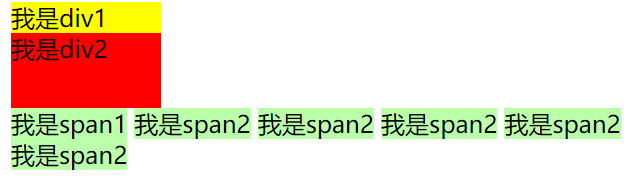

## 3.2 盒模型

盒模型、盒子模型、框模型（box model）
CSS将页面中的所有元素都设置为了一个矩形的盒子
将元素设置为矩形的盒子后，对页面的布局就变成将不同的盒子摆放到不同的位置
每一个盒子都由一下几个部分组成：
内容区（content）
内边距（padding）   位于内容区与边框之间
边框（border）	内容区不变，只是套上了边框
外边距（margin）   盒子位置


### 3.2.1 盒模型的内容区、边框内边距、外边距

**内容区**
内容区（content），元素中的所有的子元素和文本内容都在内容区中排列 ，内容区的大小由width 和 height两个属性来设置
width 设置内容区的宽度
height 设置内容区的高度
设置的仅仅是内容区 

```html
<head>
  <style>
    .box1 {
      width: 200px;
      height: 200px;
      background: #bfa;
  </style>
</head>

<body>
  <div class="box1">aaa</div>
</body>
```

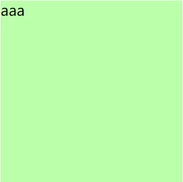

**边框（border）**
边框属于盒子边缘，边框里边属于盒子内部，出了边框都是盒子的外部，边框的大小会影响到整个盒子的大小(注意内容区不变，只是框扩大了盒子的大小)
要设置边框，需要至少设置三个样式：

* 边框的宽度 border-width
* 边框的颜色 border-color
* 边框的样式 border-style

```html
<head>
  <style>
    .box1 {
      /*内容区（content）*/
      width: 200px;
      height: 200px;
      background: #bfa;
      /*边框（border）*/
      border-width: 10px;
      border-color: red;
      border-style: solid;
    }
  </style>
</head>

<body>
  <div class="box1">aaa</div>
</body>
```

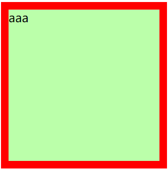

给定div结构和内容区

```html
<style>
  width: 200px;
  height: 200px;
  background-color: #bfa;
</style>
<body>
  <div class="box1"></div>
</body>
```

**border-width:** 
  默认值，一般都是 3个像素
  border-width可以用来指定四个方向的边框的宽度
  值的情况
          四个值：上 右 下 左   (顺时针)  中间用空格隔开
          三个值：上 左右 下
          两个值：上下 左右
          一个值：上下左右
  除了border-width还有一组 border-xxx-width
      xxx可以是 top right bottom left 
      用来单独指定某一个边的宽度

```html
<style>
  border-width: 10px;
  border-bottom-width: 30px;
</style>
```

**border-color**

用来指定边框的颜色，同样可以分别指定四个边的边框，规则和border-width一样，border-color也可以省略不写，如果省略了则自动使用color的颜色值。

```html
<style>
  color: red;
  /*前景色：字体、边框*/
  border-color: red;
  border-color: orange red yellow green;
</style>
```

**border-style** 

指定边框的样式  ==》规则和前面的相同
	solid 表示实线
	dotted 点状虚线    :有斑点的，点缀
	dashed 虚线        ：虚线
	double 双线
	border-style的默认值是none 表示没有边框

```html
<style>
  border-style: solid;
  border-style: solid dotted dashed double;
  /* 整合在一起练习：上下实线红色、绿色；左右点状虚线蓝色  宽为5px*/
  border-width: 5px;
  border-color: red blue green;
  border-style: solid dotted solid dotted;
</style>
```


**border简写属性**

通过该属性可以同时设置边框所有的相关样式，并且没有顺序要求
border:像素 颜色 线型;
除了border以外还有四个 border-xxx
	border-top
	border-right
	border-bottom
	border-left

```html
<style>
  border: 3px red solid;
  border-bottom: green 5px dotted;
  border-right: 5px blue dashed;
  border-left: none;
</style>
```

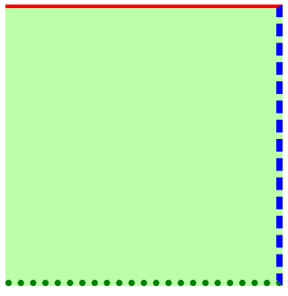

**内边距**

内边距（padding）  padding:填料、填补
  - 内容区和边框之间的距离是内边距
  - 一共有四个方向的内边距：
      padding-top
      padding-right
      padding-bottom
      padding-left

  - 内边距的设置会影响到盒子的大小
  - 背景颜色会延伸到内边距上

一个盒子的可见框的大小，由**内容区**、**内边距** 和 **边框**共同决定，所以在计算盒子大小时，需要将这三个区域加到一起计算。

**padding 内边距的简写属性**，可以同时指定四个方向的内边距，规则和border-width 一样

* 值的情况
        四个值：上 右 下 左   (顺时针)  中间用空格隔开
        三个值：上 左右 下
        两个值：上下 左右
        一个值：上下左右

```html
<head>
  <style>
    .box1{
      /*内容区*/
      width: 200px;
      height: 200px;
      background-color: #bfa;
      border: 5px orange dashed;
      /*内边距*/
      padding-top: 100x;
      padding-right: 10px;
      padding-bottom: 10px;
      padding-left: 10px;
      /*内边距简写*/
      padding: 10px 20px 30px 40px;
      padding: 10px 20px 30px ;
      padding: 10px 20px ;
      padding: 10px ;
    }

    /* 区分内容区内边距 */
    .inner{
      width: 100%;
      height: 100%;
      background-color: yellow;
    }
  </style>
</head>
<body>
  <div class="box1">
    <div class="inner"></div>
  </div>
</body>
```

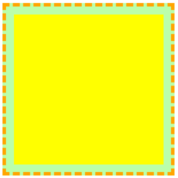

**外边距**

外边距（margin）  
- 外边距不会影响盒子可见框的大小
- 但是外边距会影响盒子的位置
- 一共有四个方向的外边距：
    margin-top
        - 上外边距，设置一个正值，元素会向下移动
    margin-right
        - 默认情况下设置margin-right不会产生任何效果（默认情况下没用）
    margin-bottom
        - 下外边距，设置一个正值，其下边的元素会向下移动
    margin-left
        - 左外边距，设置一个正值，元素会向右移动

    - margin也可以设置负值，如果是负值则元素会向相反的方向移动

- 元素在页面中是按照自左向右的顺序排列的，
    所以默认情况下如果我们设置的左和上外边距则会移动元素自身
    而设置下和右外边距会移动其他元素   （把别人挤走）

- margin的简写属性
    margin 可以同时设置四个方向的外边距 ，用法和padding一样

- margin会影响到盒子实际占用空间

```html
<style>
  .box1 {
    /* 内容区 */
    width: 200px;
    height: 200px;
    background-color: #bfa;
    border: 10px red solid;

    margin-top: 100px;
    margin-left: 100px;
    margin-bottom: 100px;
    /*会将该元素的下面一个元素移动*/
    margin-bottom: 100px;
    margin-top: -100px;
    margin-bottom: -100px;

    margin: 100px;
  }

  .box2 {
    width: 220px;
    height: 220px;
    background-color: yellow;
  }
</style>
<body>
  <div class="box1"></div>
  <div class="box2"></div>
</body>
```

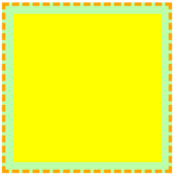

### 3.2.2 盒模型的布局

**水平布局**
元素在其父元素中水平方向的位置由以下几个属性共同决定“
  margin-left
  border-left
  padding-left
  width       ---》这个表示内容区的宽度
  padding-right
  border-right
  margin-right

一个元素在其父元素中，水平布局必须要满足以下的等式（水平方向上的宽度等于父元素内容区宽度）
margin-left+border-left+padding-left+width+padding-right+border-right+margin-right = 其父元素内容区的宽度 （必须满足）

0 + 0 + 0 + 200 + 0 + 0 + 0 = 800
0 + 0 + 0 + 200 + 0 + 0 + 600 = 800


100 + 0 + 0 + 200 + 0 + 0 + 400 = 800
100 + 0 + 0 + 200 + 0 + 0 + 500 = 800
- 以上等式必须满足，如果相加结果使等式不成立，则称为过度约束，则等式会自动调整
  - 调整的情况：

      如果这七个值中没有为 auto 的情况，则浏览器会自动**调整margin-right值**以使等式满足
- 这七个值中有三个值可设置为auto
  width
  margin-left
  margin-right

  - 如果某个值为auto，则会自动调整为auto的那个值以使等式成立
    0 + 0 + 0 + auto + 0 + 0 + 0 = 800  auto = 800
    0 + 0 + 0 + auto + 0 + 0 + 200 = 800  auto = 600
    200 + 0 + 0 + auto + 0 + 0 + 200 = 800  auto = 400

    auto + 0 + 0 + 200 + 0 + 0 + 200 = 800  auto = 400

    auto + 0 + 0 + 200 + 0 + 0 + auto = 800  auto = 300

- 如果将一个宽度和一个外边距设置为auto，则宽度会调整到最大，设置为auto的外边距会自动为0  例如设置margin-left=auto  则左外边距永远为0
- 如果将三个值都设置为auto，则外边距都是0，宽度最大  (填满整个父元素)
- 如果将两个外边距设置为auto，宽度固定值，则会将外边距设置为相同的值（就是居中）
    所以我们经常利用这个特点来使一个元素在其父元素中水平居中
    示例：
        width:xxxpx;
        margin:0 auto;   左右都设置为auto

width固定，外边距为auto的情况

```html
<style>
  .outer{
    width: 800px;
    height: 200px;
    border: 10px red solid;
  }

  .inner{
    /* width: auto;  width的值默认就是auto*/
    width: 300px;
    height: 200px;
    background-color: #bfa;
    margin-right: auto;
    margin-left: auto;
  }
</style>
<body>
  <div class="outer">
    <div class="inner"></div>
  </div>
</body>
```

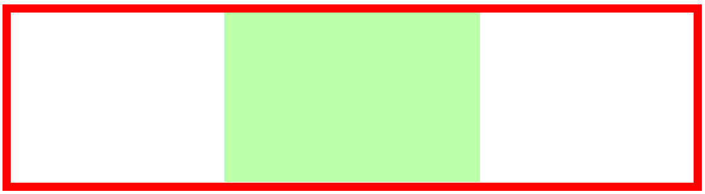

**垂直布局**

* 与内容区的height有关
  默认情况下父元素的高度被内容撑开，内容区高度设置多少就是多少。如果溢出则做overflow溢出处理。

* 子元素是在父元素的内容区中排列的，
  如果子元素的大小超过了父元素，则子元素会从父元素中溢出，使用 overflow 属性来设置父元素如何处理溢出的子元素
  **可选值**：
        visible，默认值 子元素会从父元素中溢出，在父元素外部的位置显示  (可见)
        hidden 溢出内容将会被裁剪不会显示  （隐藏） 
        scroll 生成两个滚动条，通过滚动条来查看完整的内容  上下  左右滚动
        auto 根据需要生成滚动条

overflow-x: 单独处理水平方向
overflow-y: 单独处理垂直方向

```html
<style>
  .outer {
    background-color: #bfa;
  }

  .inner {
    width: 100px;
    background-color: yellow;
    height: 100px;
    margin-bottom: 100px;
  }

  .box1 {
    width: 200px;
    height: 200px;
    background-color: #bfa;
    overflow: auto;
    overflow-x: scroll;
  }

  .box2 {
    width: 100px;
    height: 400px;
    background-color: orange;
  }
</style>
<body>
  <div class="outer">
    <div class="inner"></div>
    <div class="inner"></div>
  </div>

  <div class="box1">
    在我的后园，可以看见墙外有两株树，一株是枣树，还有一株也是枣树。
    这上面的夜的天空，奇怪而高，我生平没有见过这样奇怪而高的天空。
  </div>
</body>
```

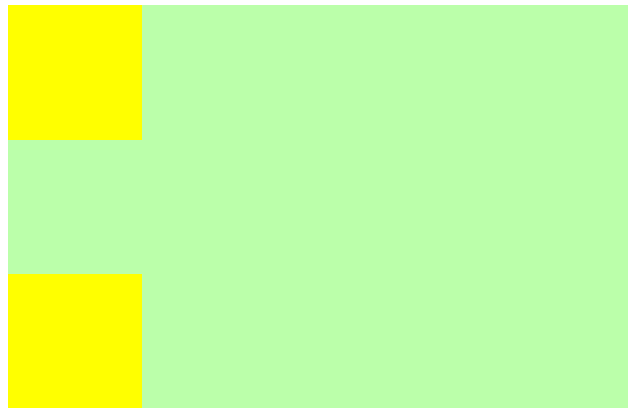

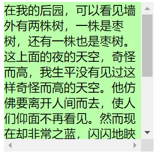

**外边距的折叠**

垂直外边距的重叠（折叠）
  - 相邻的垂直方向外边距会发生重叠现象
  - 兄弟元素
      - 兄弟元素间的相邻垂直外边距会取两者之间的较大值（两者都是正值）
      - 特殊情况：
          如果相邻的外边距一正一负，则取两者的和
          如果相邻的外边距都是负值，则取两者中绝对值较大的    (移动仍然按负的移动)

      - 兄弟元素之间的外边距的重叠，对于开发是有利的，所以我们不需要进行处理


  - 父子元素
      - 父子元素间相邻外边距，子元素的会传递给父元素（上外边距）
      - 父子外边距的折叠会影响到页面的布局，必须要进行处理
        处理方式：
        1. 对父元素进行修改 修改其高度和内边距
        2. 给父元素加上边框 则父子俩的外边距不相邻；还要把子元素 外边距改为99px  因为边框多了1px
           不是好的方式

**兄弟元素**

```html
<style>
  .box1, .box2{
    width: 200px;
    height: 200px;
    font-size: 100px;
  }
  /*外边距都为正值的情况，取最大值*/
  .box1{
    background-color: #bfa;
    /* 设置一个下外边距  则box2向下移动10px*/
    margin-bottom: 10px;
  }
  .box2{
    background-color: orange;
    /* 设置一个上外边距  比较兄弟*/
    margin-top: 20px;
  }
</style>
<body>
  <div class="box3">
    <div class="box4"></div>
  </div>
</body>
```

🦈box1和box2两兄弟元素外边距都为正，选取两则较大的即20px，显示到页面。

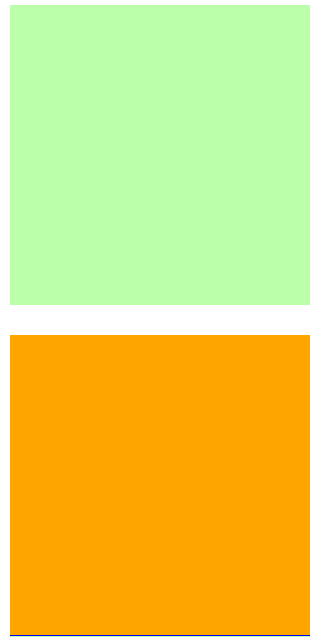

**父子元素**

子元素会相对父元素设置，并且会影响到父元素

```html
<style>
  .box1, .box2{
    width: 200px;
    height: 200px;
    font-size: 100px;
  }

  .box3{
    width: 200px;
    height: 200px;
    background-color: #bfa;
    /* padding-top: 100px; */
    border-top: 1px blue solid;
  }
  /* 子元素会传递给父元素 */
  .box4{
    width: 100px;
    height: 100px;
    background-color: orange;
    margin-top: 99px;
  }
</style>
<body>
  <div class="box3">
    <div class="box4"></div>
  </div>
</body>
```

子组件外边距margin会影响到父元素，即父元素跟随子元素一起动。

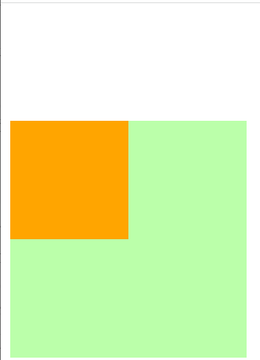

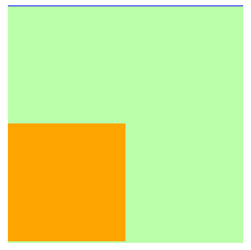


**行内元素的盒模型**

内容区
行内元素的盒模型
  - 行内元素不支持设置宽度和高度
  - 行内元素可以设置padding，但是垂直方向padding不会影响页面的布局
  - 行内元素可以设置border，垂直方向的border不会影响页面的布局（不会挤其他元素  可能覆盖）
  - 行内元素可以设置margin，垂直方向的margin不会影响布局
    小结：行内元素不可设置宽度高度，支持设置margin、border、padding但垂直方向不会影响布局

```html
<style>
  .s1 {
    background-color: yellow;
    /* 无效果、不支持宽度高度设置*/
    /* width: 100px;
    height: 100px; */
    /* padding: 100px;
    border: 10px red solid; */
    margin: 100px;/*垂直方向上无效*/
  }

  .box1 {
    width: 200px;
    height: 200px;
    background-color: #bfa;
  }
</style>
<body>
  <span class="s1">我是span</span>
  <span class="s1">我是span</span>
</body>
```

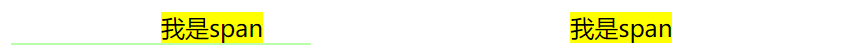

**将行内元素变成块元素**

要想设置行内元素的宽高，需要将行内元素变成块元素

* display 用来设置元素显示的类型
  可选值：
      inline 将元素设置为行内元素
      block 将元素设置为块元素
      inline-block 将元素设置为行内块元素 
              行内块，既可以设置宽度和高度又不会独占一行
      table 将元素设置为一个表格
      none 元素不在页面中显示 （也不会占用页面位置；和hidden的区别，none不占据页面的位置）

* visibility 用来设置元素的显示状态(显示or隐藏)
  可选值：
      visible 默认值，元素在页面中正常显示
      hidden 元素在页面中隐藏不显示，但是依然占据页面的位置

```html
<style>
  a {
    display: block;
    /* visibility: hidden; */
    width: 100px;
    height: 100px;
    background-color: orange;
  }
</style>
<body>
  <span class="s1">我是span</span>
  <span class="s1">我是span</span>
</body>
```

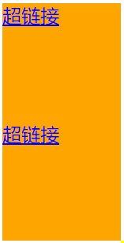

**默认样式**
- 通常情况，浏览器都会为元素设置一些默认样式

- 默认样式的存在会影响到页面的布局，
    通常情况下编写网页时必须要去除浏览器的默认样式（PC端的页面）

    **手动清除**

```html
<style>
  body{
    margin: 0%;
  }
  p{
    margin: 0%;
  }
  ul{
    margin: 0%;
    padding: 0%;
    /* 去除项目符号  */
    list-style: none;
  }
  /* 上面分布写太麻烦；简单做法 把所有的margin padding去除 */
  *{
    margin: 0;
    padding: 0;
  }

  /* 默认情况下在浏览器中和左上有一定的间隔 */
  .box1{
    width: 100px;
    height: 100px;
    border: 1px black solid;
  }
</style>
<body>
  <div class="box1"></div>
</body>
```

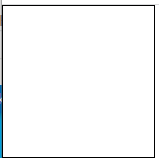

**引入重置样式表**

引用重置样式表，清除浏览器的全部样式。

重置样式表：专门用来对浏览器的样式进行重置的
  reset.css 直接去除了浏览器的默认样式    (所有)
  normalize.css 对默认样式进行了统一     （使标准化）

  小结：三种方式
  1.对所有的margin padding设置为0   （临时做个小demo用这个）
  2.reset重置样式表
  3.normalize重置样式表

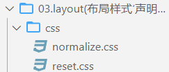

盒子的尺寸

* 默认情况下，盒子可见框的大小由内容区、内边距和边框共同决定
  box-sizing 用来设置盒子尺寸的计算方式（设置width和height的作用）
* 可选值：
  content-box 默认值，宽度和高度用来设置**内容区的大小**
  border-box 宽度和高度用来设置整个盒子**可见框的大小**
  width 和 height 指的是**内容区 和 内边距 和 边框的总大小**

```html
<style>
  .box1{
    width: 100px;
    height: 100px;
    background-color: #bfa;
    padding: 10xp;
    border: 10px red solid;
    /*设置盒子大小*/
    /* box-sizing: border-box; */
  }
</style>
<body>
  <div class="box1"></div>
</body>
```

**设置盒子大小前后**
不设置时盒子的大小为内容区+内边距+边框=120 * 120
设置盒子大小border-box后，盒子大小=100 * 100
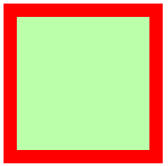
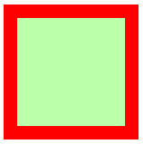

**轮廓和圆角**

**1. 轮廓**（包括边框阴影和边框轮廓）

* box-shadow 用于在元素的框架上添加阴影效果。阴影不会影响页面布局 
  第一个值 水平偏移量 设置阴影的水平位置 正值向右移动 负值向左移动
  第二个值 垂直偏移量 设置阴影的水平位置 正值向下移动 负值向上移动
  第三个值 阴影的模糊半径
  第四个值 阴影的颜色

  **语法：**

  ```html
  <style>
    /* x偏移量 | y偏移量 | 阴影颜色 */
    box-shadow: 60px -16px teal;
  
    /* x偏移量 | y偏移量 | 阴影模糊半径 | 阴影颜色 */
    box-shadow: 10px 5px 5px black;
  
    /* x偏移量 | y偏移量 | 阴影模糊半径 | 阴影扩散半径 | 阴影颜色 */
    box-shadow: 2px 2px 2px 1px rgba(0, 0, 0, 0.2);
  
    /* 插页(阴影向内) | x偏移量 | y偏移量 | 阴影颜色 */
    box-shadow: inset 5em 1em gold;
  
    /* 任意数量的阴影，以逗号分隔 */
    box-shadow: 3px 3px red, -1em 0 0.4em olive;
  
    /* 全局关键字 */
    box-shadow: inherit;
    box-shadow: initial;
    box-shadow: unset;
  
  </style>
  ```

  **inset**
  如果没有指定inset，默认阴影在边框外，即阴影向外扩散。
  使用 inset 关键字会使得阴影落在盒子内部，这样看起来就像是内容被压低了。 此时阴影会在边框之内 (即使是透明边框）、背景之上、内容之下。

  **使用实例**

  🦈文字卡片

  ```html
  <style>
    div.card {
      width: 250px;
      box-shadow: 0 4px 8px 0px rgba(0, 0, 0, 0.2), 0 6px 20px 0 rgba(0, 0, 0, 0.19);
      text-align: center;
    }
    div.header {
      background-color: rgba(50, 20, 255, 0.7);
      color: white;
      padding: 10px;
      font-size: 40px;
    }
  
    div.container {
      padding: 10px;
    }
  </style>
  <body>
    <h2>卡片</h2>
    <p>box-shadow 属性可以用来创建纸质样式卡片:</p>
    <div class="card">
      <div class="header">
        <h1>1</h1>
      </div>
      <div class="container">
        <p>April 12, 2022</p>
      </div>
    </div>
  </body>
  ```

  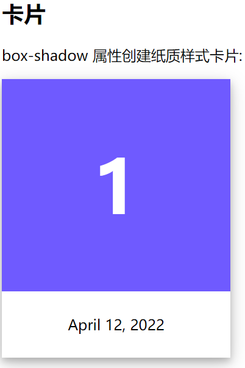

  🦈图片卡片

  ```html
  <style>
    div.polaroid {
      width: 250px;
      box-shadow: 0 4px 8px 0 rgba(0, 0, 0, 0.2), 0 6px 20px 0 rgba(0, 0, 0, 0.19);
      text-align: center;
    }
    div.container {
      padding: 10px;
    }
  </style>
  <body>
    <h2> 卡片</h2>
    <p>box-shadow属性创建纸质样式卡片:</p>
    <div class="polaroid">
      
      <div class="container">
        <p>Hardanger, Norway</p>
      </div>
    </div>
  </body>
  ```

  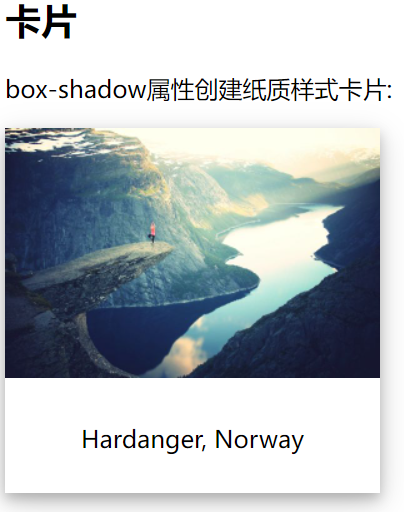

* outline 用来设置元素的轮廓线，用法和border一模一样
  轮廓和边框不同的点，就是轮廓不会影响到可见框的大小（在可见框的基础上设置轮廓）

```html
<style>
  .box1{
    width: 200px;
    height: 200px;
    background-color: #bfa;
    /*box-shadow 用来设置元素的阴影效果*/
    box-shadow: 0px 0px 50px rgba(0, 0, 0, .3);
    /*outline 用来设置元素的轮廓线*/
    outline: 5px red solid;
  }
</style>
<body>
  <div class="box1"></div>
</body>
```

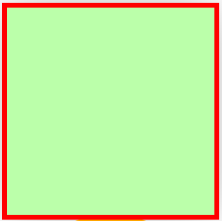

**2. 圆角**

* border-radius: 用来设置圆角 圆角设置的圆的半径大小

  border-radius 可以分别指定四个角的圆角
  四个值 左上 右上 右下 左下
  三个值 左上 右上/左下 右下 
  两个个值 左上/右下 右上/左下

```html
<style>
  .box2{
    width: 200px;
    height: 200px;
    background-color: orange;
    /*border-radius: 用来设置圆角 圆角设置的圆的半径大小*/
    border-top-left-radius: 10px;
    border-top-right-radius: 10px;
    border-bottom-left-radius: 10px;
    border-bottom-right-radius: 10px;
    /* border-radius 可以分别指定四个角的圆角*/
    border-radius: 20px 40px;
    /* 将元素设置为一个圆形 */
    border-radius: 50%;
  }
</style>
<body>
  <div class="box2"></div>
</body>
```

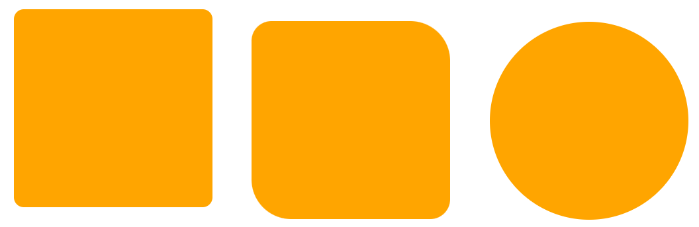

# 4. float浮动

## 4.1 浮动简介

**浮动就是将元素横过来**
通过浮动可以使一个元素向其父元素的左侧或右侧移动
使用 float 属性来设置于元素的浮动
可选值：
        none 默认值，元素不浮动
        left 元素向左浮动
        right 元素向右浮动

* 注意，元素设置浮动以后，**水平布局的等式便不需要强制成立**
  元素设置浮动以后，会==完全从文档流中脱离==，不再占用文档流的位置，所以元素下边的还在文档流中的元素会自动向上移动
* 浮动的特点：
      1、浮动元素会完全脱离文档流，不再占据文档流中的位置  (地基)
      2、设置浮动以后元素会向父元素的左侧或右侧移动，
      3、浮动元素默认不会从父元素中移出
      4、浮动元素向左或向右移动时，不会超过它前边的其他浮动元素
      5、==如果浮动元素的上边是一个没有浮动的块元素，则浮动元素无法上移==
      6、浮动元素不会超过它上边的浮动的兄弟元素，最多最多就是和它一样高
* 简单总结：
  浮动目前来讲它的==主要作用就是让页面中的元素可以水平排列==，通过浮动可以制作一些水平方向的布局。

```html
<style>
  .box1{
    width: 200px;
    height: 200px;
    background-color: #bfa;
    float: left;
  }
  .box2{
    width: 200px;
    height: 200px;
    background-color: orange;
    float: left;
  }
  .box3{
    width: 200px;
    height: 200px;
    background-color: yellow;
    float: right;
  }
</style>
</head>
<body>
  <div class="box1"></div>
  <div class="box2"></div>
  <div class="box3"></div>
</body>
```

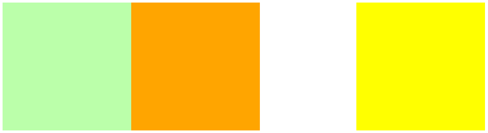

**浮动的其他特点**

* 浮动元素不会盖住文字，==文字会自动环绕在浮动元素的周围==，所以我们可以利用浮动来设置文字环绕图片的效果。

* 元素设置浮动以后，将会从文档流中脱离，从文档流中脱离后，元素的一些特点也会发生变化。
  脱离文档流的特点：

  **块元素：**
  1、块元素不独占页面的一行
  2、脱离文档流以后，块元素的宽度和高度默认都被内容撑开

  **行内元素：**
  行内元素脱离文档流以后会变成块元素，特点和块元素一样 (可以设置宽高)

  **脱离文档流以后，不需要再区分块和行内了**

```html
<style>
  * {
    /* 清除默认样式 */
    margin: 0;
    padding: 0;
  }

  .box1 {
    width: 100px;
    height: 100px;
    background-color: #bfa;
    float: left;
    /* 环绕吗？？？ div盒子不占用文档流；文字上去 且文字自动环绕在浮动元素的周围 */
  }

  .box2 {
    background-color: yellowgreen;
    float: left;
  }

  .box3 {
    background-color: orange;
  }

  .s1 {
    float: left;
    width: 200px;
    height: 200px;
    background-color: yellow;
  }
</style>

<body>
  <div class="box1">box1</div>
  <p>
    我忽而听到夜半的在我的后园，可以看见墙外有两株树，一株是枣树，还有一株也是枣树。 这上面的夜的天空，奇怪而高，我生平没有见过这样奇怪而高的天空。
  </p>
  <span class="s1">我是一个行内元素！浮动后变成块元素，可以设置宽高</span>
  <div class="box2">box2块元素脱离文档流不再占用一行</div>
  <div class="box3">未浮动块元素</div>
</body>
```

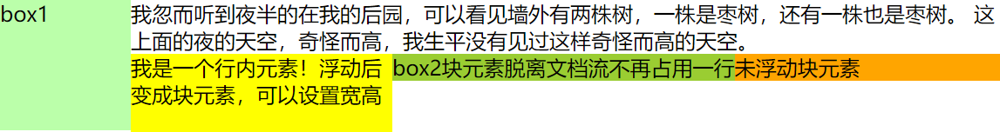

## 4.2 网页的布局

```html
<style>
  /*(选择器分组)头、主、底 三部分的重复部分可以提取出来 */
  header,
  main,
  footer {
    width: 1000px;
    margin: 0 auto;
  }
  /* 代码执行顺序：从上至下 */
  /* 设置头部 */
  header {
    height: 150px;
    background-color: silver;
  }
  /* 设置主体   (与头部、底部组成三大块；然后对中间部分细分，分为左侧导航、中间内容、右边边栏)*/
  main {
    height: 500px;
    background-color: #bfa;
    margin: 10px auto;
    /*上下间隔10px  左右居中*/
  }
  /* 中间部分即左侧导航、中间内容、右边边栏 设置为横向 方法：设置浮动 */
  nav,
  article,
  aside {
    float: left;
    height: 100%;
  }
  /* 设置左侧的导航 */
  nav {
    width: 200px;
    background-color: yellow;
  }
  /* 设置中间的内容 */
  article {
    width: 580px;
    background-color: orange;
    margin: 0 10px;
  }
  /* 设置右侧的内容 */
  aside {
    width: 200px;
    background-color: pink;
  }
  /* 设置底部 */
  footer {
    height: 150px;
    background-color: tomato;
  }
</style>
</head>

<body>
  <!-- 创建头部 -->
  <header>header</header>
  <!-- 创建网页的主体 -->
  <main>
    <!-- 左侧导航 -->
    <nav>nav</nav>
    <!-- 中间的内容 -->
    <article>article</article>
    <!-- 右边的边栏 -->
    <aside>aside</aside>
  </main>
  <!-- 网页的底部 -->
  <footer>footer</footer>
</body>
```

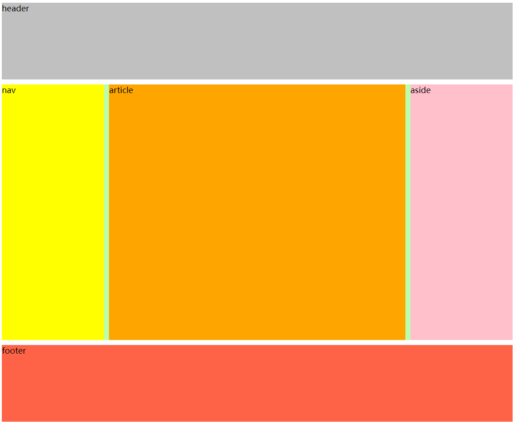

## 4.3 高度塌陷

**高度塌陷的问题：**

* 在浮动布局中，父元素的高度默认是被子元素撑开的，当子元素浮动后，其会完全脱离文档流，==子元素从文档流中脱离，将会无法撑起父元素的高度，导致父元素的高度丢失==。
  解释：--》本来都在文档流中，当元素浮动后，子元素脱离文档流后，子父元素就不在一层了，父元素高度丢失。
* 父元素高度丢失以后，其下的元素会自动上移，导致页面的布局混乱，所以高度塌陷是浮动布局中比较常见的一个问题，这个问题我们必须要进行处理！

```html
<style>
  /* 父元素随子元素变化而变化 (即inner变化outer跟随变化)*/
  .outer{
    border: 10px red solid;   
  }
  .inner{
    width: 100px;
    height: 100px;
    background-color: #bfa;
    float: left;
  }
</style>
<body>
  <div class="outer">
    <div class="inner"></div>
  </div>
  <div style="width: 200px;height: 200px;background-color:yellow;"></div>
</body>
```

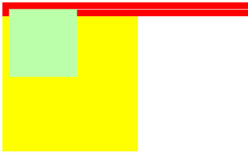

**解决方法一：开启BFC**

float是用来做文字环绕的 用来做布局会存在一些问题
BFC(Block Formatting Context) 块级格式化环境

- BFC是一个CSS中的一个隐含的属性，可以为一个元素开启BFC
    开启BFC该元素会变成一个独立的布局区域
- 元素开启BFC后的特点：
    1.开启BFC的元素不会被浮动元素所覆盖
    2.开启BFC的元素子元素和父元素外边距不会重叠
    3.开启BFC的元素可以包含浮动的子元素

- 可以通过一些特殊方式来开启元素的BFC：
    1、设置元素的浮动（不推荐）==》让父元素也脱离文档流，这时父子元素就在一层了  子元素可以撑起父元素的高度
    2、将元素设置为行内块元素（不推荐）
    3、将元素的overflow设置为一个非visible的值

    常用的方式 为元素设置 ==overflow:hidden== 开启其BFC 以使其可以包含浮动元素

    也可以使用 overflow:scroll/auto   scroll有滚动条

```html
<style>
  /* 父元素随子元素变化而变化 (即inner变化outer跟随变化)*/
  .outer{
    border: 10px red solid;   
    /* 下面三种 */
    /* float: left; */
    /* display: inline-block; */
    overflow: hidden;
  }
  .inner{
    width: 100px;
    height: 100px;
    background-color: #bfa;
    float: left;
  }
</style>
<body>
  <div class="outer">
    <div class="inner"></div>
  </div>
  <div style="width: 200px;height: 200px;background-color:yellow;"></div>
</body>
```

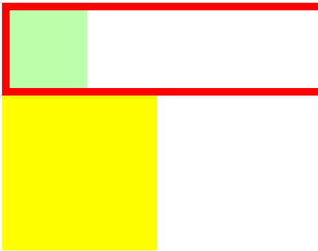

**开启BFC后的特点**

```html
<style>
  .box1{
    width: 200px;
    height: 200px;
    background-color: #bfa;
    /* float: left; */
    overflow: hidden;/*开启BFC*/ 
    /* margin-top: 50px;  开启BFC后 如果父元素移动  父子会一起移动---即子是相对于父定位了*/
  }
  .box2{
    width: 200px;
    height: 200px;
    background-color: orange;
    /* 不开启BFC，若box1浮动则box2就会被覆盖 */
    overflow: hidden;
  }

  .box3{
    width: 100px;
    height: 100px;
    background-color: yellow;
    margin-top: 50px;
    /* 如果不给父元素开启BFC，则父子一起移动 */
  }
</style>
<body>
  <div class="box1">
    <div class="box3"></div>
  </div>
  <div class="box2"></div>
</body>
```

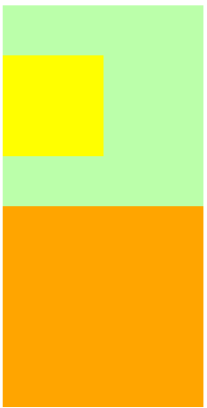

**解决方法二：clear消除浮动影响**

由于box1的浮动，导致box3位置上移（---因为box1脱离文档流，上了一层，所以box3在下一层上移位置）也就是box3收到了box1浮动的影响，位置发生了改变。

如果我们不希望某个元素因为其他元素浮动的影响而改变位置，
可以通过clear属性来清除浮动元素对当前元素所产生的影响

**clear**

* 作用：清除浮动元素对当前元素所产生的影响

- 可选值：
    left 清除左侧浮动元素对当前元素的影响
    right 清除右侧浮动元素对当前元素的影响
    both 清除两侧中最大影响的那侧

* 原理：
  设置清除浮动以后，浏览器会自动为元素**添加一个上外边距**，以使其位置不受其他元素的影响。

```html
<style>
  div {
    font-size: 30px;
  }
  .box1 {
    width: 100px;
    height: 100px;
    background-color: #bfa;
    float: left;
  }
  .box2 {
    width: 200px;
    height: 200px;
    background-color: #ff0;
    float: right;
  }
  .box3 {
    width: 100px;
    height: 100px;
    background-color: orange;
    clear: left;
  }
</style>
<body>
  <div class="box1">1</div>
  <div class="box2">2</div>
  <div class="box3">3</div>
</body>
```

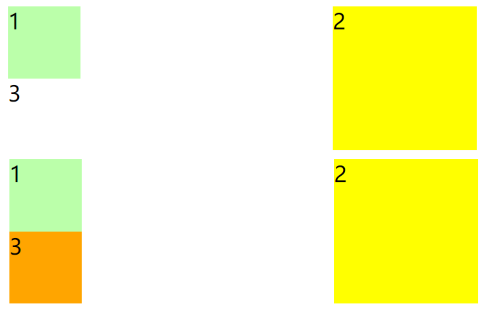

**解决方法三：最终解决方法**

* 采用结构，加一个兄弟元素，并且设置clear消除浮动影响
* 伪元素 (after伪元素 默认下为行内元素)⭐🦈

```html
<style>
  .box1{
    border: 10px red solid;
  }

  .box2{
    width: 100px;
    height: 100px;
    background-color: #bfa;
    float: left;
  }
  .box3{
    /*原本：子元素box2会导致box1高度塌陷，
    现在：加上clear属性 box3摆脱box2的影响，根据box2的高度加上外边距
    用结构去改变表现问题
    还是希望css的问题css自己解决
    */
    clear: both;
  }

  /* 优化：希望css自己解决表现问题  方法：伪元素 (after伪元素 默认下为行内元素) */
  .box1::after{
    /* 先转换成块元素 */
    display: block;
    content: '';
    clear: both;
  }
</style>
<body>
  <div class="box1">
    <div class="box2"></div>
    <div class="box3"></div>
  </div>
</body>
```

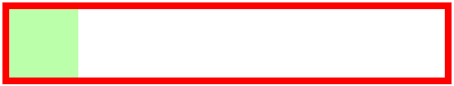

**解决外边距重叠问题clearfix**

* clearfix 这个样式可以同时解决高度塌陷和外边距重叠的问题，当在遇到这些问题时，直接使用clearfix这个类即可。
* table  表格 既可以解决高度塌陷问题又可以解决外边距重叠问题

```html
<style>
  .box1{
    width: 200px;
    height: 200px;
    background-color: #bfa;
  }
  /* 中间加上内容  隔离外边距 */
  .box1::before{
    content: '';
    display: table;
  }
  .box2{
    width: 100px;
    height: 100px;
    background-color: orange;
    /* 子元素位置改变，父元素也跟着改变 */
    margin-top: 100px;
    /* float: left; */
  }
</style>
<body>
  <div class="box1 clearfix">
    <div class="box2"></div>
  </div>
</body>
```

**解决高度塌陷问题和外边距重叠问题的代码**

```html
<style>
  /*clearfix 这个样式可以同时解决高度塌陷和外边距重叠的问题，当你在遇到这些问题时，直接使用clearfix这个类即可*/
  /*table  表格 既可以解决高度塌陷问题又可以解决外边距重叠问题*/
  /* ⭐⭐⭐经典代码：记下来⭐⭐⭐ */
  .clearfix::before,
  .clearfix::after{
    content: '';
    display: table;
    clear: both;
  }
</style>
```

# 5. position定位

==大局上用浮动、细节上用定位==

定位（position）
- 定位是一种更加高级的布局手段

- 通过定位可以将元素摆放到页面的任意位置

- 使用position属性来设置定位
    可选值：
        static 默认值，元素是静止的没有开启定位
        relative 开启元素的相对定位
        absolute 开启元素的绝对定位
        fixed 开启元素的固定定位
        sticky 开启元素的粘滞定位

## 5.1 相对定位

- 当元素的position属性值设置为relative时则开启了元素的相对定位

- 相对定位的特点：
    1.元素开启相对定位以后，如果不设置偏移量元素不会发生任何的变化
    2.相对定位是参照于元素在文档流中的位置进行定位的  (就是每次移动他自己)
    3.相对定位会提升元素的层级（==高于文档流的层级==）
    4.相对定位**不会使元素脱离文档流**
    5.相对定位不会改变元素的性质 块还是块，行内还是行内

- 偏移量（offset）    ==>不会挤别人  移动的是自己

    当元素**开启了定位以后**，可以通过偏移量来设置元素的位置；不设置偏移量，元素保持原位置不动。

    * **top**

      定位元素和定位位置上边的距离   (定位元素即要移动的元素)

    * **bottom**
      定位元素和定位位置下边的距离

      定位元素垂直方向的位置由top和bottom两个属性来控制
      通常情况下我们只会使用其中一
      top值越大，定位元素越向下移动，bottom值越大，定位元素越向上移动

       - **left**
      定位元素和定位位置的左侧距离

       - **right**
      定位元素和定位位置的右侧距离

      定位元素水平方向的位置由left和right两个属性控制，通常情况下只会使用一个。
      left越大元素越靠右，right越大元素越靠左

```html
<style>
  div {
    font-size: 30px;
  }
  .box1 {
    width: 200px;
    height: 200px;
    background-color: #bfa;
  }
  .box2 {
    width: 200px;
    height: 200px;
    background-color: orange;
    /* 开启定位 */
    position: relative;
    left: 200px;
    top: -200px;
  }
  .box3 {
    width: 200px;
    height: 200px;
    background-color: yellow;
  }
</style>
<body>
  <div class="box1">1</div>
  <div class="box2">2</div>
  <div class="box3">3</div>
</body>
```

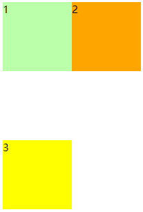

## 5.2 绝对定位

- 当元素的position属性值设置为absolute时，则开启了元素的绝对定位
- 绝对定位的特点：
  1.开启绝对定位后，如果不设置偏移量元素的位置不会发生变化
  2.开启绝对定位后，**元素会从文档流中脱离**
  3.绝对定位**会改变元素的性质**，行内变成块，块的宽高被内容撑开
  4.绝对定位会使元素提升一个层级
  5.绝对定位元素是**相对于其包含块进行定位**的

  包含块( containing block )
  - 正常情况下：
      包含块就是离当前元素最近的祖先块元素

  - 绝对定位的包含块:
      包含块就是离它最近的**开启了定位的祖先元素**，
          如果所有的祖先元素都没有开启定位则根元素就是它的包含块

  - html（根元素、初始包含块）

**实例**

定义HTML结构

```html
<body>
  <div class="box1">1</div>
  <div class="box4">
    4
    <div class="box5">
      5
      <div class="box2">2</div>
    </div>
  </div>
  <div class="box3">3</div>
</body>
```

1
4-->5-->2
3
**当box4、box5不开启定位时**，box2相对于根元素进行定位，根元素作为它的包含块。

```html
<style>
  div {
    font-size: 30px;
  }
  .box1 {
    width: 200px;
    height: 200px;
    background-color: #bfa;
  }
  .box2 {
    width: 200px;
    height: 200px;
    background-color: orange;
    /* 开启定位 */
    position: absolute;
    left: 25px;
    top: 25px;
  }
  .box3 {
    width: 200px;
    height: 200px;
    background-color: yellow;
  }
  .box4 {
    width: 400px;
    height: 400px;
    background-color: tomato;
    /* position: relative; */
  }
  .box5 {
    width: 300px;
    height: 300px;
    background-color: blueviolet;
    /* position: relative; */
  }
</style>
```


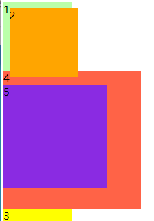

**当box5开启定位时**，box2相对于父元素box5进行定位。开启定位，不设置偏移量，元素不会改变位置，只是升了层级。

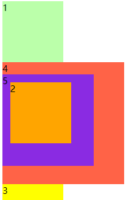

**当box4开启定位时**，box2相对于祖先元素box4进行定位。(这时要关闭父元素的定位，因为开启绝对定位的元素，向祖先元素查找，找到的第一个开启定位的元素，该元素就是它的包含块，然后相对于该包含块进行定位)

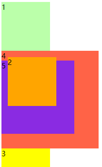

## 5.3 固定定位

- 将元素的position属性设置为fixed则开启了元素的固定定位
- 固定定位也是一种绝对定位，所以固定定位的大部分特点都和绝对定位一样
    唯一不同的是**固定定位永远参照于浏览器的视口进行定位**
    固定定位的元素不会随网页的滚动条滚动

类似于绝对定位相对于根元素定位

```html
<style>
  div {
    font-size: 30px;
  }

  .box1 {
    width: 200px;
    height: 200px;
    background-color: #bfa;
  }

  .box2 {
    width: 200px;
    height: 200px;
    background-color: orange;
    /*开启固定定位*/
    position: fixed;
    left: 25px;
    top: 25px;
  }

  .box3 {
    width: 200px;
    height: 200px;
    background-color: yellow;
  }

  .box4 {
    width: 400px;
    height: 400px;
    background-color: tomato;
  }

  .box5 {
    width: 300px;
    height: 300px;
    background-color: blueviolet;
  }
</style>

<body>
  <div class="box1">1</div>
  <div class="box4">
    4
    <div class="box5">
      5
      <div class="box2">2</div>
    </div>
  </div>
  <div class="box3">3</div>
</body>
```

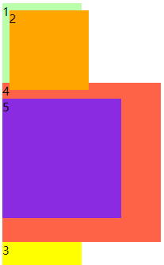

## 5.4 粘滞定位

粘滞定位 : 基于用户的滚动位置来定位。（当到达某个位置后，固定不动）
- 当元素的position属性设置为sticky时则开启了元素的粘滞定位

- 粘滞定位和相对定位的特点基本一致，
    不同的是粘滞定位可以在元素==到达某个位置时将其固定== 

- 粘性定位的元素是依赖于用户的滚动，在 **position:relative** 与 **position:fixed** 定位之间切换。
    它的行为就像 **position:relative;** 而当页面滚动超出目标区域时，它的表现就像 **position:fixed;**，它会固定在目标位置。

- 元素定位表现为在跨越特定阈值前为相对定位，之后为固定定位。

    这个特定阈值指的是 top, right, bottom 或 left 之一，换言之，指定 top, right, bottom 或 left 四个阈值其中之一，才可使粘性定位生效。否则其行为与相对定位相同。

**实例：**通过设置粘滞定位，top:10px;距浏览器视口顶部10px；初始时，设置外边距margin距顶部为100px，此时相当于相对定位，当滚动后，设置为10px，此时相当于固定定位。粘滞定位sticky就是根据滚动在相对定位relative和固定定位fixed之间切换。

```html
<style>
  body {
    height: 3000px;
  }

  /* 设置nav的大小 */
  .nav {
    /* 设置宽度和高度 */
    width: 1210px;
    height: 48px;
    /* 设置背景颜色 */
    background-color: #E8E7E3;

    margin: 100px auto;
    position: sticky;
    top: 10px;
  }

  /* 设置nav中li */
  .nav li {
    /* 设置li向左浮动，以使菜单横向排列 */
    float: left;
    /* 设置li的高度 */
    /* height: 48px; */
    /* 将文字在父元素中垂直居中 */
    line-height: 48px;

  }

  /* 设置a的样式 */
  .nav a {
    /* 将a转换为块元素 */
    display: block;
    /* 去除下划线 */
    text-decoration: none;
    /* 设置字体颜色 */
    color: #777777;
    /* 修改字体大小 */
    font-size: 18px;

    padding: 0 39px;
  }

  .nav li:last-child a {
    padding: 0 42px 0 41px;
  }

  /* 设置鼠标移入的效果 */
  .nav a:hover {
    background-color: #3F3F3F;
    color: #E8E7E3;
  }
</style>
<body>
  <!-- 创建导航条的结构 -->
  <ul class="nav">
    <li>
      <a href="#">HTML/CSS</a>
    </li>
    <li>
      <a href="#">Browser Side</a>
    </li>
    <li>
      <a href="#">Server Side</a>
    </li>
    <li>
      <a href="#">Programming</a>
    </li>
    <li>
      <a href="#">XML</a>
    </li>
    <li>
      <a href="#">Web Building</a>
    </li>
    <li>
      <a href="#">Reference</a>
    </li>
  </ul>
</body>
```

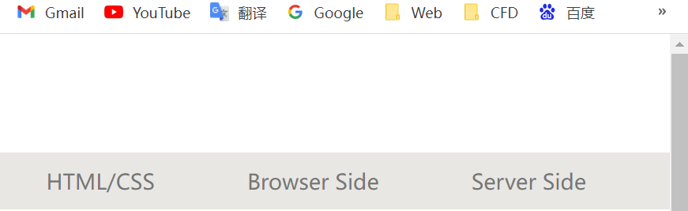

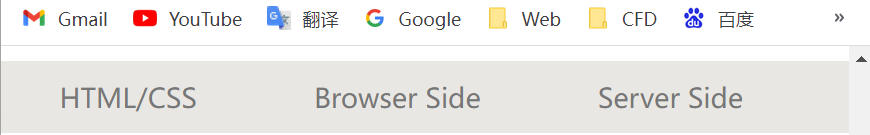

## 5.5 绝对定位元素的布局

**水平布局**
left + margin-left + border-left + padding-left + width + padding-right + border-right + margin-right + right = 包含块的内容区的宽度

- 当我们开启了绝对定位后:
  水平方向的布局等式就需要添加left 和 right 两个值
  此时规则和之前一样只是多添加了两个值：
  **当发生过度约束：**
  - 如果9个值中没有 auto 则自动调整right值以使等式满足
      如果有auto，则自动调整auto的值以使等式满足
    - 可设置auto的值
        margin width left right

    - 因为left 和 right的值默认是auto，所以如果不指定left和right
        则等式不满足时，会自动调整这两个值

**垂直布局**

等式也必须要满足
top + margin-top/bottom + padding-top/bottom + border-top/bottom + height = 包含块的高度

**实例**
设置元素在父元素的中间

```html
<style>
  .box1{
    width: 500px;
    height: 500px;
    background-color: #bfa;
    position: relative;
  }
  .box2{
    width: 100px;
    height: 100px;
    background-color: orange;
    position: absolute;
    /* 设置左右外边距为auto可以使其居中 */
    /* margin-left: auto;
    margin-right: auto; */
    /* 设置元素在父元素的中间 */
    margin: auto;

    left: 0;
    right: 0;

    top: 0;
    bottom: 0;
  }
</style>
<body>
  <div class="box1">
    <div class="box2"></div>
  </div>
</body>
```

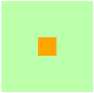

## 5.6 元素的层级

定位的层级是一样的 

* 对于开启了定位元素，可以通过z-index属性来指定元素的层级
  z-index需要一个整数作为参数，值越大元素的层级越高  (值越大越靠前)
  元素的层级越高越优先显示

* 如果元素的层级一样，则优先显示靠下的元素
  祖先的元素的层级再高也不会盖住后代元素

```html
<style>
  body {
    font-size: 50px;
  }

  .box1 {
    width: 200px;
    height: 200px;
    background-color: #bfa;
    position: absolute;
    z-index: 1;
  }

  .box2 {
    width: 200px;
    height: 200px;
    background-color: rgba(255, 0, 0, .3);
    position: absolute;
    top: 50px;
    left: 50px;
    z-index: 2;
  }

  .box3 {
    width: 200px;
    height: 200px;
    background-color: yellow;
    position: absolute;
    top: 100px;
    left: 100px;
    z-index: 3;
  }

  .box4{
    width: 100px;
    height: 100px;
    background-color: orange;
    position: absolute;
    /* 祖先的元素的层级再高也不会盖住后代元素 */
    z-index: 1;
  }
</style>
<body>
  <div class="box1">1</div>
  <div class="box2">2</div>
  <div class="box3">3
    <div class="box4">4</div>
  </div>
</body>
```

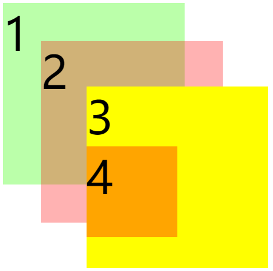

# 6. 字体和背景颜色

## 6.1 字体@font-face

**字体相关的样式**

* color 用来设置字体颜色
* font-size 字体的大小
  和font-size相关的单位
  em 相当于当前元素的一个font-size
  rem 相对于根元素的一个font-size
* font-family 字体族（字体的格式）
  可选值：（不是某一个字体  是一个分类）
  serif  衬线字体
  sans-serif 非衬线字体
  monospace 等宽字体
  指定字体的类别，浏览器会自动使用该类别下的字体
* font-family 可以同时指定多个字体，多个字体间使用,隔开
  字体生效时优先使用第一个，第一个无法使用则使用第二个 以此类推
  Microsoft YaHei,Heiti SC,tahoma,arial,Hiragino Sans GB,"\5B8B\4F53",sans-serif
* font-face可以将服务器中的字体直接提供给用户去使用 
  问题：
  1.加载速度
  2.版权
  3.字体格式

```html
<style>
  @font-face {
    /* 指定字体的名字 */
    font-family: 'myfont';
    /* src服务器中字体的路径 */
    src: url('./font/ZCOOLKuaiLe-Regular.ttf') format("truetype");
  }
  p{
    /* color其实设置的是前景色  但都拿来设置字体颜色 */
    color: blue;
    font-size: 40px;
    /* font-family: 'Courier New', Courier, monospace;   为什么加引号：因为字体的名称中有空格*/
    font-family: myfont;
  }
</style>
<body>
  <p>
    醉后不知天在水，满船清梦压星河。hello web!!!
  </p>
</body>
```


## **6.2 图标字体（iconfont）**

- 在网页中经常需要使用一些图标，可以通过图片来引入图标
  但是图片大小本身比较大，并且非常的不灵活
- 所以在使用图标时，我们还可以将图标直接设置为字体，
  然后通过font-face的形式来对字体进行引入
- 这样我们就可以通过使用字体的形式来使用图标

**fontawesome 使用步骤**
1.下载 https://fontawesome.com/
2.解压
3.将css和webfonts移动到项目中  （必须在同一级目录下）
4.将all.css引入到网页中
5.使用图标字体

- 直接通过类名来使用图标字体
  免费常用的  fas  fab  ==》加上后 就是把字体在该元素上应用了
  class="fas fa-bell"
  class="fab fa-accessible-icon"

应用时要提前下载好图标库

```html
<link rel="stylesheet" href="./fa/css/all.css">
<body>
  <!-- i本表示斜体 现在用来作为小图标 -->
  <i class="fas fa-bell"></i>
  <i class="fas fa-bell-slash"></i>
  <i class="fab fa-accessible-icon"></i>
  <!-- 就是字体 可以设置大小 颜色 -->
  <i class="fas fa-otter" style="font-size: 20px; color:green;"></i>
</body>
```

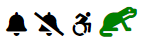

**通过伪元素来设置图标字体**
1.找到要设置图标的元素通过before或after选中
2.在content中设置字体的编码
3.设置字体的样式   看是哪种格式
fab
font-family: 'Font Awesome 5 Brands';

fas
font-family: 'Font Awesome 5 Free';
font-weight: 900; 

```html
<head>
  <link rel="stylesheet" href="./fa/css/all.css">
  <style>
    /* 去除符号---清除样式 */
    li{
      list-style: none;
    }

    li::before{
      content: '\f1b0';
      font-family: 'Font Awesome 5 Free';
      font-weight: 900;
      color: blue;
      margin-right: 10px;
    }
  </style>
</head>
<body>
  <!-- 一般的引用方式 -->
  <!-- <i class="fas fa-cat"></i> -->
  <!-- 想把符号应用到多个段落中，为了减少重复代码，使用伪元素 -->
  <ul>
    <li>锄禾日当午</li>
    <li>汗滴禾下土</li>
    <li>谁知盘中餐</li>
    <li>粒粒皆辛苦</li>
  </ul>
  <!-- 第三种：实体 -->
  <span class="fas">&#xf0f3;</span>
</body>
```

**阿里字体库**

应用字体库的三种方法：实体、类、伪元素。
伪元素  编码就是实体后面的
**格式**：
伪元素{
	内容：编码---设置字体编码
	字体族
}

```html
<head>
    <link rel="stylesheet" href="./iconfont/iconfont.css">
    <style>
        /* 已经设置类的的小，直接修改i标签不可以 */
        i.iconfont{
            font-size: 50px;
        }
        /* 伪元素  编码就是实体后面的 */
        p::before{
            content: '\e625';
            font-family: 'iconfont';
            font-size: 50px;
        }
        
        p{
            font-size: 50px;
        }
    </style>
</head>
<body>
    <!-- 方法一：实体 -->
    <i class="iconfont">&#xe61c;</i>

    <!-- 方法二：类 -->
    <i class="iconfont icon-qitalaji"></i>

    <!-- 方法三：伪元素  (应用到多个段落使用) -->
    <p>前面是加的图标</p>
</body>
```

## 6.3 行高、简写属性

**行高（line height）**

- 行高指的是文字占有的实际高度
- 可以通过line-height来设置行高
    行高可以直接指定一个大小（px em），也可以直接为行高设置一个整数，如果是一个整数的话，行高将会是字体的指定的倍数。
- 行高经常还用来设置文字的行间距
    行间距 = 行高 - 字体大小
- 可以将行高设置为和高度一样的值，使单行文字在一个元素中垂直居中

**字体框(行宽) ==》字体间所占框的宽度**

- 字体框就是字体存在的格子，设置font-size实际上就是在设置字体框的高度，行高会在字体框的上下平均分配

```html
<style>
  div{
    font-size: 20px;
    /* 可以将行高设置为和高度一样的值，使单行文字在一个元素中垂直居中 */
    line-height: 50px;
    border: 1px red solid;
    /* 默认行高 */
    /* line-height: 1.33; */
    /* line-height: 1; */
  }
</style>
</head>
<body>
  <div>十步杀一人，千里不留行。事了拂衣去，深藏身与名。</div>
</body>
```

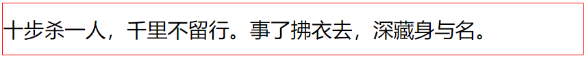

**简写属性**

* **font** 可以设置字体相关的所有属性
  **语法：**
  font: 字体大小/行高 字体族   =>/2  就表示行高 不是或
  行高可以省略不写 如果不写使用默认值 normal  (后面简写的  会覆盖前面设置的行高)

  字体属性

  * **font-weight** 字重 字体的加粗 
    可选值：
    normal 默认值 不加粗
    bold 加粗
    100-900 九个级别（没什么用）

  * font-style 字体的风格
    normal 正常的
    italic 斜体

```html
<style>
  div{
    /* 可以将行高设置为和高度一样的值，使单行文字在一个元素中垂直居中 */
    line-height: 50px;
    border: 1px red solid;
    /*倾斜、加粗、字体、*/
    font: italic bold 10px/2 'Times New Roman', Times, serif;
  }
</style>
</head>
<body>
  <div>十步杀一人，千里不留行。事了拂衣去，深藏身与名。</div>
</body>
```

## 6.4 文本的样式

* text-align 文本的水平对齐
  **可选值：**
  left 左侧对齐
  right 右对齐
  center 居中对齐
  justify 两端对齐

* vertical-align 设置元素垂直对齐的方式   ==>vertical 垂直
  **可选值：**
  baseline 默认值 基线对齐   （文字底部  子元素、父元素按基线对齐）
  top 顶部对齐
  bottom 底部对齐
  middle 居中对齐

```html
<style>
  div{
    width: 800px;
    border: 1px red solid;
    text-align: justify;
    font-size: 30px;
  }

  span{
    font-size: 20px;
    border: 1px blue solid;
    vertical-align: baseline;
  }

  p{
    border:1px red solid;
  }
  /* 默认情况下  图片按基线对齐  图片与边框会存在一段空白 
  处理方式：设置垂直对齐 任何一种都可以
  */
  img{
    vertical-align: bottom;
  }
</style>
<body>
  <div>
    十步杀一人，千里不留行。web x<span>事了拂衣去，深藏身与名。web</span> 
  </div>
  <div>Lorem ipsum dolor sit amet consectetur, adipisicing elit. .</div>
  <p>
    
  </p>

</body>
```

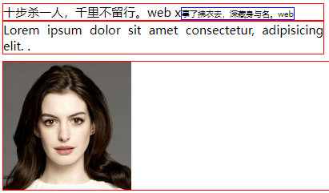

* text-decoration 设置文本修饰
  **可选值：**
  none 什么都没有
  underline 下划线
  line-through 删除线
  overline 上划线
  (dotted  虚线)
* white-space 设置网页如何处理空白
  **可选值：**
  normal 正常
  nowrap 不换行
  pre 保留空白  ==》保留所写格式的空白

```html
<style>
  .box1{
    font-size: 50px;
    font-family: 微软雅黑;
    text-decoration: overline;
    /* 还可以设置样式 ie不支持 */
    text-decoration: underline red dotted;
  }

  .box2{
    border: 1px red solid;
    width: 500px;
    white-space: nowrap;
    /* 内容溢出元素框的处理办法  裁剪 */
    overflow: hidden;
    /* 文本溢出：  溢出部分设置省略号。。。 */
    text-overflow: ellipsis;
  }
</style>
</head>
<body>
  <div class="box2">
    Lorem ipsum dolor sit amet consectetur adipisicing elit. Consequatur, minus fugit in perspiciatis reprehenderit consequuntur aspernatur repellat cumque quidem asperiores quaerat placeat,
  </div>
  <div class="box1">
    今天天气真不错
  </div>
</body>
```

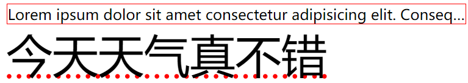

## 6.5 背景

* background-color 设置背景颜色
* background-image 设置背景图片 
  - 可以同时设置背景图片和背景颜色，这样背景颜色将会成为图片的背景色
  - 如果背景的图片小于元素，则背景图片会自动在元素中平铺将元素铺满（自动重复 repeat）
  - 如果背景的图片大于元素，将会有一部分部分背景无法完全显示
  - 如果背景图片和元素一样大，则会直接正常显示
    注意：url里面加不加引号都行  加上引号是为了与其他命令区分开
* background-repeat 用来设置背景的重复方式
  **可选值：**
  repeat 默认值 ，背景会沿着x轴 y轴双方向重复
  repeat-x 沿着x轴方向重复
  repeat-y 沿着y轴方向重复
  no-repeat 背景图片不重复
* background-position 用来设置背景图片的位置
  设置方式：
  通过 top left right bottom center 几个表示方位的词来设置背景图片的位置   九宫格
  使用方位词时必须要同时指定两个值，如果只写一个则第二个默认就是center
  **注意：**正值表示向右 向下  一般用负值较多
  通过偏移量来指定背景图片的位置：   （设置像素）
  水平方向的偏移量 垂直方向变量

```html
<style>
  .box1{
    width: 500px;
    height: 500px;
    /*background-color 设置背景颜色*/
    background-color: #bfa;

    /*background-image 设置背景图片 */
    background-image: url("./img/1.png");
    /* 改变背景颜色像素大小，背景图片会重复就是因为repeat是默认的xy方向重复 */
    /*background-repeat 用来设置背景的重复方式*/
    background-repeat: no-repeat;

    /*background-position 用来设置背景图片的位置*/
    background-position: left;
    background-position: 50px 50px;
  }
</style>
</head>
<body>
  <div class="box1"></div>
</body>
```

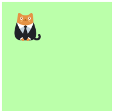

设置背景的范围

* **background-clip     裁剪**
  * **可选值**：
    border-box 默认值，背景会出现在边框的下边  （全部都有）
    padding-box 背景不会出现在边框，只出现在内容区和内边距
    content-box 背景只会出现在内容区

* **background-origin** 背景图片的偏移量计算的原点

  * **可选值：**
    padding-box 默认值，background-position从内边距处开始计算 ==》图片的原点在内边距处
    content-box 背景图片的偏移量从内容区处计算  ==》原点在内容去左上角
    border-box 背景图片的变量从边框处开始计算 ==》在边框

* **background-size** 设置背景图片的大小   尺寸
  第一个值表示宽度 
  第二个值表示高度

  - 如果只写一个，则第二个值默认是 auto

  cover 图片的比例不变，将元素铺满
  contain 图片比例不变，将图片在元素中完整显示

* **background-attachment**

  - 背景图片是否跟随元素移动
  - 可选值：
    scroll 默认值 背景图片会跟随元素移动   ==>相当于背景图片固定到了内容上
    fixed 背景会固定在页面中，不会随元素移动

* 背景元素的简写
  含有的属性---
  background-color
  background-image
  background-repeat
  background-position
  background-size
  background-origin
  background-clip
  background-attachment：设置背景图片滚动
  * backgound 背景相关的简写属性，所有背景相关的样式都可以通过该样式来设置，并且该样式没有顺序要求，也没有哪个属性是必须写的。
  * 注意：
    background-size必须写在background-position的后边，并且使用/隔开，background-position/background-size。
    background-origin background-clip 两个样式 ，origin要在clip的前边

```html
<head>
  <meta charset="UTF-8">
  <meta http-equiv="X-UA-Compatible" content="IE=edge">
  <meta name="viewport" content="width=device-width, initial-scale=1.0">
  <title>背景2</title>
  <style>
    .box1{
      width: 500px;
      height: 500px;
      overflow: auto;/*处理溢出*/
      background-color: #bfa;
      background-image: url("./img/2.jpg");
      background-repeat: no-repeat;
      background-position: 0 0;
      padding: 10px;

      /* background-clip: border-box;
      background-origin: content-box; */

      /* 
      background-size 设置背景图片的大小   尺寸
      第一个值表示宽度 
      第二个值表示高度
      - 如果只写一个，则第二个值默认是 auto

      cover 图片的比例不变，将元素铺满
      contain 图片比例不变，将图片在元素中完整显示
      */

      /* 宽度充满，高度自动 */
      /* background-size: 100% auto; */
      /* 高度铺满，宽度自动 */
      /* background-size: auto 100%; */
      background-size: contain;
      /* background-size: 1000px 500px; */
      /* 设置背景图片滚动 */
      /* background-attachment: fixed; */

    }

    .box2{
      width: 300px;
      height: 500px;
      background-color: gray;
      background-image: url('./img/1.png');
      background-repeat: no-repeat;
      background-position: 100px 100px;
      background-attachment: fixed;
    }

    .box3{
      border: 10px red double;
      padding: 50px;
      width: 500px;
      height: 500px;
      background: url('./img/2.jpg') yellow center center/contain border-box content-box no-repeat;
      /* background无顺序  最好是 背景图片 颜色 位置 （位置大小） 背景的范围 原点 是否重复 */
    }
  </style>
  <body>
    <div class="box3"></div>
    <div>
      <!-- box1就是一个空盒子 -->
      <div class="box1"></div>
      <div class="box2">
        Lorem ipsum dolor, sit amet consectetur adipisicing elit. Aliquid recusandae aut laudantium, vero modi dicta! Nobis quae autem aliquid nostrum unde possimus adipisci ex, quasi quaerat ad necessitatibus quibusdam dolore?
      </div>
    </div>
  </body>
```

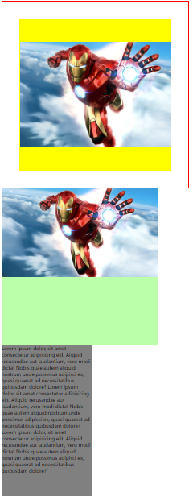

## 6.6 渐变

### **6.6.1 线性渐变**

通过渐变可以设置一些复杂的背景颜色，可以实现从一个颜色向其他颜色过渡的效果
**！！渐变是图片，需要通过background-image来设置**

* 线性渐变，颜色沿着一条直线发生变化   ==》沿着一个方向
  linear-gradient()       ==>gradient梯度 渐变
  linear-gradient(red,yellow) 红色在开头，黄色在结尾，中间是过渡区域  (上->下)
  * 线性渐变的开头，我们可以指定一个渐变的方向
    to left
    to right
    to bottom
    to top
    deg deg表示度数    45deg  45度
    turn 表示圈   1turn  一圈
  * 渐变可以同时指定多个颜色，多个颜色默认情况下平均分布，
    也可以手动指定渐变的分布情况
  * 可以重复的渐变（重复线性渐变：）
    repeating-linear-gradient() 可以平铺的线性渐变

```html
<style>
  .box1 {
    width: 200px;
    height: 200px;
    background-color: #bfa;
    /* 可以指定多个渐变颜色，中间用逗号，隔开 */
    background-image: linear-gradient(red, yellow, #bfa, orange);
    /* 表示50px~100px  红色到黄色渐变 0-50是红色渐变；50-100是黄色渐变 */
    background-image: linear-gradient(red 50px, yellow 100px);
    /* 可以指定渐变的像素  red 50px表示从50px开始渐变 0-50px都是纯色  分布情况*/
    background-image: linear-gradient(red 50px,yellow 100px,green 120px,orange 200px);
    /* 可以指定渐变的方向 */
    /* background-image: repeating-linear-gradient(to right,red, yellow 50px); */
  }
</style>
<body>
  <div class="box1"></div>
</body>
```

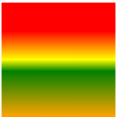

### **6.6.2 径向渐变**

* radial-gradient() 径向渐变(放射性的效果)   ==>从中心向四周放射
  默认情况下径向渐变的形状根据元素的形状来计算的
  正方形 --> 圆形
  长方形 --> 椭圆形

  * 我们也可以手动指定径向渐变的大小
    circle      圆形
    ellipse     椭圆形

    也可以指定渐变的位置

  * 语法：
    radial-gradient(大小 at 位置, 颜色 位置 ,颜色 位置 ,颜色 位置)
    at 后面确定的是渐变的原点。at后指定的位置就是从该位置开始渐变。
    大小：
    circle 圆形
    ellipse 椭圆
    closest-side 近边	
    closest-corner 近角
    farthest-side 远边
    farthest-corner 远角

    解释：就是渐变到近边还是远边

  * 位置：
    top right left center bottom

```html
<style>
  .box1{
    width: 300px;
    height: 300px;
    background-image: radial-gradient(red, yellow);
    background-image: radial-gradient(closest-corner at 100px 100px,red, #bfa);    
  }
</style>
<body>
  <div class="box1"></div>
</body>
```

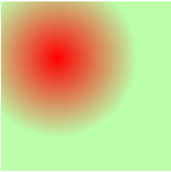

# 7.less、sass、scss

直接学scss


# 8. Flex Box弹性盒

flex(弹性盒、伸缩盒)    功能和浮动一样，在老的浏览器还是用浮动float
- 是CSS中的又一种布局手段，它主要用来代替浮动来完成页面的布局。
- ==flex可以使元素具有弹性，让元素可以跟随页面的大小的改变而改变==。

  **弹性容器**
- 要使用弹性盒，必须先将一个元素设置为弹性容器
- 我们通过 display 来设置弹性容器
  display:flex  设置为块级弹性容器          （独占一行）
  display:inline-flex 设置为行内的弹性容器  （不会独占一行）

  **弹性元素**

- 弹性容器的子元素是弹性元素（弹性项）    ---》==直接子元素==
- 弹性元素可以同时是弹性容器

**弹性盒方法**

1. 首先设置容器  display:flex
    1.1 对容器设置排列方式 flex-direction:
2. 设置弹性元素，弹性容器的直接子元素就是弹性元素（设置这个才会出现弹性效果）
    2.1 设置伸展flex-grow:亦或收缩flex-shrink:

注意：伸展时，容器大才会伸展填满整个容器，不足会溢出
收缩时，容器小才会收缩填满容器，大会保持元素默认大小，不会变化，不能填满容器

* 小结：弹性盒方法
  设置容器的方法：display:flex
  设置容器排列方式的方法：flex-direction:
  设置弹性元素：伸展flex-grow:、收缩flex-shrink:

**弹性容器的属性:**
flex-direction 指定容器中弹性元素的排列方式
**可选值：**

* **row 默认值**，弹性元素在容器中水平排列（左向右）

- 主轴 自左向右
  row-reverse 弹性元素在容器中反向水平排列（右向左）
- 主轴 自右向左
  column 弹性元素纵向排列（自上向下）
- 主轴 自上向下
  column-reverse 弹性元素方向纵向排列（自下向上）
  - 主轴：
    弹性元素的排列方向称为主轴
  - 侧轴：
    与主轴垂直方向的称为侧轴
    如：若主轴水平则侧轴垂直

**弹性元素的属性：**
flex-grow 指定弹性元素的伸展的系数

- 当父元素有多余空间时，子元素如何伸展
- 父元素的剩余空间，会==按照比例进行分配==
  flex-shrink 指定弹性元素的收缩系数
- 当父元素中的空间不足以容纳所有的子元素时，如何对子元素进行收缩
  默认值是1 等比例收缩

```html
<style>
  /* 现在能用flex不要用浮动 */
  /* 清除浏览器默认样式 */
  *{
    margin: 0;
    padding: 0;
    list-style: none;
  }
  ul{
    width: 500px;
    border: 10px solid red;
    /* 将ul设置为弹性容器 */
    display: flex;
    flex-direction: row;
  }
  li{
    width: 100px;
    height: 100px;
    background-color: #bfa;
    font-size: 30px;
    text-align: center;
    line-height: 100px;
    /* flex-grow: 1; */
    flex-shrink: 0;
  }
  li:nth-child(1){
    flex-grow: 1;
    /* flex-shrink: 1; */
  }
  li:nth-child(2){
    background-color: pink;
    flex-grow: 2;
    /* flex-shrink: 2; */
  }
  li:nth-child(3){
    background-color: orange;
    flex-grow: 3;
    /* flex-shrink: 3; */
  }
</style>
<body>
  <ul>
    <li>1</li>
    <li>2</li>
    <li>3</li>
  </ul>
</body>
```

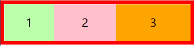

## 8.2 弹性容器的样式

* **flex-wrap:** 
  设置弹性元素是否在弹性容器中自动换行
  * 可选值：
    nowrap 默认值，元素不会自动换行
    wrap 元素沿着辅轴方向自动换行
    wrap-reverse 元素沿着辅轴反方向换行
    注意：要在元素溢出时才会自动换行

* **justify-content**    （justify：证明...合法，整理版面； evenly：均匀地）
  ==如何分配主轴上的空白空间==（主轴上的元素如何排列）--- 🦈项目在主轴上的对齐方式。
  * **可选值：**
    flex-start 元素沿着主轴起边排列  （向开始方向对齐）
    flex-end 元素沿着主轴终边排列
    center 元素居中排列
    space-around 空白分布到元素两侧     ==》注意中间宽一些(因为是两部分之和)
    space-between 空白均匀分布到元素间  （两侧对齐）
    space-evenly 空白分布到元素的单侧    （均匀对齐）
* **flex-flow:**  wrap 和 direction 的简写属性，将两者写在一起。

```html
<style>
  *{
    margin: 0;
    padding: 0;
    list-style: none;
  }
  /* 弹性容器 */
  ul{
    width: 800px;
    border: 10px red solid;
    /* 设置ul为弹性容器 */
    display: flex;
    /* ====排列方向=== */
    /* flex-direction: column; */
    /* ====自动换行=== */
    /* flex-wrap:*/
    flex-wrap: wrap;
    /* ====结合换行与方向（无前后顺序之分）=== */
    /* flex-flow:  wrap 和 direction 的简写属性  ==》将两者写在一起 */
    /* flex-flow: row wrap; */
    justify-content: space-around;
  }
  li{
    width: 200px;
    height: 100px;
    background-color: #bfa;
    font-size: 50px;
    text-align: center;
    line-height: 100px;
    flex-shrink: 0;
    /* flex-grow: 1; */
  }
  /* li:nth-child(1){
  } */
  li:nth-child(2){
    background-color: pink;
  }
  li:nth-child(3){
    background-color: orange;
  }
</style>
<body>
  <ul>
    <li>1</li>
    <li>2</li>
    <li>3</li>
  </ul>
</body>
```

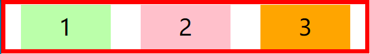

**align**表示调整辅轴的内容

* **align-items:**    （元素之间）
  * 元素在辅轴上如何对齐
  * 元素间的关系
  * **可选值：**
    stretch 默认值，将元素（元素会被拉伸）的长度设置为相同的值  （即行与行之间高度相同）
    flex-start 元素不会拉伸，沿着辅轴起边对齐
    flex-end 沿着辅轴的终边对齐
    center 居中对齐---实例中，辅轴为纵向，所以是垂直居中
    baseline 基线对齐  （一条线上）--- 项目的第一行文字的基线对齐
* **align-content:** 辅轴空白空间的分布
  可选值和justify-content一样
  类似于 `align-items`, 但它不是设置弹性子元素的对齐，而是设置各个行的对齐
* **align-self:**      (元素自身)
  align-self 属性用于设置弹性元素自身在侧轴（纵轴）方向上的对齐方式。

```html
<style>
  * {
    margin: 0;
    padding: 0;
    list-style: none;
  }

  /* 弹性容器 */
  ul {
    width: 800px;
    height: 800px;
    border: 10px red solid;
    /* 设置ul为弹性容器 */
    display: flex;
    flex-flow: row wrap;

    /*  
    juestif表示调整主轴的内容   （主轴空白空间）
    justify-content    （justify：证明...合法，整理版面； evenly：均匀地）
    */
    justify-content: space-around;

    /*align表示调整辅轴的内容align-items: 元素之间*/
    align-items: flex-start;
    /* ===需求：元素在容器中垂直、水平双方向对齐 */
    justify-content: center; 
    align-items: center; 

    /* =====align-content: 辅轴空白空间的分布====== */
    /* 可选值和justify-content一样 */
    align-content: center;
  }
  li {
    width: 200px;
    background-color: #bfa;
    font-size: 50px;
    text-align: center;
    line-height: 100px;
    flex-shrink: 0;
  }
  /* 对第几个li进行设置 */
  li:nth-child(1) {
    /* align-self: 用来覆盖当前弹性元素上的align-items */
    /* 弹性容器中有一个特殊的弹性元素，对单个元素进行设置（辅轴元素） */
    align-self: stretch;
  }
  li:nth-child(2) {
    background-color: pink;
  }
  li:nth-child(3) {
    background-color: orange;
  }
  li:nth-child(4) {
    background-color: yellow;
  }
  li:nth-child(5) {
    background-color: chocolate;
  }
</style>
<body>
  <ul>
    <li>1</li>
    <li>
      2
      <div>2</div>
    </li>
    <li>
      3
      <div>3</div>
      <div>3</div>
    </li>

    <li>1</li>
    <li>
      2
      <div>2</div>
    </li>
  </ul>
</body>
```

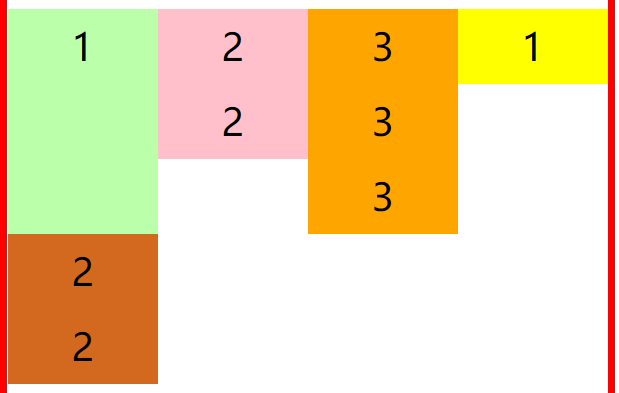

* **flex-basis:**元素基础长度

  flex-basis 指定的是==元素在主轴上的基础长度==
  如果主轴是 横向的 则 该值指定的就是元素的宽度
  如果主轴是 纵向的 则 该值指定的是就是元素的高度

  - 默认值是 auto，表示参考元素自身的高度或宽度
  - 如果传递了一个具体的数值，则以该值为准  100px

* **flex** 可以设置弹性元素所有的三个样式 (三个值可以自己设定)
  flex 增长 缩减 基础; flex-grow、flex-shrink、flex-basis
  initial "flex: 0 1 auto".
  auto  "flex: 1 1 auto"
  none "flex: 0 0 auto" 弹性元素没有弹性
* **order** 决定弹性元素的排列顺序

```html
<style>
  *{
    margin: 0;
    padding: 0;
    list-style: none;
  }
  ul{
    width: 900px;
    border: 10px red solid;
    /* 设置弹性盒 */
    display: flex;

  }
  li{
    width: 200px;
    height: 100px;
    background-color: #bfa;
    font-size: 50px;
    text-align: center;
    line-height: 100px; 

    /* ========弹性元素的各种样式========== */
    /* 增长系数 */
    /* flex-grow: 1; */

    /*缩减系数*/
    /* flex-shrink: 1; */

    /*元素基础长度flex-basis 指定的是元素在主轴上的基础长度*/
    flex-basis: auto;

    /* flex 可以设置弹性元素所有的三个样式 (三个值可以自己设定)*/
    flex: initial;
  }
  li:nth-child(1){
    /* order 决定弹性元素的排列顺序 */
    order: 2;
  }
  li:nth-child(2){
    background-color: pink;
    /* flex-grow: 2; */
    order: 3;
  }
  li:nth-child(3){
    background-color: orange;
    /* flex-grow: 3; */
    order: 1;
  }
</style>
</head>
<body>
  <ul>
    <li>1</li>
    <li>2</li>
    <li>3</li>
  </ul>
</body>
```


## 8.3 像素

**像素：px**

- 屏幕是由一个一个发光的小点构成，这一个个的小点就是像素
- 分辨率：1920 x 1080 说的就是屏幕中小点的数量
- 在前端开发中像素要分成两种情况讨论：CSS像素 和 物理像素
- 物理像素，上述所说的小点点就属于物理像素
- CSS像素，编写网页时，我们所用像素都是CSS像素
- 浏览器在显示网页时，需要将CSS像素转换为物理像素然后再呈现
- 一个css像素最终由几个物理像素显示，由浏览器决定：
  默认情况下在pc端，一个css像素 = 一个物理像素

**视口（viewport）**

- 视口就是屏幕中用来显示网页的区域
- 可以通过查看视口的大小，来观察CSS像素和物理像素的比值
- 默认情况下：
  （查看方式：元素宽度默认是父元素的100%，所以在视口中直接查看html的宽度）
  视口宽度 1920px（CSS像素）
  1920px（物理像素）
- 此时，css像素和物理像素的比是 1:1

- 放大两倍的情况：
  视口宽度 960px（CSS像素）
  1920px（物理像素）
- 此时，css像素和物理像素的比是1:2

- 我们可以通过改变视口的大小，来改变CSS像素和物理像素的比值

（就是放大缩小网页显示即视口，放大时一个css像素对应多个物理像素）

## 8.4 移动端

在不通的屏幕，单位像素的大小是不同的，==像素越小屏幕会越清晰==
24寸 1920x1080
i6 4.7寸 750 x 1334   ==》说的这些都是物理像素
智能手机的像素点 远远小于 计算机的像素点

* 问题：一个宽度为900px的网页在iphone6中要如何显示呢？
  默认情况下，移动端的网页都会将视口设置为980像素（css像素），以确保pc端网页可以在移动端正常访问，但是如果网页的宽度超过了980，移动端的浏览器会自动对网页缩放以完整显示网页、

  https://material.io/resources/devices/

  所以基本大部分的pc端网站都可以在移动端中正常浏览，但是往往都不会有一个好的体验，为了解决这个问题，大部分网站都会专门为移动端设计网页。

**完美视口**

移动端默认的视口大小是980px(css像素)，默认情况下，移动端的像素比就是  980/移动端宽度  （980/750）如果我们直接在网页中编写移动端代码，这样在980的视口下，像素比是非常不好，导致网页中的内容非常非常的小。
编写移动页面时，必须要确保有一个比较合理像素比：
1css像素 对应 2个物理像素
1css像素 对应 3个物理像素

- 可以==通过meta标签来设置视口大小==

- 每一款移动设备设计时，都会有一个最佳的像素比，
  一般我们只需要将像素比设置为该值即可得到一个最佳效果
  （查询网页中给定的建议 css像素：物理像素），将像素比设置为最佳像素比的视口大小我们称其为完美视口

将网页的视口设置为完美视口
```html
<head>
  <meta name="viewport" content="width=device-width, initial-scale=1.0">
  可以自定更改像素比
</head>
```


结论：以后再写移动端的页面，就把上边这个玩意先写上

**视口**

不同的设备完美视口的大小是不一样的
iphone6 -- 375
iphone6plus -- 414

由于不同设备视口和像素比不同，所以同样的375个像素(css像素)在不同的设备下意义是不一样，比如在iphone6中 375就是全屏，而到了plus中375就会缺一块，所以==在移动端开发时，就不能再使用px来进行布局==了。

vw 表示的是视口的宽度（viewport width）
- 100vw = 一个视口的宽度
- 1vw = 1%视口宽度

  vw这个单位永远相当于视口宽度进行计算（总是参照于视口）
  设计图的宽度（常见设计图宽度）
  750px 1125px
  设计图 
  750px 
  使用vw作为单位
  100vw

**需求：**创建一个 48px x 35px 大小的元素

100vw = 750px(设计图的像素) 0.1333333333333333vw = 1px
6.4vw = 48px(设计图像素)
4.667vw = 35px

计算方法：求得4.667vw对应35px
$$
\frac{750px}{35px} = \frac{100vw}{x}
$$


```html
<style>
  *{
    margin: 0;
    padding: 0;
  }
  /*假设设计图是750px，则宽带100vw就是750px；高度4.667vw就是35px==》 35px*100vw / 750px = 4.667vw*/
  .box1{
    width: 100vw;
    height: 4.667vw;
    background-color: #bfa;
  }
</style>
<body>
  <div class="box1">
    aa
  </div>
</body>
```


**vw视口适配**

## **8.5. 响应式布局**

- 网页可以根据不通的设备或窗口大小呈现出不同的效果
- 使用响应式布局，可以使一个网页适用于所有设备
- 响应布局的关键就是 媒体查询
- 通过媒体查询，可以为不同的设备，或设备不同状态来分别设置样式

* 使用媒体查询 
  语法： @media 查询规则{}
  媒体类型：
  all 所有设备
  print 打印设备
  screen 带屏幕的设备
  speech 屏幕阅读器

  可以使用,连接多个媒体类型，这样它们之间就是一个或的关系，可以在媒体类型前添加一个only，表示只有。only的使用主要是为了兼容一些老版本浏览器。

  ```html
  <style>
    @media only screen {
      body{
        background-color: #bfa;
      }
    }
  </style>
  ```

* **媒体特性：（一般只关注宽度）**
  width 视口的宽度
  height 视口的高度

  min-width 视口的最小宽度（视口大于指定宽度时生效） 左边界[
  max-width 视口的最大宽度（视口小于指定宽度时生效） 有边界]

  样式切换的分界点，我们称其为断点，也就是网页的样式会在这个点时发生变化

  * 一般比较常用的断点

    小于768 超小屏幕 max-width=768px
    大于768 小屏幕   min-width=768px
    大于992 中型屏幕 min-width=992px
    大于1200 大屏幕  min-width=1200px

    , 逗号是或 and是与（同时满足）  not取反

```html
<style>
  /* @media (max-width: 500px){
  body{
  background-color: #bfa;
  }
  } */

  /* 满足500-700才显示效果 */
  @media only screen and (min-width: 500px) and (max-width:700px) {
    body {
      background-color: #bfa;
    }
  }
  } 
</style>
```

# 9. 动画

## 9.1 过渡

过渡（transition）
- 通过过渡可以指定一个属性发生变化时的切换方式
- 通过过渡可以创建一些非常好的效果，提升用户的体验

**transition过渡的四个属性**

* transition-property: 指定要执行过渡的属性 
  多个属性间使用"，"隔开 ，如果所有属性都需要过渡，则使用all关键字，大部分属性都支持过渡效果，注意过渡时必须是从一个有效数值向另外一个有效数值进行过渡。

  ```html
  <style>
    transition-property: height , width;
    transition-property: all;
  </style>
  ```

* transition-duration: 指定过渡效果的持续时间
  时间单位：s 和 ms  1s = 1000ms
  用逗号","隔开表示对不同属性进行过渡(就是过渡时间分别设置)

  ```html
  <style>
    transition-duration: 100ms, 2s;
    transition-duration: 2s;
  </style>
  ```

* transition-timing-function: 过渡的时序函数
  指定过渡的执行的方式
  可选值：
  ease 默认值，慢速开始，先加速，再减速
  linear 匀速运动
  ease-in 加速运动   (慢速开始)
  ease-out 减速运动
  ease-in-out 先加速 后减速
  cubic-bezier() 来指定时序函数  -->贝塞尔曲线
  https://cubic-bezier.com
  steps() 分步执行过渡效果
  可以设置一个第二个值：
  end ， 在时间结束时执行过渡(默认值)
  start ， 在时间开始时执行过渡

  ```html
  <style>
    /* 下面这个贝塞尔曲线有个回弹的效果 */
    transition-timing-function: cubic-bezier(.24,.95,.82,-0.88);
    transition-timing-function: steps(3);
    transition-timing-function: steps(2, start);
  </style>
  ```

*  transition-delay: 过渡效果的延迟，等待一段时间后在执行过渡。

  transition-delay: 2s

* transition：可以同时设置过渡相关的所有属性，只有一个要求，如果要写延迟，则两个时间中第一个是持续时间，第二个是延迟时间。

  ```html
  <style>
    transition: 2s margin-left 1s cubic-bezier(.24,.95,.82,-0.88);
  </style>
  ```

  实例：当鼠标移到box1后，改变box2 box3
  过渡要先设置变化的属性，然后才会触发过渡效果

  ```html
  <style>
    .box1{
      width: 800px;
      height: 800px;
      background-color: silver;
  
      overflow: hidden;
    }
    .box1>div{
      width: 100px;
      height: 100px;
      margin-left: 0;
      /* 两个盒子间隔100px */
      margin-bottom: 100px;
    }
    .box2{
      background-color: #bfa;
      transition: 2s margin-left 1s cubic-bezier(.24,.95,.82,-0.88);
    }
    .box3{
      background-color: orange;
      transition-property: all;
      transition-duration: 2s;
    }
    /* 后代元素选择器，当鼠标移到box1后，改变box2 box3 */
    .box1:hover div{
      /* width: 200px;
      height: 200px; */
      /* 颜色也可以变化 */
      /* background-color: #bfa; */
      margin-left: 700px;
    }
  </style>
  </head>
  <body>
    <div class="box1">
      <div class="box2"></div>
      <div class="box3"></div>
    </div>
  </body>
  ```

  

## 9.2 动画

动画和过渡类似，都是可以实现一些动态的效果，
不同的是过渡需要在某个属性发生变化时才会触发
动画可以自动触发动态效果
设置动画效果，必须先要设置一个关键帧，关键帧设置了动画执行每一个步骤

**动画的属性**

* animation-name: 要对当前元素生效的关键帧的名字
  animation-name: test

* animation-duration: 动画的执行时间
  animation-duration: 4s

* animation-delay: 2s 动画的延时

* animation-timing-function: ease-in-out  动画的时序函数

* animation-iteration-count：动画执行的次数 
  可选值：
  次数
  infinite 无限执行
  animation-iteration-count: 1

* animation-direction指定动画运行的方向
  可选值：
  normal 默认值  从 from 向 to运行 每次都是这样 
  reverse 从 to 向 from 运行 每次都是这样 
  alternate 从 from 向 to运行 重复执行动画时反向执行   --》alternate交替
  alternate-reverse 从 to 向 from运行 重复执行动画时反向执行
  animation-direction: alternate-reverse

* animation-play-state: 设置动画的执行状态可选值：

  running 默认值 动画执行

  paused 动画暂停

* animation-fill-mode: 动画的填充模式
  可选值：
  none 默认值 动画执行完毕元素回到原来位置
  forwards 动画执行完毕元素会停止在动画结束的位置
  backwards 动画延时等待时，元素就会处于开始位置  （处于from设置的内容）
  both 结合了forwards 和 backwards  （即开始处于from开始位置，结束在动画结束位置）

* animation-fill-mode: both
  两个时间中第一个是持续执行时间，第二个是延迟几秒后执行
  animation: test 2s 2 1s alternat

  ```html
  <style>
    *{
      margin: 0;
      padding: 0;
    }
    .box1{
      width: 800px;
      height: 800px;
      background-color: silver;
      overflow: hidden;
    }
    .box1 div{
      width: 100px;
      height: 100px;
      margin-bottom: 100px;
      margin-left: 10px;
    }
    .box2{
      background-color: #bfa;
      animation: test 2s 2 1s alternate;
    }
    .box3{
      background-color: yellow;
    }
    .box1:hover div{
      animation-play-state: running;
    }
  
    @keyframes test{
      /* from表示动画的开始位置 也可以使用 0% */
      from{
        margin-left: 0;
        border-color: orange;
      }
      /* to动画的结束位置 也可以使用100%*/
      to{
        background-color: red;
        margin-left: 700px;
      }
    }
  </style>
  </head>
  <body>
    <div class="box1">
      <div class="box2"></div>
      <div class="box3"></div>
    </div>
  </body>
  ```

**案例：弹起的小球**

```html
<style>
  .outer{
    height: 500px;
    border-bottom: 10px solid black;
    margin: 50px auto;
    /* 解决外边距重叠 */
    overflow: hidden;
  }

  .outer div{
    float: left;
    width: 100px;
    height: 100px;
    margin-right: 20px;
    border-radius: 50%;
    background-color: #bfa;
    animation: ball 0.5s forwards linear infinite alternate;
  }
  div.box2{
    background-color: orange;
    animation-delay: .1s;
  }

  div.box3{
    background-color: yellow;
    animation-delay: .2s;
  }

  div.box4{
    background-color: yellowgreen;
    animation-delay: .3s;
  }

  div.box5{
    background-color: blue;
    animation-delay: .4s;
  }
  div.box6{
    background-color: pink;
    animation-delay: .5s;
  }
  div.box7{
    background-color: tomato;
    animation-delay: .6s;
  }
  div.box8{
    background-color: skyblue;
    animation-delay: .7s;
  }
  div.box9{
    background-color: chocolate;
    animation-delay: .8s;
  }
  div.box10{
    background-color: #300;
    animation-delay: .9s;
  }

  @keyframes ball{
    /* 按进程来（这里的100px是从顶端计算的高度） */
    from{
      margin-top: 0;

    }
    to{
      margin-top: 400px;
    }

    /* 20%,60%,to{
    margin-top: 400px;
  }

    40%{
    margin-top: 100px;
  }

    80%{
    margin-top: 200px;
  } */
  }
</style>
</head>
<body>
  <div class="outer">
    <div class="box1"></div>
    <div class="box2"></div>
    <div class="box3"></div>
    <div class="box4"></div>
    <div class="box5"></div>
    <div class="box6"></div>
    <div class="box7"></div>
    <div class="box8"></div>
    <div class="box9"></div>
    <div class="box10"></div>
  </div>
</body>
```


## 9.3 变形

变形就是指通过CSS来改变元素的形状或位置
-   变形不会影响到页面的布局
-   transform 用来设置元素的变形效果
-   平移：
  translateX() 沿着x轴方向平移
  translateY() 沿着y轴方向平移
  translateZ() 沿着z轴方向平移
-   平移元素，百分比是相对于自身计算的
  注意：后面带（）的都是函数；  变形不会脱离文档流

**自身移动**

```html
<style>
  /* 设置网页主体的背景颜色 */
  body{
    background-color: rgb(236, 236, 236);
  }
  .box1{
    width: 200px;
    height: 200px;
    background-color: #bfa;
    margin: 0;
    margin-top: 100px;
    /* transform: translateY(-100px); */
    transform: translateX(100%);
  }
  /* 做对比 */
  .box2{
    width: 200px;
    height: 200px;
    background-color: orange;
    margin: 0;
  }
</style>
</head>
<body>
  <div class="box1"></div>
  <div class="box2"></div>
</body>
```


**设置居中**

现在设置居中有三种方式：
1.元素大小确定的 
2.table（text/vertical） 
3.transform

```html
<style>
  .box3{
    background-color: red;
    position: absolute;
    /* 
    这种居中方式，只适用于元素的大小确定（当盒子内含有元素失效）
    top: 0;
    left: 0;
    bottom: 0;
    right: 0;
    margin: auto; */

    /* 用transform设置居中 */
    /* 50%是相对于包含块的；  多个效果空格隔开就可以， 下面的会覆盖上满的 */
    left: 50%;
    top: 50%;
    transform: translateX(-50%) translateY(-50%);
  }
</style>
<body>
  <div class="box3">aaaaaa</div>
</body>
```


**效仿小米一个向上弹出的效果**

```html
<style>
  .box4,.box5{
    width: 220px;
    height: 300px;
    background-color: #fff;
    /* 设置向左浮动，让两个边框在一行，水平排列 */
    float: left;
    /* 设置两者间距 */
    margin: 0 10px;
    /* 第一个时间表示效果持续的时间，all连带阴影也有动画效果 */
    transition:all .3s;
  }

  .box4:hover,.box5:hover{
    transform: translateY(-4px);
    /* 设置阴影效果 */
    box-shadow: 0 0 10px rgba(0, 0, 0, .3);
  }
</style>
<body>
  <div class="box4"></div>
  <div class="box5"></div>
</body>
```


**transform的属性**

### **9.3.1 平移**

z轴平移，调整元素在z轴的位置，正常情况就是调整元素和人眼之间的距离，距离越大，元素离人越近
z轴平移属于立体效果（近大远小），默认情况下网页是不支持透视，如果需要看见效果必须要设置网页的视距

```html
<style>
  /* 设置视距（设置在600~1200之间） */
  html{
    /* 设置当前网页的视距为800px，人眼距离网页的距离 */
    perspective: 800px;
  }

  body{
    border: 1px solid red;
    background-color: rgb(241, 241, 241);
  }

  .box1{
    width: 200px;
    height: 200px;
    background-color: #bfa;
    margin: 200px auto;
    transition:2s;
  }
  body:hover .box1{
    transform: translateZ(500px);
  }
</style>
<body>
  <div class="box1"></div>
</body>
```


### 9.3.2 旋转

通过旋转可以使元素沿着x y 或 z旋转指定的角度
rotateX()
rotateY()
rotateZ()
deg（degree）角度  turn圈

```html
<style>
  /* 设置视距；  视距会有个透视的效果（3D效果）*/
  html{
    perspective: 800px;
  }

  /* 设置主体 */
  body{
    border: 1px solid red;
    background-color: rgb(241, 241, 241);
  }

  .box1{
    width: 200px;
    height: 200px;
    background-color: #bfa;
    margin: 200px auto;
    transition: 2s;
  }

  body:hover .box1{
    transform: rotateX(.25turn);
    /* 设置先转后平移和先平移后转 效果不同 */
    /* transform: rotateY(180deg) translateZ(400px); */
    /* transform: translateZ(400px) rotateY(180deg); */
    transform: rotateY(180deg);
    /* 是否显示元素的背面   visible可见 */
    /* backface-visibility: hidden; */
  }

</style>
</head>
<body>
  <div class="box1">
  </div>
</body>
```

### 9.3.3 缩放

对元素进行缩放的函数：
scaleX() 水平方向缩放
scaleY() 垂直方向缩放
scale() 双方向的缩放
scale里填的数表示变化的比例

```html
<style>
  /* 缩放scale是transform里的内容 */
  html{
    perspective:800px;
  }
  .box1{
    width: 100px;
    height: 100px;
    background-color: #bfa;
    transition:2s;
    margin: 100px auto;
    /* 变形的原点 默认值 center  --> 即设置从哪个位置开始缩放*/
    /* transform-origin:0px 0px;  */
  }
  .box1:hover{
    /* scale里填的数表示变化的比例 */
    transform: scale(2);
  }
  /* 设置放照片的一个容器 */
  .img-wrapper{
    width: 200px;
    height: 200px;
    border: 1px solid red;
    /* 多余部分裁剪 */
    overflow: hidden;
  }
  img{
    transition: .2s;
  }
  /* 设置鼠标悬停效果 */
  .img-wrapper:hover img{
    transform: scale(1.5);
  }
</style>
<body>
  <div class="box1"></div>
  <div class="img-wrapper">
    <!-- 100%是相对于其包含块，即填充满整个图片容器 -->
    
  </div>
</body>
```

