# 牛客网面经

1. BFC？如何触发BFC？

2. 元素垂直居中？

3. Flex布局

4. 重排与重绘？触发的方式？

5. 实现`三栏布局`, 用`float + BFC`和`flex`两种方式

6. 实现九宫格布局

7. css盒模型 样式优先级 scoped原理

8. 除了flex做响应式布局，还有别的方案吗
   [前端响应式布局原理与方案（详细版） - 掘金 (juejin.cn)](https://juejin.cn/post/6844903814332432397)

9. 介绍一下你了解的flex[Flex 布局教程：语法篇 - 阮一峰的网络日志 (ruanyifeng.com)](http://www.ruanyifeng.com/blog/2015/07/flex-grammar.html)

10. css实现垂直水平居中，尽可能多的方案

11. 元素隐藏的方法
    我：display: none、visibility: hidden、opacity: 0, z-index,
    面试官： position: absolute移到可视区域外、缩放 transform:scale(0),  
    面完后我搜到的：文本缩进属性text-indent: -999px、lip-path: polygon(0 0, 0 0, 0 0, 0 0)、height: 0; overflow: hidden;  

12. 什么是重绘和重排，怎么减少[面试经常提到的重排和重绘，你真的了解吗？ | 代码视界 (chenhanpeng.com)](https://www.chenhanpeng.com/reflow-and-repaint/)

13. 怎么引起重绘和重排
    答：样式改变触发重绘（这个不太对，所以面试官又接着问了） dom结构改变引起重排（应该没答完整所以继续追问了）

14. 单纯改变样式会引起重排吗，比如padding和margin
    答：会引起

15. 哪些样式改变会引起重绘，哪些会引起重排
    答：调整字体大小、窗口大小、样式改变（我仿佛脑抽了用问题回答问题，其实我想说颜色这种样式的改变，被抓住了这一点，见12）会引起重排

16. 所有样式改变都会引起重排吗
    答：改颜色只会引起重绘

17. 缩小元素怎么不引起重排，比如10px * 10px 变5px * 5px
    答：一紧张说了个translation？？给面试官逗笑了55555 
    面试官：translate / transform确实不影响真实占位不会重排，但是改位置和改尺寸会引起重排，因为要重新计算div的位置大小，只要不改div在整个布局的位置和尺寸就不引起重排，比如你刚说的改变字体大小和窗口大小就会引起重排。 
    我主动补充了opacity:0和position: absolute/fixed脱标可以减少重排 
    面试官：先绝对定位掉，等全部渲染完再（什么什么听不清了）减少重排的次数

18. css选择器考察
    1)      获取当前页面的所有dom节点

    ```
    `document.querySelectorAll(``"*"``)`
    ```

    2)      获取当前页面的所有p节点

    ```
    `document.querySelectorAll(``"p"``)`
    ```

    3)      获取当前页面带有data-click属性的节点，color设为白色

    ```
    `var x = document.querySelectorAll(``"[data-click]"``);` `    ``var i;` `    ``for` `(i = 0; i < x.length; i++) {` `        ``x[i].style.color = ``"white"``;` `    ``}`
    ```

19. 伪类和伪元素，知道哪些，有什么区别
    [(31条消息) 伪元素和伪类的区别总结_一晌贪欢i的博客-CSDN博客_伪类和伪元素](https://blog.csdn.net/qq_27674439/article/details/90608220)

20. 你说下css的flex布局api? 你项目怎么使用的？

21. 盒模型？你为什么常用ie盒模型？

22. 如果是一个弹性盒子，其中一个子元素为flex为1，请问另一个子元素的宽度？

23. 怎么实现一个简单的导航栏？

24. 怎么实现一个三栏布局？

25. display：block、inlineblock、 inline 三者的区别

26. css实现画一条0.5px的线

27. css盒模型的理解;

28. css定位有几种；absolute 什么时候用；absolute 和 fixed 对性能的影响

29. 怎么样实现一个modal框，说思路

30. 垂直居中的方法

31. 三个元素怎么实现三列布局

32. 动画效果方案

    transition（嘴瓢说了transiform），animation，requestAnimationFrame

33. flex:1效果是什么

    先回大了flex:1是三个属性的简写，然后回答了效果

34. box-sizing干什么的（盒模型）

35. 按照盒模型由内到外[排序](https://www.nowcoder.com/jump/super-jump/word?word=%E6%8E%92%E5%BA%8F)？ 

    CABD

    `A. padding    B.border    C.height    D.margin`

    （提问）盒模型用什么属性改变成IE盒模型？

36. 考察css样式优先级，!import 优先级最高，优先级相同后出现的生效，样式权重的算法

37. 下列关于选择器说法错误的是？AD

    `A.div＞p表示所有div元素和p元素``// B C 一眼对``D.span::after表示span元素后面的所有元素`

    1. AD分别是什么选择器？（A.子代选择器 D.伪元素选择器）
    2. 开发过程中用过伪元素选择器吗？（高度塌陷的时候父元素清除浮动）
    3. 两栏布局能用哪几种方式实现？
    4. flex:1表示什么？
    5. 你知道为什么现在都不用table布局了吗？

38. **flex布局实习三分栏**

    （我忘了flex，css比较烂，就说浮动布局然后margin写死）

    **BFC的理解**

    （块级格式上下文，日期，外边距重叠，不影响其他元素，怎么设置成bfcdeng ）

    **弹窗如何居中**

    （直接说用了vh、vw，然后说设置left、top50%，再translate）

39. css 动画 (transition、animation)

40. 举了个例子说用 js 一帧一帧绘制和用 css 动画哪个更优(因为不知道，从 cpu 和 gpu 方面来讲)

    突然想起来，面试官应该是想考我关于浏览器渲染机制方面的问题(简历上写了)，js 的执行会挂起 GUI 线程，如果使用 js 来绘制动画的话会阻塞 html 的解析导致渲染树构建被延迟。

    后来去查了一下，关于这方面牵扯的还是挺多的，可以看以下两篇文章。

    [JS 动画比 CSS3 动画性能谁更好？ - 知乎 (zhihu.com)](https://www.zhihu.com/question/33686030?sort=created)

    [CSS and JavaScript animation performance - Web 性能 | MDN (mozilla.org)](https://developer.mozilla.org/zh-CN/docs/Web/Performance/CSS_JavaScript_animation_performance)

41. flex布局中的flex:1是啥

42. 手撕样式代码：父元素宽度100vw，每列三个子元素均分父宽度

43. css盒模型的理解

44. 实现一个16:9比例固定的样式

45. css实现三角形！（我答的transform: rotate(45deg)然后在父元素overflow: hidden，插问了rotate的旋转中心怎么确定。总之是没答到正解border的点子上）

46. css position属性有哪些？区别是什么？详细说说fixed的定位方式？

47. flex布局原理

48. 一个方块移动到屏幕边缘不动怎么实现

49. css动画有了解吗

50. css3有哪些新特性

51. 说说你用了哪些页面媒体查询方案css @media ...

52. 给div设置宽度100px，最小高度100px，最大高度500px,1px边框，高度大于500px时出现滑动条
    高度大于500px时出现滑动条从来没用到过，没写出来，下来查才是overflow-Y:auto

53. 设置元素水平、垂直居中

54. 列出 flex 常用属性和值，并解释；

55. 对 BFC 的理解

56. pxtorem如何实现自适应的，有没有看过打包后的源码，是什么时候把px转成rem的，以及rem的相关知识

57. CSS如何实现水平垂直居中


🦈对于虚拟dom的理解[(35 封私信 / 26 条消息) 网上都说操作真实 DOM 慢，但测试结果却比 React 更快，为什么？ - 知乎 (zhihu.com)](https://www.zhihu.com/question/31809713/answer/53544875)


# 整理小金库

## 问题1：为什么要初始化CSS样式（清除CSS默认样式）

因为浏览器的兼容问题，不同浏览器对有些标签的默认值是不同的，如果没对CSS初始化往往会出现浏览器之间的页面显示差异，影响到页面的布局。当然，初始化样式会对SEO有一定的影响，但鱼和熊掌不可兼得，但力求影响最小的情况下初始化。

清除浏览器默认样式的方法

* 手动清除

  ```html
  <style>
   *{
      padding: 0; 
      margin: 0;
    }
  </style>
  ```

* 引入重置样式表

  reset.css 直接去除了浏览器的默认样式

* 统一默认样式

  normalize.css 对默认样式进行了统一     （使标准化）

## 问题2：选择器上的优先级和覆盖原则

* 样式的冲突
  当我们通过==不同的选择器，选中相同的元素==，并且为相同的样式设置不同的值时，此时就发生了样式的冲突。发生样式冲突时，应用哪个样式由选择器的权重（优先级）决定  =》和位置没关系

* 有关系选择器的权重
  内联样式        	1,0,0,0
  id选择器        	 0,1,0,0
  类和伪类选择器     0,0,1,0
  元素选择器             0,0,0,1
  通配选择器             0,0,0,0
  继承的样式       没有优先级

**注意事项：**

- !important 声明的样式的优先级最高；
- 如果优先级相同，则最后出现的样式生效；
- 继承得到的样式的优先级最低；
- 通用选择器（*）、子选择器（>）和相邻同胞选择器（+）并不在这四个等级中，所以它们的权值都为 0；
- 样式表的来源不同时，优先级顺序为：内联样式 > 内部样式 > 外部样式 > 浏览器用户自定义样式 > 浏览器默认样式。

> 简单记住结论：!important>行内样式>id 选择器>class 选择器/属性选择器>标签选择器>通配符*

**覆盖原则：**

- 规则一：由于继承而发生样式冲突时，最近祖先获胜。
- 规则二：继承的样式和直接指定的样式冲突时，直接指定的样式获胜。
- 规则三：直接指定的样式发生冲突时，样式权值高者获胜。
- 规则四：样式权值相同时，后者获胜。
- 规则五：!important 的样式属性不被覆盖。

## 问题3：CSS3 中有哪些新特性

* 边框（border-radius、box-shadow、border-image）
* 背景（background-）
* 渐变（gradient）！！渐变是图片，需要通过background-image来设置。background-image: linear-gradient
* 文本效果（text）
* 字体（@font-face）
* 2D、3D转换（transform）
* 过渡（transition）
* 动画（@keyframes）
* 多列（column-count）
* 用户界面（resize、box-sizing、outline-offset）
* 图片（img ）
* 按钮（button）
* 分页
* 弹性盒（Flex Box）
* 多媒体查询（@media）
* 网格布局（grid ）

## 问题4：CSS 动画如何实现

* transition 过渡动画，也可实现动画。transition 强调过渡，是元素的一个或多个属性发生变化时产生的过渡效果，同一个元素通过两个不同的途径获取样式，而第二个途径当某种改变发生 （例如 hover）时才能获取样式，这样就会产生过渡动画。

* 使用 animation 属性或其子属性创建动画序列，该属性允许配置动画时间、时长 以及其他动画细节，但该属性不能配置动画的实际表现，动画的实际表现是 由 @keyframes 规则实现。设置动画效果，必须先要设置一个关键帧，关键帧设置了动画执行每一个步骤。

* 两则的区别是过渡需要在某个属性发生变化时才会触发，动画可以自动触发动态效果。

  transition属性	animation属性

## 问题5：CSS 中可继承与不可继承属性有哪些

**无继承性的属性**

- **display**：规定元素应该生成的框的类型
- **文本属性**
  - vertical-align：垂直文本对齐
  - text-decoration：规定添加到文本的装饰
  - text-shadow：文本阴影效果
  - white-space：空白符的处理
  - unicode-bidi：设置文本的方向
- **盒子模型的属性**：width、height、margin、border、padding
- **背景属性**：background、background-color、background-image、background-repeat、background-position、background-attachment
- **定位属性**：float、clear、position、top、right、bottom、left、min-width、min-height、max-width、max-height、overflow、clip、z-index

**有继承性的属性**

- 字体系列属性
  - font-family：字体系列
  - font-weight：字体的粗细
  - font-size：字体的大小
  - font-style：字体的风格
- 文本系列属性
  - text-indent：文本缩进
  - text-align：文本水平对齐
  - line-height：行高
  - word-spacing：单词之间的间距
  - letter-spacing：中文或者字母之间的间距
  - text-transform：控制文本大小写（就是 uppercase、lowercase、capitalize 这三个）
  - color：文本颜色

## 问题6：align-items 和 align-content 的区别

- align-items：弹性元素在弹性容器的当前行的辅轴方向上的对齐方式，即弹性元素间的关系。

- align-content：空白空间的分布，只适用于多行的容器，并且当交叉轴上有多余的空间，将 flex 线在伸缩容器内对齐。

  设置了浏览器如何沿着[弹性盒子布局](https://developer.mozilla.org/zh-CN/docs/Web/CSS/CSS_Flexible_Box_Layout)的辅轴和[网格布局](https://developer.mozilla.org/zh-CN/docs/Web/CSS/CSS_Grid_Layout)的主轴在内容项之间和周围分配空间。

## 问题7：display相关问题

### 1. display的属性值及其作用

display 用来设置元素显示的类型

| **属性值**   | 作用                                                         |
| ------------ | ------------------------------------------------------------ |
| none         | 元素不在页面中显示，并且会从文档流中移除。不会占用页面位置   |
| block        | 将元素设置为块元素。默认宽度为父元素宽度，可设置宽高，换行显示。 |
| inline       | 行内元素类型。默认宽度为内容宽度，不可设置宽高，同行显示。   |
| inline-block | 将元素设置为行内块元素，默认宽度为内容宽度，可以设置宽高，同行显示，不会独占一行。 |
| list-item    | 像块类型元素一样显示，并添加样式列表标记。                   |
| table        | 此元素会作为块级表格来显示。                                 |
| inherit      | 规定应该从父元素继承display属性的值。                        |

### 2. display的block、inline和inline-block的区别

**block：** 会独占一行，多个元素会另起一行，可以设置width、height、margin和padding属性；

**inline：** 元素不会独占一行，设置width、height属性无效。但可以设置水平方向的margin和padding属性，不能设置垂直方向的padding和margin；

**inline-block：** 行内块元素。将对象设置为inline对象，但对象的内容作为block对象呈现，之后的内联对象会被排列在同一行内。对于行内元素和块级元素，其特点如下：

**行内元素**

- 设置宽高无效；
- 可以设置水平方向的margin和padding属性，不能设置垂直方向的padding和margin；
- 不会自动换行；

**块级元素**

- 块元素不独占页面的一行
- 可以设置宽高；设置margin和padding都有效；
- 可以自动换行；
- 多个块状，默认排列从上到下。

### 3. display：table 和本身的 table 有什么区别

- display:table 和本身 table 是相对应的，区别在于：
- display:table 的 css 声明能够让一个 html 元素和它的子节点像 table 元素一样，使用基于表格的 css 布局，是我们能够轻松定义一个单元格的边界，背景等样式，而不会产生因为使用了 table 那样的制表标签导致的语义化问题。 之所以现在逐渐淘汰了 table 系表格元素，是因为用 div+css 编写出来的文件比用 table 边写出来的文件小，而且==table 必须在页面完全加载后才显示，div 则是逐行显示，table 的嵌套性太多，没有 div 简洁==。

## 问题8:隐藏元素的方法有哪些

- **display: none**：渲染树不会包含该渲染对象，因此该元素==不会在页面中占据位置==，也不会响应绑定的监听事件。
- **visibility: hidden**：元素在页面中仍占据空间，但是不会响应绑定的监听事件。
- **opacity: 0**：将元素的透明度设置为 0，以此来实现元素的隐藏。元素在页面中仍然占据空间，并且能够响应元素绑定的监听事件。
- **z-index: 负值**：来使其他元素遮盖住该元素，以此来实现隐藏。
- **transform: scale(0,0)**：将元素缩放为 0，来实现元素的隐藏。这种方法下，元素仍在页面中占据位置，但是不会响应绑定的监听事件。
- **position: absolute**：通过使用绝对定位将元素移除可视区域内，以此来实现元素的隐藏。
- **clip/clip-path** ：使用元素裁剪的方法来实现元素的隐藏，这种方法下，元素仍在页面中占据位置，但是不会响应绑定的监听事件。

## 问题9：rgba() 和 opacity 的透明效果有什么不同？

rgba()和opacity都能实现透明效果，但最大的不同是opacity==作用于元素，以及元素内的所有内容==的透明度，而rgba()只作用于==元素的颜色或其背景色==。（设置rgba透明的元素的子元素不会继承透明效果！）

## 问题10：link和@import的区别

两者都是外部引用CSS的方式，它们的区别如下：

- link是XHTML标签，除了加载CSS外，还可以定义RSS等其他事务；@import属于CSS范畴，只能加载CSS。
- link引用CSS时，在页面载入时同时加载；@import需要页面网页完全载入以后加载。
- link是XHTML标签，无兼容问题；@import是在CSS2.1提出的，低版本的浏览器不支持。
- link支持使用Javascript控制DOM去改变样式；而@import不支持。

## 问题11：伪类和伪元素

**伪类**用来描述一个元素的特殊状态
比如：第一个子元素、被点击的元素、鼠标移入的元素...

- 伪类一般情况下都是使用冒号":"开头

```css
ul>li:first-child {
  color: tomato;
}
```

**伪元素**，表示页面中一些特殊的并不真实的存在的元素（特殊的位置）

**用法：**伪元素使用 :: 开头

::first-letter 表示第一个字母

```css
/* 设置第一个字的大小 */
p::first-letter{
  font-size: 30px;
}
```

### 1. 伪类与伪元素的不同

- 伪类就是一个选择处于特定状态的元素的选择器，比如某一个 clsss 的第一个元素，某个被 hover 的元素等等，我们可以理解成一个特定的 CSS 类，但与普通的类不一样，它只有==处于 DOM 树无法描述的状态下才能为元素添加样式==，所以将其称为伪类。
- 伪元素和伪类很像，但是伪元素类似于增添一个新的 DOM 节点到 DOM 树中，而不是改变元素的状态。注意了，这里是类似，而不是真的增加一个节点，这也是其被称为伪元素的原因（实质上，元素被创建在文档外）。
- ==伪类是操作文档中已有的元素==，而==伪元素是创建了一个文档外的元素==，两者最关键的区别就是这点。此外，为了书写 CSS 时进行区分，一般伪类是单冒号，如:hover，而伪元素是双冒号::before。

### 2. ::before 和 :after 的双冒号和单冒号有什么区别？

- 冒号(:)用于CSS3伪类，双冒号(::)用于CSS3伪元素。
- ::before就是以一个子元素的存在，定义在元素主体内容之前的一个伪元素。并不存在于dom之中，只存在在页面之中。

> 注意： :before和 :after 这两个伪元素，是在CSS2.1里新出现的。起初，伪元素的前缀使用的是单冒号语法，但随着Web的进化，在CSS3的规范里，伪元素的语法被修改成使用双冒号，成为::before、::after

## 问题12：盒模型

### 1. 组成

盒模型都是由四个部分组成的，分别是margin、border、padding和content。

### 2. 外边距重叠问题（margin）

- 多个相邻（兄弟或者父子关系）普通流的块元素==垂直方向== marigin 会重叠
- 折叠的结果为：

两个相邻的外边距都是正数时，折叠结果是它们两者之间较大的值。 两个相邻的外边距都是负数时，折叠结果是两者绝对值的较大值。 两个外边距一正一负时，折叠结果是两者的相加的和。


## 问题13：CSS预处理器/后处理器是什么？为什么要使用它们？

**预处理器，** 如：less，sass，stylus，用来预编译sass或者less，增加了css代码的复用性。层级，mixin， 变量，循环， 函数等对编写以及开发UI组件都极为方便。---🦈书写方式更加方便。

**后处理器，** 如： postCss，通常是在完成的样式表中根据css规范处理css，让其更加有效。目前最常做的是给css属性添加浏览器私有前缀，实现跨浏览器兼容性的问题。

css预处理器为css增加一些编程特性，无需考虑浏览器的兼容问题，可以在CSS中使用变量，简单的逻辑程序，函数等在编程语言中的一些基本的性能，可以让css更加的简洁，增加适应性以及可读性，可维护性等。

其它css预处理器语言：Sass（Scss）, Less, Stylus, Turbine, Swithch css, CSS Cacheer, DT Css。

**使用原因**：

- 结构清晰， 便于扩展
- 可以很方便的屏蔽浏览器私有语法的差异
- 可以轻松实现多重继承
- 完美的兼容了CSS代码，可以应用到老项目中

## 问题14：单行、多行文本溢出隐藏

- 单行文本溢出

```
overflow: hidden;            // 溢出隐藏
text-overflow: ellipsis;      // 溢出用省略号显示
white-space: nowrap;         // 规定段落中的文本不进行换行
```

- 多行文本溢出

```
overflow: hidden;            // 溢出隐藏
text-overflow: ellipsis;     // 溢出用省略号显示
display:-webkit-box;         // 作为弹性伸缩盒子模型显示。
-webkit-box-orient:vertical; // 设置伸缩盒子的子元素排列方式：从上到下垂直排列
-webkit-line-clamp:3;        // 显示的行数
```

注意：由于上面的三个属性都是 CSS3 的属性，没有浏览器可以兼容，所以要在前面加一个-webkit- 来兼容一部分浏览器。

## 问题15：要动态改变层中内容可以使用的方法？

- innerHTML，innerText

## 问题16：style 标签写在 body 后与 body前有什么区别？

- 页面加载自上而下 当然是先加载样式。
- 写在 body 标签后由于浏览器以逐行方式对HTML文档进行解析，当解析到写在尾部的样式表（外联或写在 style 标签）会导致浏览器停止之前的渲染，等待加载且解析样式表完成之后重新渲染，在windows的IE下可能会出现 FOUC 现象（即样式失效导致的页面闪烁问题）

## 问题16：页面布局单位及设计(重点⭐⭐⭐)

* 布局的传统解决方案，基于[盒状模型](https://developer.mozilla.org/en-US/docs/Web/CSS/box_model)，依赖 [`display`](https://developer.mozilla.org/en-US/docs/Web/CSS/display) 属性 + [`position`](https://developer.mozilla.org/en-US/docs/Web/CSS/position)属性 + [`float`](https://developer.mozilla.org/en-US/docs/Web/CSS/float)属性。

* Flex 布局，可以简便、完整、响应式地实现各种页面布局。

### 1. CSS布局单位

常用的布局单位包括像素（`px`），百分比（`%`），`em`，`rem`，`vw/vh`。

🦈px像素（Pixel）。相对长度单位。像素px是相对于显示器屏幕分辨率而言的。

🦈em是相对长度单位。相对于当前对象内文本的字体尺寸。浏览器默认字体尺寸是16px。

🦈rem是相对长度单位，相对的只是HTML根元素。

**（1）像素**（`px`）是页面布局的基础，一个像素表示终端（电脑、手机、平板等）屏幕所能显示的最小的区域，像素分为两种类型：CSS像素和物理像素：

- **CSS像素**：为web开发者提供，在CSS中使用的一个抽象单位；
- **物理像素**：只与设备的硬件密度有关，任何设备的物理像素都是固定的。

**（2）百分比**（`%`），当浏览器的宽度或者高度发生变化时，通过百分比单位可以使得浏览器中的组件的宽和高随着浏览器的变化而变化，从而==实现响应式的效果==。一般认为子元素的百分比相对于直接父元素。

**（3）em和rem**相对于px更具灵活性，它们都是==相对长度单位==，它们之间的区别：**em相对于父元素，rem相对于根元素。**

- **em：** 文本相对长度单位。**相对于当前对象内==文本==的字体尺寸**。如果当前行内文本的字体尺寸未被人为设置，则相对于浏览器的默认字体尺寸(默认16px)。(相对父元素的字体大小倍数)。
- **rem：** rem是CSS3新增的一个相对单位，相对于根元素（html元素）的font-size的倍数。**作用**：利用rem可以实现简单的响应式布局，可以利用html元素中字体的大小与屏幕间的比值来设置font-size的值，以此实现当屏幕分辨率变化时让元素也随之变化。

**（4）vw/vh**是与视图窗口有关的单位，vw表示相对于视图窗口的宽度，vh表示相对于视图窗口高度，除了vw和vh外，还有vmin和vmax两个相关的单位。

- vw：相对于视窗的宽度，视窗宽度是100vw；
- vh：相对于视窗的高度，视窗高度是100vh；
- vmin：vw和vh中的较小值；
- vmax：vw和vh中的较大值；

**vw/vh** 和百分比很类似，两者的区别：

- 百分比（`%`）：大部分相对于祖先元素，也有相对于自身的情况比如（border-radius、translate等)
- vw/vm：相对于视窗的尺寸

**px、em、rem的区别**

- px是固定的像素，一旦设置了就无法因为适应页面大小而改变。
- em和rem相对于px更具有灵活性，他们是相对长度单位，其长度不是固定的，更适用于响应式布局。
- em是相对于其父元素来设置字体大小，这样就会存在一个问题，进行任何元素设置，都有可能需要知道他父元素的大小。而rem是相对于根元素，这样就意味着，只需要在根元素确定一个参考值。

**注意事项：**

* 为实现响应式布局，匹配移动端，设计页面时就不用px作为单位。（如果给定了像素px可以根据设计图大小确定对应的视口vw大小）

### 2. flex布局

#### 2.1 基础

#### **2.2 详解flex属性**

flex 属性用于设置或检索弹性盒模型对象的==子元素如何分配空间==。

##### 2.2.1 语法

`flex`属性是`flex-grow`，`flex-shrink`和`flex-basis`属性的缩写。

`flex-grow`：指定了容器剩余空间多余时候的分配规则，默认值是`0`，多余空间不分配。🦈弹性容器有剩余时，按比例填充满，不足时不变。
`flex-shrink`：指定了容器剩余空间多余时候的分配规则，默认值是`0`，多余空间不分配。🦈弹性容器小，弹性元素溢出时，按比例收缩，有剩余则不变。
`flex-basis`：指定了固定的分配数量，默认值是`auto`。🦈弹性元素的长度

语法：flex: none | auto | [ <'flex-grow'> <'flex-shrink'>? || <'flex-basis'> ]
这是一个格式化语法的写法。?号表示可有可无，||表示或者；所以flex合法的写法有

```css
flex: auto;
flex: none;
/* 1个值，flex-grow */
flex: 1;
/* 1个值，flex-basis */
flex: 100px;
/* 2个值，flex-grow和flex-basis */
flex: 1 100px;
/* 2个值，flex-grow和flex-shrink */
flex: 1 1;
/* 3个值 */
flex: 1 1 100px;
```

缩写时默认值为：flex-grow:1; flex-shrink:1; flex-basis:0%;

flex不同值对应的不同含义

**一个值**

* 如果是数值，则表示`flex-grow`，其他保持默认
* 如果是长度值，则表示`flex-basis`，其他保持默认

**两个值**

* 第1个值一定指`flex-grow`，第2个值根据值的类型不同表示不同的CSS属性，具体规则如下：
  * 数值，则第二个值表示`flex-shrink`，`flex-basis`为默认值0%。
  * 长度值，则第二个值表示`flex-basis`，

**三个值**

数值在前的表示`flex-grow`，长度表示`flex-basis`。

##### 2.2.2 flex属性值

**initial**

`flex:initial`等同于设置`"flex: 0 1 auto"`。

理解：不会增长变大占据flex容器中额外的剩余空间（flex-grow:0），会收缩变小以适合容器（flex-shrink:1），尺寸根据自身宽高属性进行调整（flex-basis:auto）。

**auto**

`flex:auto`等同于设置`"flex: 1 1 auto"`。

理解：子项会增长变大占据flex容器中额外的剩余空间（flex-grow:1），会收缩变小以适合容器（flex-shrink:1），尺寸根据自身宽高属性进行调整（flex-basis:auto）。

**none**

`flex:none`等同于设置`"flex: 0 0 auto"`。

理解：子项会不会增长变大占据flex容器中额外的剩余空间（flex-grow:0），也不会收缩变小以适合容器（flex-shrink:0），尺寸根据自身宽高属性进行调整（flex-basis:auto）。

案例：参考

范张，范鑫和范旭每人100万固定家产，范帅和范哥则20万保底家产。如果范闲归西那天家产还有富余，范帅和范哥按照3:2比例分配；如果没有剩余财产，则范张，范鑫和范旭三位兄长按照2:1:1的比例给两人匀20万保底家产。

```html
<!DOCTYPE html>
<html lang="en">
<head>
  <meta charset="UTF-8">
  <meta http-equiv="X-UA-Compatible" content="IE=edge">
  <meta name="viewport" content="width=device-width, initial-scale=1.0">
  <title>Document</title>
  <style>
    .container{
      display: flex;
      border: solid red 2px;
    }
    item:nth-child(1){
      background-color: yellow;
      flex: 0 2 100px;
    }
    item:nth-child(2){
      background-color: blueviolet;
      flex:0 1 100px
    }
    item:nth-child(3){
      background-color: aqua;
      flex: 0 1 100px;
    }
    item:nth-child(4){
      background-color: royalblue;
      flex: 3 0 20px;
    }
    item:nth-child(5){
      background-color: saddlebrown;
      flex: 2 0 20px;
    }
  </style>
</head>
<body>
  <div class="container">
    <item clas="zhang">范张</item>
    <item clas="xin">范鑫</item>
    <item clas="xu">范旭</item>
    <item clas="shuai">范帅</item>
    <item clas="ge">范哥</item>
</div>
</body>
</html>
```

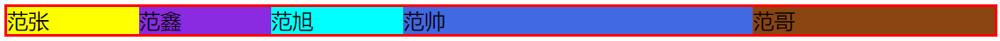

##### 2.2.3 flex-basis详解

在Flex布局中，一个Flex子项的宽度是由==基础尺寸==、==弹性增长或收缩==、==最大最小尺寸限制==共同作用的结果。

- 基础尺寸由CSS `flex-basis`属性以及`box-sizing`盒模型共同决定；
- 弹性增长指的是`flex-grow`属性，弹性收缩指的是`flex-shrink`属性；
- 最大最小尺寸限制指的`width`属性以及`min-width`/`max-width`等CSS属性，以及`min-content`最小内容尺寸。

尺寸计算的优先级为：**最大最小尺寸限制 > 弹性增长或收缩 > 基础尺寸**
比如：width > flex-grow > box-sizing

**1. 深入理解flex-basis:auto**

`flex-basis`的默认值是`auto`，表示自动，也就是==完全根据子列表项（弹性元素）自身尺寸渲染==。

在Flex布局中，==**flex-basis设置长度时优先级是比width高的**==（可以理解为覆盖）
当设置`flex-basis:auto`时，width的优先级要大于`flex-basis:auto`。

案例：width被flex-basis覆盖
注意点：设置border-box后，内容区的实际宽度是 width 减 去(border + padding) 的值。

```html
<style>
  .container {
    display: flex;
    border: solid red 2px;
    /* width: 500px; */
  }
  item-basis-width {
    padding: 1em;
    border: 1px solid deepskyblue;
    color: deepskyblue;
    box-sizing: border-box;
    width: 200px;/*width属性被flex-basis覆盖*/
    flex-basis: 100px;
  }
</style>
</head>
<body>
  <div class="container">
    <item-basis-width>项目1</item-basis-width>
    <item-basis-width>项目2</item-basis-width>
    <item-basis-width>项目3</item-basis-width>
    <item-basis-width>项目4</item-basis-width>
  </div>
</body>
```

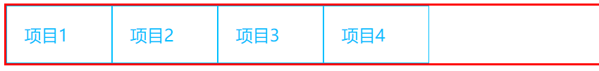

* **flex-basis和width**

  当弹性元素里的内容溢出 / 不溢出时，width和flex-basis表现都相同。

##### 2.2.4 flex应用场景

单值属性所对应的flex计算值根据开发者日常最常用的使用进行了优化。

* `flex-basis`默认值是`auto`，`flex-grow`默认值是`0`，`flex-shrink`默认值是`1`。

* 而缩写时flex默认值为：flex-grow:1; flex-shrink:1; flex-basis:0%;
  `flex`属性站在实用主义的角度对缩写属性的计算值进行了优化。

常见的flex缩写有下面这几个，`flex:0`、`flex:1`、`flex:none`、`flex:auto`。

**flex单值语法对应的计算值**

|   单值语法    |     等同于     |     备注      |
| :-----------: | :------------: | :-----------: |
| flex: initial | flex: 0 1 auto | 初始值，常用⭐ |
|    flex: 0    |  flex: 0 1 0%  |  适用场景少   |
|  flex: none   | flex: 0 0 auto |     推荐⭐     |
|    flex: 1    |  flex: 1 1 0%  |     推荐⭐     |
|  flex: auto   | flex: 1 1 auto |  适用场景少   |

* **flex:initial基本表现和适用场景**

  等同于flex属性默认值。0 1 auto

  理解：flex容器有剩余空间时尺寸不会增长（flex-grow:0），flex容器尺寸不足时尺寸会收缩变小（flex-shrink:1），尺寸自适应于内容（flex-basis:auto）（行为类似fit-content）。
  🦈有剩余空间不会增长，空间不足会收缩，尺寸自适应。

  ==日常开发不会专门设置`flex:initial`声明==

* **flex:0和flex:none的区别和各自适用场景**

  `flex:0`等同于设置`flex: 0 1 0%`，`flex:none`等同于设置`flex: 0 0 auto`。

  * 0，会收缩不会扩展，`flex-basis:0%`元素的最终尺寸表现为最小内容宽度；（一个字体的宽度）
  * none，不会收缩也不会扩展，`flex-basis:auto`表示固定尺寸由内容决定。元素里的内容不会换行，最终尺寸通常表现为最大内容宽度（一行字体的宽度）

  ```html
  <style>
    .container {
      display: flex;
    }
    .flex-0 item {
      flex: 0;
      border: 1px solid red;
    }
  
    .flex-none item {
      flex: none;
      border: 1px solid blue;
    }
  </style>
  </head>
  <body>
    <h4>flex:0</h4>
    <div class="container flex-0">
      <item>会收缩不会扩展</item>
      <item>会收缩不会扩展</item>
      <item>最小内容区宽度</item>
      <item>最小内容区宽度</item>
    </div>
    <h4>flex:none</h4>
    <div class="container flex-none">
      <item>不会收缩也不会扩展</item>
      <item>范鑫范不会收缩也不会扩展鑫范鑫</item>
      <item>最大内容区宽度</item>
      <item>最大内容区宽度</item>
    </div>
  </body>
  ```

  `flex:0`最小内容宽度就一个字体宽度； `flex:none`最大内容区宽度，即一行字体的宽度。

  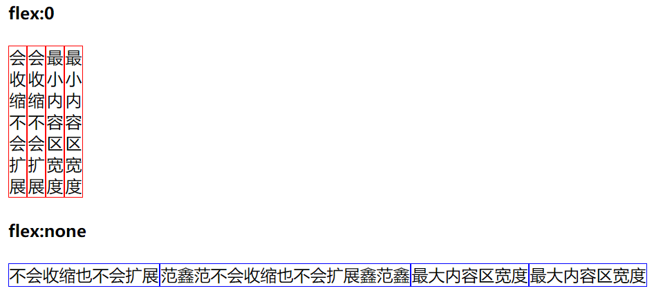

  ##### 适合使用flex:0的场景

  * 以图像宽度自动换行

  ##### 适合使用flex:none的场景

  * 当flex子项的宽度就是内容的宽度，且内容永远不会换行，则适合使用`flex:none`。
    比如按钮，设置display:none; 使文字不换行。

* **flex:1和flex:auto的区别和各自适用场景**

  `flex:1`等同于设置`flex: 1 1 0%`，`flex:auto`等同于设置`flex: 1 1 auto`。
  两个都可扩展可收缩，尺寸不足时`flex:1`最小内容宽度，`flex:auto`尺寸不足时最大内容宽度。

  **适合使用flex:1的场景**

  当希望元素充分利用剩余空间，同时==不会侵占其他元素应有的宽度==的时候，适合使用`flex:1`。

  **适合使用flex:auto的场景**

  当希望元素充分利用剩余空间，但是==各自的尺寸按照各自内容进行分配==的时候，适合使用`flex:auto`。

* **总结**

  - `flex:initial`表示默认的flex状态，无需专门设置，适合小控件元素的分布布局，或者某一项内容动态变化的布局；
  - `flex:0`适用场景较少，适合设置在替换元素的父元素上；
  - `flex:none`适用于不换行的内容固定或者较少的小控件元素上，如按钮。
  - `flex:1`适合==等分布局==；
  - `flex:auto`适合==基于内容动态适配的布局==；

### 3. 布局方式（阮一峰flex实例）

#### 3.1 网格布局

* **基本网格布局**

平均分布：在容器里面平均分配空间，需要设置项目的自动缩放。


```html
  <style>
    .Grid {
      display: flex;
      border: 1px solid red;
    }
    .Grid-cell {
      flex: 1;
      border: 1px solid blue;
    }
  </style>
<body>
  <div class="Grid">
    <div class="Grid-cell">弹性元素1内容大量溢出时；内容大量溢出时；不会侵占其他元素应有的宽度；</div>
    <div class="Grid-cell">弹性元素2</div>
    <div class="Grid-cell">弹性元素3</div>
  </div>
</body>
```

`flex:1;`等同于`flex:1 1 0%`，内容不足会扩展，内容溢出会收缩，一个弹性元素内容过多会自动换行且不会影响其他弹性元素。

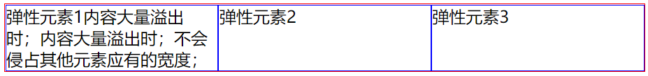

* **百分比布局**

某个网格的宽度为固定的百分比，其余网格平均分配剩余的空间。


```html
<style>
  .Grid {
    display: flex;
    border: 2px solid red;
    text-align: center;
  }
  .Grid-cell {
    flex: 1;
    border: 1px solid blue;
  }
  .Grid-cell.u-1of1 {
    flex: 0 0 50%;
    background-color: #bfa;
  }
</style>
<body>
  <div class="Grid">
    <div class="Grid-cell u-1of1">1/2</div>
    <div class="Grid-cell u-1of2">auto</div>
    <div class="Grid-cell u-1of3">auto</div>
  </div>
</body>
```

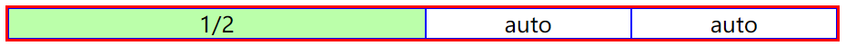

#### 3.2 圣杯布局

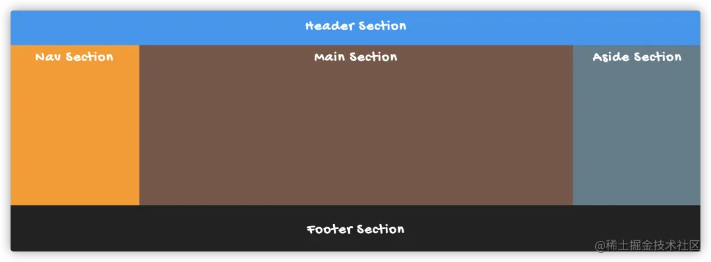

```html
<style>
  /* 清除样式 */
  * {
    margin: 0;
    padding: 0;
  }
  body {
    display: flex;
    flex-direction: column;
    width: 100vw;
    min-height: 100vh;
    background-color: aqua;
    font-size: 1.5rem;
  }
  header,
  main,
  footer {
    display: flex;
    /* 设置主轴和辅轴元素都居中排列 */
    justify-content: center;
    align-content: center;
  }
  header {
    min-height: 15vh;
    background-color: khaki;
  }
  main {
    flex: 1;
    align-items: stretch;
    min-height: 0vh;
    /*默认值就是0*/
    width: 100%;
    background-color: dimgray;
  }
  footer {
    min-height: 20vh;
    margin-top: auto;
    background-color: blueviolet;
  }
  nav {
    order: -1;
    width: 220px;
    background-color: hotpink;
  }
  article {
    flex: 1;
    background-color: mistyrose;
  }
  aside {
    width: 220px;
    background-color: indianred;
  }
  /* 如果是小屏幕，躯干的三栏自动变为垂直叠加。 */
  @media (max-width: 768px) {
    main {
      flex-direction: column;
      flex: 1;
    }
    nav,
    article,
    aside {
      flex: auto;
    }
  }
</style>
<body class="HolyGrail">
  <header>Header Section</header>
  <main>
    <nav>Nav Section</nav>
    <article>Article Section</article>
    <aside>Aside Section</aside>
  </main>
  <footer>Footer Section</footer>
</body>
```

如果是小屏幕，躯干的三栏自动变为垂直叠加。

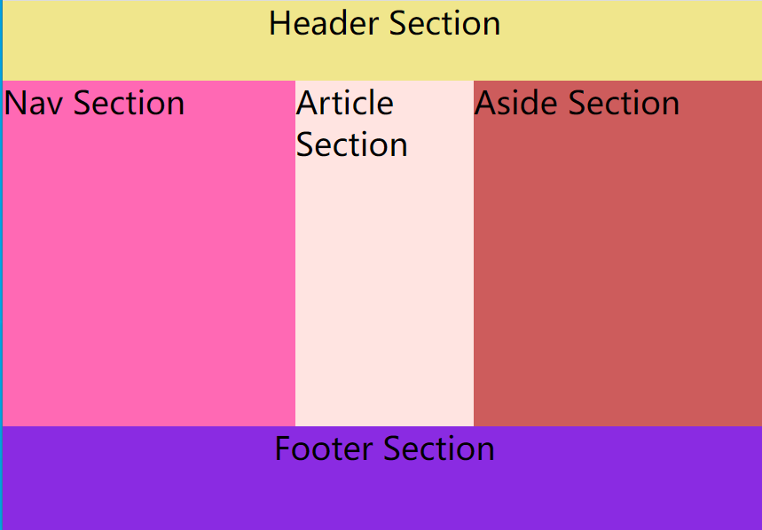


#### 3.3 悬挂式布局

主栏的左侧或右侧，需要添加一个图片栏。

```html
<style>
  .Media {
    display: flex;
    align-items: flex-start;
  }

  .Media-figure {
    margin-right: 1em;
  }

  .Media-body {
    flex: 1;
  }
  <style/>
<body>
  <div class="Media">
  
  <p class="Media-body">...</p>
  </div>
</body>
```

#### 3.4 固定的底栏

问题所在：页面内容太少，无法占满一屏的高度，底栏就会抬高到页面的中间。这时可以采用Flex布局，让底栏总是出现在页面的底部。

解决方法：设置纵轴为主轴，并且设置main为`flex:1`，可扩展可收缩，当内容较多时不侵占其他元素的尺寸。

```html
<style>
  body{
    display: flex;
    flex-direction: column;
    min-height: 100vh;
  }
  main{
    flex: 1;
  }
</style>
<body>
  <header></header>
  <main></main>
  <footer></footer>
</body>
```

### 4. 布局方式（牛客整理flex实现）

#### 4.1 两栏布局

两栏布局指的是==左边一栏宽度固定==，==右边一栏宽度自适应==。

左边元素设置为固定宽度 200px，将右边的元素设置为 flex:1。
理解：左边会固定为200px，当窗口改变时，右侧宽度会相应改变，

```html
<style>
  .outer{
    display: flex;
    min-height: 100vh;
  }
  .left{
    width: 200px;
    background-color: darkorange;
  }
  .right{
    flex: 1;
    background-color: grey;
  }
</style>
<body>
  <div class="outer">
    <div class="left">left</div>
    <div class="right">right</div>
  </div>
</body>
```

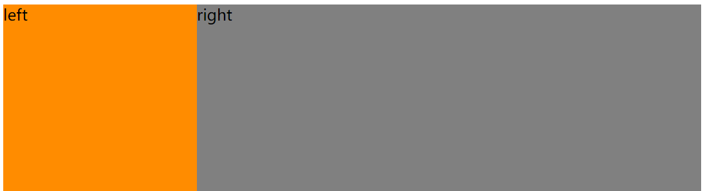

#### 4.2 等宽布局

弹性元素之间等宽排列。

设置方法：设置父元素为flex弹性盒`display:flex`，成为弹性容器，然后设置弹性元素`flex:1`

```html
<style>
  #parent{
    display: flex;
    min-height: 10vh;
  }
  .column{
    flex: 1;
    margin-left: 2vw;/*元素之间的外边距*/
  }
  .column:nth-child(odd){
    background-color: dimgray;
  }
  .column:nth-child(even){
    background-color: peachpuff;
  }
</style>
<body>
  <div id="parent">
    <div class="column">1</div>
    <div class="column">2</div>
    <div class="column">3</div>
    <div class="column">4</div>
    <div class="column">5</div>
</div>
```

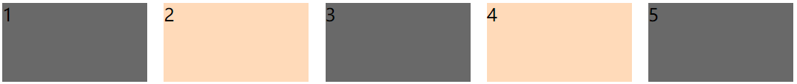

#### 4.3 九宫格布局

设置方法：整体按纵轴为主轴，每一行按横轴为主轴；并且父元素设置`display:flex`，每一行也设置`display:flex`，并且对每一行的弹性元素设置`flex:1`

```html
<body>
  <div id="parent">
    <div class="row">
        <div class="item">1</div>
        <div class="item">2</div>
        <div class="item">3</div>
    </div>
    <div class="row">
        <div class="item">4</div>
        <div class="item">5</div>
        <div class="item">6</div>
    </div>
    <div class="row">
        <div class="item">7</div>
        <div class="item">8</div>
        <div class="item">9</div>
    </div>
</div>
<style>
  #parent{
    display: flex;
    flex-direction: column;
  }
  .row{
    display: flex;
    float: 1;
  }
  .item{
    flex: 1;
    border: 1px solid #000;
  }
</style>
```

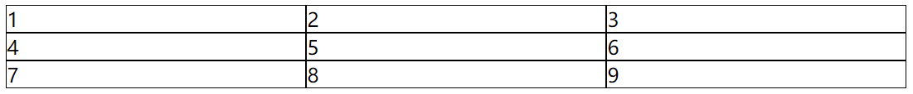

#### 4.4 全屏布局

设置方法：和圣杯布局都差不多吧，比较简单，设置父为弹性容器其纵轴为主轴，top、middle、bottom都为`display:flex`，并且设置middle为`flex:1`表示中间自适应，left为固定宽度，right为`flex：1`右侧为自适应。

```html
<body>
  <div class="parent">
    <div class="top">top</div>
    <div class="middle">
      <div class="left">left</div>
      <div class="right">right</div>
    </div>
    <div class="bottom">bottom</div>
  </div>
  <style>
    *{
      margin: 0;
      padding: 0;
    }
    .parent{
      display: flex;
      flex-direction: column;
      min-height: 100vh;
      background-color: #bfa;
    }
    .top{
      display: flex;
      min-height: 15vh;
      background-color: gray;
    }
    /* 中间部分：左设置为固定，有自适应 */
    .middle{
      display: flex;
      flex: 1;/*顶部和底部都设置好了高度，这里设置flex:1；剩下的部分都是middle的*/
    }
    .left{
      width: 20vw;
      background-color: saddlebrown;
    }
    .right{
      flex: 1;
      background-color: burlywood;
    }
    .bottom{
      display: flex;
      min-height: 15vh;
      background-color: dimgrey;
    }
  </style>
</body>
```

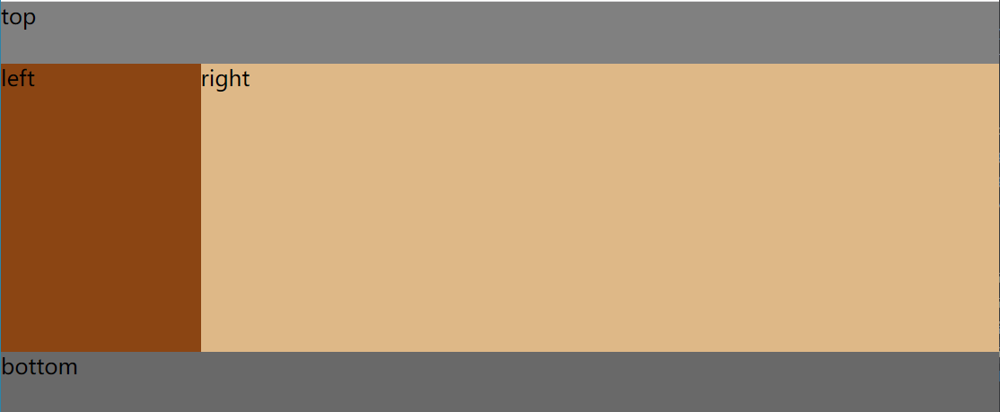

隐藏滚动条：-webkit-scrollbar {display: none;}

#### 4.5 圣杯布局

圣杯布局是常见的三栏式布局。两边顶宽，中间自适应的三栏布局。

添加响应式布局，当屏幕缩小到768px时，隐藏两个侧边栏

* 设置上中下的对齐方式`justify-content: center;`，`align-items: center;`则上下里面的元素会居中对齐；但是main会仅在中间显示，需要设置`align-items: stretch;`将中间元素拉伸为等高。main设置`flex:1`的目的是让main可扩展可收缩，响应式 --- 圣杯布局还是不太完美。

```html
<body>
  <div class="continer">
    <header>Header Section</header>
    <main>
      <nav>Nav Section</nav>
      <article>Article Section</article>
      <aside>Aside Section</aside>
    </main>
    <footer>Footer Section</footer>
  </div>
  <style>
    * {
      margin: 0;
      padding: 0;
    }
    .continer {
      display: flex;
      flex-direction: column;
      min-height: 100vh;
      min-width: 100vw;
      background-color: #bfa;
    }
    header,main,footer{
      display: flex;
      justify-content: center;
      align-items: center;
    }

    header {
      min-height: 15vh;
      background-color: lightslategray;
    }

    main {
      flex: 1;
      align-items: stretch;
      text-align: center;
    }

    footer {
      min-height: 15vh;
      background-color: gray;
    }

    nav {
      width: 200px;
      background-color: indianred;
    }

    article {
      flex: 1;
      background-color: lightskyblue;
    }

    aside {
      width: 200px;
      background-color: darkkhaki;
    }

    /* 如果是小屏幕，只保留隐藏两栏。 */
    @media (max-width: 768px) {

      nav,
      aside {
        display: none;
      }
    }
  </style>
</body>
```

#### 4.6 双飞翼布局

两侧边栏固定，中间自适应

```html
<body>
  <div class="container">
    <nav>left</nav>
    <main>content</main>
    <aside>right</aside>
  </div>
  <style>
    *{
      margin: 0;
      padding: 0;
    }
    .container{
      display: flex;
      min-width: 100vw;
      min-height: 100vh;
      background-color: #bfa;
    }
    nav{
      display: flex;
      width: 100px;
      background-color: coral;
    }
    main{
      display: flex;
      flex: 1;
      background-color: antiquewhite;
    }
    aside{
      display: flex;
      width: 100px;
    }
  </style>
</body>
```

## 问题17：水平垂直居中

#### 1. 定宽高flex实现

子元素定宽高

```html
<body>
  <div class="box">
    <div class="children-box">
      2
    </div>
  </div>
  <style>
    .box{
      width: 200px;
      height: 200px;
      border: 1px solid red;
      display: flex;
      justify-content: center;
      align-items: center;
    }
    .children-box{
      display: flex;
      justify-content: center;
      align-items: center;
      width: 100px;
      height: 100px;
      background: yellow;
    }
  </style>
</body>
```

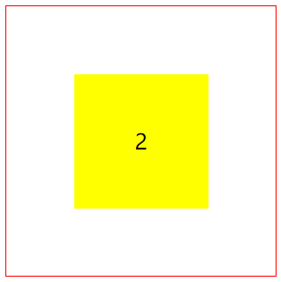

#### 2. 不定宽高

子元素不定宽高，和定宽高设置一样；思想都是给父设置为弹性容器，然后对子即弹性元素设置`justify-content:center`，`align-items:center`。

```html
<div class="box">
  <div class="children-box">
    2
  </div>
</div>
<style>
  .box{
    width: 200px;
    height: 200px;
    border: 1px solid red;
    display: flex;
    justify-content: center;
    align-items: center;
  }
  .children-box{
    background: yellow;
  }
</style>
```

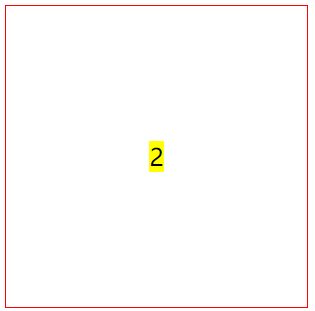

## 问题18：浮动和定位⭐⭐⭐

### 一、浮动

#### 1. 要点

`float：none|left|right`

特点：

* 设置浮动会脱离文档流
* 如果上面的元素没有设置浮动，则下面设浮动的元素不会上移
* 设置浮动的元素不会超过它的父元素
* 上面有设置浮动的兄弟元素，则该元素不会超过上面的兄弟元素，最多和他一样高

#### 2. 高度塌陷

原因：默认情况下父元素高度是由子元素高度撑开的，但是子元素设置浮动后，会脱离文档流，所以会形成高度塌陷现象。

举例说明：

* 在该案例中，父元素只设置了边框，元素在未设置宽度时，默认是视口宽度。

```html
<div class="outer">
  <div class="inner">inner</div>
</div>
<style>
  .outer{
    border: 10px red solid;
  }
  .inner{
    width: 100px;
    height: 100px;
    background-color: #bfa;
    float: none;
    float: left;
  }
</style>
```

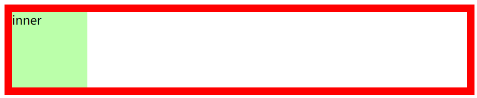

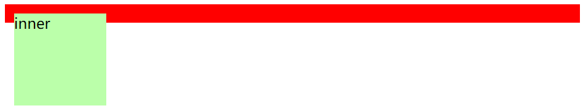

解决方法：

1. 开启BFC

   特点

   * 开启BFC，元素会变成独立的布局区域
   * 不会被浮动元素所覆盖
   * 可以包含子元素
   * 不会出现外边距重叠

   开启BFC方法

   * 设置元素浮动（给父元素设置浮动，脱离文档流）
   * 设置为行内块元素（`display:inner-block`）
   * 设置元素的`overflow`为非`visibal`值 🦈

### 二、定位

#### 1. 清除浮动

**浮动定义**

- 非IE浏览器下，容器不设高度且子元素浮动时，容器高度不能被内容撑开。 此时，内容会溢出到容器外面而影响布局。这种现象被称为浮动（溢出）。--- 🦈高度塌陷

**浮动元素引起的问题**

- 父元素的高度无法被撑开，影响与父元素同级的元素
- 与浮动元素同级的非浮动元素会跟随其后
- 若浮动的元素不是第一个元素，则该元素之前的元素也要浮动，否则会影响页面的显示结构

**清除浮动的方式**


### 问题19：CSS 优化和提高性能的方法有哪些？


### 问题20：场景提

#### 1. 三角形

border的边框是由四个三角形组成的。

整个实现流程：

* 先创建一个边框

```html
<div class="triangle"></div>
<style>
  .triangle{
    width: 50px;
    height: 50px;
    border: 20px solid;
    border-color: blue red green greenyellow
  }
</style>
```

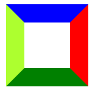

* 将width和height设置为0，变成三角形

```html
<div class="triangle"></div>
<style>
  .triangle{
    width: 0;
    height: 0;
    border: 20px solid;
    border-color: blue red green greenyellow
  }
</style>
```


* 通过设置边框颜色为透明，即可以实现三角形

```html
<div class="triangle"></div>
<style>
  .triangle{
    width: 0;
    height: 0;
    border: 20px solid;
    border-color: blue transparent transparent transparent /*上右下左*/
  }
</style>
```

* 通过改变边框的位置可以改变三角形的位置，通过改变边框大小，实现三角形的不同大小。


**直角三角形**

通过border-top、border-left设置直角三角形

```html
<div class="triangle"></div>
<style>
  .triangle{
    width: 0;
    height: 0;
    /* 三角形 */
    /* border: 20px solid; */
    /* border-color: blue transparent transparent transparent 上右下左 */

    /* 直角三角形 */
    border-top: 100px solid transparent;
    border-left: 100px solid blue;
  }
</style>
```

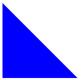

#### 2. 扇形

```html
<div class="sector"></div>
<style>
  .sector{
    width: 0;
    height: 0;
    border: 100px solid transparent;/*会形成一个正方形，由上右下左四个三角形实现*/
    border-radius: 100px;/*会形成一个圆形*/
    border-top-color: red;/*通过四个三角形把圆形分割，只给上面添加颜色形成扇形*/
  }
</style>
```

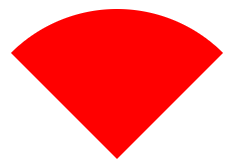

#### 3. 0.5px的线

```html
<body>
  <h1>0.5px的线</h1>
  <div class="pxhalf"></div>
  <h1>1px的线</h1>
  <div class="pxone"></div>
  <style>
    .pxhalf{
      height: 1px;
      background-color: black;
      transform: scaleY(0.5);
      transform-origin: 50% 100%; /*为了防止线模糊*/
    }

    .pxone{
      height: 1px;
      background-color: blue;
    }
  </style>
</body>
```

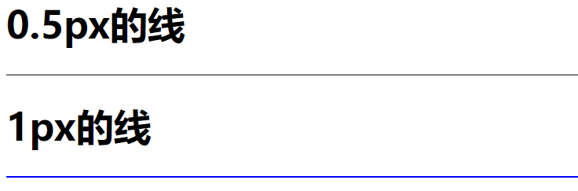

### 问题21：让Chrome支持小于12px 的文字？

```html
p{
    font-size:10px;
    -webkit-transform:scale(0.8);//0.8是缩放比例
} 
```

