# 牛客

## 1. 数据类型

1. 数据类型（了解symbol和bigint吗）
2. 基本数据类型和引用数据类型的区别
3. 判断数据类型方法
4. JS基本数据类型引用数据类型分别有哪些？
5. 基本数据类型之间的转换
6. typeof的使用 和 instanceof的区别
7. null和undefined的区别
8. 栈和堆

## 2. BOM、DOM

1. 如何避免 js 阻止 DOM 树渲染？
2. JS中数据经常不准确，比如：为什么0.1+0.2 ! == 0.3，如何让其相等？[答案](https://www.nowcoder.com/discuss/726027?channel=-1&source_id=profile_follow_post_nctrack)
3. DOM树上有10个节点，渲染树上一定有10个节点吗？


1. new 操作符干了什么事？
2. 声明变量的方式 const var let 的区别
3. const 声明生成对象的时候，如何使其不可更改
4. 防抖和节流

# 整理

## 1.数据类型

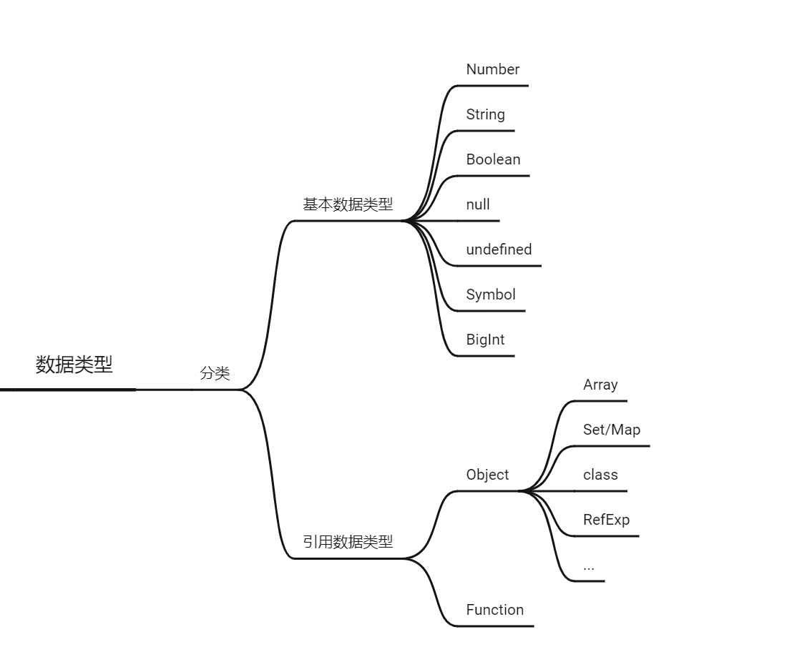

### **🦈问题1：数据类型分类**

分为两大类，基本数据类型和引用数据类型。

基本类型：Number Boolean  String  undefined null （ES6新增了）Symbol BigInt

（对象）引用类型：Object  Function Array

ES6新增数据类型Symbol BigInt

- Symbol 代表创建后独一无二且不可变的数据类型，它主要是为了解决可能出现的全局变量冲突的问题。---symbol类型：不可用作构造函数与new一起使用；（说说你对Symbol的理解？主要用于定义对象的属性，避免属性冲突）。
- BigInt 是一种数字类型的数据，它可以表示任意精度格式的整数，使用 BigInt 可以安全地存储和操作大整数，即使这个数已经超出了 Number 能够表示的安全整数范围。（说说对BigInt的理解？）

### **🦈问题2：基本类型和引用类型的区别：**

* 存放位置：
  * 基本类型的数据是直接存储在栈（stack）中的简单数据段，占据空间小、大小固定，属于被频繁使用数据，所以放入栈中存储，
  * 引用类型的数据是存放在堆内存中的，占据空间大、大小不固定。如果存储在栈中，将会影响程序运行的性能；引用数据类型在栈中存储了指针，该指针指向堆中该实体的起始地址。当解释器寻找引用值时，会首先检索其在栈中的地址，取得地址后从堆中获得实体。---基本类型保存的就是该基本类型数据，而引用类型保存的是地址值。

* 复制：

  * 基本类型的复制就是在栈内存中开辟出了一个新的存储区域用来存储新的变量，这个变量有它自己的值，只不过和前面的值一样，所以如果其中一个的值改变，则不会影响到另一个。
  * 引用类型定义一个对象其实是在栈内存中存储了一个指针，这个指针指向堆内存中该对象的存储地址。复制给另一个对象的过程其实是把该对象的地址复制给了另一个对象变量，两个指针都指向同一个对象实体，所以若其中一个修改了，则另一个也会改变。

  **扩展**

  堆和栈的概念存在于数据结构和操作系统内存中，在数据结构中：

  - 在数据结构中，栈中数据的存取方式为先进后出。
  - 堆是一个优先队列，是按优先级来进行排序的，优先级可以按照大小来规定。

  在操作系统中，内存被分为栈区和堆区：

  - 栈区内存由编译器自动分配释放，存放函数的参数值，局部变量的值等。其操作方式类似于数据结构中的栈。
  - 堆区内存一般由开发着分配释放，若开发者不释放，程序结束时可能由垃圾回收机制回收。

### **🦈问题3：typeof的使用 和 instanceof的区别**

* **typeof**
  `typeof`确定任意==变量==的数据类型；`typeof` 操作符返回一个字符串，表示未经计算的操作数的类型。

  ```js
  typeof 1 // 'number'
  typeof '1' // 'string'
  typeof undefined // 'undefined'
  typeof true // 'boolean'
  typeof Symbol() // 'symbol'
  typeof null // 'object'
  typeof [] // 'object'
  typeof {} // 'object'
  typeof console // 'object'
  typeof console.log // 'function'
  ```

  前6个都是基础数据类型，但是`null`返回'object'，所以不能使用`typeof()`去判断null，可以采用`===null`去判断是否为null。
  引用类型采用`typeof`去判断，除了`function可以识别，其他都会返回`object`

  **关于底层**

  js 在底层存储变量的时候，会在变量的机器码的低位1-3位存储其类型信息👉

  - 000：对象
  - 010：浮点数
  - 100：字符串
  - 110：布尔
  - 1：整数

  but, 对于 `undefined` 和 `null` 来说，这两个值的信息存储是有点特殊的。

  `null`：所有机器码均为0

  `undefined`：用 −2^30 整数来表示

  所以，`typeof` 在判断 `null` 的时候就出现问题了，由于 `null` 的所有机器码均为0，因此直接被当做了对象来看待。

* **instanceof**
  `instanceof` 运算符用于检测构造函数的 `prototype` 属性是否出现在某个实例对象的原型链上。---（`instanceof`运算符返回一个布尔值，可以用于检测构造函数的 `prototype` 属性是否出现在某个实例对象的原型链上，通俗说就是用于判断某个实例是否属于某构造函数。再通俗一点就是，只要右边变量的`prototype`在左边变量的原型链上就返回 true，否则返回 false）
  使用：

* ```react
  object instanceof constructor
  ```

  构造函数通过`new`可以实例对象，`instanceof`判断生成的实例对象是不是右边的构造函数所生成的实例对象。

  ```js
  // 定义构建函数
  let Car = function() {}
  let benz = new Car()
  benz instanceof Car // true
  let car = new String('xxx')
  car instanceof String // true
  let str = 'xxx'
  str instanceof String // false
  ```

  `instanceof`的==实现原理==：🦈右边变量的`prototype`是否在左边变量的原型链上

  ```js
  function myInstanceof(left, right) {
    // 这里先用typeof来判断基础数据类型，如果是，直接返回false
    if(typeof left !== 'object' || left === null) return false;
    // getProtypeOf是Object对象自带的API，能够拿到参数的原型对象
    let proto = Object.getPrototypeOf(left);
    while(true) {                  
      if(proto === null) return false;
      if(proto === right.prototype) return true;//找到相同原型对象，返回true
      proto = Object.getPrototypeof(proto);
    }
  }
  ```
  顺着原型链去找，直到找到相同的原型对象，返回`true`，否则为`false`。

  🦈这里可能会提问原型继承的原理？

  `__proto__`属性，可以访问对象的原型，即p1.__proto__ = Person.prototype

* **区别**

  * typeof会返回一个变量的基本类型，instanceof返回的是一个布尔值。
  * instanceof 可以准确地判断复杂引用数据类型，但是不能正确判断基础数据类型。
  * 而typeof 也存在弊端，它虽然可以判断基础数据类型（null 除外），但是引用数据类型中，除了function 类型以外，其他的也无法判断。

  **通用数据类型检测**
  可以采用`Object.prototype.toString`，调用该方法，统一返回格式`“[object Xxx]”`的字符串。

  ```js
  Object.prototype.toString({})       // "[object Object]"
  Object.prototype.toString.call({})  // 同上结果，加上call也ok
  Object.prototype.toString.call(1)    // "[object Number]"
  Object.prototype.toString.call('1')  // "[object String]"
  Object.prototype.toString.call(true)  // "[object Boolean]"
  Object.prototype.toString.call(function(){})  // "[object Function]"
  Object.prototype.toString.call(null)   //"[object Null]"
  Object.prototype.toString.call(undefined) //"[object Undefined]"
  Object.prototype.toString.call(/123/g)    //"[object RegExp]"
  Object.prototype.toString.call(new Date()) //"[object Date]"
  Object.prototype.toString.call([])       //"[object Array]"
  Object.prototype.toString.call(document)  //"[object HTMLDocument]"
  Object.prototype.toString.call(window)   //"[object Window]"
  ```

  实现一个全局通用的数据类型判断方法（把typeof方法和instanceof方法结合起来）

  思路：先采用`typeof`去判断，能判断则直接返回，不能判断则采用`instanceof`去判断，采用正则表达式对判断结果进行调整。

  ```js
  function getType(obj){
    let type  = typeof obj;
    if (type !== "object") { // 先进行typeof判断，如果是基础数据类型，直接返回
      return type;
    }
    // 对于typeof返回结果是object的，再进行如下的判断，正则返回结果
    return Object.prototype.toString.call(obj).replace(/^\[object (\S+)\]$/, '$1'); 
  }
  ```

  使用

  ```js
  getType([])     // "Array" typeof []是object，因此toString返回
  getType('123')  // "string" typeof 直接返回
  getType(window) // "Window" toString返回
  getType(null)   // "Null"首字母大写，typeof null是object，需toString来判断
  getType(undefined)   // "undefined" typeof 直接返回
  getType()            // "undefined" typeof 直接返回
  getType(function(){}) // "function" typeof能判断，因此首字母小写
  getType(/123/g)      //"RegExp" toString返回
  ```


**小问题：**

* **typeof NaN 的结果是什么？'number'**

  NaN 指"不是一个数字”（not a number），NaN 是一个“警戒值”（sentinel value，有特殊用途的常规值），用于指出数字类型中的错误情况，即“执行数学运算没有成功，这是失败后返回的结果”。

  ```javascript
  typeof NaN; // "number"
  ```

  NaN 是一个特殊值，它和自身不相等，是唯一一个非自反（自反，reflexive，即 `x === x` 不成立）的值。而 NaN !== NaN 为 true。

* **isNaN 和 Number.isNaN 函数的区别**

  - 函数 isNaN 接收参数后，会尝试将这个参数转换为数值，==任何不能被转换为数值的的值都会返回 true==，因此非数字值传入也会返回 true ，会影响 NaN 的判断。
  - 函数 Number.isNaN 会首先判断传入参数是否为数字，如果是数字再继续判断是否为 NaN ，==不会进行数据类型的转换==，这种方法对于 NaN 的判断更为准确。

**扩展**

同样是检测对象obj调用toString方法，obj.toString()的结果和Object.prototype.toString.call(obj)的结果不一样，这是为什么？

这是因为toString是Object的原型方法，而Array、function等**类型作为Object的实例，都重写了toString方法**。不同的对象类型调用toString方法时，根据原型链的知识，调用的是对应的重写之后的toString方法（function类型返回内容为函数体的字符串，Array类型返回元素组成的字符串…），而不会去调用Object上原型toString方法（返回对象的具体类型），所以采用obj.toString()不能得到其对象类型，只能将obj转换为字符串类型；因此，在想要得到对象的具体类型时，应该调用Object原型上的toString方法。

### **🦈问题4：null 和 undefined 的差异**

- null 转为数字类型值为 0，而 undefined 转为数字类型为 NaN；（已声明但是值为空null）
- undefined 是代表调用一个值而该值却没有赋值，这时候默认则为 undefined；（声明变量但未赋值）
- null 是一个很特殊的对象，最为常见的一个用法就是作为参数传入(说明该参数不是对象）
- 初始赋值null，表明将要赋值为对象。？
- 结束前，让对象成为垃圾对象，设置为 null 的变量或者对象会被内存收集器回收；垃圾回收
- 关于底层：`null`：所有机器码均为0。`undefined`：机器码用 −2^30 整数来表示

### 🦈问题5：`==`、`===`和 Object.is()的区别

- ==：等同，比较运算符，两边值类型不同的时候，先进行类型转换，再比较；
- ===：恒等，严格比较运算符，不做类型转换，类型不同就是不等；
- Object.is()是 ES6 新增的用来比较两个值是否严格相等的方法，与===的行为基本一致。
- 先说===，这个比较简单，只需要利用下面的规则来判断两个值是否恒等就行了：
  - 如果类型不同，就不相等
  - 如果两个都是数值，并且是同一个值，那么相等； 
  - 值得注意的是，如果两个值中至少一个是 NaN，那么不相等（判断一个值是否是 NaN，可以用 isNaN()、Number.isNaN()或 Object.is()来判断）。
  - 如果两个都是字符串，每个位置的字符都一样，那么相等；否则不相等。
  - 如果两个值都是同样的 Boolean 值，那么相等。
  - 如果两个值都引用同一个对象或函数，那么相等，即两个对象的物理地址也必须保持一致；否则不相等。
  - 如果两个值都是 null，或者都是 undefined，那么相等。
- 再说 Object.is()，其行为与===基本一致，不过有两处不同：
  - +0 不等于-0。
  - NaN 等于自身。

### 🦈问题6：JavaScript 中的包装类型

在JS中为我们提供了三个包装类，通过这三个包装类可以将基本数据类型的数据转换为对象。
String()可以将基本数据类型字符串转换为String对象
Number()可以将基本数据类型的数字转换为Number对象
Boolean()可以将基本数据类型的布尔值转换为Boolean对象

在 JavaScript 中，基本类型是没有属性和方法的，但是为了便于操作基本类型的值，在调用基本类型的属性或方法时 JavaScript 会在后台隐式地将基本类型的值转换为对象，如：

```js
const a = "abc";
a.length; // 3
a.toUpperCase(); // "ABC"
```

在访问\'abc\'.length时，JavaScript 将'abc'在后台转换成String('abc')，然后再访问其length属性。
JavaScript也可以使用**Object**函数显式地将基本类型转换为包装类型：

```js
var a = 'abc'
Object(a) // String {"abc"}
```

也可以使用**valueOf**方法将包装类型倒转成基本类型：

```
var a = 'abc'
var b = Object(a)
var c = b.valueOf() // 'abc'
```

看看如下代码会打印出什么：

```js
var a = new Boolean( false );
if (!a) {
	console.log( "Oops" ); // never runs
}
console.log(typeof(a))
// object
```

答案是什么都不会打印，因为虽然包裹的基本类型是false，但是false被包裹成包装类型后就成了对象，所以其非值为false，所以循环体中的内容不会运行。

### 🦈问题7：判断数组的五种方法

**instanceof**

```JavaScript
const arr= []
arr instanceof Array // true
```

**Array.isArray**

```
const arr = []
Array.isArray(arr) // true

const obj = {}
Array.isArray(obj) // false
```

**Object.prototype.isPrototypeOf**

- 使用 Object 的原型方法 isPrototypeOf，判断两个对象的原型是否一样, `isPrototypeOf()` 方法用于测试一个对象是否存在于另一个对象的原型链上。---》instanceof就是采用的这种方法。

```
const arr = []
Object.prototype.isPrototypeOf(arr, Array.prototype) // true
```

**Object.getPrototypeOf**：`getPrototypeOf()` 方法返回指定对象的原型。

```
const arr = []
Object.getPrototypeOf(arr) === Array.prototype // true
```

**Object.prototype.toString**

```
const arr = []
Object.prototype.toString.call(arr) === '[object Array]' // true

const obj = {}
Object.prototype.toString.call(obj) // "[object Object]"
```

- 为什么不直接用 obj.toString()呢？
  这是因为 toString 为 Object 的原型方法，而 Array，function 等类型作为 Object 的实例，都==重写了 toString 方法==。不同的对象类型调用 toString 方法时，根据原型链的知识，调用的是对应的重写之后的 toString 方法，而不会去调用 Object 上原型 toString 方法（返回对象的具体类型），所以采用 obj.toString()不能得到其对象类型，只能将 obj 转换为字符串类型；因此，在想要得到对象的具体类型时，应该调用 Object 上原型 toString 方法。

### 🦈问题8：数组操作

**数组扁平化**
数组扁平化就是把多维数组转化成一维数组。

- flat()方法

  - 指定提取数组的嵌套层数，默认是1，Infinity可以提取任意深度
  - flat方法会自动移除空项（移除空格）

  ```js
  console.log([1 ,[2, 3]].flat()); // [1, 2, 3]
  // 指定转换的嵌套层数
  console.log([1, [2, [3, [4, 5]]]].flat(2)); // [1, 2, 3, [4, 5]]
  // 不管嵌套多少层
  console.log([1, [2, [3, [4, 5]]]].flat(Infinity)); // [1, 2, 3, 4, 5]
  // 自动跳过空位
  console.log([1, [2, , 3]].flat()); // [1, 2, 3]
  ```

- reduce + concat

  ```js
  arr.reduce((prev, cur) => prev.concat((cur), []);//这个仅能对二维数组进行铺平
  // 优化---采用递归
  // 定义一个flatten函数，判断如果是数组就一直递归
  function flatten(arr){
    return arr.reduce((prev, cur) => {
      return prev.concat(Array.isArray(cur) ? flatten(cur) : cur)
    },[])
  }
  ```

- 扩展运算符 + concat

  ```js
  // 二维
  const flattened = arr => [].concat(...arr);
  
  // 优化
  function flatten(arr){
  while(arr.some(item => Array.isArray(item))){
    arr = [].concat(...arr);
  }
  return arr;
  }
  
  const arr = [1, [2, [3, 4]]];
  console.log(flatten(arr));
  ```

**数组去重**
去除数组的重复元素

- 双重for循环

  ```js
  function Array_dfor(data) {
    const newArray = [];
    let isRepeat;
    for (let i = 0; i < data.length; i++) {
      isRepeat = false;
      for (let j = 0; j < newArray.length; j++) {
        if (data[i] === newArray[j]) {
          isRepeat = true;
          break;
        }
      }
      if (!isRepeat) {
        newArray.push(data[i]);
      }
    }
    return newArray;
  }
  ```

- includes()
  不存在就加入数组，存在直接跳过

  ```js
  function Array_includes(data) {
  var arr = [];
  for (var i = 0; i < data.length; i++) {
    if (!arr.includes(data[i])) {
      arr.push(data[i])
    }
  }
  return arr;
  ```

- index()
  同includes()

  ```js
  function Array_indexOf(data) {
    var arr = [];
    for (var i = 0; i < data.length; i++) {
      if (arr.indexOf(data[i]) === -1){
        arr.push(data[i])
      }
    }
    return arr;
  }
  ```

- reducer + indexOf()
  不存在该元素时，加入到数组，存在时直接返回前一计算结果的数组

  ```js
  let myArray = ['a', 'b', 'a', 'b', 'c', 'e', 'e', 'c', 'd', 'd', 'd', 'd']
  let myArrayWithNoDuplicates = myArray.reduce(function (previousValue, currentValue) {
    if (previousValue.indexOf(currentValue) === -1) {// indexOf判断不存在该元素返回-1
      previousValue.push(currentValue)
    }
    return previousValue // 已经存在该元素，所以直接返回前一判断结果
  }, [])
  
  console.log(myArrayWithNoDuplicates)
  ```

- Map()

```js
function Array_Map(data) {
  const newArr = [];
  const tmp = new Map();
  for (var i = 0; i < data.length; i++) {
    if (!tmp.has(data[i])){
      tmp.set(data[i],1)
      newArr.push(data[i])
    }
  }
  return newArr;
}
```

- Set()

```js
function Array_set(data) {
  return Array.from(new Set(data))
}
```


## 2. BOM和DOM

### 基础知识点

* BOM
  浏览器对象模型，它指的是把浏览器当做一个对象来对待，这个对象主要定义了与浏览器进行交互的方法和接口。

  * location

    提供了当前窗口中加载文档的信息，以及通常的导航功能。

  * history 对象
    `history`对象主要用来操作浏览器`URL`的历史记录，可以通过参数向前，向后，或者向指定`URL`跳转

    - history.go() -- 前进或后退指定的页面数 history.go(num);
    - history.back() -- 后退一页
    - history.forward() -- 前进一页

  * Navigator
    `navigator` 对象主要用来获取浏览器的属性，区分浏览器类型。属性较多，且兼容性比较复杂。

    - navigator.userAgent -- 返回用户代理头的字符串表示(就是包括浏览器版本信息等的字符串)
    - navigator.cookieEnabled -- 返回浏览器是否支持(启用)cookie

  * screen
    保存的纯粹是客户端能力信息，也就是浏览器窗口外面的客户端显示器的信息，比如像素宽度和像素高度

* DOM
  DOM 指的是文档对象模型，它指的是把文档当做一个对象，这个对象主要定义了处理网页内容的方法和接口。==DOM 表示由多层节点构成的文档，通过它开发者可以添加、删除和修改页面的各个部分。==

### 🦈问题1：说说你对BOM的理解，常见的BOM对象你了解哪些？

[参考](https://vue3js.cn/interview/JavaScript/BOM.html#%E4%B8%80%E3%80%81%E6%98%AF%E4%BB%80%E4%B9%88)

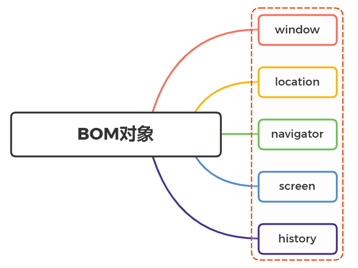

### 🦈问题2：DOM常见的操作有哪些？

**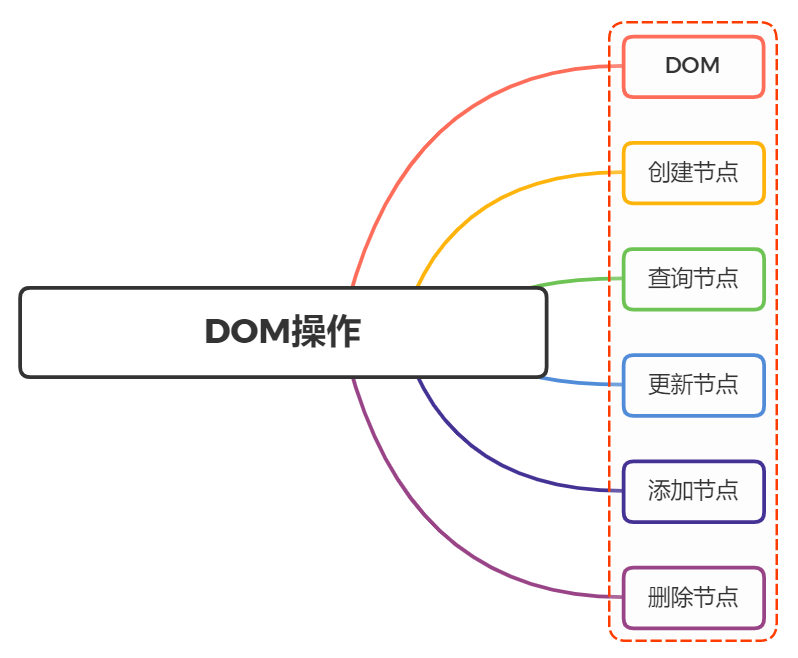**
**操作**

`React`等框架出现后，我们通过操作数据来控制`DOM`（绝大多数时候），越来越少的去直接操作`DOM`。

- 创建节点
- 查询节点
- 更新节点
- 添加节点
- 删除节点

**创建节点**

* createElement

  创建新元素，接受一个参数，即要创建元素的标签名

```js
const divEl = document.createElement("div");
```

- createTextNode

  创建一个文本节点

```js
const textEl = document.createTextNode("content");
```

- createDocumentFragment

  用来创建一个文档碎片，它表示一种轻量级的文档，主要是用来存储临时节点，然后把文档碎片的内容一次性添加到`DOM`中

```js
const fragment = document.createDocumentFragment();
```

​	当请求把一个`DocumentFragment` 节点插入文档树时，插入的不是 `DocumentFragment`自身，而是它的所有子孙节点

- createAttribute

  创建属性节点，可以是自定义属性

```js
const dataAttribute = document.createAttribute('custom');
consle.log(dataAttribute);
```

**获取节点**

- querySelector

传入任何有效的`css` 选择器，即可选中单个 `DOM`元素（首个）：

```js
document.querySelector('.element')
document.querySelector('#element')
document.querySelector('div')
document.querySelector('[name="username"]')
document.querySelector('div + p > span')
```

如果页面上没有指定的元素时，返回 `null`

- querySelectorAll

返回一个包含节点子树内所有与之相匹配的`Element`节点列表，如果没有相匹配的，则返回一个空节点列表

```js
const notLive = document.querySelectorAll("p");
```

需要注意的是，该方法返回的是一个 `NodeList`的静态实例，它是一个静态的“快照”，而非“实时”的查询

关于获取`DOM`元素的方法还有如下，就不一一述说

```js
document.getElementById('id属性值');返回拥有指定id的对象的引用
document.getElementsByClassName('class属性值');返回拥有指定class的对象集合
document.getElementsByTagName('标签名');返回拥有指定标签名的对象集合
document.getElementsByName('name属性值'); 返回拥有指定名称的对象结合
document/element.querySelector('CSS选择器');  仅返回第一个匹配的元素
document/element.querySelectorAll('CSS选择器');   返回所有匹配的元素
document.documentElement;  获取页面中的HTML标签
document.body; 获取页面中的BODY标签
document.all[''];  获取页面中的所有元素节点的对象集合型
```

除此之外，每个`DOM`元素还有`parentNode`、`childNodes`、`firstChild`、`lastChild`、`nextSibling`、`previousSibling`属性，关系图如下图所示

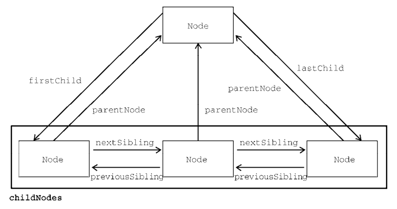

**更新节点**

- innerHTML

不但可以修改一个`DOM`节点的文本内容，还可以直接通过`HTML`片段修改`DOM`节点内部的子树

```js
// 获取<p id="p">...</p >
var p = document.getElementById('p');
// 设置文本为abc:
p.innerHTML = 'ABC'; // <p id="p">ABC</p >
// 设置HTML:
p.innerHTML = 'ABC <span style="color:red">RED</span> XYZ';
// <p>...</p >的内部结构已修改
```

- innerText、textContent

自动对字符串进行`HTML`编码，保证无法设置任何`HTML`标签

```js
// 获取<p id="p-id">...</p >
var p = document.getElementById('p-id');
// 设置文本:
p.innerText = '<script>alert("Hi")</script>';
// HTML被自动编码，无法设置一个<script>节点:
// <p id="p-id">&lt;script&gt;alert("Hi")&lt;/script&gt;</p >
```

两者的区别在于读取属性时，`innerText`不返回隐藏元素的文本，而`textContent`返回所有文本

- style

`DOM`节点的`style`属性对应所有的`CSS`，可以直接获取或设置。遇到`-`需要转化为驼峰命名。

```js
// 获取<p id="p-id">...</p >
const p = document.getElementById('p-id');
// 设置CSS:
p.style.color = '#ff0000';
p.style.fontSize = '20px'; // 驼峰命名
p.style.paddingTop = '2em';
```

**添加节点**

- innerHTML

如果这个DOM节点是空的，例如，`<div></div>`，那么，直接使用`innerHTML = '<span>child</span>'`就可以修改`DOM`节点的内容，相当于添加了新的`DOM`节点

如果这个DOM节点不是空的，那就不能这么做，因为`innerHTML`会直接替换掉原来的所有子节点。

- appendChild

把一个子节点添加到父节点的最后一个子节点

举个例子

```js
<!-- HTML结构 -->
<p id="js">JavaScript</p >
<div id="list">
    <p id="java">Java</p >
    <p id="python">Python</p >
    <p id="scheme">Scheme</p >
</div>
```

添加一个`p`元素

```js
const js = document.getElementById('js')
js.innerHTML = "JavaScript"
const list = document.getElementById('list');
list.appendChild(js);
```

现在`HTML`结构变成了下面

```js
<!-- HTML结构 -->
<div id="list">
    <p id="java">Java</p >
    <p id="python">Python</p >
    <p id="scheme">Scheme</p >
    <p id="js">JavaScript</p >  <!-- 添加元素 -->
</div>
```

上述代码中，我们是获取`DOM`元素后再进行添加操作，这个`js`节点是已经存在当前文档树中，因此这个节点首先会从原先的位置删除，再插入到新的位置

如果动态添加新的节点，则先创建一个新的节点，然后插入到指定的位置

```js
const list = document.getElementById('list'),
const haskell = document.createElement('p');
haskell.id = 'haskell';
haskell.innerText = 'Haskell';
list.appendChild(haskell);
```

- insertBefore

把子节点插入到指定的位置，使用方法如下：

```js
parentElement.insertBefore(newElement, referenceElement)
```

子节点会插入到`referenceElement`之前

- setAttribute

在指定元素中添加一个属性节点，如果元素中已有该属性改变属性值

```js
const div = document.getElementById('id')
div.setAttribute('class', 'white');//第一个参数属性名，第二个参数属性值。
```

- 删除节点

删除一个节点，首先要获得该节点本身以及它的父节点，然后，调用父节点的`removeChild`把自己删掉

```js
// 拿到待删除节点:
const self = document.getElementById('to-be-removed');
// 拿到父节点:
const parent = self.parentElement;
// 删除:
const removed = parent.removeChild(self);
removed === self; // true
```

删除后的节点虽然不在文档树中了，但其实它还在内存中，可以随时再次被添加到别的位置。

## 总结面试官系列

[参考地址](https://vue3js.cn/interview/)

### 问题1：数组的常用方法有哪些？

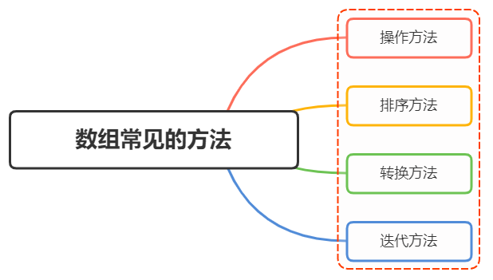

**操作方法**

⭐⭐⭐需要留意的是哪些方法会对原数组产生影响，哪些方法不会。

* 增

  `push() unshift() splice() concat()`；只有cancat()方法不会对原数组产生影响。

  - push() 方法接收任意数量的参数，并将它们添加到数组末尾，返回数组的最新长度

    ```js
    let colors = []; // 创建一个数组
    let count = colors.push("red", "green"); // 推入两项
    console.log(count) // 2
    ```

  - unshift() unshift()在数组开头添加任意多个值，然后返回新的数组长度

  - splice() 传入三个参数，分别是开始位置、0（要删除的元素数量）、插入的元素，返回空数组

  - concat() 首先会创建一个当前数组的副本，然后再把它的参数添加到副本末尾，最后返回这个新构建的数组，不会影响原始数组。---》生成的数组还是一维数组。

* 删

  `pop() shift() splice() slice()`；其中slice()方法不影响原数组。

  - pop() 用于删除数组的最后一项，同时减少数组的`length` 值，返回被删除的项。

  - shift() 用于删除数组的第一项，同时减少数组的`length` 值，返回被删除的项。

  - splice() 传入两个参数，分别是开始位置，删除元素的数量，返回包含删除元素的数组。

  - slice()  用于创建一个包含原有数组中一个或多个元素的新数组，不会影响原始数组。接收两个参数，表示要复制的位置。`[)`左闭右开。---》截取数组。

    ```js
    let colors = ["red", "green", "blue", "yellow", "purple"];
    let colors2 = colors.slice(1);
    let colors3 = colors.slice(1, 4);
    console.log(colors)   // red,green,blue,yellow,purple
    concole.log(colors2); // green,blue,yellow,purple
    concole.log(colors3); // green,blue,yellow
    ```

* 改
  修改原来数组的内容，常用`splice()`

  `splice() `传入三个参数，分别是开始位置，要删除元素的数量，要插入的任意多个元素，返回删除元素的数组，对原数组产生影响

* 查
  即查找元素，返回元素索引值或者元素值。

  - indexOf(value) 返回要查找的元素在数组中的位置，如果没找到则返回 -1

  - includes(value) 返回要查找的元素在数组中的位置，找到返回`true`，否则`false`

  - find() 返回第一个匹配的元素

    ```js
    const people = [
        {
            name: "Matt",
            age: 27
        },
        {
            name: "Nicholas",
            age: 29
        }
    ];
    people.find((element, index, array) => element.age < 28) // // {name: "Matt", age: 27}
    ```

**排序方法**

- reverse() 将数组元素方向反转。

  ```js
  let values = [1, 2, 3, 4, 5];
  values.reverse();
  alert(values); // 5,4,3,2,1
  ```

- sort()  升序、降序

**迭代方法**
都不改变原数组

- some() 对数组每一项都运行传入的测试函数，如果至少有1个元素返回 true ，则这个方法返回 true。

- every() 对数组每一项都运行传入的测试函数，如果所有元素都返回 true ，则这个方法返回 true

- forEach() 对数组每一项都运行传入的函数，没有返回值

  ```js
  let numbers = [1, 2, 3, 4, 5, 4, 3, 2, 1];
  numbers.forEach((item, index, array) => {
      // 执行某些操作
  });
  ```

- filter() 对数组每一项都运行传入的函数，函数返回 `true` 的项会组成数组之后返回。

  ```js
  let numbers = [1, 2, 3, 4, 5, 4, 3, 2, 1];
  let filterResult = numbers.filter((item, index, array) => item > 2);
  console.log(filterResult); // 3,4,5,4,3
  ```

- map() 对数组每一项都运行传入的函数，返回由每次函数调用的结果构成的数组。

  ```js
  let numbers = [1, 2, 3, 4, 5, 4, 3, 2, 1];
  let mapResult = numbers.map((item, index, array) => item * 2);
  console.log(mapResult) // 2,4,6,8,10,8,6,4,2
  ```

### 问题2：JavaScript字符串的常用方法有哪些？

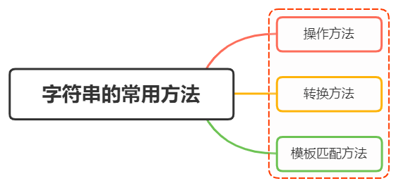

**操作方法**

归纳为增、删、改、查，字符串的特点是一旦创建了，就不可变。

* 增
  创建字符串的一个副本，再进行操作。
  除了常用`+`以及`${}`进行字符串拼接之外，还可通过`concat`。

  - `concat()` 用于将一个或多个字符串拼接成一个新字符串

    ```js
    let stringValue = "hello ";
    let result = stringValue.concat("world");
    console.log(result); // "hello world"
    console.log(stringValue); // "hello"
    ```

* 删

  创建字符串的一个副本，再进行操作.

  - slice()

  - substr()

  - substring()
    都返回调用它们的字符串的一个子字符串，而且都接收一或两个参数。
    一个参数表示截取从该索引到末尾，两个参数，表示截取该区间内的元素。除了`substr()`是左闭右闭，其他都是左闭右开。

    ```js
    let stringValue = "hello world";
    console.log(stringValue.slice(3)); // "lo world"
    console.log(stringValue.substring(3)); // "lo world"
    console.log(stringValue.substr(3)); // "lo world"
    console.log(stringValue.slice(3, 7)); // "lo w"
    console.log(stringValue.substring(3,7)); // "lo w"
    console.log(stringValue.substr(3, 7)); // "lo worl"
    ```

* 改

  不是改变原字符串，创建字符串的一个副本，再进行操作。

  常见的有：

  - trim()、trimLeft()、trimRight() 删除前、后或前后所有空格符，再返回新的字符串；⭐注意，只处理前后的空格，中间的空格不处理。

    ```js
    let stringValue = " hello world ";
    let trimmedStringValue = stringValue.trim();
    console.log(stringValue); // " hello world "
    console.log(trimmedStringValue); // "hello world"
    ```

  - repeat() 接收一个整数参数，表示要将字符串复制多少次，然后返回拼接所有副本后的结果

    ```js
    let stringValue = "na ";
    let copyResult = stringValue.repeat(2) // na na 
    ```

  - padStart()、padEnd() 复制字符串，如果小于指定长度，则在相应一边填充字符，直至满足长度条件.

    ```js
    let stringValue = "foo";
    console.log(stringValue.padStart(6)); // " foo"
    console.log(stringValue.padStart(9, ".")); // "......foo"
    ```

  - toLowerCase()、 toUpperCase() 大小写转化

    ```js
    let stringValue = "hello world";
    console.log(stringValue.toUpperCase()); // "HELLO WORLD"
    console.log(stringValue.toLowerCase()); // "hello world"
    ```

* 查

  除了通过索引的方式获取字符串的值，还可通过：

  - chatAt() 返回给定索引位置的字符，由传给方法的整数参数指定

    ```js
    let message = "abcde";
    console.log(message.charAt(2)); // "c"
    ```

  - indexOf() 从字符串开头去搜索传入的字符串，并返回位置（如果没找到，则返回 -1 ）

    ```js
    let stringValue = "hello world";
    console.log(stringValue.indexOf("o")); // 4
    ```

  - startWith() 检查是否以指定字符串开头。

  - includes() 从字符串中搜索传入的字符串，并返回一个表示是否包含的布尔值

    ```js
    let message = "foobarbaz";
    console.log(message.startsWith("foo")); // true
    console.log(message.startsWith("bar")); // false
    console.log(message.includes("bar")); // true
    console.log(message.includes("qux")); // false
    ```

**转换方法**

`split` 把字符串按照指定的分割符，拆分成数组中的每一项

```js
let str = "12+23+34"
let arr = str.split("+") // [12,23,34]
```

**模板匹配方法**

针对正则表达式，字符串设计了几个方法：

- match() 接收一个参数，可以是一个正则表达式字符串，也可以是一个`RegExp`对象，返回数组.

  ```js
  let text = "cat, bat, sat, fat";
  let pattern = /.at/;
  let matches = text.match(pattern);
  console.log(matches[0]); // "cat"
  ```

- search() 接收一个参数，可以是一个正则表达式字符串，也可以是一个`RegExp`对象，找到则返回匹配索引，否则返回 -1

  ```js
  let text = "cat, bat, sat, fat";
  let pos = text.search(/at/);
  console.log(pos); // 1
  ```

- replace() 接收两个参数，第一个参数为匹配的内容，第二个参数为替换的元素（可用函数）;==替换第一个元素==

  ```js
  let text = "cat, bat, sat, fat";
  let result = text.replace("at", "ond");
  console.log(result); // "cond, bat, sat, fat"
  ```

### 问题3：谈谈 JavaScript 中的类型转换机制

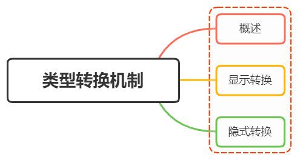

**为什么会出现类型转换**

声明的时候数据类型不确定，只有到运行期间才会确定当前类型。

但是各种运算符对数据类型是有要求的，如果运算符的类型与预期不符合，就会触发类型转换机制。

常见的类型转换有：

- 强制转换（显示转换）
- 自动转换（隐式转换）

**显示转换**

常见方法`Number()`、`parseInt()`、`String()`、`Boolean()`、

- Number()

  将任意类型的值转化为数值。

  转换规则

  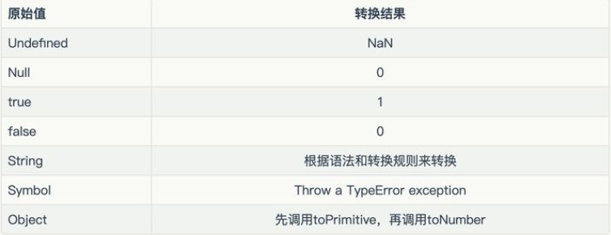

  ```js
  Number(324) // 324
  
  // 字符串：如果可以被解析为数值，则转换为相应的数值
  Number('324') // 324
  
  // 字符串：如果不可以被解析为数值，返回 NaN
  Number('324abc') // NaN
  
  // 空字符串转为0
  Number('') // 0
  
  // 布尔值：true 转成 1，false 转成 0
  Number(true) // 1
  Number(false) // 0
  
  // undefined：转成 NaN
  Number(undefined) // NaN
  
  // null：转成0
  Number(null) // 0
  
  // 对象：通常转换成NaN(除了只包含单个数值的数组)
  Number({a: 1}) // NaN
  Number([1, 2, 3]) // NaN
  Number([5]) // 5
  ```

  `Number`转换的时候是很严格的，只要有一个字符无法转成数值，整个字符串就会被转为`NaN`

- parseInt()

  `parseInt`相比`Number`，就没那么严格了，`parseInt`函数逐个解析字符，遇到不能转换的字符就停下来。

  ```js
  parseInt('32a3') //32
  ```

- String()

  可以将任意类型的值转化成字符串。

  转换规则图：

  

  ```js
  // 数值：转为相应的字符串
  String(1) // "1"
  
  //字符串：转换后还是原来的值
  String("a") // "a"
  
  //布尔值：true转为字符串"true"，false转为字符串"false"
  String(true) // "true"
  
  //undefined：转为字符串"undefined"
  String(undefined) // "undefined"
  
  //null：转为字符串"null"
  String(null) // "null"
  
  //对象
  String({a: 1}) // "[object Object]"
  String([1, 2, 3]) // "1,2,3"
  ```

- Boolean()

  可以将任意类型的值转为布尔值，转换规则如下：

  

  ```js
  Boolean(undefined) // false
  Boolean(null) // false
  Boolean(0) // false
  Boolean(NaN) // false
  Boolean('') // false
  Boolean({}) // true
  Boolean([]) // true
  Boolean(new Boolean(false)) // true
  ```

**隐式转换**

两种发生隐式转换的场景

- 比较运算（`==`、`!=`、`>`、`<`）、`if`、`while`需要布尔值地方
- 算术运算（`+`、`-`、`*`、`/`、`%`）

除了上面的场景，还要求运算符两边的操作数不是同一类型

* **自动转换为布尔值**

  在需要布尔值的地方，就会将非布尔值的参数自动转为布尔值，系统内部会调用`Boolean`函数

  可以得出个小结：

  - undefined
  - null
  - false
  - +0
  - -0
  - NaN
  - ""

  除了上面几种会被转化成`false`，其他都换被转化成`true`

* **自动转换成字符串**

  就是拼接

  遇到预期为字符串的地方，就会将非字符串的值自动转为字符串

  ==具体规则是：==先将复合类型的值转为原始类型的值，再将原始类型的值转为字符串

  常发生在`+`运算中，一旦存在字符串，则会进行字符串拼接操作

  ```js
  '5' + 1 // '51'
  '5' + true // "5true"
  '5' + false // "5false"
  '5' + {} // "5[object Object]"
  '5' + [] // "5"
  '5' + function (){} // "5function (){}"
  '5' + undefined // "5undefined"
  '5' + null // "5null"
  ```

* **自动转换成数值**

  除了`+`有可能把运算子转为字符串，其他运算符都会把运算子自动转成数值

  ```js
  '5' - '2' // 3
  '5' * '2' // 10
  true - 1  // 0
  false - 1 // -1
  '1' - 1   // 0
  '5' * []    // 0
  false / '5' // 0
  'abc' - 1   // NaN
  null + 1 // 1
  undefined + 1 // NaN
  ```

  `null`转为数值时，值为`0` 。`undefined`转为数值时，值为`NaN`

### 问题4：== 和 ===区别，分别在什么情况使用

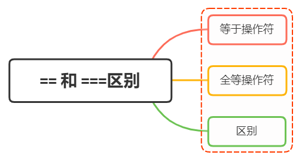

**等于操作符`==`**

操作符（`==`）在比较中会==先进行类型转换，再确定操作数是否相等==。

遵循的转换规则：

如果任一操作数是布尔值，则将其转换为数值再比较是否相等

```js
let result1 = (true == 1); // true
```

如果一个操作数是字符串，另一个操作数是数值，则尝试将字符串转换为数值，再比较是否相等

```js
let result1 = ("55" == 55); // true
```

如果一个操作数是对象，另一个操作数不是，则调用对象的 `valueOf()`方法取得其原始值，再根据前面的规则进行比较

```js
let obj = {valueOf:function(){return 1}}
let result1 = (obj == 1); // true
```

`null`和`undefined`相等

```js
let result1 = (null == undefined ); // true
```

如果有任一操作数是 `NaN` ，则相等操作符返回 `false`

```js
let result1 = (NaN == NaN ); // false
```

如果两个操作数都是对象，则比较它们是不是同一个对象。如果两个操作数都指向同一个对象，则相等操作符返回`true`

```text
let obj1 = {name:"xxx"}
let obj2 = {name:"xxx"}
let result1 = (obj1 == obj2 ); // false
```

下面进一步做个小结：

- 两个都为简单类型，字符串和布尔值都会转换成==数值==，再比较。
- 简单类型与引用类型比较，对象转化成其原始类型的值，再比较
- 两个都为引用类型，则比较它们是否指向同一个对象
- null 和 undefined 相等
- 存在 NaN 则返回 fals

**全等操作符`===`**

全等操作符由 3 个等于号（ `===` ）表示，只有两个操作数在不转换的前提下相等才返回 `true`。即类型相同，值也需相同。==先对数据类型进行判断再对值进行.==

```js
let result1 = ("55" === 55); // false，不相等，因为数据类型不同
let result2 = (55 === 55); // true，相等，因为数据类型相同值也相同
```

`undefined` 和 `null` 与自身严格相等

```js
let result1 = (null === null)  // true
let result2 = (undefined === undefined)  // true
```

```js
console.log(NaN === NaN) // false
```

**区别 **

* 相等操作符（`==`）会做类型转换，再进行值的比较，全等运算符不会做类型转换

```js
let result1 = ("55" === 55); // false，不相等，因为数据类型不同
let result2 = (55 === 55); // true，相等，因为数据类型相同值也相同
```

* `null` 和 `undefined` 比较不同，相等操作符（==）为`true`，全等为`false`.

```
let result1 = (null == undefined ); // true
let result2 = (null  === undefined); // false
```

**小结**

建议除了在比较对象属性为`null`或者`undefined`的情况下，我们可以使用相等操作符（`==`），其他情况建议一律使用全等操作符（`===`）。

### 问题5： 深拷贝浅拷贝的区别？如何实现一个深拷贝？

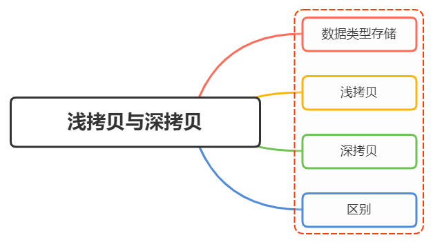

**数据类型存储**

两大数据类型，基本数据类型和引用数据类型，基本数据类型存放在栈内存中，存放的就是值；而引用数据类型存放在堆内存中，栈内存中存放中引用堆内存实际对象的引用地址值，指向堆内存。

**浅拷贝**

浅拷贝，指的是创建新的数据，这个数据有着原始数据属性值的一份精确拷贝

如果==属性是基本类型，拷贝的就是基本类型的值==。如果==属性是引用类型，拷贝的就是内存地址==。

即浅拷贝是拷贝一层，深层次的引用类型则共享内存地址。

* 实现一个简单的对象浅拷贝

  ```js
  function shallowClone(obj){
    const newObj = new ();
    for(let prop in obj){
      if(obj.hasProperty(prop)){
        newObj[prop] = obj[prop]
      }
    }
    return newObj;
  }
  ```

在`JavaScript`中，存在浅拷贝的现象有：

1. `Object.assign`
2. `Array.prototype.slice()`, `Array.prototype.concat()`
3. 使用拓展运算符实现的复制。

- `Object.assign(target, source)`

  将可枚举和自有属性从一个或多个源对象复制到目标对象。---》源对象是我们要拷贝的对象。
  如果目标对象与源对象key值（属性值）相同，则把源对象的属性覆盖掉目标对象的属性。--》相同属性就替换。

  `Object.assign()` 只复制属性值，对于引用类型，如果把源对象堆内存中的内容改变，所复制到的目标对象值也会改变。⭐？？？会改变吗？？？==修改对象属性会影响原对象==

  ```js
  // 浅拷贝 数值、数组、对象、函数
  var obj = {
    num: 5,
    arr:[1, 2, 3],
    object:{
      name:bob,
      age:5
    },
    fun:function(){
      console.log('属性值是一个函数')
    }
  }
  var newObj = Object.assign({}, obj) // 把源对象obj浅拷贝给{}
  ```

- `Array.prototype.slice()`法返回一个新的数组对象，这一对象是一个由 `begin` 和 `end` 决定的原数组的**浅拷贝**（包括 `begin`，不包括`end`）。原始数组不会被改变。--》就是截取原数组的一段新生成一个浅拷贝的数组。

  接收两个参数

  ```js
  const animals = ['ant', 'bison', 'camel', 'duck', 'elephant'];
  
  console.log(animals.slice(2));
  // expected output: Array ["camel", "duck", "elephant"]
  console.log(animals.slice(2, 4));
  // expected output: Array ["camel", "duck"]
  ```

- `Array.prototype.concat()` 用于合并两个或多个数组。此方法不会更改现有数组，而是返回一个新数组。

  ```js
  const array1 = ['a', 'b', 'c'];
  const array2 = ['d', 'e', 'f'];
  const array3 = array1.concat(array2);
  
  console.log(array3);
  // expected output: Array ["a", "b", "c", "d", "e", "f"]
  ```

- 扩展运算符`...`  

  - 运算符将一个数组，变为参数序列。

  - 替代apply()将数组转为函数的参数

    ```js
    const arr = [html, css, js]
    const newArr = [...arr, react]
    console.log(newArr) // [html, css, js, react]
    ```

**深拷贝**

深拷贝开辟一个新的栈，两个对象属性完全相同，但是对应两个不同的地址，修改一个对象的属性，不会改变另一个对象的属性。

常见的深拷贝方式有：

1. _.cloneDeep()
2. JSON.stringify()
3. 手写循环递归

* _.cloneDeep()

  ```js
  const _ = require('lodash');
  const obj1 = {
      a: 1,
      b: { f: { g: 1 } },
      c: [1, 2, 3]
  };
  const obj2 = _.cloneDeep(obj1);
  console.log(obj1.b.f === obj2.b.f);// false
  ```

- JSON.stringify()

  - 不支持 Symbol，BigInt，Function；忽略`undefined`、`symbol`和`函数`
  - 不支持 循环引用
  - 丢失值为 undefined 的键

  ```js
  const obj2=JSON.parse(JSON.stringify(obj1));
  ```

  ```js
  const obj = {
      name: 'A',
      name1: undefined,
      name3: function() {},
      name4:  Symbol('A')
  }
  const obj2 = JSON.parse(JSON.stringify(obj));
  console.log(obj2); // {name: "A"}
  ```

- 循环递归

  ```js
  function deepClone(obj, hash = new WeakMap()) {
    if (obj === null) return obj; // 如果是null或者undefined我就不进行拷贝操作
    if (obj instanceof Date) return new Date(obj);
    if (obj instanceof RegExp) return new RegExp(obj);
    // 可能是对象或者普通的值  如果是函数的话是不需要深拷贝
    if (typeof obj !== "object") return obj;
    // 是对象的话就要进行深拷贝
    if (hash.get(obj)) return hash.get(obj);
    let cloneObj = new obj.constructor();
    // 找到的是所属类原型上的constructor,而原型上的 constructor指向的是当前类本身
    hash.set(obj, cloneObj);
    for (let key in obj) {
      if (obj.hasOwnProperty(key)) {
        // 实现一个递归拷贝
        cloneObj[key] = deepClone(obj[key], hash);
      }
    }
    return cloneObj;
  }
  ```


**区别**


- 浅拷贝只复制属性指向某个对象的指针，而不复制对象本身，新旧对象还是共享同一块内存，修改对象属性会影响原对象
- 深拷贝会另外创造一个一模一样的对象，新对象跟原对象不共享内存，修改新对象不会改到原对象

**小结**

前提为拷贝类型为引用类型的情况下：

- 浅拷贝是拷贝一层，属性为对象时，浅拷贝是复制，两个对象指向同一个地址
- 深拷贝是递归拷贝深层次，属性为对象时，深拷贝是新开栈，两个对象指向不同的地址

### 问题6：说说你对闭包的理解？闭包使用场景

闭包就是为了保护方法，不向外暴露


**是什么**

一个函数和对其周围状态（lexical environment，词法环境）的引用捆绑在一起（或者说函数被引用包围），这样的组合就是闭包（closure）

也就是说，闭包让你可以在一个内层函数中访问到其外层函数的作用域

在 `JavaScript`中，每当创建一个函数，闭包就会在函数创建的同时被创建出来，作为函数内部与外部连接起来的一座桥梁。

🦈

闭包指的是那些引用了另一个函数作用域中变量的函数。

1. 如何产生闭包?

- 当一个嵌套的内部(子)函数引用了嵌套的外部(父)函数的变量(函数)时, 就产生了闭包

2. 闭包到底是什么?

- 使用chrome调试查看
  - 理解一: 闭包是嵌套的内部函数(绝大部分人)
  - 理解二: 包含被引用变量(函数)的对象(极少数人)
  - 注意: 闭包存在于嵌套的内部函数中

3. 产生闭包的条件?

- 函数嵌套

- 内部函数引用了外部函数的数据(变量/函数) 

下面给出一个简单的例子

```js
function init() {
    var name = "Mozilla"; // name 是一个被 init 创建的局部变量
    function displayName() { // displayName() 是内部函数，一个闭包
        alert(name); // 使用了父函数中声明的变量
    }
    displayName();
}
init();
```

`displayName()` 没有自己的局部变量。然而，由于闭包的特性，它可以访问到外部函数的变量。

**使用场景**

任何闭包的使用场景都离不开这两点：

- 创建私有变量
- 延长变量的生命周期

> 一般函数的词法环境在函数返回后就被销毁，但是闭包会保存对创建时所在词法环境的引用，即便创建时所在的执行上下文被销毁，但创建时所在词法环境依然存在，以达到延长变量的生命周期的目的。

下面举个例子：

在页面上添加一些可以调整字号的按钮

```js
function makeSizer(size) {
  return function() {
    document.body.style.fontSize = size + 'px';
  };
}

var size12 = makeSizer(12);
var size14 = makeSizer(14);
var size16 = makeSizer(16);

document.getElementById('size-12').onclick = size12;
document.getElementById('size-14').onclick = size14;
document.getElementById('size-16').onclick = size16;
```

* **柯里化函数**

  高阶函数：一个函数可以接收另一个函数作为参数。

  柯里化（Currying）是一种编程思想，函数执行产生一个闭包，把一些信息预先存储起来，目的是供下级上下文使用。这样预先存储和处理的思想，就叫做柯里化的编程思想。

  简单来说就是只传递给函数一部分参数来调用它，让它==返回一个函数==去处理剩下的参数。

  ```js
  // 定义了一个柯里化函数，当传入参数时，会返回一个记录width的height函数
  function getArea(width) {
    return height => {
      return width * height
    }
  }
  
  // 调用getArea函数返回一个函数给getWidthArea，其中记录着传入的width参数
  const getWidthArea = getArea(10)
  
  // getWidthArea函数又接收一个height参数
  const areaRes = getWidthArea(20)//
  console.log(areaRes); // 200
  ```

  柯里化函数面试题

  add(1)(2)(3)(4)(5)(6); // => 21
  add(1, 2)(3, 4)(5, 6); // => 21
  add(1, 2, 3, 4, 5, 6); // => 21

  [答案](https://juejin.cn/post/7086393986780233736#comment)

  ```js
  var curring = () => {
    var result = [];
    var add = (...args) => {
      result = result.concat(args);
      return add;
    };
  
    add.valueOf = add.toString = () => {
      return result.reduce((pre, cur) => pre + cur, 0);
    }
    return add;
  };
  
  var add = curring();
  console.log(+add(1)(2)(3)(4)(5)(6));
  
  add = curring();
  console.log(+add(1, 2)(3, 4)(5, 6));
  
  add = curring();
  console.log(+add(1, 2, 3, 4, 5, 6));
  ```

* **使用闭包模拟私有方法**

  就是定义JS模块

  - 具有特定功能的js文件
  - 将所有的数据和功能都封装在一个函数内部(私有的)
  - 只向外暴露一个包含n个方法的对象或函数
  - 模块的使用者, 只需要通过模块暴露的对象调用方法来实现对应的功能

  两种定义方法：一是定义js文件，二是定义匿名自调用函数

  ```js
  function makeCounter() {
    var privateCounter = 0;
    function changeBy(val) {
      privateCounter += val;
    }
    return {
      increment: function() {
        changeBy(1);
      },
      decrement: function() {
        changeBy(-1);
      },
      value: function() {
        return privateCounter;
      }
    }
  }
  
  var Counter1 = makeCounter();
  var Counter2 = makeCounter();
  console.log(Counter1.value()); /* logs 0 */
  Counter1.increment();
  Counter1.increment();
  console.log(Counter1.value()); /* logs 2 */
  Counter1.decrement();
  console.log(Counter1.value()); /* logs 1 */
  console.log(Counter2.value()); /* logs 0 */
  ```

**注意事项**

如果不是某些特定任务需要使用闭包，在其它函数中创建函数是不明智的，因为闭包在处理速度和内存消耗方面对脚本性能具有负面影响。

例如，在创建新的对象或者类时，==方法通常应该关联于对象的原型，而不是定义到对象的构造器中。原因在于每个对象的创建，方法都会被重新赋值==。

```js
function MyObject(name, message) {
  this.name = name.toString();
  this.message = message.toString();
  this.getName = function() {
    return this.name;
  };

  this.getMessage = function() {
    return this.message;
  };
}
```

上面的代码中，我们并没有利用到闭包的好处，因此可以避免使用闭包。修改成如下：

```js
function MyObject(name, message) {
  this.name = name.toString();
  this.message = message.toString();
}
MyObject.prototype.getName = function() {
  return this.name;
};
MyObject.prototype.getMessage = function() {
  return this.message;
};
```


词法环境中保存着局部变量name。

私有方法：例如Java中，私有方法只能被同一个类中的其他方法调用。

私有方法优点：私有方法不仅仅有利于限制对代码的访问：还提供了管理全局命名空间的强大能力，避免非核心的方法弄乱了代码的公共接口部分。

每次调用最外面的函数都会生成一个新的闭包，并且有自己的一个词法环境。每个闭包都是引用自己词法作用域内的变量 。

### 问题7：说说你对作用域链的理解


🦈什么是作用域链增强？？？

**作用域**

作用域，即变量（变量作用域又称上下文）和函数生效（能被访问）的区域或集合

换句话说，作用域决定了代码区块中变量和其他资源的可见性

举个例子

```js
function myFunction() {
    let inVariable = "函数内部变量";
}
myFunction();//要先执行这个函数，否则根本不知道里面是啥
console.log(inVariable); // Uncaught ReferenceError: inVariable is not defined
```

上述例子中，函数`myFunction`内部创建一个`inVariable`变量，当我们在全局访问这个变量的时候，系统会报错

这就说明我们在全局是无法获取到（闭包除外）函数内部的变量

我们一般将作用域分成：

- 全局作用域
- 函数作用域
- 块级作用域


- **全局作用域**

任何不在函数中或是大括号中声明的变量，都是在全局作用域下，全局作用域下声明的变量可以在程序的任意位置访问

```js
// 全局变量
var greeting = 'Hello World!';
function greet() {
  console.log(greeting);
}
// 打印 'Hello World!'
greet();
```

- **函数作用域**

函数作用域也叫局部作用域，如果一个变量是在函数内部声明的它就在一个函数作用域下面。这些变量只能在函数内部访问，不能在函数以外去访问

```js
function greet() {
  var greeting = 'Hello World!';
  console.log(greeting);
}
// 打印 'Hello World!'
greet();
// 报错： Uncaught ReferenceError: greeting is not defined
console.log(greeting);
```

可见上述代码中在函数内部声明的变量或函数，在函数外部是无法访问的，这说明在函数内部定义的变量或者方法只是函数作用域

- **块级作用域**

  函数块是指被大括号 ("{}") 包裹住的相关联的集合；例如if语句后就是一个块作用域。注意在{}中用`var`声明的变量没有块级作用域。

  ES6引入了`let`和`const`关键字,和`var`关键字不同，在大括号中使用`let`和`const`声明的变量存在于块级作用域中。在大括号之外不能访问这些变量。

  ```js
  {
    // 块级作用域中的变量
    let greeting = 'Hello World!';
    var lang = 'English';
    console.log(greeting); // Prints 'Hello World!'
  }
  // 变量 'English'
  console.log(lang);
  // 报错：Uncaught ReferenceError: greeting is not defined
  console.log(greeting);
  ```

**词法作用域**

词法作用域，又叫静态作用域，变量被创建时就确定好了，而非执行阶段确定的。也就是说我们写好代码时它的作用域就确定了，`JavaScript` 遵循的就是词法作用域

```js
var a = 2;
function foo(){
    console.log(a)
}
function bar(){
    var a = 3;
    foo();
}
n()
```

上述代码改变成一张图


由于`JavaScript`遵循词法作用域，相同层级的 `foo` 和 `bar` 就没有办法访问到彼此块作用域中的变量，所以输出2

**作用域链**

当在`Javascript`中使用一个变量的时候，首先`Javascript`引擎会尝试在当前作用域下去寻找该变量，如果没找到，再到它的上层作用域寻找，以此类推直到找到该变量或是已经到了全局作用域。🦈自下而上，从内向外查找，知道全局作用域。

如果在全局作用域里仍然找不到该变量，它就会在全局范围内隐式声明该变量(非严格模式下)或是直接报错

这里拿《你不知道的Javascript(上)》中的一张图解释：

把作用域比喻成一个建筑，这份建筑代表程序中的嵌套作用域链，第一层代表当前的执行作用域，顶层代表全局作用域


变量的引用会顺着当前楼层进行查找，如果找不到，则会往上一层找，一旦到达顶层，查找的过程都会停止

下面代码演示下：

```js
var sex = '男';
function person() {
    var name = '张三';
    function student() {
        var age = 18;
        console.log(name); // 张三
        console.log(sex); // 男 
    }
    student();
    console.log(age); // Uncaught ReferenceError: age is not defined
}
person();
```

上述代码主要主要做了以下工作：

- `student`函数内部属于最内层作用域，找不到`name`，向上一层作用域`person`函数内部找，找到了输出“张三”
- `student`内部输出cat时找不到，向上一层作用域`person`函数找，还找不到继续向上一层找，即全局作用域，找到了输出“男”
- 在`person`函数内部输出`age`时找不到，向上一层作用域找，即全局作用域，还是找不到则报错

### 问题8：JavaScript原型，原型链 ? 有什么特点？

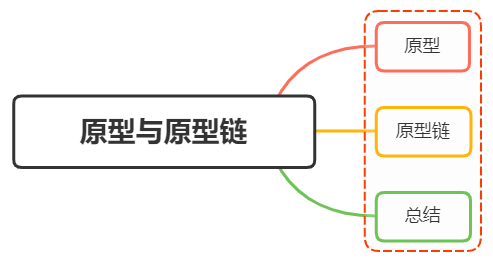

**原型**

函数的prototype属性，每个函数都有一个prototype属性。

`JavaScript` 常被描述为一种基于原型的语言——每个对象拥有一个原型对象

当试图访问一个对象的属性时，它不仅仅在该对象上搜寻，还会搜寻该对象的原型，以及该对象的原型的原型，依次层层向上搜索，直到找到一个名字匹配的属性或到达原型链的末尾

准确地说，这些属性和方法定义在Object的构造器函数（constructor functions）之上的`prototype`属性上，而非实例对象本身

下面举个例子：

函数可以有属性。 每个函数都有一个特殊的属性叫作原型`prototype`

```js
function doSomething(){}
console.log( doSomething.prototype );
```

控制台输出

```js
{
    constructor: ƒ doSomething(),
    __proto__: {
        constructor: ƒ Object(),
        hasOwnProperty: ƒ hasOwnProperty(),
        isPrototypeOf: ƒ isPrototypeOf(),
        propertyIsEnumerable: ƒ propertyIsEnumerable(),
        toLocaleString: ƒ toLocaleString(),
        toString: ƒ toString(),
        valueOf: ƒ valueOf()
    }
}
```

上面这个对象，就是大家常说的原型对象

可以看到，原型对象有一个自有属性`constructor`，这个属性指向该函数，如下图关系展示


**原型链**

原型对象也可能拥有原型，并从中继承方法和属性，一层一层、以此类推。这种关系常被称为原型链 (prototype chain)，它解释了为何一个对象会拥有定义在其他对象中的属性和方法

在对象实例和它的构造器之间建立一个链接（它是`__proto__`属性，是从构造函数的`prototype`属性派生的），之后通过上溯原型链，在构造器中找到这些属性和方法

下面举个例子：

```js
function Person(name) {
    this.name = name;
    this.age = 18;
    this.sayName = function() {
        console.log(this.name);
    }
}
// 第二步 创建实例
var person = new Person('person')
```

根据代码，我们可以得到下图


🦈整个过程
我们创建了一个构造函数Person和一个实例对象person作为例子

- 每个函数都有一个prototype属性，所构造函数的prototype属性指向其原型对象Person.prototype，实例对象存在着`__proto__`属性，指向构造函数的原型对象。
- 构造函数Person底层是一个函数，由函数创建，所以其`__proto__`属性会指向匿名函数
- 构造函数Person的原型对象为一个普通对象，是又Object创建的，所以其指向内置对象，即`Person.prototype.__proto__`指向内置对象，
- Object对象的原型是内置对象，同时Object又是一个函数，所以其`__proto__`属性会指向函数的原型即匿名函数。
- Function的两个属性都会指向匿名函数，匿名函数指向内置对象，最终指向为null

下面分析一下：

- 构造函数`Person`存在原型对象`Person.prototype`
- 构造函数生成实例对象`person`，`person`的`__proto__`指向构造函数`Person`原型对象
- `Person.prototype.__proto__` 指向内置对象，因为 `Person.prototype` 是个对象，默认是由 `Object`函数作为类创建的，而 `Object.prototype` 为内置对象
- `Person.__proto__` 指向内置匿名函数 `anonymous`，因为 Person 是个函数对象，默认由 Function 作为类创建
- `Function.prototype` 和 `Function.__proto__`同时指向内置匿名函数 `anonymous`，这样原型链的终点就是 `nul`

**总结**

下面首先要看几个概念：

`__proto__`作为不同对象之间的桥梁，用来指向创建它的构造函数的原型对象的

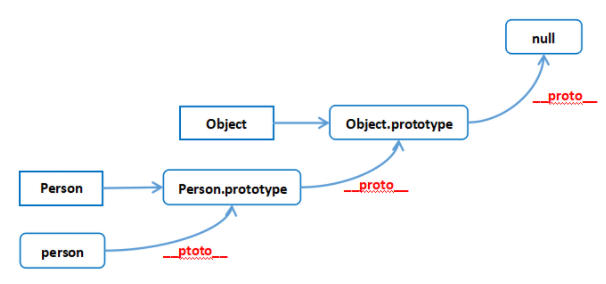

每个对象的`__proto__`都是指向它的构造函数的原型对象`prototype`的

```js
person1.__proto__ === Person.prototype
```

构造函数是一个函数对象，是通过 `Function`构造器产生的

```js
Person.__proto__ === Function.prototype
```

原型对象本身是一个普通对象，而普通对象的构造函数都是`Object`

```js
Person.prototype.__proto__ === Object.prototype
```

刚刚上面说了，所有的构造器都是函数对象，函数对象都是 `Function`构造产生的

```js
Object.__proto__ === Function.prototype
```

`Object`的原型对象也有`__proto__`属性指向`null`，`null`是原型链的顶端

```js
Object.prototype.__proto__ === null
```

下面作出总结：

- 一切对象都是继承自`Object`对象，`Object` 对象直接继承根源对象`null`
- 一切的函数对象（包括 `Object` 对象），都是继承自 `Function` 对象
- `Object` 对象直接继承自 `Function` 对象
- `Function`对象的`__proto__`会指向自己的原型对象，最终还是继承自`Object`对象

### 问题9：Javascript如何实现继承？

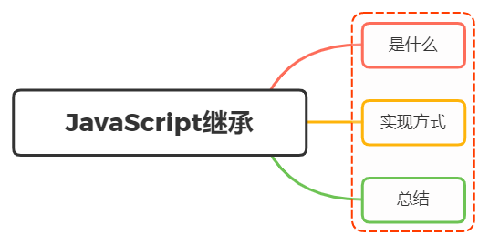

**是什么**

**实现方式**

- 原型链继承（不会被单独使用）

  🦈实现一个原型链继承

  定义父类、子类构造函数，让子类构造函数的原型执行父的实例对象，这样就实现类子类继承父类的属性和方法。

  ```js
  // 定义父类
  function Parent() {
      this.name = 'Jack';
  }
  // 父类原型添加方法
  Parent.prototype.getName = function () {
      return this.name;
  };
  
  // 子类
  function Child() {}
  // 子类的原型设置为父类Parent的实例
  Child.prototype = new Parent();
  
  // 实例化子类
  const child = new Child();
  
  console.log(child.getName()); // Jack
  ```

  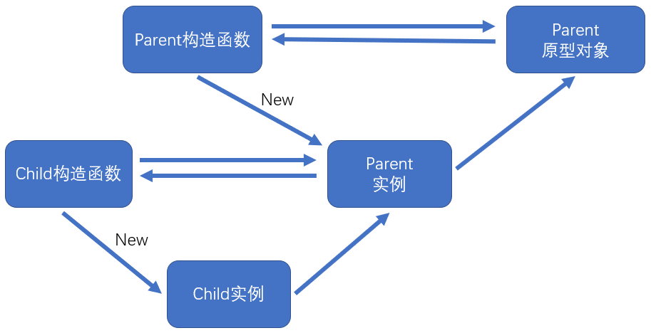

  两个注意点（缺点）：

  - 继承之后再更改原型属性不会向下传递
  - 实例之间互相影响

  原型链继承，创建实例对象时实现继承，再次对原型上的属性和方法进行更改时，不会影响到实例对象原有的继承。

  ```js
  let f = function () {
    this.a = 1;
    this.b = 2;
  }
  let o = new f(); // {a: 1, b: 2}
  // 对原型的属性进行了更改
  f.prototype.b = 3;
  f.prototype.c = 4;
  console.log(o.a); // 1
  console.log(o.b); // 2 ==》不会影响到原有继承
  console.log(o.c); // 4 ==》当前实例中没有该属性，取原型中查找
  console.log(o.d); // undefined ==》 原型中也没有，返回undefined
  ```

  但是多个实例对象实现原型链继承时，都其中一个实例更改属性，会影响到其他实例。--》即当继承的函数被调用时，[this](https://developer.mozilla.org/zh-CN/docs/Web/JavaScript/Reference/Operators/this) 指向的是当前继承的对象，而不是继承的函数所在的原型对象。

  ```js
  function Parent() {
    this.name = 'parent1';
    this.play = [1, 2, 3]
  }
  function Child() {
    this.type = 'child2';
  }
  Child1.prototype = new Parent();
  console.log(new Child())
  ```

  上面代码看似没问题，实际存在潜在问题

  ```js
    var s1 = new Child2();
    var s2 = new Child2();
    s1.play.push(4);
    console.log(s1.play, s2.play); // [1,2,3,4]
  ```

  改变`s1`的`play`属性，会发现`s2`也跟着发生变化了，这是因为两个实例使用的是同一个原型对象，内存空间是共享。

- 构造函数继承（不单独使用）

  在**子类构造函数**中调用**父类构造函数**。使用 `apply()`和`call()`方法以**新创建的对象**为上下文执行构造函数。

  ```js
  function Parent(){
      this.name = 'parent1';
  }
  
  Parent.prototype.getName = function () {
      return this.name;
  }
  
  function Child(){
      Parent1.call(this);
      this.type = 'child'
  }
  
  let child = new Child();
  console.log(child);  // 没问题
  console.log(child.getName());  // 会报错
  ```

  只能继承父类的实例属性和方法，不能继承原型属性或者方法。

  ```js
  function SuperType() {
      this.colors = ['red', 'blue', 'green'];
  }
  function SubType() {
      // 继承 SuperType
      SuperType.call(this);
  }
  const instance1 = new SubType();
  instance1.colors.push('black');
  console.log(instance1.colors); // [ 'red', 'blue', 'green', 'black' ]
  
  const instance2 = new SubType();
  console.log(instance2.colors); // [ 'red', 'blue', 'green' ]
  ```

  实例之间不互相影响，因为`SubType`子类调用call仅对父函数复制了初始化代码，每一个实例都是一个新的。

  ```js
  function SuperType(name) {
      this.name = name;
  }
  function SubType() {
      // 继承 SuperType 并传参
      SuperType.call(this, 'Nicholas');
      // 实例属性
      this.age = 29;
  }
  const usr = new SubType();
  console.log(usr.name, usr.age); // Nicholas 29
  ```

  相比于使用**原型链**，**构造函数继承**的一个优点就是**可以在子类构造函数中向父类构造函数传参**。

  小结：

  - 可向父类构造函数传参
  - 实例之间不影响
  - 不能访问父类原型上的方法

- 组合继承 

  **组合继承**，有时候也叫**伪经典继承**，综合了**原型链**和**盗用构造函数**，将两者的优点集中了起来。使用**原型链继承原型上的属性和方法**，而通过**盗用构造函数继承实例属性**。这样既可以把方法定义在原型上以实现重用，又可以让每个实例都有自己的属性。

  ```javascript
  function SuperType(name) {
      this.name = name;
      this.colors = ['red', 'blue', 'green'];
  }
  SuperType.prototype.sayName = function () {
      console.log(this.name);
  };
  
  function SubType(name, age) {
      // 继承属性
      SuperType.call(this, name);
      this.age = age;
  }
  // 继承方法
  SubType.prototype = new SuperType();
  SubType.prototype.sayAge = function () {
      console.log(this.age);
  };
  
  const usr1 = new SubType('Nicholas', 29);
  usr1.colors.push('black');
  console.log(usr1.colors); // [ 'red', 'blue', 'green', 'black' ]
  usr1.sayName(); // Nicholas
  usr1.sayAge(); // 29
  
  const usr2 = new SubType('Greg', 27);
  console.log(usr2.colors); // [ 'red', 'blue', 'green' ]
  usr2.sayName(); // Greg
  usr2.sayAge(); // 27
  ```

  **组合继承**弥补了**原型链**和**盗用构造函数**的不足，是 JavaScript 中使用最多的继承模式。而且组合继承也保留了`instanceof`操作符和`isPrototypeOf()`方法**识别合成对象**的能力。

- 原型式继承

  

**总结**


### 问题10：谈谈this对象的理解

- 函数的调用方式决定了this的值
- this不可以在执行期间被赋值

**全局上下文**

无论是否在严格模式下，在全局执行环境中（在任何函数体外部）`this` 都指向全局对象。

**函数上下文**

- 在函数内部，`this`的值取决于函数被调用的方式。
- 非严格模式下，若函数中未设定this，则this默认为全局。
- 把`this`的值从一个环境传到另一个，就要用 `call` 或者`apply` 方法

**类上下文**

- 在类的构造函数中，`this` 是一个常规对象。类中所有非静态的方法都会被添加到 `this` 的原型中：

**派生类**

- 在构造函数中调用`super()`会生成一个`this`绑定
- 派生类不能在调用 `super()` 之前返回，除非其构造函数返回的是一个对象，或者根本没有构造函数。

**实例**

- 函数上下文的this

  ```js
  // 对象可以作为 bind 或 apply 的第一个参数传递，并且该参数将绑定到该对象。---bind改变this指向
  var obj = {a: 'Custom'};
  
  // 声明一个变量，并将该变量作为全局对象 window 的属性。
  var a = 'Global';
  
  function whatsThis() {
    return this.a;  // this 的值取决于函数被调用的方式
  }
  
  whatsThis();          // 'Global' 因为在这个函数中 this 没有被设定，所以它默认为 全局/ window 对象
  whatsThis.call(obj);  // 'Custom' 因为函数中的 this 被设置为 obj
  whatsThis.apply(obj); // 'Custom' 因为函数中的 this 被设置为 obj
  ```

- this和对象转换

  这里定义了一个函数add和一个对象o，我们调用函数时，采用`call`、`apply`方法绑定this为对象o，即传入的第一个参数就是绑定的地方。

  ```js
  function add(c, d) {
    return this.a + this.b + c + d;
  }
  
  var o = {a: 1, b: 3};
  
  // 第一个参数是用作“this”的对象
  // 其余参数用作函数的参数
  add.call(o, 5, 7); // 16
  
  // 第一个参数是用作“this”的对象
  // 第二个参数是一个数组，数组中的两个成员用作函数参数
  add.apply(o, [10, 20]); // 34
  ```

  在非严格模式下使用 `call` 和 `apply` 时，如果用作 `this` 的值不是对象，则会被尝试转换为对象。不是对象的值会自动转成对象。原始值`7 str true`也会被转成原始值包装类型。

  ```js
  function bar() {
    console.log(Object.prototype.toString.call(this));
  }
  
  bar.call(7);     // [object Number]
  bar.call('foo'); // [object String]
  bar.call(undefined); // [object global]
  ```

- bind方法

  调用`f.bind(someObject)`会创建一个与`f`具有相同函数体和作用域的函数，但是在这个新函数中，`this`将永久地被绑定到了`bind`的第一个参数，无论这个函数是如何被调用的。

  🦈`bind()`方法，会生成一个和调用该方法的函数一样的函数，只是把this绑定到了第一个参数上。

  ```js
  function f(){
    return this.a;
  }
  
  var g = f.bind({a:"azerty"});
  console.log(g()); // azerty
  
  var h = g.bind({a:'yoo'}); // bind 只生效一次！
  console.log(h()); // azerty
  
  var o = {a:37, f:f, g:g, h:h};
  console.log(o.a, o.f(), o.g(), o.h()); // 37, 37, azerty, azerty
  // o.a调用对象的属性，直接输出
  // o.f()，对象o调用了函数f()，所以这里的this指向对象o，a为对象o的属性值37
  // o.g(), o.h(),采用bind方法绑定了this，所以这里的this指向{a:"azerty"}，并且只对第一次绑定有效
  ```

- 箭头函数

  在[箭头函数](https://developer.mozilla.org/zh-CN/docs/Web/JavaScript/Reference/Functions/Arrow_functions)中，`this`与封闭词法环境的`this`保持一致。在全局代码中，它将被设置为全局对象：

  ```js
  var globalObject = this;
  var foo = (() => this);
  console.log(foo() === globalObject); // true
  ```

  注意：如果将`this`传递给`call`、`bind`、或者`apply`来调用箭头函数，它将被忽略。

  在箭头函数中，this的指向为它被创建时的环境。

  ```js
  // 创建一个含有 bar 方法的 obj 对象，
  // bar 返回一个函数，
  // 这个函数返回 this，
  // 这个返回的函数是以箭头函数创建的，
  // 所以它的 this 被永久绑定到了它外层函数的 this。
  // bar 的值可以在调用中设置，这反过来又设置了返回函数的值。
  var obj = {
    bar: function() {
      var x = (() => this);
      return x;
    }
  };
  
  // 作为 obj 对象的一个方法来调用 bar，把它的 this 绑定到 obj。
  // 将返回的函数的引用赋值给 fn。
  var fn = obj.bar();
  
  // 直接调用 fn 而不设置 this，
  // 通常 (即不使用箭头函数的情况) 默认为全局对象
  // 若在严格模式则为 undefined
  console.log(fn() === obj); // true
  
  // 但是注意，如果你只是引用 obj 的方法，
  // 而没有调用它
  var fn2 = obj.bar;
  // 那么调用箭头函数后，this 指向 window，因为它从 bar 继承了 this。
  console.log(fn2()() == window); // true
  ```

  🦈在这里，创建了一个对象，对象内的属性bar返回一个函数，函数里的内容由箭头函数决定，此时箭头函数的this即已经绑定为obj，后面再次使用this时，this指向的内容就由obj所决定。---这里没搞明白，obj.bar()时this指向了obj，那this是被bar决定的还是obj决定的，obj.bar时，this指向了window，那是不是this就是由bar所决定。也就是在定义箭头函数后，其this的指向是由bar所决定。

- 作为对象的方法

  当函数作为对象里的方法被调用时，`this` 被设置为调用该函数的对象。

  下面的例子中，当 `o.f()` 被调用时，函数内的 `this` 将绑定到 `o` 对象。

  ```js
  var o = {
    prop: 37,
    f: function() {
      return this.prop;
    }
  };
  
  console.log(o.f()); // 37
  
  // this 的绑定只受最接近的成员引用的影响
  o.b = {g: independent, prop: 42};
  console.log(o.b.g()); // 42
  // 把一个方法g当作对象o.b的函数调用。在这次执行期间，函数中的this将指向o.b。
  // 🦈this指向最近的引用
  ```

- 原型中的this

  如果该方法存在于一个对象的原型链上，那么 `this` 指向的是调用这个方法的对象，就像该方法就在这个对象上一样。

  ```js
  var o = {
    f: function() {
      return this.a + this.b;
    }
  };
  var p = Object.create(o);
  p.a = 1;
  p.b = 4;
  
  console.log(p.f()); // 5
  ```

  🦈p中没有属性f，向原型中查找，查找开始的位置就是p，所以函数中的 `this` 指向`p`，因为`f`是作为`p`的方法调用的，所以它的`this`指向了`p`。---》this 的指向是p，属性函数从原型中获得的。

- getter 与 setter 中的 `this`

- 作为构造函数

  当一个函数用作构造函数时（使用[new](https://developer.mozilla.org/zh-CN/docs/Web/JavaScript/Reference/Operators/new)关键字），它的`this`被绑定到正在构造的新对象。

  ```js
  /*
   * 构造函数这样工作：
   *
   * function MyConstructor(){
   *   // 函数实体写在这里
   *   // 根据需要在 this 上创建属性，然后赋值给它们，比如：
   *   this.fum = "nom";
   *   // 等等...
   *
   *   // 如果函数具有返回对象的 return 语句，
   *   // 则该对象将是 new 表达式的结果。
   *   // 否则，表达式的结果是当前绑定到 this 的对象。
   *   //（即通常看到的常见情况）。
   * }
   */
  
  function C(){
    this.a = 37;
  }
  
  var o = new C();
  console.log(o.a); // logs 37
  
  
  function C2(){
    this.a = 37;
    return {a:38};
  }
  
  o = new C2();
  console.log(o.a); // logs 38
  
  ```

  🦈创建函数C，其没有返回值，在this上创建属性a并赋值，我们在创建C的实例时，输出的属性a就就是函数C的属性。C2函数由返回值，则返回给创建的实例，this绑定到该返回值上

- 作为一个DOM事件处理函数

  当函数被用作事件处理函数时，它的 `this` 指向触发事件的元素

- 作为内联事件处理函数

  当代码被内联 [on-event 处理函数 (en-US)](https://developer.mozilla.org/en-US/docs/Web/Events/Event_handlers) 调用时，它的`this`指向监听器所在的 DOM 元素：

- 类中的this

  让类中的 `this` 值总是指向这个类实例。

  ```js
  
  class Car {
    constructor() {
      // Bind sayBye but not sayHi to show the difference
      this.sayBye = this.sayBye.bind(this);
    }
    sayHi() {
      console.log(`Hello from ${this.name}`);
    }
    sayBye() {
      console.log(`Bye from ${this.name}`);
    }
    get name() {
      return 'Ferrari';
    }
  }
  
  class Bird {
    get name() {
      return 'Tweety';
    }
  }
  
  const car = new Car();
  const bird = new Bird();
  
  // The value of 'this' in methods depends on their caller
  car.sayHi(); // Hello from Ferrari
  bird.sayHi = car.sayHi;
  bird.sayHi(); // Hello from Tweety
  
  // For bound methods, 'this' doesn't depend on the caller
  bird.sayBye = car.sayBye;
  bird.sayBye();  // Bye from Ferrari
  ```

**面试官系列**

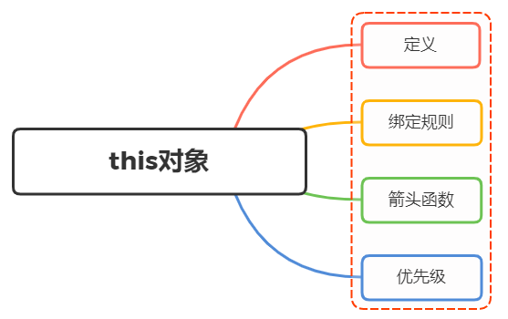

### 问题11：JavaScript中执行上下文和执行栈是什么？

什么是作用域链增强？？？

**执行上下文**

执行上下文是一种对`Javascript`代码执行环境的抽象概念，也就是说只要有`Javascript`代码运行，那么它就一定是运行在执行上下文中。

- 全局执行上下文：只有一个，浏览器中的全局对象就是 `window`对象，`this` 指向这个全局对象
- 函数执行上下文：存在无数个，只有在函数被调用的时候才会被创建，每次调用函数都会创建一个新的执行上下文
  - 每次调用函数创建一个新的上下文，会创建一个私有作用域，函数内部声明的任何变量都不能在当前函数作用域外部直接访问。（除了闭包）

**生命周期**


- **创建阶段**

  这几个环境没搞清

- **执行阶段**

  在这阶段，执行变量赋值、代码执行

  如果 `Javascript` 引擎在源代码中声明的实际位置找不到变量的值，那么将为其分配 `undefined` 值。

- **回收阶段**

  - 上下文在其所有代码都执行完毕后被销毁（除了全局上下文）
  - 全局执行上下文在应用程序退出前才会被销毁。

**执行栈**

执行栈，也叫调用栈，具有 LIFO（后进先出）结构，用于存储在代码执行期间创建的所有执行上下文。


当`Javascript`引擎开始执行你第一行脚本代码的时候，它就会创建一个全局执行上下文然后将它压到执行栈中

每当引擎碰到一个函数的时候，它就会创建一个函数执行上下文，然后将这个执行上下文压到执行栈中

引擎会执行位于执行栈栈顶的执行上下文(一般是函数执行上下文)，当该函数执行结束后，对应的执行上下文就会被弹出，然后控制流程到达执行栈的下一个执行上下文

举个例子：

```js
let a = 'Hello World!';
function first() {
  console.log('Inside first function');
  second();
  console.log('Again inside first function');
}
function second() {
  console.log('Inside second function');
}
first();
console.log('Inside Global Execution Context');
```

转化成图的形式


简单分析一下流程：

- 创建全局上下文请压入执行栈
- `first`函数被调用，创建函数执行上下文并压入栈
- 执行`first`函数过程遇到`second`函数，再创建一个函数执行上下文并压入栈
- `second`函数执行完毕，对应的函数执行上下文被推出执行栈，执行下一个执行上下文`first`函数。---》🦈将控制权返还给之前的执行上下文。
- `first`函数执行完毕，对应的函数执行上下文也被推出栈中，然后执行全局上下文
- 所有代码执行完毕，全局上下文也会被推出栈中，程序结

### 问题12：说说JavaScript中的事件模型

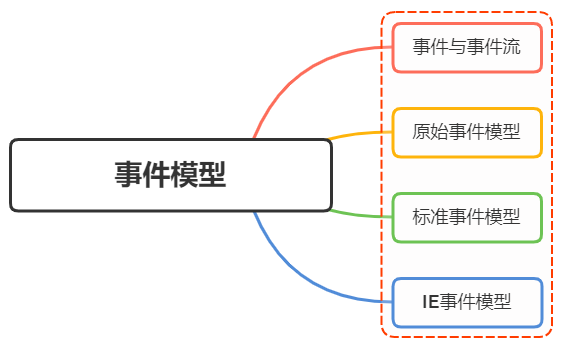

**事件流**

事件流描述了页面接收事件的顺序。

事件流都会经历三个阶段：

- 事件捕获阶段(capture phase)
- 处于目标阶段(target phase)
- 事件冒泡阶段(bubbling phase)


事件冒泡是一种从下往上的传播方式，由最具体的元素（触发节点）然后逐渐向上传播到最不具体的那个节点，也就是`DOM`中最高层的父节点

**事件模型**

- 原始事件模型（DOM0级）
- 标准事件模型（DOM2级）


- **原始事件模型**

  事件绑定监听函数比较简单, 有两种方式：

  - HTML代码中直接绑定

  ```js
  <input type="button" onclick="fun()">
  ```

  - 通过`JS`代码绑定

  ```js
  var btn = document.getElementById('.btn');
  btn.onclick = fun;
  ```

  **特性**

  - 绑定速度快

  `DOM0`级事件具有很好的跨浏览器优势，会以最快的速度绑定，但由于绑定速度太快，可能页面还未完全加载出来，以至于事件可能无法正常运行

  - 只支持冒泡，不支持捕获
  - 同一个类型的事件只能绑定一次

  ```js
  <input type="button" id="btn" onclick="fun1()">
  
  var btn = document.getElementById('.btn');
  btn.onclick = fun2;
  ```

  如上，当希望为同一个元素绑定多个同类型事件的时候（上面的这个`btn`元素绑定2个点击事件），是不被允许的，后绑定的事件会覆盖之前的事件

  删除 `DOM0` 级事件处理程序只要将对应事件属性置为`null`即可

  ```js
  btn.onclick = null;
  ```

**标准事件模型**

在该事件模型中，一次事件共有三个过程:

- 事件捕获阶段：事件从`document`一直向下传播到目标元素, 依次检查经过的节点是否绑定了事件监听函数，如果有则执行
- 事件处理阶段：事件到达目标元素, 触发目标元素的监听函数
- 事件冒泡阶段：事件从目标元素冒泡到`document`, 依次检查经过的节点是否绑定了事件监听函数，如果有则执行

事件绑定监听函数的方式如下:

```text
addEventListener(eventType, handler, useCapture)
```

事件移除监听函数的方式如下:

```text
removeEventListener(eventType, handler, useCapture)
```

参数如下：

- `eventType`指定事件类型(不要加on)
- `handler`是事件处理函数
- `useCapture`是一个`boolean`用于指定是否在捕获阶段进行处理，一般设置为`false`与IE浏览器保持一致

举个例子：

```js
var btn = document.getElementById('.btn');
btn.addEventListener(‘click’, showMessage, false);
btn.removeEventListener(‘click’, showMessage, false);
```

特性

- 可以在一个`DOM`元素上绑定多个事件处理器，各自并不会冲突

```js
btn.addEventListener(‘click’, showMessage1, false);
btn.addEventListener(‘click’, showMessage2, false);
btn.addEventListener(‘click’, showMessage3, false);
```

- 执行时机

当第三个参数(`useCapture`)设置为`true`就在捕获过程中执行，反之在冒泡过程中执行处理函数

下面举个例子：

```js
<div id='div'>
    <p id='p'>
        <span id='span'>Click Me!</span>
    </p >
</div>
```

设置点击事件

```js
var div = document.getElementById('div');
var p = document.getElementById('p');

function onClickFn (event) {
    var tagName = event.currentTarget.tagName;
    var phase = event.eventPhase;
    console.log(tagName, phase);
}

div.addEventListener('click', onClickFn, false);
p.addEventListener('click', onClickFn, false);
```

上述使用了`eventPhase`，返回一个代表当前执行阶段的整数值。1为捕获阶段、2为事件对象触发阶段、3为冒泡阶段

点击`Click Me!`，输出如下

```js
P 3
DIV 3
```

可以看到，`p`和`div`都是在冒泡阶段响应了事件，由于冒泡的特性，裹在里层的`p`率先做出响应

如果把第三个参数都改为`true`

```js
div.addEventListener('click', onClickFn, true);
p.addEventListener('click', onClickFn, true);
```

输出如下

```js
DIV 1
P 1
```

两者都是在捕获阶段响应事件，所以`div`比`p`标签先做出响应

### 问题13：typeof 与 instanceof 区别

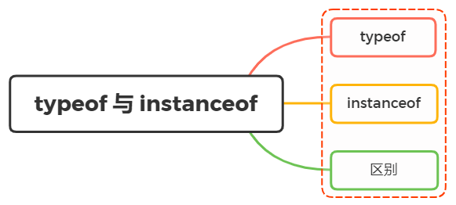

🦈要求：手写数据类型判断，包括`instanceof原理`和通用的数据类型判断方法`Object.prototype.toString`。

- `typeof`用于判断原始数据类型（或者对象）
- `instanceof`用于判断引用数据类型

**typeof**

**instancof**

`instanceof` 运算符用于检测构造函数的 `prototype` 属性是否出现在某个实例对象的原型链上。

🦈

使用如下：

```js
object instanceof constructor
```

`object`为实例对象，`constructor`为构造函数

构造函数通过`new`可以实例对象，`instanceof`能判断这个对象是否是之前那个构造函数生成的对象

```js
// 定义构建函数
let Car = function() {}
let benz = new Car()
benz instanceof Car // true
let car = new String('xxx')
car instanceof String // true
let str = 'xxx'
str instanceof String // false
```

关于`instanceof`的实现原理，可以参考下面：

```js
function myInstanceof(left, right) {
    // 这里先用typeof来判断基础数据类型，如果是，直接返回false
    if(typeof left !== 'object' || left === null) return false;
    // getProtypeOf是Object对象自带的API，能够拿到参数的原型对象
    let proto = Object.getPrototypeOf(left);
    while(true) {                  
        if(proto === null) return false;
        if(proto === right.prototype) return true;//找到相同原型对象，返回true
        proto = Object.getPrototypeof(proto);
    }
}
```

也就是顺着原型链去找，直到找到相同的原型对象，返回`true`，否则为`false`。

**区别**

`typeof`与`instanceof`都是判断数据类型的方法，区别如下：

- `typeof`会返回一个变量的基本类型，`instanceof`返回的是一个布尔值
- `instanceof` 可以准确地判断复杂引用数据类型，但是不能正确判断基础数据类型
- 而`typeof` 也存在弊端，它虽然可以判断基础数据类型（`null` 除外），但是引用数据类型中，除了`function` 类型以外，其他的也无法判断

可以看到，上述两种方法都有弊端，并不能满足所有场景的需求

如果需要通用检测数据类型，可以采用`Object.prototype.toString`，调用该方法，统一返回格式`“[object Xxx]”`的字符串

如下

```js
Object.prototype.toString({})       // "[object Object]"
Object.prototype.toString.call({})  // 同上结果，加上call也ok
Object.prototype.toString.call(1)    // "[object Number]"
Object.prototype.toString.call('1')  // "[object String]"
Object.prototype.toString.call(true)  // "[object Boolean]"
Object.prototype.toString.call(function(){})  // "[object Function]"
Object.prototype.toString.call(null)   //"[object Null]"
Object.prototype.toString.call(undefined) //"[object Undefined]"
Object.prototype.toString.call(/123/g)    //"[object RegExp]"
Object.prototype.toString.call(new Date()) //"[object Date]"
Object.prototype.toString.call([])       //"[object Array]"
Object.prototype.toString.call(document)  //"[object HTMLDocument]"
Object.prototype.toString.call(window)   //"[object Window]"
```

了解了`toString`的基本用法，下面就实现一个全局通用的数据类型判断方法

```js

// 把typeof和Object.prototype.toString.call()结合起来
// 为什么不直接使用Object.prototype.toString.call()，以防toString被重写function getType(obj){
let type  = typeof obj;
if (type !== "object") {    // 先进行typeof判断，如果是基础数据类型，直接返回
  return type;
}
// 对于typeof返回结果是object的，再进行如下的判断，正则返回结果
return Object.prototype.toString.call(obj).replace(/^\[object (\S+)\]$/, '$1'); 
}
```

使用如下

```js
getType([])     // "Array" typeof []是object，因此toString返回
getType('123')  // "string" typeof 直接返回
getType(window) // "Window" toString返回
getType(null)   // "Null"首字母大写，typeof null是object，需toString来判断
getType(undefined)   // "undefined" typeof 直接返回
getType()            // "undefined" typeof 直接返回
getType(function(){}) // "function" typeof能判断，因此首字母小写
getType(/123/g)      //"RegExp" toString返回
```

### 问题14：解释下什么是事件代理？应用场景？

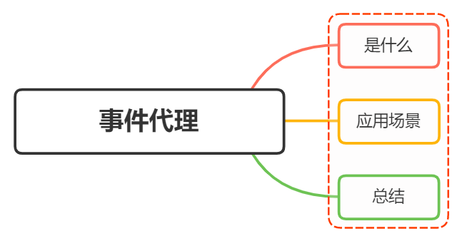

🦈思考：自己项目中的事件处理函数能不能采用事件代理的方式统一去处理。

**是什么**

事件代理，俗地来讲，就是把一个元素响应事件（`click`、`keydown`......）的函数委托到另一个元素

前面讲到，事件流的都会经过三个阶段： 捕获阶段 -> 目标阶段 -> 冒泡阶段，而事件委托就是在冒泡阶段完成

事件委托，会把一个或者一组元素的事件委托到它的父层或者更外层元素上，真正绑定事件的是外层元素，而不是目标元素

当事件响应到目标元素上时，会通过事件冒泡机制从而触发它的外层元素的绑定事件上，然后在外层元素上去执行函数

下面举个例子：

比如一个宿舍的同学同时快递到了，一种笨方法就是他们一个个去领取

较优方法就是把这件事情委托给宿舍长，让一个人出去拿好所有快递，然后再根据收件人一一分发给每个同学

在这里，取快递就是一个事件，每个同学指的是需要响应事件的 `DOM`元素，而出去统一领取快递的宿舍长就是代理的元素

所以真正绑定事件的是这个元素，按照收件人分发快递的过程就是在事件执行中，需要判断当前响应的事件应该匹配到被代理元素中的哪一个或者哪几个

**应用场景**

列表项举例

- 每个列表项都绑定一个事件处理函数，内存消耗较大
- 动态增加或解绑事件时，操作繁琐玛法。

如果我们有一个列表，列表之中有大量的列表项，我们需要在点击列表项的时候响应一个事件

```js
<ul id="list">
  <li>item 1</li>
  <li>item 2</li>
  <li>item 3</li>
  ......
  <li>item n</li>
</ul>
```

如果给每个列表项一一都绑定一个函数，那对于内存消耗是非常大的

```js
// 获取目标元素
const lis = document.getElementsByTagName("li")
// 循环遍历绑定事件
for (let i = 0; i < lis.length; i++) {
    lis[i].onclick = function(e){
        console.log(e.target.innerHTML)
    }
}
```

这时候就可以事件委托，把点击事件绑定在父级元素`ul`上面，然后执行事件的时候再去匹配目标元素

```js
// 给父层元素绑定事件
document.getElementById('list').addEventListener('click', function (e) {
    // 兼容性处理
    var event = e || window.event;
    var target = event.target || event.srcElement;
    // 判断是否匹配目标元素
    if (target.nodeName.toLocaleLowerCase === 'li') {
        console.log('the content is: ', target.innerHTML);
    }
});
```

还有一种场景是上述列表项并不多，我们给每个列表项都绑定了事件

但是如果用户能够随时动态的增加或者去除列表项元素，那么在每一次改变的时候都需要重新给新增的元素绑定事件，给即将删去的元素解绑事件

如果用了事件委托就没有这种麻烦了，因为事件是绑定在父层的，和目标元素的增减是没有关系的，执行到目标元素是在真正响应执行事件函数的过程中去匹配的

举个例子：

下面`html`结构中，点击`input`可以动态添加元素

```html
<input type="button" name="" id="btn" value="添加" />
<ul id="ul1">
    <li>item 1</li>
    <li>item 2</li>
    <li>item 3</li>
    <li>item 4</li>
</ul>
```

使用事件委托

```js
const oBtn = document.getElementById("btn");
const oUl = document.getElementById("ul1");
const num = 4;

//事件委托，添加的子元素也有事件
oUl.onclick = function (ev) {
    ev = ev || window.event;
    const target = ev.target || ev.srcElement;
    if (target.nodeName.toLowerCase() == 'li') {
        console.log('the content is: ', target.innerHTML);
    }

};

//添加新节点
oBtn.onclick = function () {
    num++;
    const oLi = document.createElement('li');
    oLi.innerHTML = `item ${num}`;
    oUl.appendChild(oLi);
};
```

可以看到，使用事件委托，在动态绑定事件的情况下是可以减少很多重复工作的

**总结**

适合事件委托的事件有：`click`，`mousedown`，`mouseup`，`keydown`，`keyup`，`keypress`

从上面应用场景中，我们就可以看到使用事件委托存在两大优点：

- 减少整个页面所需的内存，提升整体性能
- 动态绑定，减少重复工作

但是使用事件委托也是存在局限性：

- `focus`、`blur`这些事件没有事件冒泡机制，所以无法进行委托绑定事件
- `mousemove`、`mouseout`这样的事件，虽然有事件冒泡，但是只能不断通过位置去计算定位，对性能消耗高，因此也是不适合于事件委托的

如果把所有事件都用事件代理，可能会出现事件误判，即本不该被触发的事件被绑定上了事件

### 问题15：说说new操作符具体干了什么？

**一、是什么**

在`JavaScript`中，`new`操作符用于创建一个给定构造函数的实例对象

例子

```js
function Person(name, age){
    this.name = name;
    this.age = age;
}
Person.prototype.sayName = function () {
    console.log(this.name)
}
const person1 = new Person('Tom', 20)
console.log(person1)  // Person {name: "Tom", age: 20}
t.sayName() // 'Tom'
```

从上面可以看到：

- `new` 通过构造函数 `Person` 创建出来的实例可以访问到构造函数中的属性
- `new` 通过构造函数 `Person` 创建出来的实例可以访问到构造函数原型链中的属性（即实例与构造函数通过原型链连接了起来）

现在在构建函数中显式加上返回值，并且这个返回值是一个原始类型

```js
function Test(name) {
  this.name = name
  return 1
}
const t = new Test('xxx')
console.log(t.name) // 'xxx'
```


可以发现，构造函数中返回一个原始值，然而这个返回值并没有作用

下面在构造函数中返回一个对象

```js
function Test(name) {
  this.name = name
  console.log(this) // Test { name: 'xxx' }
  return { age: 26 }
}
const t = new Test('xxx')
console.log(t) // { age: 26 }
console.log(t.name) // 'undefined'
```


从上面可以发现，构造函数如果返回值为一个对象，那么这个返回值会被正常使用

**二、流程**

从上面介绍中，我们可以看到`new`关键字主要做了以下的工作：

- 创建一个新的对象`obj`
- 将对象与构建函数通过原型链连接起来
- 将构建函数中的`this`绑定到新建的对象`obj`上
- 根据构建函数返回类型作判断，如果是原始值则被忽略，如果是返回对象，需要正常处理

举个例子：

```js
function Person(name, age){
    this.name = name;
    this.age = age;
}
const person1 = new Person('Tom', 20)
console.log(person1)  // Person {name: "Tom", age: 20}
t.sayName() // 'Tom'
```

流程图如下：

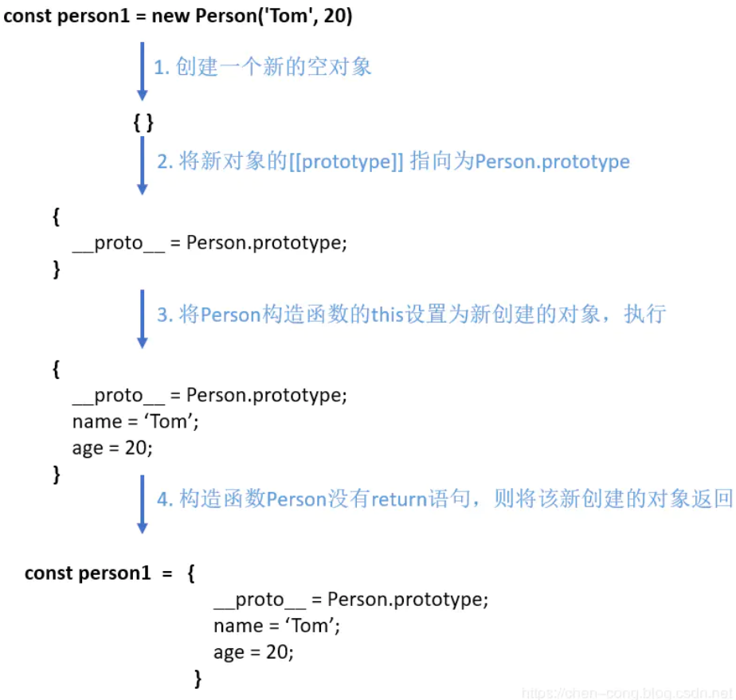

**三、手写new操作符**

现在我们已经清楚地掌握了`new`的执行过程

那么我们就动手来实现一下`new`

```js
function mynew(Func, ...args) {
    // 1.创建一个新对象
    const obj = {}
    // 2.新对象原型指向构造函数原型对象
    obj.__proto__ = Func.prototype
    // 3.将构建函数的this指向新对象
    let result = Func.apply(obj, args)
    // 4.根据返回值判断
    return result instanceof Object ? result : obj
}
```

测试一下

```js
function mynew(func, ...args) {
    const obj = {}
    obj.__proto__ = func.prototype
    let result = func.apply(obj, args)
    return result instanceof Object ? result : obj
}
function Person(name, age) {
    this.name = name;
    this.age = age;
}
Person.prototype.say = function () {
    console.log(this.name)
}

let p = mynew(Person, "huihui", 123)
console.log(p) // Person {name: "huihui", age: 123}
p.say() // huihui
```

可以发现，代码虽然很短，但是能够模拟实现`new`

### 问题16：bind、call、apply 区别？如何实现一个bind?

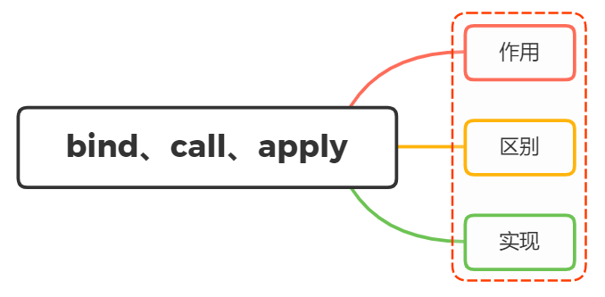

**apply()、call()、bind()详解**

- **apply()**

  语法

  ```js
  apply(thisArg)
  apply(thisArg, argsArray)
  // thisArg：this的指向；argsArray：数组或类数组
  // 含义：即把一个类数组参数argsArray的this绑定到thisArg上
  ```

  thisArg：this的指向；指定为 `null` 或 `undefined` 时会自动替换为指向全局对象，原始值会被包装。
  argsArray：数组或类数组；如果该参数的值为 [`null`](https://developer.mozilla.org/zh-CN/docs/Web/JavaScript/Reference/Operators/null) 或  [`undefined`](https://developer.mozilla.org/zh-CN/docs/Web/JavaScript/Reference/Global_Objects/undefined)，则表示不需要传入任何参数。

  实例

  - 实例一：[用 `apply` 将数组各项添加到另一个数组](https://developer.mozilla.org/zh-CN/docs/Web/JavaScript/Reference/Global_Objects/Function/apply#%E7%94%A8_apply_%E5%B0%86%E6%95%B0%E7%BB%84%E5%90%84%E9%A1%B9%E6%B7%BB%E5%8A%A0%E5%88%B0%E5%8F%A6%E4%B8%80%E4%B8%AA%E6%95%B0%E7%BB%84)

    向一个数组中添加元素时，该元素是数组，如果使用`push()`会将整个数组添加进去，如果想把被添加数组中的元素逐个添加到数组，可以采用`concat()`，但是`cncat()`不是将元素添加到现有数组，而是创建并返回一个新数组。此时我们就可以使用`apply()`。

    ```js
    const array = ['a', 'b'];
    const elements = [0, 1, 2];
    array.push.apply(array, elements);
    console.info(array); // ["a", "b", 0, 1, 2]
    ```

  - 实例二：[使用 `apply` 和内置函数](https://developer.mozilla.org/zh-CN/docs/Web/JavaScript/Reference/Global_Objects/Function/apply#%E4%BD%BF%E7%94%A8_apply_%E5%92%8C%E5%86%85%E7%BD%AE%E5%87%BD%E6%95%B0)--》避免循环

    ```js
    // 找出数组中最大/小的数字
    const numbers = [5, 6, 2, 3, 7];
    
    // 使用 Math.min/Math.max 以及 apply 函数时的代码
    let max = Math.max.apply(null, numbers); // 基本等同于 Math.max(numbers[0], ...) 或 Math.max(5, 6, ..)
    let min = Math.min.apply(null, numbers);
    ```

- **call**

  语法：

  ```js
  function.call(thisArg, arg1, arg2, ...)
  ```

  参数：

  thisArg：在 *function* 函数运行时使用的 `this` 值。指定为 `null` 或 `undefined` 时会自动替换为指向全局对象，原始值会被包装。--》🦈函数调用者的this指向第一个参数。

  arg1, arg2, ...：参数列表。

  - 实例一：[使用 `call` 方法调用父构造函数](https://developer.mozilla.org/zh-CN/docs/Web/JavaScript/Reference/Global_Objects/Function/call#%E4%BD%BF%E7%94%A8_call_%E6%96%B9%E6%B3%95%E8%B0%83%E7%94%A8%E7%88%B6%E6%9E%84%E9%80%A0%E5%87%BD%E6%95%B0)

    可以通过调用父构造函数的 `call` 方法来实现继承。

    ```js
    function Product(name, price) {
      this.name = name;
      this.price = price;
    }
    
    function Food(name, price) {
      Product.call(this, name, price);
      this.category = 'food';
    }
    
    function Toy(name, price) {
      Product.call(this, name, price);
      this.category = 'toy';
    }
    
    var cheese = new Food('feta', 5);
    var fun = new Toy('robot', 40);
    ```

  - 实例二：使用`call`方法调用函数并且指定上下文的`this`

    在下面的例子中，当调用 `greet` 方法的时候，该方法的`this`值会绑定到 `obj` 对象。

    ```js
    function greet() {
      var reply = [this.animal, 'typically sleep between', this.sleepDuration].join(' ');
      console.log(reply);
    }
    
    var obj = {
      animal: 'cats', sleepDuration: '12 and 16 hours'
    };
    
    greet.call(obj);  // cats typically sleep between 12 and 16 hours
    ```

  - 实例三：[使用 `**call**` 方法调用函数并且不指定第一个参数（`argument）`](https://developer.mozilla.org/zh-CN/docs/Web/JavaScript/Reference/Global_Objects/Function/call#%E4%BD%BF%E7%94%A8_call_%E6%96%B9%E6%B3%95%E8%B0%83%E7%94%A8%E5%87%BD%E6%95%B0%E5%B9%B6%E4%B8%94%E4%B8%8D%E6%8C%87%E5%AE%9A%E7%AC%AC%E4%B8%80%E4%B8%AA%E5%8F%82%E6%95%B0%EF%BC%88argument%EF%BC%89)

    在下面的例子中，我们调用了 `display` 方法，但并没有传递它的第一个参数。如果没有传递第一个参数，`this` 的值将会被绑定为全局对象。--》🦈call中不给定参数，则this指向全局对象。

    ```js
    var sData = 'Wisen';
    
    function display() {
      console.log('sData value is %s ', this.sData);
    }
    
    display.call();  // sData value is Wisen
    ```

- **bind**

  定义：`**bind()**` 方法创建一个新的函数，在 `bind()` 被调用时，这个新函数的 `this` 被指定为 `bind()` 的第一个参数，而其余参数将作为新函数的参数，供调用时使用。

  语法

  ```
  function.bind(thisArg[, arg1[, arg2[, ...]]])
  ```

  实例：

  1. 创建绑定函数

     ```js
     this.x = 9;    // 在浏览器中，this 指向全局的 "window" 对象
     var module = {
       x: 81,
       getX: function() { return this.x; }
     };
     
     module.getX(); // 81
     
     var retrieveX = module.getX;
     retrieveX();
     // 返回 9 - 因为函数是在全局作用域中调用的
     
     // 创建一个新函数，把 'this' 绑定到 module 对象
     // 新手可能会将全局变量 x 与 module 的属性 x 混淆
     var boundGetX = retrieveX.bind(module);
     boundGetX(); // 81
     ```

  2. 偏函数

  3. 与setTimeout一起使用

     在默认情况下，使用 [`window.setTimeout()`](https://developer.mozilla.org/zh-CN/docs/Web/API/setTimeout) 时，`this` 关键字会指向 [`window`](https://developer.mozilla.org/zh-CN/docs/Web/API/Window)（或 `global`）对象。

     当类的方法中需要 `this` 指向类的实例时，你可能需要显式地把 `this` 绑定到回调函数，就不会丢失该实例的引用。

     ```js
     function LateBloomer() {
       this.petalCount = Math.ceil(Math.random() * 12) + 1;
     }
     
     // 在 1 秒钟后声明 bloom
     LateBloomer.prototype.bloom = function() {
       window.setTimeout(this.declare.bind(this), 1000);
     };
     
     LateBloomer.prototype.declare = function() {
       console.log('I am a beautiful flower with ' +
         this.petalCount + ' petals!');
     };
     
     var flower = new LateBloomer();
     flower.bloom();  // 一秒钟后，调用 'declare' 方法
     ```

     这里创建了一个函数`LateBloomer`，然年添加方法`bloom`并且把`declare`的this绑定到回调函数上，此时不会丢失该实例的引用。

**作用**

`call`、`apply`、`bind`作用是改变函数执行时的上下文，简而言之就是改变函数运行时的`this`指向。

**区别**

**apply**

`apply`接受两个参数，第一个参数是`this`的指向，第二个参数是函数接受的参数，以数组的形式传入

改变`this`指向后原函数会立即执行，且此方法只是临时改变`this`指向一次

```js
function fn(...args){
    console.log(this,args);
}
let obj = {
    myname:"张三"
}

fn.apply(obj,[1,2]); // this会变成传入的obj，传入的参数必须是一个数组；
fn(1,2) // this指向window
```

当第一个参数为`null`、`undefined`的时候，默认指向`window`(在浏览器中)

```js
fn.apply(null,[1,2]); // this指向window
fn.apply(undefined,[1,2]); // this指向window
```

**call**

`call`方法的第一个参数也是`this`的指向，后面传入的是一个参数列表

跟`apply`一样，改变`this`指向后原函数会立即执行，且此方法只是临时改变`this`指向一次

```js
function fn(...args){
    console.log(this,args);
}
let obj = {
    myname:"张三"
}

fn.call(obj,1,2); // this会变成传入的obj，传入的参数必须是一个数组；
fn(1,2) // this指向window
```

同样的，当第一个参数为`null`、`undefined`的时候，默认指向`window`(在浏览器中)

```js
fn.call(null,[1,2]); // this指向window
fn.call(undefined,[1,2]); // this指向window
```

**bind**

bind方法和call很相似，第一参数也是`this`的指向，后面传入的也是一个参数列表(但是这个参数列表可以分多次传入)

改变`this`指向后不会立即执行，而是返回一个永久改变`this`指向的新函数。

```js
function fn(...args){
    console.log(this,args);
}
let obj = {
    myname:"张三"
}

const bindFn = fn.bind(obj); // this 也会变成传入的obj ，bind不是立即执行需要执行一次
bindFn(1,2) // this指向obj
fn(1,2) // this指向window
```

**小结**

从上面可以看到，`apply`、`call`、`bind`三者的区别在于：

- 三者都可以改变函数的`this`对象指向
- 三者第一个参数都是`this`要指向的对象，如果如果没有这个参数或参数为`undefined`或`null`，则默认指向全局`window`
- 三者都可以传参，但是`apply`是数组，而`call`是参数列表，且`apply`和`call`是一次性传入参数，而`bind`可以分为多次传入
- `bind`是返回绑定this之后的函数，`apply`、`call` 则是立即执行
- 应用场景：`call()`用于继承，`apply()`用于和数组有关的情况，`bind()`

`apply`根本区别在于，`call()` 接受一个**参数列表**，而 `apply()` 接受一个**参数的单数组**。

🦈[参考飞鸟](https://lzxjack.top/post?title=call-apply-bind)

**实现**（不理解这个是怎么实现的）

- **call()**

  `call()`方法调用一个对象。简单理解为**调用函数**的方式，但是它可以改变函数的`this`指向。

  - 将第一个参数作为`call`函数内部临时对象`obj`
  - 给`obj`一个属性`fn`，成为实际执行函数，并将`this`关键字指向这个属性
  - 执行这个函数，并拿到返回值
  - 删除函数属性
  - 返回函数执行的结果

  ```javascript
  // 实现call
  Function.prototype.myCall = function (obj, ...args) {
      // 判断上下文
      const newObj = obj ? Object(obj) : global;
      // 将函数设置为对象的属性
      newObj.fn = this;
      // 执行这个函数，并拿到返回值
      const res = newObj.fn(...args);
      // 删除这个函数属性
      delete newObj.fn;
      // 返回值
      return res;
  };
  ```

- **apply()**

  定义和call()一样，只是传入的参数不同，

  `apply`第二个参数是以数组形式传递的，所以基本步骤与`call`一致，不同的是函数执行的时候需要进行判断是否传入了第二个参数。如果有，将其传入并执行；若没有，直接执行。

  ```javascript
  // 实现apply
  Function.prototype.myApply = function (obj, arr) {
      // 判断上下文
      const newObj = obj ? Object(obj) : global;
      // 将函数设置为对象的属性
      newObj.fn = this;
      // 执行这个函数，并拿到返回值
      let res;
      if (arr) {
          res = newObj.fn(...arr);
      } else {
          res = newObj.fn();
      }
      // 删除这个函数属性
      delete newObj.fn;
      // 返回值
      return res;
  };
  ```

- **bind()**

  `bind()`方法**不会调用函数**。但是能改变函数内部`this`指向。

  当我们只是想改变`this`指向，并且**不想调用**这个函数的时候，可以使用`bind()`。

  ```javascript
  // 实现bind
  Function.prototype.MyBind = function (context) {
      // 调用的方法本身
      const self = this;
      // 类数组->真数组
      const args = Array.prototype.slice.call(arguments, 1);
      // 中转函数
      const temp = function () {};
      const fn = function () {
          // 将新函数执行时的参数arguments数组化，然后与绑定时的参数合并
          const newArgs = Array.prototype.slice.call(arguments);
          // 如果被new调用，this应该是fn的实例
          return self.apply(this instanceof fn ? this : context || global, args.concat(newArgs));
      };
      // 中转原型链
      temp.prototype = self.prototype;
      fn.prototype = new temp();
      return fn;
  };
  ```

### 问题16：说说你对正则表达式的理解？应用场景？

 **一、是什么**

用力啊匹配字符串

创建正则表达式的两种方式：

1. 利用字面量创建正则

   ```js
   // 语法：let 变量 = /模式字符串/标记字符串
   let patter1 = /at/g
   ```

2. 构造函数`RegExp`

   ```js
   const pattern1 = new RegExp('at', 'gi')//全局匹配at并忽略大小写
   ```

注意：遇到元字符需要转义，采用反斜杠`\`

**二、匹配规则**

 **match()** 方法检索返回一个字符串匹配正则表达式的结果。

常见的校验规则如下：

| 规则        | 描述                                                  |
| ----------- | ----------------------------------------------------- |
| \           | 转义                                                  |
| ^           | 匹配输入的开始                                        |
| $           | 匹配输入的结束                                        |
| *           | 匹配前一个表达式 0 次或多次                           |
| +           | 匹配前面一个表达式 1 次或者多次。等价于 `{1,}`        |
| ?           | 匹配前面一个表达式 0 次或者 1 次。等价于`{0,1}`       |
| .           | 默认匹配除换行符之外的任何单个字符                    |
| x(?=y)      | 匹配'x'仅仅当'x'后面跟着'y'。这种叫做先行断言         |
| (?<=y)x     | 匹配'x'仅当'x'前面是'y'.这种叫做后行断言              |
| x(?!y)      | 仅仅当'x'后面不跟着'y'时匹配'x'，这被称为正向否定查找 |
| (?<!*y*)*x* | 仅仅当'x'前面不是'y'时匹配'x'，这被称为反向否定查找   |
| x\|y        | 匹配‘x’或者‘y’                                        |
| {n}         | n 是一个正整数，匹配了前面一个字符刚好出现了 n 次     |
| {n,}        | n是一个正整数，匹配前一个字符至少出现了n次            |
| {n,m}       | n 和 m 都是整数。匹配前面的字符至少n次，最多m次       |
| [xyz]       | 一个字符集合。匹配方括号中的任意字符                  |
| [^xyz]      | 匹配任何没有包含在方括号中的字符                      |
| \b          | 匹配一个词的边界，例如在字母和空格之间                |
| \B          | 匹配一个非单词边界                                    |
| \d          | 匹配一个数字                                          |
| \D          | 匹配一个非数字字符                                    |
| \f          | 匹配一个换页符                                        |
| \n          | 匹配一个换行符                                        |
| \r          | 匹配一个回车符                                        |
| \s          | 匹配一个空白字符，包括空格、制表符、换页符和换行符    |
| \S          | 匹配一个非空白字符                                    |
| \w          | 匹配一个单字字符（字母、数字或者下划线）              |
| \W          | 匹配一个非单字字符                                    |

**正则表达式标记**

| 标志 | 描述                                                      |
| :--- | :-------------------------------------------------------- |
| `g`  | 全局搜索。                                                |
| `i`  | 不区分大小写搜索。                                        |
| `m`  | 多行搜索。                                                |
| `s`  | 允许 `.` 匹配换行符。                                     |
| `u`  | 使用`unicode`码的模式进行匹配。                           |
| `y`  | 执行“粘性(`sticky`)”搜索,匹配从目标字符串的当前位置开始。 |

使用方法如下：

```js
var re = /pattern/flags;
var re = new RegExp("pattern", "flags");
```

在了解下正则表达式基本的之外，还可以掌握几个正则表达式的特性：

- 贪婪模式

  在了解贪婪模式前，首先举个例子：

  ```js
  const reg = /ab{1,3}c/
  ```

  在匹配过程中，尝试可能的顺序是从多往少的方向去尝试。首先会尝试`bbb`，然后再看整个正则是否能匹配。不能匹配时，吐出一个`b`，即在`bb`的基础上，再继续尝试，以此重复

  如果多个贪婪量词挨着，则深度优先搜索

  ```js
  const string = "12345";
  const regx = /(\d{1,3})(\d{1,3})/;// \d表示匹配一个数字
  console.log( string.match(reg) );
  // => ["12345", "123", "45", index: 0, input: "12345"]
  ```

  其中，前面的`\d{1,3}`匹配的是"123"，后面的`\d{1,3}`匹配的是"45"

- 懒惰模式

  惰性量词就是在贪婪量词后面加个问号。表示==尽可能少的匹配==

  ```js
  var string = "12345";
  var regex = /(\d{1,3}?)(\d{1,3})/;
  console.log( string.match(regex) );
  // => ["1234", "1", "234", index: 0, input: "12345"]
  ```

  其中`\d{1,3}?`只匹配到一个字符"1"，而后面的`\d{1,3}`匹配了"234"。

- 分组

  分组主要是用过`()`进行实现，比如`beyond{3}`，是匹配`d`字母3次。而`(beyond){3}`是匹配`beyond`三次

  在`()`内使用`|`达到或的效果，如`(abc | xxx)`可以匹配`abc`或者`xxx`

  反向引用，巧用`$`分组捕获--》🦈有意思，可以用于算法

  ```js
  let str = "John Smith";
  
  // 交换名字和姓氏
  console.log(str.replace(/(john) (smith)/i, '$2, $1')) // Smith, John
  ```

**三、匹配方法**

正则表达式常被用于某些方法，我们可以分成两类：

- 字符串（str）方法：`match`、`matchAll`、`search`、`replace`、`split`
- 正则对象下（regexp）的方法：`test`、`exec`

| 方法     | 描述                                                         |
| :------- | :----------------------------------------------------------- |
| exec     | 一个在字符串中执行查找匹配的RegExp方法，它返回一个数组（未匹配到则返回 null）。 |
| test     | 一个在字符串中测试是否匹配的RegExp方法，它返回 true 或 false。 |
| match    | 一个在字符串中执行查找匹配的String方法，它返回一个数组，在未匹配到时会返回 null。 |
| matchAll | 一个在字符串中执行查找所有匹配的String方法，它返回一个迭代器（iterator）。 |
| search   | 一个在字符串中测试匹配的String方法，它返回匹配到的位置索引，或者在失败时返回-1。 |
| replace  | 一个在字符串中执行查找匹配的String方法，并且使用替换字符串替换掉匹配到的子字符串。 |
| split    | 一个使用正则表达式或者一个固定字符串分隔一个字符串，并将分隔后的子字符串存储到数组中的 `String` 方法。 |

**str.match(regexp)**

`str.match(regexp)` 方法在字符串 `str` 中找到匹配 `regexp` 的字符

如果 `regexp` 不带有 `g` 标记，则它以数组的形式返回第一个匹配项，其中包含分组和属性 `index`（匹配项的位置）、`input`（输入字符串，等于 `str`）

```js
let str = "I love JavaScript";

let result = str.match(/Java(Script)/);

console.log( result[0] );     // JavaScript（完全匹配）
console.log( result[1] );     // Script（第一个分组）
console.log( result.length ); // 2

// 其他信息：
console.log( result.index );  // 7（匹配位置）
console.log( result.input );  // I love JavaScript（源字符串）
```

如果 `regexp` 带有 `g` 标记，则它将所有匹配项的数组作为字符串返回，而不包含分组和其他详细信息

```js
let str = "I love JavaScript";

let result = str.match(/Java(Script)/g);

console.log( result[0] ); // JavaScript
console.log( result.length ); // 1
```

如果没有匹配项，则无论是否带有标记 `g` ，都将返回 `null`

```js
let str = "I love JavaScript";

let result = str.match(/HTML/);

console.log(result); // null
```

**str.matchAll(regexp)**

返回一个包含所有匹配正则表达式的结果及分组捕获组的迭代器

```js
const regexp = /t(e)(st(\d?))/g;
const str = 'test1test2';

const array = [...str.matchAll(regexp)];

console.log(array[0]);
// expected output: Array ["test1", "e", "st1", "1"]

console.log(array[1]);
// expected output: Array ["test2", "e", "st2", "2"]
```

**str.search(regexp)**

返回第一个匹配项的位置，如果未找到，则返回 `-1`

```js
let str = "A drop of ink may make a million think";

console.log( str.search( /ink/i ) ); // 10（第一个匹配位置）
```

这里需要注意的是，`search` 仅查找第一个匹配项

**str.replace(regexp)**

替换与正则表达式匹配的子串，并返回替换后的字符串。在不设置全局匹配`g`的时候，只替换第一个匹配成功的字符串片段

```js
const reg1=/javascript/i;
const reg2=/javascript/ig;
console.log('hello Javascript Javascript Javascript'.replace(reg1,'js'));
//hello js Javascript Javascript
console.log('hello Javascript Javascript Javascript'.replace(reg2,'js'));
//hello js js js
```

**str.split(regexp)**

使用正则表达式（或子字符串）作为分隔符来分割字符串

```js
console.log('12, 34, 56'.split(/,\s*/)) // 数组 ['12', '34', '56']
```

**regexp.exec(str)**

`regexp.exec(str)` 方法返回字符串 `str` 中的 `regexp` 匹配项，与以前的方法不同，它是在正则表达式而不是字符串上调用的

根据正则表达式是否带有标志 `g`，它的行为有所不同

如果没有 `g`，那么 `regexp.exec(str)` 返回的第一个匹配与 `str.match(regexp)` 完全相同

如果有标记 `g`，调用 `regexp.exec(str)` 会返回第一个匹配项，并将紧随其后的位置保存在属性`regexp.lastIndex` 中。 下一次同样的调用会从位置 `regexp.lastIndex` 开始搜索，返回下一个匹配项，并将其后的位置保存在 `regexp.lastIndex` 中

```js
let str = 'More about JavaScript at https://javascript.info';
let regexp = /javascript/ig;

let result;

while (result = regexp.exec(str)) {
  console.log( `Found ${result[0]} at position ${result.index}` );
  // Found JavaScript at position 11
  // Found javascript at position 33
}
```

**regexp.test(str)**

查找匹配项，然后返回 `true/false` 表示是否存在

```js
let str = "I love JavaScript";

// 这两个测试相同
console.log( /love/i.test(str) ); // true
```

**四、[应用场景](https://vue3js.cn/interview/JavaScript/regexp.html#%E5%9B%9B%E3%80%81%E5%BA%94%E7%94%A8%E5%9C%BA%E6%99%AF)**

### 问题17：说说你对事件循环的理解

事件循环顺序，先执行同步任务再执行异步任务，异步任务又分为宏任务和微任务，先执行微任务再执行宏任务，所以执行顺序为：同步任务 --》 微任务 --》 宏任务

**一、是什么**

首先，`JavaScript`是一门单线程的语言，意味着同一时间内只能做一件事，但是这并不意味着单线程就是阻塞，而实现单线程非阻塞的方法就是事件循环

在`JavaScript`中，所有的任务都可以分为

- 同步任务：立即执行的任务，同步任务一般会直接进入到主线程中执行
- 异步任务：异步执行的任务，比如`ajax`网络请求，`setTimeout`定时函数等

同步任务与异步任务的运行流程图如下：


从上面我们可以看到，同步任务进入主线程，即主执行栈，异步任务进入任务队列，主线程内的任务执行完毕为空，会去任务队列读取对应的任务，推入主线程执行。上述过程的不断重复就事件循环

**二、宏任务与微任务**

如果将任务划分为同步任务和异步任务并不是那么的准确，举个例子：

```js
console.log(1)

setTimeout(()=>{
    console.log(2)
}, 0)

new Promise((resolve, reject)=>{
    console.log('new Promise')
    resolve()
}).then(()=>{
    console.log('then')
})

console.log(3)
```

如果按照上面流程图来分析代码，我们会得到下面的执行步骤：

- `console.log(1)`，同步任务，主线程中执行
- `setTimeout()` ，异步任务，放到 `Event Table`，0 毫秒后`console.log(2)`回调推入 `Event Queue` 中
- `new Promise` ，同步任务，主线程直接执行
- `.then` ，异步任务，放到 `Event Table`
- `console.log(3)`，同步任务，主线程执行

所以按照分析，它的结果应该是 `1` => `'new Promise'` => `3` => `2` => `'then'`

但是实际结果是：`1`=>`'new Promise'`=> `3` => `'then'` => `2`

出现分歧的原因在于异步任务执行顺序，事件队列其实是一个“先进先出”的数据结构，排在前面的事件会优先被主线程读取

例子中 `setTimeout`回调事件是先进入队列中的，按理说应该先于 `.then` 中的执行，但是结果却偏偏相反

原因在于异步任务还可以细分为微任务与宏任务

**微任务**

一个需要异步执行的函数，执行时机是在主函数执行结束之后、当前宏任务结束之前

常见的微任务有：

- Promise.then
- MutaionObserver
- Object.observe（已废弃；Proxy 对象替代）
- process.nextTick（Node.js）

**宏任务**

宏任务的时间粒度比较大，执行的时间间隔是不能精确控制的，对一些高实时性的需求就不太符合

常见的宏任务有：

- script (可以理解为外层同步代码)
- setTimeout/setInterval
- UI rendering/UI事件
- postMessage、MessageChannel
- setImmediate、I/O（Node.js）

这时候，事件循环，宏任务，微任务的关系如图所示


按照这个流程，它的执行机制是：

- 执行一个宏任务，如果遇到微任务就将它放到微任务的事件队列中
- 当前宏任务执行完成后，会查看微任务的事件队列，然后将里面的所有微任务依次执行完

回到上面的题目

```js
console.log(1)
setTimeout(()=>{
    console.log(2)
}, 0)
new Promise((resolve, reject)=>{
    console.log('new Promise')
    resolve()
}).then(()=>{
    console.log('then')
})
console.log(3)
```

流程如下

```js
// 遇到 console.log(1) ，直接打印 1
// 遇到定时器，属于新的宏任务，留着后面执行
// 遇到 new Promise，这个是直接执行的，打印 'new Promise'
// .then 属于微任务，放入微任务队列，后面再执行
// 遇到 console.log(3) 直接打印 3
// 好了本轮宏任务执行完毕，现在去微任务列表查看是否有微任务，发现 .then 的回调，执行它，打印 'then'
// 当一次宏任务执行完，再去执行新的宏任务，这里就剩一个定时器的宏任务了，执行它，打印 2
```

**三、async与await**

`async` 是异步的意思，`await`则可以理解为 `async wait`。所以可以理解`async`就是用来声明一个异步方法，而 `await`是用来等待异步方法执行

**async**

`async`函数返回一个`promise`对象，下面两种方法是等效的

```js
function f() {
    return Promise.resolve('TEST');
}

// asyncF is equivalent to f!
async function asyncF() {
    return 'TEST';
}
```

**await**

正常情况下，`await`命令后面是一个 `Promise`对象，返回该对象的结果。如果不是 `Promise`对象，就直接返回对应的值

```js
async function f(){
    // 等同于
    // return 123
    return await 123
}
f().then(v => console.log(v)) // 123
```

不管`await`后面跟着的是什么，`await`都会阻塞后面的代码

```js
async function fn1 (){
    console.log(1)
    await fn2()
    console.log(2) // 阻塞
}

async function fn2 (){
    console.log('fn2')
}

fn1()
console.log(3)
```

上面的例子中，`await` 会阻塞下面的代码（即加入微任务队列），先执行 `async`外面的同步代码，同步代码执行完，再回到 `async` 函数中，再执行之前阻塞的代码

所以上述输出结果为：`1`，`fn2`，`3`，`2`

🦈执行流程：调用函数`fn1()`直接执行同步任务输出==1==，遇到`await`阻塞后面的代码加入到微任务队列，`await`后面是一个值不是`Promise`对象直接返回（是同步任务直接执行）输出==`'fn2'`==，继续执行同步任务输出==3==，同步任务执行结束，执行微任务，输出==2==。

**四、流程分析**

```js
async function async1() {
    console.log('async1 start')
    await async2()
    console.log('async1 end')
}
async function async2() {
    console.log('async2')
}
console.log('script start')
setTimeout(function () {
    console.log('settimeout')
})
async1()
//=======================================
new Promise(function (resolve) {
    console.log('promise1')
    resolve()
}).then(function () {
    console.log('promise2')
})
console.log('script end')
```

🦈执行流程：

`'script start'` --》`'async1 start'` --》`'async2'` --》`'promise1'`--》 `'script end'` --》 `'async1 end'` --》`'promise2'` --》`'settimeout'`。

自己动手画画

分析过程：

1. 执行整段代码，遇到 `console.log('script start')` 直接打印结果，输出 `script start`
2. 遇到定时器了，它是宏任务，先放着不执行
3. 遇到 `async1()`，执行 `async1` 函数，先打印 `async1 start`，下面遇到`await`怎么办？先执行 `async2`，打印 `async2`，然后阻塞下面代码（即加入微任务列表），跳出去执行同步代码 🦈--》这里因为async2()返回值不是一个Promise对象，所以是同步任务直接执行。
4. 跳到 `new Promise` 这里，直接执行，打印 `promise1`，下面遇到 `.then()`，它是微任务，放到微任务列表等待执行
5. 最后一行直接打印 `script end`，现在同步代码执行完了，开始执行微任务，即 `await`下面的代码，打印 `async1 end`
6. 继续执行下一个微任务，即执行 `then` 的回调，打印 `promise2`
7. 上一个宏任务所有事都做完了，开始下一个宏任务，就是定时器，打印 `settimeout`

所以最后的结果是：`script start`、`async1 start`、`async2`、`promise1`、`script end`、`async1 end`、`promise2`、`settimeout`

### 问题18：举例说明你对尾递归的理解，有哪些应用场景

[参考](https://vue3js.cn/interview/JavaScript/tail_recursion.html#%E4%B8%80%E3%80%81%E9%80%92%E5%BD%92)

### 问题19：说说 JavaScript 中内存泄漏的几种情况？

看MDN的内存管理

**垃圾回收**

垃圾回收是删除那些不再被其他对象引用的对象。
在这里，“对象”的概念不仅特指 JavaScript 对象，还包括函数作用域（或者全局词法作用域）。

**内存管理**

内存生命周期

分配、使用、释放

回收

- 引用计数

  对象是否不再需要

  限制：循环引用

- 标记清理（常用⭐）

  对象是否可以获得

  垃圾回收器将定期从根（全局对象）开始，找所有从根开始引用的对象，然后找这些对象引用的对象……从根开始，垃圾回收器将找到所有可以获得的对象和收集所有不能获得的对象。---》对不可获得的对象进行清除。

  循环引用解决：函数调用返回之后，两个对象==从全局对象出发无法获取==。会被垃圾回收器回收。


**一、是什么**

内存泄漏（Memory leak）是在计算机科学中，由于疏忽或错误造成程序未能释放已经不再使用的内存

并非指内存在物理上的消失，而是应用程序分配某段内存后，由于设计错误，导致在释放该段内存之前就失去了对该段内存的控制，从而造成了内存的浪费

程序的运行需要内存。只要程序提出要求，操作系统或者运行时就必须供给内存

对于持续运行的服务进程，必须及时释放不再用到的内存。否则，内存占用越来越高，轻则影响系统性能，重则导致进程崩溃。

JS提供自动内存管理，减轻程序员的负担，这被称为"垃圾回收机制".。

**二、垃圾回收机制**

**标记清除**

`JavaScript`最常用的垃圾收回机制

当变量进入执行环境时，就标记这个变量为“进入环境“。进入环境的变量所占用的内存就不能释放，当变量离开环境时，则将其标记为“离开环境“

垃圾回收程序运行的时候，会标记内存中存储的所有变量。然后，它会==将所有在上下文中的变量，以及被在上下文中的变量引用的变量的标记去掉==（这两种是不进行回收的）。

在此之后再被加上标记的变量就是待删除的了，原因是任何在上下文中的变量都访问不到它们了

随后垃圾回收程序做一次内存清理，销毁带标记的所有值并收回它们的内存

举个例子：

```js
var m = 0,n = 19 // 把 m,n,add() 标记为进入环境。
add(m, n) // 把 a, b, c标记为进入环境。
console.log(n) // a,b,c标记为离开环境，等待垃圾回收。
function add(a, b) {
  a++
  var c = a + b
  return c
}
```

**引用计数**

语言引擎有一张"引用表"，保存了内存里面所有的资源（通常是各种值）的引用次数。如果一个值的引用次数是`0`，就表示这个值不再用到了，因此可以将这块内存释放

如果一个值不再需要了，引用数却不为`0`，垃圾回收机制无法释放这块内存，从而导致内存泄漏

```javascript
const arr = [1, 2, 3, 4];
console.log('hello world')
```

面代码中，数组`[1, 2, 3, 4]`是一个值，会占用内存。变量`arr`是仅有的对这个值的引用，因此引用次数为`1`。尽管后面的代码没有用到`arr`，它还是会持续占用内存

如果需要这块内存被垃圾回收机制释放，只需要设置如下：

```js
arr = null
```

通过设置`arr`为`null`，就解除了对数组`[1,2,3,4]`的引用，引用次数变为 0，就被垃圾回收了。

**小结**

有了垃圾回收机制，不代表不用关注内存泄露。那些很占空间的值，一旦不再用到，需要检查是否还存在对它们的引用。如果是的话，就必须手动解除引用

**三、常见内存泄露情况**

- 意外声明全局变量

  ```js
  function foo(arg) {
      bar = "this is a hidden global variable";
  }
  ```

  另一种意外的全局变量可能由 `this` 创建：

  ```js
  function foo() {
      this.variable = "potential accidental global";
  }
  // foo 调用自己，this 指向了全局对象（window）
  foo();
  ```

  🦈相当于在`window`上创建的属性，只要`window`本身不被清理就不会消失。

  上述使用严格模式，可以避免意外的全局变量

  解决方法：在变量声明前加上关键字`var let const`，这样变量会在函数执行完离开作用域。

- 定时器也常会造成内存泄露

  ```js
  var someResource = getData();
  setInterval(function() {
      var node = document.getElementById('Node');
      if(node) {
          // 处理 node 和 someResource
          node.innerHTML = JSON.stringify(someResource));
      }
  }, 1000);
  ```

  如果`id`为Node的元素从`DOM`中移除，该定时器仍会存在，同时，因为回调函数中包含对`someResource`的引用，定时器外面的`someResource`也不会被释放

  包括我们之前所说的闭包，维持函数内局部变量，使其得不到释放

  ```js
  function bindEvent() {
    var obj = document.createElement('XXX');
    var unused = function () {
      console.log(obj, '闭包内引用obj obj不会被释放');
    };
    obj = null; // 解决方法--》🦈把obj释放掉
  }
  ```

- 没有清理对`DOM`元素的引用同样造成内存泄露

  ```js
  const refA = document.getElementById('refA');
  document.body.removeChild(refA); // dom删除了
  console.log(refA, 'refA'); // 但是还存在引用能console出整个div 没有被回收
  refA = null;
  console.log(refA, 'refA'); // 解除引用
  ```

  包括使用事件监听`addEventListener`监听的时候，在不监听的情况下使用`removeEventListener`取消对事件监听

### 问题20：Javascript本地存储的方式有哪些？区别及应用场景？

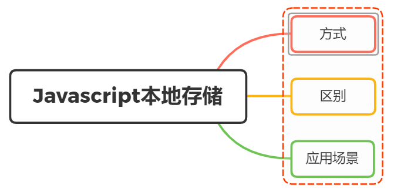

**书籍整理**
存储类型有cookie和web storage，其中web storage又分为sessionStorage和localStorage。sessionStorage用于保存浏览器一次会话期间的数据，在浏览器关闭时删除；localStorage用于会话之外持久保存数据。IndexDB是类似于SQL数据库的结构化数据存储机制，保存的是对象而不是数据表（对象存储）。

**视频**
HTTP是无状态存储。
需求：当第一次登录后，再次登录不需要再次输入密码。
解决：浏览器在每一次请求里加入用户名和密码

**cookie**

Cookie：每次HTTP请求都自动带数据给服务器的技术。
Cookie基本流程：

1. 浏览器发起HTTP请求
2. 服务器会进行Cookie设置（即Set-Cookie）,Cookie中有名和值两个属性，服务器把名和值属性里的内容给填充完整，然后发送给浏览器，浏览器进行保存。
3. 之后浏览器发送的每一个请求都会自动附上这个Cookie

Cookie是存储在浏览器中的数据，打开浏览器是可以查询到的，如果把用户名和密码存储到其中是不安全的。所以引入了Session（会话）。

**Session**

注意：当浏览器访问服务端时会话开始，服务端设置了结束时间和 Session ID，保存到数据库中。

流程：

1. 用户输入密码第一次登录，浏览器携带着用户名和密码发送请求到服务端。

2. 服务端设置Session ID和结束时间，然后发送给浏览器

3. 之后浏览器的每次请求都会携带Session ID和结束时间，待到达结束时间后，浏览器自行删除这个Cookie。再次登录就需要密码。

   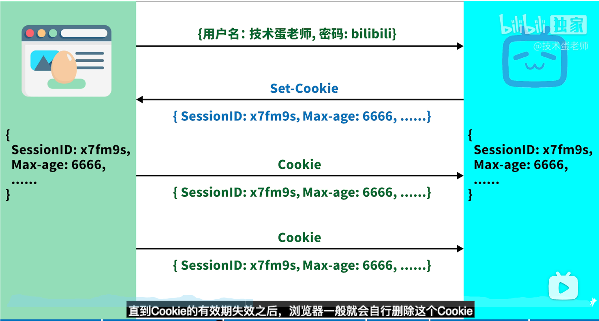

存在问题：

用户量变大，当特定时间大量用户访问服务器的时候，服务器就会面临需要存储大量Session ID在服务器里，当一台服务器存储超载时，就需要分享Session ID给其他服务器，但是分享也不方便，就采用数据库存储`Session ID`，但是当数据库崩溃时就会影响服务器获取Session ID。所以出现了JWT （JSON Web Token）

**JWT**

流程：

1. 用户登录，客户端发送请求到服务器，服务器生成一个JWT，只保存`JWT`签名的密文，然后将JWT发送给客户端。

2. 浏览器以Cookie或者Storage的形式存储（假设以Cookie形式存储）

3. 客户端每次发送请求都会把JWT发送给服务器，则不需要输入账户密码。Token存储在用户这里。

   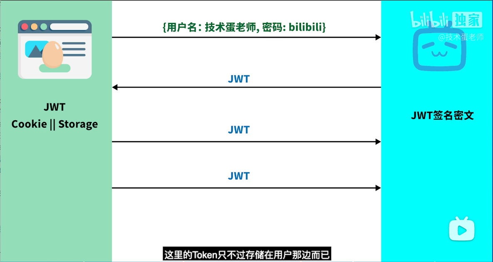

安全性：

组成：


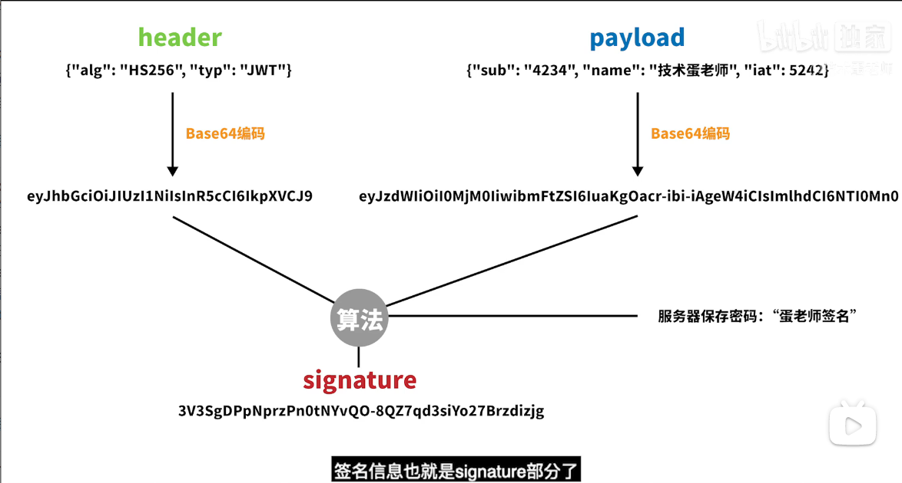

编码，很容易就解码，所以

两端编码进行算法运算，得到签名信息，保存在服务端中。

**小结**

- Session保存在服务器端
- Cookie是数据载体，把Session放入Cookie中送到客户端；Cookie跟着HTTP的每个请求发送到服务端
- Token在服务器中生成，但保存在客户端中，存储在Cookie或者Storage中

**一、方式**

`javaScript`本地缓存的方法我们主要讲述以下四种：

- cookie
- sessionStorage
- localStorage
- indexedDB

**cookie**

🦈Cookie的工作机制是用户识别和状态管理。服务端为了管理客户端的状态，把一些数据临时存储在用户的计算机内

`Cookie`，类型为「小型文本文件」，指某些网站为了辨别用户身份而储存在用户本地终端上的数据。是为了解决 `HTTP`无状态导致的问题

作为一段一般不超过 4KB 的小型文本数据，它由一个名称（Name）、一个值（Value）和其它几个用于控制 `cookie`有效期、安全性、使用范围的可选属性组成

但是`cookie`在每次请求中都会被发送，如果不使用 `HTTPS`并对其加密，其保存的信息很容易被窃取，导致安全风险。举个例子，在一些使用 `cookie`保持登录态的网站上，如果 `cookie`被窃取，他人很容易利用你的 `cookie`来假扮成你登录网站

关于`cookie`常用的属性如下：

- Expires 用于设置 Cookie 的过期时间

```js
Expires=Wed, 21 Oct 2015 07:28:00 GMT
```

- Max-Age 用于设置在 Cookie 失效之前需要经过的秒数（优先级比`Expires`高）

```js
Max-Age=604800
```

- `Domain`指定了 `Cookie` 可以送达的主机名
- `Path`指定了一个 `URL`路径，这个路径必须出现在要请求的资源的路径中才可以发送 `Cookie` 首部

```js
Path=/docs   # /docs/Web/ 下的资源会带 Cookie 首部
```

- 标记为 `Secure`的 `Cookie`只应通过被`HTTPS`协议加密过的请求发送给服务端

通过上述，我们可以看到`cookie`又开始的作用并不是为了缓存而设计出来，只是借用了`cookie`的特性实现缓存

关于`cookie`的使用如下：

```js
document.cookie = '名字=值';
```

关于`cookie`的修改，首先要确定`domain`和`path`属性都是相同的才可以，其中有一个不同得时候都会创建出一个新的`cookie`

```js
Set-Cookie:name=aa; domain=aa.net; path=/  # 服务端设置
document.cookie =name=bb; domain=aa.net; path=/  # 客户端设置
```

最后`cookie`的删除，最常用的方法就是给`cookie`设置一个过期的事件，这样`cookie`过期后会被浏览器删除。

**localStorage**

`HTML5`新方法，IE8及以上浏览器都兼容;--》🦈持久化存储数据

- 生命周期：持久化的本地存储，除非主动删除数据，否则数据是永远不会过期的
- 存储的信息在同一域中是共享的
- 当本页操作（新增、修改、删除）了`localStorage`的时候，本页面不会触发`storage`事件,但是别的页面会触发`storage`事件。
- 大小：5M（跟浏览器厂商有关系）
- `localStorage`本质上是对字符串的读取，如果存储内容多的话会消耗内存空间，会导致页面变卡
- 受同源策略的限制

`localStorage`的使用

- 存储数据

  ```js
  // 使用方法
  localStorage.setItem('name','bobo')
  // 使用属性
  localStorage.name = 'bobo'
  ```

- 获取数据

  ```js
  // 使用方法
  localStorage.getItem('name','bobo')
  // 使用属性
  let name = localStorage.name
  ```

- 获取键名

  ```js
  localStorage.key(0) //获取第一个键名
  ```

- 删除

  ```js
  localStorage.removeItem('username')
  ```

- 一次性清除所有存储

  ```js
  localStorage.clear()
  ```

缺点

- 无法像`Cookie`一样设置过期时间
- 只能存入字符串，无法直接存对象

```js
localStorage.setItem('key', {name: 'value'});
console.log(localStorage.getItem('key')); // '[object, Object]'
```

**sessionStorage**

存储会话数据

`sessionStorage`和 `localStorage`使用方法基本一致，唯一不同的是生命周期，一旦页面（会话）关闭，`sessionStorage` 将会删除数据。

**indexedDB**

🦈存储结构化数据

虽然 `Web Storage`对于存储较少量的数据很有用，但对于存储更大量的结构化数据来说，这种方法不太有用。`IndexedDB`提供了一个解决方案。

使用方法

1. 创建对象存储
2. 创建事物操作数据

```js
// 给定一定数据
let user = {
  username:'bobo', //作为键，必须唯一，访问数据的凭证
  password:'2525'
}
// 1.创建对象存储
let request = indexedDB.open('admin', version)
request.onupgradeneeded = (event) => {
	
}...
```

扩展：

事物：根据键取得一条数据

游标：指向结果集的指针，获取多条数据。

键范围：管理游标，指定游标索引的位置，根据方法缺点范围，获取该范围内的数据。

**二、区别**

关于`cookie`、`sessionStorage`、`localStorage`三者的区别主要如下：

- 存储大小：`cookie`数据大小不能超过`4k`，`sessionStorage`和`localStorage`虽然也有存储大小的限制，但比`cookie`大得多，可以达到5M或更大
- 有效时间：`localStorage`存储持久数据，浏览器关闭后数据不丢失除非主动删除数据； `sessionStorage`数据在当前浏览器窗口关闭后自动删除；`cookie`设置的`cookie`过期时间之前一直有效，即使窗口或浏览器关闭
- 数据与服务器之间的交互方式，`cookie`的数据会自动的传递到服务器，服务器端也可以写`cookie`到客户端； `sessionStorage`和`localStorage`不会自动把数据发给服务器，仅在本地保存

**三、应用场景**

在了解了上述的前端的缓存方式后，我们可以看看针对不对场景的使用选择：

- 标记用户与跟踪用户行为的情况，推荐使用`cookie`
- 适合长期保存在本地的数据（令牌），推荐使用`localStorage`
- 敏感账号一次性登录，推荐使用`sessionStorage`
- 存储大量数据的情况、在线文档（富文本编辑器）保存编辑历史的情况，推荐使用`indexedDB`

### 问题21：说说你对函数式编程的理解？优缺点？

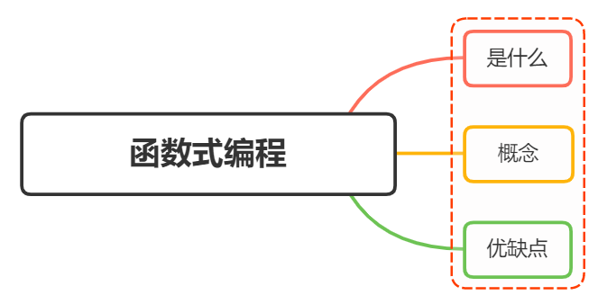

**柯里化**

柯里化是把一个多参数函数转化成一个嵌套的一元函数的过程。

一个二元函数如下：

```js
let fn = (x,y)=>x+y;
```

转化成柯里化函数如下：

```js
const curry = function(fn){
    return function(x){
        return function(y){
            return fn(x,y);
        }
    }
}
let myfn = curry(fn);
console.log( myfn(1)(2) );
```

代码思路：首先我们调用了`curry()`函数并且传入参数fn，就预处理了x+y，然后返回的是一个函数`function(x)`部分，然后再调用`myfn(1)`传入参数1，返回`function(y)`部分，再次调用`myfn(1)(2)`传入参数2，返回 `fn(x,y)`执行x+y，输出3。

上面的`curry`函数只能处理二元情况，下面再来实现一个实现多参数的情况

```js
// 多参数柯里化；
const curry = function(fn){
    return function curriedFn(...args){
        if(args.length<fn.length){
            return function(){
                return curriedFn(...args.concat([...arguments]));
            }
        }
        return fn(...args);
    }
}
const fn = (x,y,z,a)=>x+y+z+a;
const myfn = curry(fn);
console.log(myfn(1)(2)(3)(1));
```

关于柯里化函数的意义如下：

- 让纯函数更纯，每次接受一个参数，松散解耦
- 惰性执行

柯里化函数面试题（上面的多参数柯里化就是答案）

add(1)(2)(3)(4)(5)(6); // => 21
add(1, 2)(3, 4)(5, 6); // => 21
add(1, 2, 3, 4, 5, 6); // => 21

**组合与管道**

组合函数，目的是将多个函数组合成一个函数

举个简单的例子：

```js
function afn(a){
    return a*2;
}
function bfn(b){
    return b*3;
}
const compose = (a,b)=>c=>a(b(c));
let myfn =  compose(afn,bfn);
console.log( myfn(2));
```

可以看到`compose`实现一个简单的功能：形成了一个新的函数，而这个函数就是一条从 `bfn -> afn` 的流水线

下面再来看看如何实现一个多函数组合：

```js
const compose = (...fns)=>val=>fns.reverse().reduce((acc,fn)=>fn(acc),val);

// 🦈实现下逻辑
const compose = (...fns) => {
	val => {
		fns.reverse().reduce((acc, fn) => fn(acc),val)
  }
}
```

`compose`执行是从右到左的。而管道函数，执行顺序是从左到右执行的

```js
const pipe = (...fns)=>val=>fns.reduce((acc,fn)=>fn(acc),val);
```

组合函数与管道函数的意义在于：可以把很多小函数组合起来完成更复杂的逻辑

**三、优缺点**

优点

- 更好的管理状态：因为它的宗旨是无状态，或者说更少的状态，能最大化的减少这些未知、优化代码、减少出错情况
- 更简单的复用：固定输入->固定输出，没有其他外部变量影响，并且无副作用。这样代码复用时，完全不需要考虑它的内部实现和外部影响
- 更优雅的组合：往大的说，网页是由各个组件组成的。往小的说，一个函数也可能是由多个小函数组成的。更强的复用性，带来更强大的组合性
- 隐性好处。减少代码量，提高维护性

缺点：

- 性能：函数式编程相对于指令式编程，性能绝对是一个短板，因为它往往会==对一个方法进行过度包装==，从而产生上下文切换的性能开销
- 资源占用：在 JS 中为了实现对象状态的不可变，往往会创建新的对象，因此，它对垃圾回收所产生的压力远远超过其他编程方式
- 递归陷阱：在函数式编程中，为了实现迭代，通常会采用递归操作

### 问题22：Javascript中如何实现函数缓存？函数缓存有哪些应用场景？

