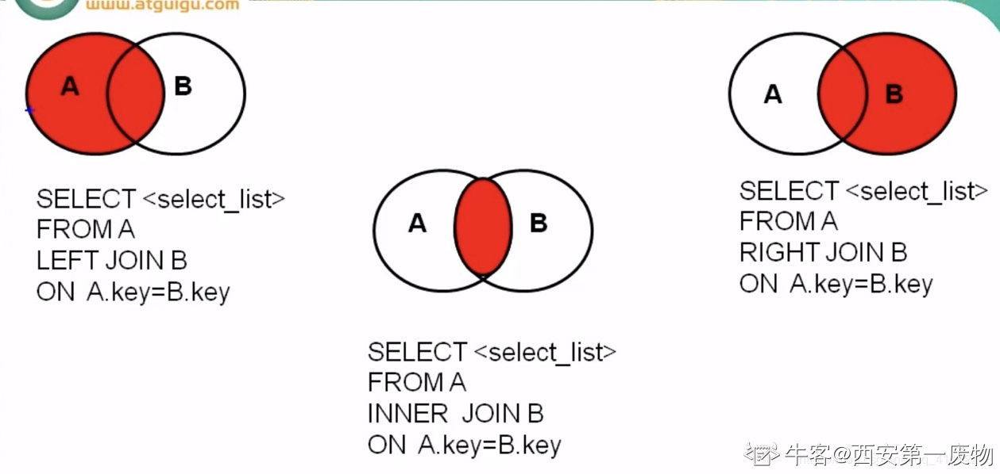
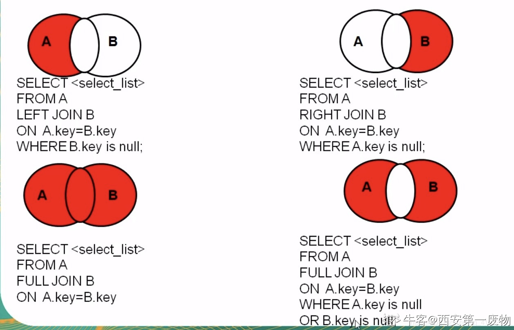

# Mysql 基础

## 一、DQL Data Query Language

### 1.1 **基础查询**

语法：`select 查询列表 from 表名；`

查询列表可以是：表中的字段、常量、表达式、函数。
查询的结果是一个虚拟的表格

1. 查询表中的单个字段
    例：select last_name from employees；

2. 查询表中的多个字段
    例：select last_name，salary from employees；

3. 查询表中的所有字段
    例： select * from 表名；

4. 查询常量值
    例：select 100；/ select ‘john’;

5. 查询表达式
    例：select 100*98;

6. 查询函数
    例：select version();

7. 起别名
    好处：便于理解、如果要查询的字段有重名情况，使用别名区分
    用AS：select 10098 **as** 结果；
    省略AS：select last_name 姓；
    别名中有关键字，加引号，例：select salary as 'out put' from employees；

8. 去重
    例：查询员工表中所有部门编号

    `select DISTINCT department_id from employees;`

9. +号的作用
    仅有一个功能，运算符。

  ```mysql
    例：select 100+90；//190  两个操作数都为数值型，加法运算。
    例：select '100'+90；//190 其中一个为字符型，试图将字符型转换成数值型，如果转换成功，继续做加法运算。如果失败，将字符型数值转换成0。 
    例：select 'a'+90；//90
    例：select null+10；//null 其中一方为null，结果为null。
    例：查询员工名和姓，并显示为 姓名。
    select last_name+first_name as 姓名 from employees;//错误方式，输出0
  ```

  如要拼接，使用**concat()**。

  ```mysql
  select CONCAT( last_name,first_name) as 姓名 from employees;//正确方式
  ```

  **如concat中有某列存在null值，结果为null。**
  可使用**IFNULL**（列名，为null时默认值），不为null时返回原本值。
  **ISNULL** 判断结果，为true返回1，false返回0。

排序查询

- `order by (asc/desc)`

  ```mysql
   SELECT last_name,salary*12*(1+IFNULL(commission_pct,0)) AS 年薪 FROM employees ORDER BY 年薪;
  ```

### 1.4常见函数

调用：select 函数名(实参列表) from 表名

- 字符函数

  ①**length(str)** 获取str的字节个数 一个汉字占3字节(utf8)
  ②**concat(str1,str2...strn)** 拼接字符串
  ③**upper(str)**、**lower（str）** 转换大小写
  ④**substr**、**substring**返回子字符串，**SQL中索引从1开始**
  substr(str,n) 截取从n开始的所有字符
  substr(str,n,m) 截取从n开始的m个字符
  ⑤**instr(str,substr)** ，返回substr在str中第一次出现的索引，没有返回0。
  ⑥**trim(str)**，去掉字符串中空格。
  trim(x from str),去掉str前后的x字符。
  ⑦**lpad(str,n,c)** 左填充，用指定字符c填充str左侧至n长度。  

  *rpad(str,n,c)* 右填充，用指定字符c填充str右侧至n长度。

  ⑧**replace(str,a,b)** 替换

- 数学函数

  ①**round(x)** 四舍五入
  ②**ceil(x)** 向上取整，返回大于等于参数的最小整数
  ③**floor(x)** 向下取整，返回小于等于参数的最大整数
  ④**truncate(n,m)** 截断n，保留m位
  ⑤**mod(a,b)** 取余
  ⑥**rand()** 获取0-1之间的随机数  

- 日期函数

  ①**now()** 返回当前系统日期+时间
  ②**curdate()** 返回当前日期
  ③**curtime()** 返回当前时间
  ④**year(),month(),day(),hour(),minute(),second()** 获取年月日时分秒
  ⑤**str_to_date()** 将日期格式的字符转换成指定格式的字符串
  ⑥**date_format()** 将日期转换成字符
  ⑦**datediff()**返回两日期相差的天数 

- 其他函数

  ①**version()** 版本号
  ②**databases()** 查看所有[数据]()库
  ③**user()** 当前用户
  ④**password(str)** 返回加密形式（MySQL8已弃用）
  ⑤**md5(str)** 返回字符串的md5模式  

- 流程控制函数

  ①if (exp1,exp2,exp3)

   若exp1为true，返回exp2，否则返回exp3

  ②case

  ```mysql
  用法一：
  
   case 要判断的字段或表达式
  
   when 常量1 then 要显示的值 或 语句1；
  
   ...
  
   when 常量n then 要显示的值 或 语句n；
  
   else 要显示的值或语句m
  
   end
  
   用法二：
  
   case
  
   when 条件1 then 要显示的值或语句1；
  
  ...
  
   when 条件n then 要显示的值 或 语句n；
  
   else 要显示的值或语句m
  
   end
  ```

- *分组函数**，做统计使用，又称统计函数或聚合函数***

  **①sum()** 求和*

  **②avg()** 求平均值

  ③**min()** 求最小值

  ④**max()** 求最大值

  ⑤**count()** 求非空个数count(*)/count(常量值) 统计总行数MYISAM存储引擎下，count(*)效率高，INNODB下差不多sum和avg对数值型处理，min和max可对字符型和日期型[排序]()所有分组函数都忽略null值，可和distinct（去重）搭配使用
  和分组函数一同查询的字段要求是group by后的字段；

### 1.5分组查询

语法：

```mysql
select 分组函数，列
from 表名 【where 筛选条件】
group by 分组列表 【order by 字句】
```

特点：
分组前筛选 [数据]()源  为原始表 用where
分组后筛选 [数据]()源  为分组后结果集 用having
分组函数做条件肯定放在having子句中
能用分组前筛选的优先考虑分组前筛选
group by支持单个字段，多个字段(用，隔开)，表达式或函数分组，也可以添加[排序]()（放在最后）。  

连接查询

又称多表查询，当查询的字段来自多个表时，会用到连接查询；
笛卡尔乘积：查询多个表时没有添加有效的连接条件，导致多个表出现完全连接。如表1有a行，表2有b行，将产生a*b行结果。避免：添加**连接条件**；

分类

按年代：
sql92（仅支持内连）、sql99（支持内连接、左外连接、交叉连接）
按功能：
内连接（等值，非等值，自然） 外连接（左，右，全） 交叉连接

sql92语法

1. **sql92 等值连接**

   例：查询员工名和对应部门名

   ```mysql
   SELECT
       last_name,department_name
   FROM
       employees,departments
   WHERE
       employees.`department_id`=departments.`department_id`;
   ```

   注意：为表起别名后，不能使用原表名。

2. **sql92 非等值连接**

   where后跟非等值连接条件

3. **sql92 自然连接**

   把一张表通过别名当多表使用

sql99语法

 语法：

   ```mysql
select 查询列表
from  表1 别名 
连接类型  join 表2 别名
on 连接条件
...
   ```

1. **内连接**：**inner** 可以省略

   - 等值连接

     和sql92的等值连接效果一样

   - 非等值连接

   - 自然连接

     例：查询员工及对应上级名

     ```mysql
     SELECT e1.`last_name`,e2.`last_name` 
     FROM  employees e1
     INNER JOIN employees e2 ON e1.`manager_id`=e2.`employee_id`
     ```

     🦈内连接分为等值连接、非等值连接和自然连接，其中等值连接、非等值连接直接在`where`后面添加等值/非等值条件就可以，自然连接在`INNER JOIN ... ＯＮ`后面添加条件。　 

2. **外连接**：

   用于查询一个表中有，另一个表中没有的记录
   特点：外连接查询的结果为主表中的所有记录，如果从表有和他匹配的则显示匹配的值，若没有则显示null。外连接查询结果=内连接结果+主表有而从表没有的记录。
   左外连接中left左边的是主表，右外连接right右边的是主表。
   左外和右外交换顺序，可实现同样的效果  

3. **左外连接**：left 【outer】

   包含左边表的全部行（不管右边的表中是否存在与它们匹配的行），以及右边表中全部匹配的行----（🦈==主表的所有行和从表中匹配的行==）

   例：查询哪个部门没有员工

   ```MYSQL
   SELECT d.*,e.`id` FROM departments d 
   LEFT JOIN employees e ON d.`department_id`=e.`department_id`
   WHERE e.`employee_id` IS NULL
   ```

4. **右外连接**：right【outer】

5. **交叉连接**：cross【outer】

6. **全外连接**：full【outer】

   等于内连接的结果+表1中有表2中没有的+表2中有但表1中没有的

图1 左外连接/内连接/右外连接



图2 左外连接/右外连接/全外连接



sql92和sql99比较

功能：sql99支持较多
可读性：sql99实现连接条件和筛选条件的分离

子查询

- **含义**：出现在其他语句中的select语句，称为子查询或内查询外部的查询语句，称为主查询或外查询。

- **分类**：

  **按子查询出现的位置：**

  1. `select后面`仅支持标量子查询；

     案例：查询每个部门的员工个数

     ```mysql
     SELECT d.*,(SELECT COUNT(*) FROM employees WHERE employees.`department_id`=d.`department_id`)
     FROM departments d
     ```

  2. **from后面** 支持表子查询

     案例：查询每个部门的平均工资的工资等级

     ```mysql
     SELECT t1.*,t2.`grade_level`
     FROM(
         SELECT department_id,AVG(salary) avg_salary FROM employees
         GROUP BY department_id
     ) t1 INNER JOIN job_grades t2
     ON t1.avg_salary BETWEEN t2.`lowest_sal` AND t2.`highest_sal`
     ```

     将子查询结果充当一张表，要求必须起别名

  3. **where或having后面** **⭐**

     特点：子查询都放在小括号内、子查询放在条件右侧、标量子查询搭配单行操作符（>, <, >=, <=, =, <>）、列子查询搭配多行操作符（in/not in,any/some,all）、子查询的执行优先于主查询执行，主查询的条件用到了子查询的结果  

     ①支持标量子查询（单行）
     案例：谁的工资比abel高?

     ```mysql
     SELECT e.`last_name` FROM employees e WHERE e.`salary`>(SELECT salary FROM employees WHERE last_name = 'Abel')；
     ```

     ②列子查询（多行）
     案例：查询其他部门比it_prog部门任意工资低的员工名，工作类别和工资

     ```mysql
     SELECT last_name,job_id,salary FROM employees
     WHERE job_id <> 'IT_PROG' AND salary<(
     SELECT MAX(salary) FROM employees 
     WHERE job_id='IT_PROG'
     )
     ```

     ③行子查询（少）
     案例：查询员工编号最小并且工资最高的员工信息

     ```mysql
     SELECT * FROM employees
     WHERE (employee_id,salary) = (SELECT MIN(employee_id),MAX(salary) FROM employees)
     ```

  4. **exists后面**（相关子查询） 支持表子查询

     结果为1或0，1表示存在结果，0表示不存在。
     案例：查询没有女朋友的男人

     ```mysql
     SELECT * FROM boys bo
     WHERE NOT EXISTS(SELECT * FROM beauty b WHERE b.boyfriend_id=bo.id)
     ```

  **按功能不同：**

  1. **标量子查询**（结果集只有一行一列）
  2. **列子查询**（结果集只有一列多行）
  3. **行子查询**（结果集有一行多列）
  4. **表子查询**（结果集，一般多行多列）

  分页查询

  应用场景：当要显示的[数据](https://www.nowcoder.com/jump/super-jump/word?word=%E6%95%B0%E6%8D%AE)一页显示不全，需要分页提交sql请求
  特点：limit语句放在查询语句的最后；

  **公式**：要显示的页数page，每页的条目数size；

  ```mysql
  select 查询列表 from 表 limit （page-1)*size,size
  ```

  **语法**：

  ```mysql
  select 查询列表 from 表 .... limit offset，size
  ```

  offset：要显示条目的索引 从0开始
  size：要显示的条目个数

  案例：查询前5条员工信息。

  ```mysql
  SELECT * FROM employees LIMIT 0,5
  ```

  案例：查询有奖金的员工信息，并显示工资较高的前10名。

  ```mysql
  SELECT * FROM employees 
  WHERE commission_pct IS NOT NULL
  ORDER BY salary DESC  LIMIT 0,10
  ```

  查询涉及的关键字 ----------执行顺序

  select 查询列表 ------------------⑦
  from 表 -----------------------------①
  连接类型 **join** 表2-----------------②
  on 连接条件-------------------------③
  where 筛选条件--------------------④
  group by 分组列表----------------⑤
  having 分组后筛选----------------⑥
  order by [排序]()列表-----------------⑧
  limit 偏移，条目数 ----------------⑨

  联合查询

  将多条查询语句的结果合并成一个结果
  语法：

  ```mysql
  查询语句1 union 查询语句2 ...*
  ```

  应用场景：当要查询的结果来自多表且多表间无直接连接关系
  特点：

  ①要求多条查询语句的查询==列数一致==
  ②要求多条查询语句查询的每一列的==类型和顺序==最好一致
  ③默认去重，使用**union all**可以包含重复项
  ④将一条比较复杂的查询语句拆分成多条


## DML Data Manipulation Language

- **插入语句**

  **语法**：

  **方式一**：`insert into 表名（字段...） values （值...）`

  要求插入值得类型必须与列得类型一致或兼容
  不为null的列必须插入值，可为null的列可以插入null或同时省略字段和值
  省略插入列名默认所有列，而且列的顺序和表的顺序一致;

  **方式二**：`insert into 表名 set 插入列名 = 值...`

  **比较**：方式一支持插入多行、方式一支持子查询

- **修改语句**

  **修改单表的记录**⭐：`update 表名 set 列 = 新值，... where 筛选条件`

  **修改多表的记录**：

  ```mysql
  update 表1 别名,表2 别名 set 列=值... where 连接条件 and 筛选条件
  update 表1 别名 inner|left|right join 表2 别名 on 连接条件 set 列=值.. where 筛选条件
  ```

  

- **删除语句**

  - **方式一**：

    语法：

    **单表的删除**⭐

    `delete from 表名 where 筛选条件`

    **多表的删除**

    ```mysql
    delete 要删除表的别名 
    from 表1 别名 
    inner|left|right join 表2 别名 
    on 连接条件 
    where 筛选条件
    ```

  - **方式二**：

    **语法**：`truncate table 表名`，整个表全部删除

    **区别**：
    ①delete 可以加where条件
    ②truncate效率较高
    ③如果要删除的表中有自增长列，如果用delete删除后再插入[数据]()，值从断点开始，而truncate删除后再插入[数据]()，值从1开始。
    ④truncate删除没有返回值，delete有。
    ⑤truncate不能回滚，delete可以。  

### Mysql 正则表达式

以下是模式的表格，其可以连同REGEXP运算符使用。

| 模式       | 什么样的模式匹配                  |
| ---------- | --------------------------------- |
| ^          | 开始的一个字符串                  |
| $          | 结束的一个字符串                  |
| .          | 任意单个字符                      |
| [...]      | 方括号中列出的任何字符            |
| [^...]     | 任何字符方括号之间不会被列出      |
| p1\|p2\|p3 | 交替;匹配的任何模式 p1, p2, 或 p3 |
| *          | 前一个元素的零个或多个实例        |
| +          | 前面元素的一或多个实例            |
| {n}        | 前一个元素的n个实例               |
| {m,n}      | 前一个元素的 m 到 n 个实例        |


## 三、DDL Data Define Language

[数据](https://www.nowcoder.com/jump/super-jump/word?word=%E6%95%B0%E6%8D%AE)定义语言，涉及库和表的管理
创建：create 修改：alter 删除：drop

### 3.1**库的管理**

**创建：**

```mysql
create database [if not exists]  库名;
```

**修改：**

```mysql
alter database 库名 character set gbk|utf8;
```

**删除：**

```mysql
drop database if exists 库名;
```

### 3.2 **表的管理**

**创建：**

```mysql
 create table [if  not exists]  表名（列名 列类型[长度] [约束]...）
```

**修改：**
①修改列名

```mysql
alter table 表名  change [column] 旧列名 新列名 类型；
```
②修改列的类型或约束
```mysql
alter table 表名 modify column 列名 新类型
```
③添加列
```mysql
alter table 表名  add cloumn 列名 类型 [first|after 字段名]
```
④删除列
```mysql
alter table 表名 drop cloumn 列名
```
⑤修改表名
```mysql
alter table 表名 rename to  新名
```

**删除：**

```mysql
drop table [if exists] 表名；
```

### 3.3 **表的复制**

仅复制表的结构

```mysql
create table 目标（新）表名 like 源表名
```

仅复制表的部分结构

```mysql
create table 目标表名 select 目标列名 源表名  where 0;
```

复制表的结构+数据

```mysql
create table 目标表名 select * from 源表名
```

复制表部分数据

```mysql
create table 目标表名 select * from 源表名 where 复制条件
```

### 3.4 常见的数据类型

**一 . 数值型**：
 **整形**
 默认有符号 设置无符号用**unsigned** 零填充**zerofill**（默认无符号）
 如果插入值超过范围，报警告并插入临界值
 长度代表了显示的最大宽度，不够会0填充（需要搭配zerofill）
 **小数**：m表示整数加小数部位的总长度，d表示小数点后保留位数，超过范围显示临界值，可省略，省略时dec的m默认10，d默认0。
 **浮点型**
 float(m,d)
 double(m,d)
 **定点型** 精度较高，如要求插入数值精度较高如货币运算考虑浮点型
 dec(m,d)
 **二 . 字符型**：
 较短的文本：用来保存MySQL中较短的字符串 M为最大字符数
 **char**(M) 固定长度字符 M为0-255整数 M可省略，默认1
 **varchar**(M) 可变长度字符 M为0-65535整数 M不可省略
 **区别**：char比较耗费空间，但效率较高。如存储固定属性时可用char。
 **其他**：
 binary和var binary用于保存较短二进制
 enum 保存枚举，不区分大小写 插入失败为空
 set 保存集合，和enum类似，区别为可选多个
 较长的文本：
 text、
 blob（较长的二进制[数据]()）
 **三 . 日期型**：
 date只保存日期
 time只保存时间
 year只保存年
 datetime和timestamp保存日期+时间
 datetime和timestamp区别：
 1 timestamp支持范围较小
 2 timestamp 和实际时区有关，受MySQL版本和SQLMode影响大
 3 datetime 8字节 范围1000-9999
 4 timestamp 4字节 范围 1970-2038  

### 3.5 常见约束

**含义**：一种限制，用于限制表中的[数据](https://www.nowcoder.com/jump/super-jump/word?word=%E6%95%B0%E6%8D%AE)，为了保证表中的[数据](https://www.nowcoder.com/jump/super-jump/word?word=%E6%95%B0%E6%8D%AE)的准确和可靠性
添加约束的时机：创建表时、修改表时；

**修改表时添加约束**：

```mysql
添加非空约束：
alter table 表名 modify column 列名 类型 not null
添加默认约束:
alter table 表名 modify column 列名 类型 default 默认值
添加主键约束（主键支持列级约束和表级约束）：
alter table 表名 modify column 列名 类型 primary key
alter table 表名 add primary key（列名）
添加唯一键约束（唯一键支持列级约束和表级约束）：
alter table 表名 modify column 列名 类型 unique 
alter table 表名 add unique（列名）
添加外键约束：
alter table 表名 add foreign key（列名）  references 表名（列名）
添加级联删除：末尾添加 on delete cascade  从表中被删外键值所在行被删
添加级联置空：末尾添加  on delete set null 从表中被删外键值置null
```

**修改表时删除约束**：

```mysql
删除非空约束：
alter table 表名 modify column 列名 类型 null
删除默认约束:
alter table 表名 modify column 列名 类型 
删除主键约束：
alter table 表名 drop primary key
删除唯一键约束：
alter table 表名 drop index  键名
删除外键约束：
alter table 表名 drop foreign key 键名
```


## 四、[TCL](https://www.nowcoder.com/jump/super-jump/word?word=TCL) Transaction Control Language

### 4.1 事物

**事务**：一条或多条sql语句组成的一个执行单元，这个执行单元要么全部执行，要么全部不执行；

**存储引擎**

概念：MySQL中[数据]()用各种不同技术存储在文件（或内存）中
通过show engines查看mysql支持的存储引擎
在MySQL中用的最多的存储引擎有：innodb、myisam、memory等，innodb支持事务，其余不支持。  

**事务的属性ACID**

①**原子性Atomicity**
指事务是一个不可分割的工作单位，事务中的操作要么都发生，要么都不发生
②**一致性Consistency**
事务必须使事务从一个一致性状态变换到另一个一致性状态
③**隔离性Isolation**
指一个事务的执行不能被其他事务干扰，即一个事物内部的操作及使用的[数据]()对并发的其他事务是隔离的，并发执行的各个事务之间不能互相干扰
④**持久性Durability**
指一个事务一旦被提交，它对[数据]()库中[数据]()的改变是永久性的  

**事务的使用**

隐式事务：事务没有明显的开启和结束的标记，如insert、update、delete语句
显式事务：事务具有明显的开启和结束的标记，前提：必须先设置自动提交功能为关，**set autocommit=0**。  

```mysql
步骤1：
    开启事务 set autocommit=0； start transaction；（可选）
步骤2：
    编写事务中的sql语句（select insert update delete等）
**savepoint** 节点名，设置保存点
**rollback to** 节点名，可回滚到保存点
步骤3：
    结束事务 commit；提交事务 rollback 回滚事务；
```

**delete和truncate在事务使用时的区别**
delete可成功回滚，truncate回滚后表仍删除。

**隔离级别**

- **脏读**：对于两个事务T1和T2，T1读取了已被T2 **更新但还没有提交** 的字段，之后若T2回滚，T1读取的内容是临时且无效的。

- **不可重复读**：T1读取了一个字段，T2 **更新该字段并提交** ，T1再次读取同一字段，值不同

- **幻读**：T1读取了一个字段，T2在该表中插入了一些新行，之后T1再读取同一个表会多出几行；

  Oracle支持两个隔离级别：读已提交、可串行化。

  MySQL支持四个隔离级别：读未提交（存在脏读、不可重复读、幻读）、读已提交（解决脏读）、可重复读（默认，解决脏读，不可重复读）、可串行化（解决所有并发问题，但效率较低）

  ```mysql
  设置当前隔离级别：**set transaction isolation level** 级别
  设置全局隔离级别：**set global transaction isolation level** 级别
  
  ```

### 4.2 视图

**含义**：虚拟表，和普通的表一样使用，MySQL5.0.1出现的新特性，是通过表动态生成的[数据]()，==只保存sql逻辑，不保存查询结果==；
应用场景：多个地方用到同样的查询结果、该查询结果的sql语句较复杂
好处：重用sql语句，简化复杂sql操作，保护[数据]()提高安全性  

- **创建视图**
  `create view 视图名 as 查询语句`

- **修改视图**

  ```mysql
  方式一：create or replace view 视图名 as 查询语句
  方式二：alter view 视图名 as 查询语句
  ```

  具备以下特点的视图不允许更改：
   ①包含：分组函数 distinct group by、having、union、union all、join
   ②常量视图
   ③select包含子查询、from后跟不能更新的视图、where字句的子查询引用了from字句中的表  

- **删除视图**

  `drop view 视图名...`

- **查看视图**

  ```mysql
  desc 视图名；
  show create view 视图名；
  ```

- **视图和表的区别**

  视图创建用create view，基本不占用实际物理空间，只是保存sql逻辑，一般不能增删改
  表创建用create table，占用实际物理空间，保存了具体[数据](https://www.nowcoder.com/jump/super-jump/word?word=%E6%95%B0%E6%8D%AE)

### 4.3 变量

- **系统变量**
  变量由系统提供，不用自定义
  查看所有系统变量：
  `show global | [session] variables；`
  查看满足条件的部分系统变量：
  `show global | [session] variables like 条件；`
  查看某个指定系统变量：
  `select @@global | [session] .系统变量名`
  为系统变量赋值：
  `set @@global | [session] .系统变量名 = 值；`
  不写默认为session
  ①全局变量
  服务器层面，必须拥有super权限才能为系统变量赋值
  作用域：服务器每次启动为所有全局变量赋初始值，针对所有会话有效，不能跨重启
  ②会话变量
  服务器为每一个连接的客户端都提供了系统变量
  作用域：仅针对当前会话（连接）有效  

- **自定义变量**
  声明
  赋值
  使用（查看，比较，运算）

  - ①**用户变量**
    作用域：针对当前会话（连接）有效
    应用在任何地方

    ```mysql
      - 1 声明并初始化
      set @用户变量名 = 值
      set @用户变量名：=值
      select @用户变量名：=值
      - 2 赋值
      set @用户变量名 = 值
      set @用户变量名：=值
      select @用户变量名：=值
      select 字段 into @变量名 from 表
      - 3 查看
      select @用户变量名
    ```

  - ②**局部变量**
    作用域：仅在定义它的begin end中有效
    应用在begin end中的第一句话

    ```mysql
    声明：
    	declare 变量名 类型
    	declare 变量名 类型 [default 值]
    赋值：    
    set 变量名 = 值；
    set 变量名：=值
    select @用户变量名：=值：
    select 字段 into 变量名 from 表；
    查看：
    select 变量名；
    ```

### 4.4 存储过程和函数

- 存储过程
  含义：一组预先编译好的sql语句的集合
  好处：减少了编译次数并且减少了和[数据](https://www.nowcoder.com/jump/super-jump/word?word=%E6%95%B0%E6%8D%AE)库服务器的连接次数，提高了效率

  - **创建**

    ```mysql
    create procedure 存储过程名（参数列表）
    begin
        存储过程体（一组sql语句）
    end
    ```

    注意：参数列表包括参数模式 参数名 参数类型
    1.参数模式：
     IN 代表参数可以作为输入，该参数需要调用方传入值 IN可省略
     OUT 该参数可以作为输出，可以作为返回值
     INOUT 该参数既可以作为输入，又可以作为输出
     2.如果存储过程里仅有一句话，可以省略begin end
     3.存储过程体的每条语句用；结尾，存储过程的结尾可以使用delimiter重设 ;

  - **调用**

    call存储过程名（实参列表）

    ```mysql
    无参存储过程案例：向admin表插入5条记录
    DELIMITER $
    CREATE PROCEDURE myp2()
    BEGIN
        INSERT INTO admin(username,PASSWORD) VALUES('lily',2211),('jack',2211),('sad',2211),('tom',2211),('sts',2211);    
    END $
    
    CALL myp2()$
    ```

==没看完==

### 4.5 流程控制结构

- **顺序结构**：程序从上往下依次执行
- **分支结构**：程序从两条或多条路径中选择一条执行

**1. if函数** 

能实现简单的双分支
语法：`select if（表达式1，表达式2，表达式3）`
如果表达式1成立，则返回表达式2的值，否则返回表达式3的值
应用：任何地方

**2. case结构**

```mysql
    情况1：类似于switch 一般用于等值判断
    case 变量|表达式|字段
    when 要判断的值 then 返回的值1|语句1;
    when 要判断的值 then 返回的值2|语句2;
    ...
    else 返回的值n
    end case;

    情况2：类似多重if 一般用于实现区间判断
    case 
    when 要判断的条件1 then 返回的值1|语句1;
    when 要判断的条件2 then 返回的值2|语句2;
    ...
    else 返回的值n
    end case;
    特点：
    1 既能作为表达式嵌套在其他语句中使用，可在任何地方使用
    2 如果作为独立语句只能放在begin end中
    3 如果when中的值或条件成立，执行对应then后面的语句，并结束case，
    如果都不满足执行else中语句，else可以省略，如果else省略并且所有条件都不满足，返回null

    例：创建存储过程，根据传入的成绩显示对应等级
    DELIMITER $
    create procedure test(in score int)
    begin
        case
        when score>=90 and score<=100 then select 'A';
        when score>=80 then select 'B';
        when score>=60 then select 'C';
        else select 'D';
        end case;
    end $
```

**3. if结构**

实现多重分支

语法：

```mysql
if 条件1 then 语句1;
elseif 条件2 then 语句2;
...
[else 语句n;]
end if;
只能用于begin end中


例：创建函数，根据传入的成绩显示对应等级
    DELIMITER $
    create function fun(score int) returns char
    begin
        if score>=90 and score<=100 then return 'A';
        elseif score>=80 then return 'B';
        elseif score>=60 then return 'C';
        else return 'D';
        end if;
    end $

```

- **循环结构**：程序在满足一定条件的基础上重复执行一段代码

  **只能放在begin end中**
  分类：
  while、loop、repeat
  循环控制：
  iterate 类似于continue 结束本次循环，继续下一次
  leave 类似于break，结束当前所在循环  

  ```mysql
  1. while
  [标签:]while 循环条件 do
      循环体;
  end while [标签];
  2. loop
  [标签:]loop
       循环体;
   end loop[标签];
  3. repeat
  [标签:]repeat
       循环体;
   until 结束循环的条件;
   end repeat[标签];
  
  while案例：批量插入，根据设定的次数插入admin表多条记录
  create procedure test(in time int)
  begin
      declare i int default 1;
      while i<=time do
          insert into admin(username,password) values (concat('jon',i),'123');
          set i=i+1;
      end while;
  end$
  
  leave案例：批量插入，根据设定的次数插入admin表多条记录，次数大于20则停止
  create procedure test(in time int)
  begin 
      declare i int default 1;
      a:while i<=time do
          insert into admin(username,password) values (concat('jon',i),'123');
          if i>20 then leave a;
          end if;
          set i=i+1;
      end while a;
  end$
  
  iterate案例：批量插入，只插入偶数记录
  create procedure test(in time int)
  begin 
      declare i int default 0;
      a:while i<=time do
          set i=i+1;
          if mod (i,2)<>0 then iterate a;
          end if;
          insert into admin(username,password) values (concat('jon',i),'123');
      end while a;
  end$
  ```

  **三种循环的区别**：
  while 先判断后执行
  repeat 先执行后判断
  loop 没有条件的死循环

  ```mysql
  习题：已知表stringcontent，字段 id自增长 content varchar（20）向该表插入指定个数的随机字符串
  
  CREATE TABLE stringcontent(
      id INT PRIMARY KEY AUTO_INCREMENT,
      content VARCHAR(20)
  );
  
  DELIMITER $ 
  CREATE PROCEDURE randstr(IN num INT)
  BEGIN
      DECLARE i INT DEFAULT 1;
      DECLARE str VARCHAR(26) DEFAULT 'abcdefghijklmnopqrstuvwxyz';
      DECLARE startindex INT DEFAULT 1;
      DECLARE len INT DEFAULT 1;
      WHILE i<=num DO
          SET len=FLOOR(RAND()*(20-startindex+1)+1);
          SET startindex=FLOOR(RAND()*26+1);
          INSERT INTO stringcontent(content) VALUES(SUBSTR(str,startindex,len));
          SET i=i+1;
      END WHILE;
  END $
  ```

  