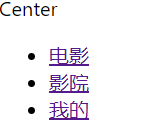
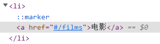
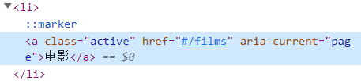
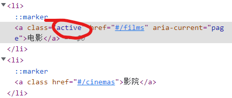
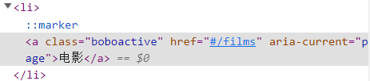
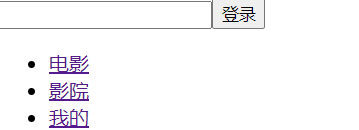

# 一、Route V5复习

## 1. 什么是路由

**路由是**根据不同的 url 地址展示不同的内容或页面。---路径映射组件

## 2. 路由使用

### 2.1 路由引入

HashRouter会自动在路径后面加#号

```react
import { HashRouter, Route } from 'react-router-dom'
import { HashRouter,BrowserRouter as Router, Route } from 'react-router-dom';
```

* 路由重定向Redirect，跳转到一个初始路径（自己指定一个初始路径）

  ```react
  <Redirect from='/' to='films' exact></Redirect>
  ```

  模糊匹配---重定向（从根路径到films），前几个都不匹配的情况下执行重定向；模糊匹配的意思是以/开头的都能匹配到。--- Router V5默认是模糊匹配

* 路由跳转选择Switch，当匹配到第一个路径后，跳出匹配。

  ```react
  <Switch>
    <Route path="/films" component={Films} ></Route>
    <Route path="/cinemas" component={Cinemas} ></Route>
    <Route path="/center" component={Center} ></Route>
  </Switch>
  ```

* 精确匹配exact，加上该属性编程精确匹配

  ```react
  <HashRouter>
    <Switch>
      <Route path="/films" component={Films} ></Route>
      <Route path="/cinemas" component={Cinemas} ></Route>
      <Route path="/center" component={Center} ></Route>
      {/* 模糊匹配 */}
      <Redirect from='/' to='films' exact></Redirect>
      {/* 当匹配不到时显示404 */}
      <Route component={NotFound}/>
    </Switch>
  </HashRouter>
  ```

### 2.2 嵌套路由

将路由写在小组件中。

```react
export default class Films extends Component {
  render() {
    return (
      <div className={style.film + " aaaa"}>
        {/* 路由配置 嵌套路由 */}
        {/* <Nowplaying/>   Switch用于匹配到就跳过此次匹配*/}
        <Switch>
          <Route path="/films/nowplaying" component={Nowplaying} />
          <Route path="/films/comingsoon" component={Comingsoon} />
          {/* 重定向 */}
          <Redirect from="/films" to="/films/nowplaying" />
        </Switch>
      </div>
    )
  }
}
```

### 2.3 路由跳转方式

原生js

```js
<a href='/index.html'>aaa</a> // 声明式----NavLink方案
location.href = '/index.html' // 编程式----history方案
```


### 2.4 路由传参


# 二、Router V6

基于不同的组件渲染不同的路径（前端开发只关注如何切换路径）

## 1. 简介

- react-router ：**核心模块**，包含 React 路由大部分的核心功能，包括路由匹配算法和大部分核心组件和钩子。
- react-router-dom：React应用中用于路由的软件包，包括react-router的所有内容，并添加了一些特定于 DOM 的 API，包括但不限于BrowserRouter、HashRouter和Link。
- react-router-native： 用于开发React Native应用，包括react-router的所有内容，并添加了一些特定于 React Native 的 API，包括但不限于NativeRouter和Link。

## 2. 与V5对比

## 3. 用法详解

### 3.1 引入

路由模式有两种`HashRouter`和`BrowserRouter`;

`HashRouter`需要添加#号

在V6中定义路由要将Route放在Routes中，根据路由进行跳转。

```react
<HashRouter>    
  <Routes>
    <Route path='/films' element={<Film />} />
    <Route path='/cinemas' element={<Cinema />} />
    <Route path='/centers' element={<Center />} />
  </Routes>
</HashRouter>
```

为避免在App根组件中定义过多的路由，可以创建一个文件专门用来放置路由，而根组件下仅对该文件进行引用。例如：
router文件夹下定义==路由配置==Mrouter组件

```react
export default function Mrouter() {
  return (
    <Routes>
      <Route path='/films' element={<Film />} />
      <Route path='/cinemas' element={<Cinema />} />
      <Route path='/centers' element={<Center />} />
    </Routes>
  )
}
```

在App根组件中引用该组件。

```react
export default function App() {
  return (
    <HashRouter>
      <Mrouter></Mrouter>
    </HashRouter>
  )
}
```

**注意**：index用于嵌套路由，仅匹配父路径时，设置渲染的组件。

解决当嵌套路由有多个子路由但本身无法确认默认渲染哪个子路由的时候，可以增加index属性来指定默认路由。index路由和其他路由不同的地方是它没有path属性，他和父路由共享同一个路径。

🦈不匹配其他子路由仅在父组件中渲染，也就是未指定子路由，就会跳转到设置的index对应的路径下。


### 3.2 重定向

1. 官方推荐方案 1: 使用 ==Navigate 组件==替代

   ```react
   <Routes>
       {/* <Route index element={<Film/>}/> */}
       <Route path="/film" element={<Film/>}/>
       <Route path="/cinema" element={<Cinema/>}/>
       <Route path="/center" element={<Center/>}/>
       <Route path="*" element={<Navigate to="/film"/>}/>
   </Routes>
   ```

2. 官方推荐方案 2: 自定义 Redirect 组件---==useNavigate==

   首先，定义一个 Redirect 组件

   ```react
   // 对于属性to的处理，有两种，直接传入props,然后使用的时候调用方法to；或者直接解构为to
   // 属性to的处理，方法一：props.to调用
   import React, { useEffect } from 'react'
   import { useNavigate } from 'react-router-dom'
   export default function Redirect(props) {
     // 采用钩子函数，自定义导航方法：方法中传了一个属性to
     const navigate = useNavigate()
     // 副作用函数
     useEffect(() => {
       // replace为true即取代之前的路径（打开新的页面）
       navigate(props.to, {replace:true})
     })
     return null
   }
   
   // 属性to的处理，方法二：解构
   export default function Redirect({to}) {
     // 采用钩子函数，自定义导航方法：方法中传了一个属性to
     const navigate = useNavigate()
     // 副作用函数
     useEffect(() => {
       // replace为true即取代之前的路径（打开新的页面）
       navigate(to, {replace:true})
       // 或者直接指定要跳转的页面
       navigate('/centers')
     })
     return null
   }
   ```

   其次，在路由组件中引用Redirect组件

   ```react
   export default function Mrouter() {
     return (
       <Routes>
         {/* 重定向方法一：引入Navigate组件 */}
         {/* <Route path='*' element={<Navigate to='/films'/>} /> */}
         {/* 自定义navigate导航函数:传了一个to属性 */}
         <Route path='*' element={<Redirect to='/centers'/>} />
       </Routes>
     )
   }
   ```

   

3. 404如何实现?

   路径不匹配时，给出404提示（当所输入的路径不对，无法匹配到相应页面时，给出404提示）--- * 表示匹配所有，就是所设定路径未找到匹配项时，跳转到`NotFound`组件下。

   ```react
   import NotFound from '../views/NotFound'
   export default function Mrouter() {
     return (
       <Routes>
         <Route path='*' element={<NotFound/>} />
       </Routes>
     )
   }
   ```

### 3.3 嵌套路由

在一个大组件中，允许部分更新；嵌套要更新的路由组件。

* 嵌套路由设置：直接写在父组件路由中，采用相对路径的写法。

* 加载嵌套的子组件到什么地方 --- 设置路由容器

* path支持相对路径，在子组件中直接定义所要嵌套的子组件

  ```react
  <Route path='/films' element={<Film />}>
    {/* 嵌套路由：直接写在要嵌套的父组件里面 */}
    <Route path='/films/nowplaying' element={<Nowplaying/>}></Route>
    {/* 写成相对路径 */}
    <Route path='comingsoon' element={<Comingsoon/>} ></Route>
  </Route>
  ```

* 采用index和`path=""`都可以跳转到一个默认路径。

路由容器


**完整代码**

首先，提前定义好子组件`Nowplaying`和`Cominsoon`

其次，采用路由嵌套的写法，在父组件路由中引入子组件路由。

```react
export default function Mrouter() {
  return (
    <Routes>
      {/* <Route index element={ <Film/> }></Route> */}
      <Route path='/films' element={<Film />}>
        {/* 嵌套路由：直接写在要嵌套的父组件里面 */}
        <Route path='nowplaying' element={<Nowplaying/>}></Route>
        <Route path='comingsoon' element={<Comingsoon/>} ></Route>
      </Route>
      <Route path='/cinemas' element={<Cinema />} />
      <Route path='/cinemas/search' element={<Search/>} />
      <Route path='/centers' element={<Center />} />
      {/* 重定向方法一：引入Navigate组件 */}
      {/* <Route path='*' element={<Navigate to='/films'/>} /> */}
      {/* 自定义navigate导航函数:传了一个to属性 */}
      <Route path='/' element={<Redirect to='/centers'/>} />
      <Route path='*' element={<NotFound/>} />
    </Routes>
  )
}
```

### 3.4 声明式导航与编程式导航

通过点击实现路径的切换。 

#### 3.4.1 原生js

```js
<a href='' > // 声明式
location.href = '' // 编程式
```


#### 3.4.2 声明式导航NavLink

**React-Router中提供了`<Link>`和`<NavLink>`组件**

功能：点击选项卡，仅组件切换，选项卡是不变的

实现：定义一个选项卡`Tabbar`组件和路由配置组件同一级。在`Tabbar`组件中定义声明式导航组件。

```react
import React from 'react'
import { Link } from 'react-router-dom'
export default function Taabbar() {
  return (
    <footer>
      <ul>
        <li><Link to='/films'>电影</Link></li>
        <li><Link to='cinemas'>影院</Link></li>
        <li><Link to='centers'>我的</Link></li>
      </ul>
    </footer>
  )
}
```



* 采用`Link`组件渲染的组件仍然是一个`<a>`链接



**问题**：采用`<Link>`组件时，如果想让所定义内容高亮，比较麻烦，这时就需要`<NavLink>`组件。

默认点击就会高亮显示

```react
import { Link, NavLink } from 'react-router-dom'
export default function Taabbar() {
  return (
    <footer>
      <ul>
        <li><NavLink to='/films'>电影</NavLink></li>
        <li><NavLink to='cinemas'>影院</NavLink></li>
        <li><NavLink to='centers'>我的</NavLink></li>
      </ul>
    </footer>
  )
}
```


* 采用`<NavLink>`形成的也是一个a链接，并且带一个`active`高亮样式

  

可以通过设置css样式，来实现对某个元素的默认高亮显示

```css
.active{
  color: red;
}
```

**问题**：但是默认设置样式后，每一个元素的样式名默认都是`active`，无法识别是哪一个内容高亮显示。--- 🦈在谷歌浏览器发现不存在该问题，点击的内容会设置为`active`，其他不设置`active`。---🦈在单页面应用中，影响定义的其他样式active？？？




**手动解决方法⭐好玩：**

`<NavLink>`组件可以指定class样式名称。

定义className给`NavLink`传属性。

`className`属性接收一个回调函数，通过设置回调函数来定义`<NavLink>`所对应的样式名称。

设置自定义样式

```css
.boboactive{
  color: red;
}
```

设置`className`属性

```react
import React from 'react'
import { Link, NavLink } from 'react-router-dom'
import './Tabbar.css'
export default function Taabbar() {
  return (
    <footer>
      <ul>
        <li><NavLink to='/films'className={({isActive}) => isActive ? 'boboactive' : ''} >电影</NavLink></li>
        <li><NavLink to='/cinemas' className={({isActive}) => isActive ? 'boboactive' : ''}>影院</NavLink></li>
        <li><NavLink to='/centers' className={({isActive}) => isActive ? 'boboactive' : ''}>我的</NavLink></li>
      </ul>
    </footer>
  )
}

```



#### 3.4.3 编程式导航

需求：从列表跳转到详情

* 定义一个处理函数，到点击列表的一项时，可以跳转到详情页面Detail
  方法：设置navgidate重定向到指定页面
  将参数传给`<Detail>`组件，`<Detail>`获取该参数。

* 传参方式：

  query(URLSearch)传参  比如  `/detail?id=1000`

  路由传参	`/detail/1000`

* **query传参**
  定义点击事件，点击时调用事件处理函数，并传入id参数，处理函数接收到参数，传给`navgate`，跳转到指定页面并把参数传过去。

```react
  const navigate = useNavigate() // 重定向
  // 处理函数
  const handleChangePage = (id) => {
    // 跳转页面
    // query传参
    navigate(`/detail?id=${id}`)
  }

  return (
    <div>
      <ul>
        {
          list.map(item => 
            <li key={item.filmId} onClick={()=>handleChangePage(item.filmId)}> {item.name} </li>  
          )
        }
      </ul>
    </div>
  )
```

  接收参数（跳转的新页面接收参数）

  采用`useSearchParams`钩子函数；第一个参数是接收传过来的内容对象，第二个参数是设置新的id，比如电商购物网站”猜你喜欢“，给定你一个新的数据，即刷新同类别。

  ```react
  import React from 'react'
  import { useSearchParams } from 'react-router-dom'
  export default function Detail() {
    // query传参---采用searchParams获取
    // 采用useSearchParams钩子函数来获取参数
    const [searchParams, setSearchParams] = useSearchParams()
    //console.log(searchParams);// 直接输出是一个URLSearchParams {}对象
    // 获取参数
    searchParams.get('id')
    console.log(searchParams.get('id'));
    // 判断参数是否存在
    searchParams.has('id')
    // 同时页面内也可以用set方法来改变路由
    return (
      <div>
        Detail
        <button onClick={()=>{
          setSearchParams({id:25252})
        }}>推荐：猜你喜欢</button>
      </div>
    )
  }
  ```

  

* **路由传参**

  ```react
  const navigate = useNavigate() // 重定向
  // 处理函数
  const handleChangePage = (id) => {
    // 跳转页面
    // query传参
    // navigate(`/detail?id=${id}`)
    // 路由传参 /detail/1000
    navigate(`/detail/${id}`)
  }
  ```

  ==存在问题==：

  无法正常跳转，因为生成id后，没有对应的页面。解决方法就是设置动态路由

  

  设置动态路由

  ```react
  export default function Mrouter() {
    return (
      <Routes>
        {/* <Route path='/detail' element={<Detail/>} /> */}
  
        {/* 动态路由 :占位符  myid随机的 */}
        <Route path='/detail:myid' element={<Detail/>} />
      </Routes>
    )
  }
  ```

  获取参数

  采用==useParams==钩子函数 --- 前面定义路由处指定了占位符。

  ```react
  // 获取动态路由的参数
  import React from 'react'
  import { useNavigate, useParams } from 'react-router-dom'
  export default function Detail() {
    const params = useParams()
    // 这里想指定指定一个id没有useSearchParams()钩子函数方便
    const navigate = useNavigate()
    console.log(params.myid);
    return (
      <div>
        detail-<button onClick={()=>{
          navigate('/detail/52525')
        }}>猜你喜欢（指定一个id）</button>
      </div>
    )
  }
  ```

  采用解构方法对钩子函数解构更加方便

  ```react
  //跳转页面,路由传参
  navigate(`/detail/${id}`)
  
  //配置动态路由
  <Route path="/detail/:id" element={<Detail/>}/>
      
  //获取动态路由参数---直接解构
  const {id} = useParams()
  ```

### 3.5 路由拦截

需求：未登录时，点击我的页面中的内容会跳转到登录页面 --- 🦈个人网站中可以直接跳转到后台管理😁

* 可以通过绑定单击响应事件进行跳转（需要单独为每一个进行处理）
* 可以通过路由跳转实现（放在路由环节）--- 路由跳转前的拦截

简单实现：点击我的，先判断是否登录过，未登录则跳转登录页面。

采用三目运算符判断，进行路由拦截

```react
import React from 'react'
import { Navigate, Route, Routes } from 'react-router-dom' // 引入路由
import Film from '../views/Film'
import Detail from '../views/Detail'
import Login from '../views/Login'
export default function Mrouter() {
  return (
    <Routes>  
      {/* 写成三目运算符进行路由拦截 */}
      <Route path='/centers' element={isAuth() ? <Center /> : <Redirect to='/login'/>} />
      <Route path='/login' element={<Login/>}/>
    </Routes>
  )
}
// 路由拦截，定义一个方法判断
function isAuth(){
  return localStorage.getItem('token')
}
```



**问题**：上面的代码会存在问题，当带年纪登录后，仅记录了token值，但是无法跳转

如果登录了，则跳转到Center组件 --- 但是第一次仅记录了数据，改为true表已登录，不能跳转到新的页面，因为不会再次渲染，所以需要将三目运算封装到一个组件中，每次到Center组件都会重新渲染一次。--- 🦈封装了组件就会再一次判断

**解决**：将三目运算符进行封装

路由

```react
import React from 'react'
import { Navigate, Route, Routes } from 'react-router-dom' // 引入路由
import Center from '../views/Center'
import Detail from '../views/Detail'
import Login from '../views/Login'

export default function Mrouter() {
  return (
    <Routes> 
      {/* 写成三目运算符进行路由拦截 */}
      <Route path='/centers' element={ <AuthComponent>
        <Center></Center>
      </AuthComponent> } />
      <Route path='/login' element={<Login/>}/>
    </Routes>
  )
}
// 封装为一个组件     插槽props.children-----直接解构为children
function AuthComponent({children}) {
  const isLogin = localStorage.getItem('token')
  return isLogin?children:<Redirect to='/login'/>
}
```

登录

```react
import React from 'react'
import { useNavigate } from 'react-router-dom'

// 需要获取input内容，并将发送到后台验证
export default function Login() {
  const navigate = useNavigate()
  return (
    <div>
      <input type="text" />
      <button onClick={()=>{
        localStorage.setItem('token','bobobbob')
        // 成功
        navigate('/centers')
      }}>登录</button>
    </div>
  )
}
```

### 3.6 路由模式

```react
import {HashRouter} from 'react-router-dom'// 多个#号
import {BrowserRouter} from 'react-router-dom'//
```

两者区别：

`BrowserRouter`每次刷新会向后端请求对应的接口，没有则返回404页面；react中已经配置好，当后端没有接口会fallback到前端处理。

`HashRouter`直接交给前端处理

### 3.7 withRouter / 类组件跳转方法

需求：film组件下又有公共组件，可以把渲染li转成渲染组件


可以提取，并封装为一个单独的组件进行渲染。--- withRoute  在这里没用，navigate组件可以在任何一个地方使用。

**在函数式组件中**

然后，点击渲染的内容可以跳转到Detail页面，直接用useNavigate钩子函数就可以。

```react
import React from 'react'
import { useNavigate } from 'react-router-dom'
export default function FilmItem(item) {
  const navigate = useNavigate() // 重定向
  // 处理函数
  const handleChangePage = (id) => {
    // 跳转页面
    // query传参
    // navigate(`/detail?id=${id}`)
    // 路由传参 /detail/1000
    navigate(`/detail/${id}`)
  }
  return (
    <li onClick={()=>handleChangePage(item.filmId)}>
      {item.name}
    </li>
  )
}
```

其父组件，直接渲染所定义的子组件

```react
  return (
    <div>
      <ul>
        {
          list.map(item => 
             <FilmItem key={item.filmId} {...item}></FilmItem>
          )
        }
      </ul>
    </div>
  )
```

**类组件中**

与函数式组件中，所提取的组件在跳转页面时，因为没用了withRouter无法实现跳转。

解决方法：自己封装withRouter组件

```react
// 用到再看吧
```

### 3.8 路由懒加载（性能）

==**解决首屏加载过慢**==

问题：单页面应用，所有组件都会加载出来。路由过多导致首页加载过慢。

解决方法：按需路由懒加载   ----  实现按需加载，只在第一次加载，之后再次访问也不用加载了。

基于react改造的；	React.lazy()   React.Suspense()

代码流程：

1. 在React.Suspense()中定义加载时要显示的内容，

2. 然后将React.lazy()所定义的组件，包在React.Suspense()中，作为插槽插进去

3. lazy中导入写成回调函数的形式，用到的时候再加载而不是直接加载

   ==注意：==

   * 实践中，组件较多，没必要一个个去写，直接封装成一个函数，将所有组件包起来
   * 重定向不用懒加载

```react
import React from 'react'
export default function Mrouter() {
  return (
    <Routes>
      <Route path='/cinemas' element={LazyLoad('Cinema')} />
      <Route path='/cinemas/search' element={<Search/>} />
    </Routes>
  )
}
// 路由拦截
// 封装为一个组件     插槽props.children-----直接解构为children
function AuthComponent({children}) {
  const isLogin = localStorage.getItem('token')
  return isLogin?children:<Redirect to='/login'/>
}

// 定义一个路由懒加载函数---传入要实现懒加载的组件
const LazyLoad = (path) => {
  const Comp = React.lazy(() => import(`../views/${path}`))
  return (
    <React.Suspense fallback={<>...懒加载</>}>
      <Comp/>
    </React.Suspense>
  )
}
```

先显示所定义的提示页面，然后等待加载完毕再显示渲染页面；只有第一次会等待加载，之后再次访问不会重新加载。——为什么？

### 3.9 useRoutes钩子配置路由

定义配置式的路由，自动生成路由解构的形式。

==useRoutes钩子函数==根据传入的数组结构生成组件结构。

路由定义的另一种书写方式

```react
import React from 'react'
import { useRoutes } from 'react-router-dom' // 引入路由
import Redirect from '../components/Redirect' // 自己定义的重定向组件

export default function Mrouter() {
  const element = useRoutes([
    {
      path: '/films',
      element: LazyLoad('Film'),
      children: [
        {
          path: '',
          element: <Redirect to='/films/nowplaying' />
        },
        {
          path: 'nowplaying',
          element: LazyLoad('films/Nowplaying')
        },
        {
          path: 'comingsoon',
          element: LazyLoad('films/Comingsoon')
        },
      ]
    },
    {
      path: '/cinemas',
      element: LazyLoad('Cinema')
    },
    {
      path: '/login',
      element: LazyLoad('Login')
    },
    {
      path: '/centers',
      element:<AuthComponent>
                {LazyLoad('Center')}
              </AuthComponent>
    },
    {
      path:'/detail/:myid',
      element:LazyLoad('Detail')
    },
    {
      path:'/',
      element:<Redirect to='/films'/>
    },
    {
      path:'*',
      element:LazyLoad('NotFound')
    }
  ])
  return (
    element
  )
}
// 路由拦截封装为一个组件     插槽props.children-----直接解构为children
function AuthComponent({ children }) {
  const isLogin = localStorage.getItem('token')
  return isLogin ? children : <Redirect to='/login' />
}

// 定义一个路由懒加载函数---传入要实现懒加载的组件
const LazyLoad = (path) => {
  const Comp = React.lazy(() => import(`../views/${path}`))
  return (
    <React.Suspense fallback={<>...懒加载</>}>
      <Comp />
    </React.Suspense>
  )
}
```


* 传过去的参数可以自己命名，不一定非要定位props


