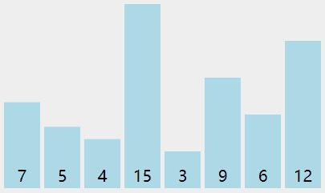
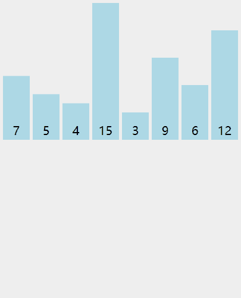
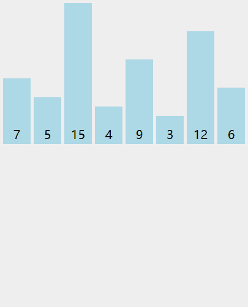
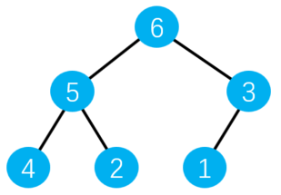
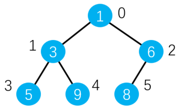
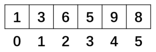

# 排序算法

## 1、冒泡排序

### 1. 思路

以**升序**排序为例：

1. 依次比较所有相邻元素，如果第一个比第二个大，则交换他们
2. 一轮下来可以保证最后一个数是最大的
3. 执行`n-1`轮就可以完成排序

**升序冒泡排序**动画演示如图所示：



**时间复杂度**：O(n^2)

### 2. 实现

现有数组`[7, 5, 4, 15, 3, 9, 6, 12]`，进行升序排序：
j<a.length-i-1 每轮则是与未冒出来的数据进行比较，冒出来的数不在进行比较。

```js
// 🦈思路：每次拿出一个数进行冒泡比较，如果当前元素大于后面的则交换
Array.prototype.bubbleSort = function () {
  // 重复(元素个数-1)次
  for (let i = 0; i < this.length - 1; i++) {
    // 从0开始遍历还没有排序过的元素
    for (let j = 0; j < this.length - 1 - i; j++) {
      // 如果当前元素比下一个大
      if (this[j] > this[j + 1]) {
        // 交换他们的位置
        let temp = this[j];
        this[j] = this[j + 1];
        this[j + 1] = temp;
      }
    }
  }
};

const arr = [7, 5, 4, 15, 3, 9, 6, 12];
arr.bubbleSort();
console.log(arr); // (8) [3, 4, 5, 6, 7, 9, 12, 15]
```

## 2、选择排序

### 1. 思路

以**升序**排序为例：

1. 找到数组中的最小值，将其放置在数组第一位
2. 找到数组中第二小的值，将其放置在数组第二位
3. 以此类推，执行`n-1`轮就可以完成排序

**升序选择排序**动画演示如图所示：


**时间复杂度**：O(n^2)

### 2. 实现

现有数组`[7, 5, 4, 15, 3, 9, 6, 12]`，进行升序排序：

```js
// 思路：每次循环拿遍历的（前面的）元素和后面每一个未排序过的元素进行比较，当发现更小的值时记录，遍历结束后将最小值与前面未排序过的元素进行交换
Array.prototype.selectionSort = function () {
  // 重复(元素个数-1)次
  for (let i = 0; i < this.length - 1; i++) {
    // 把第一个没有排序过的元素设置为最小值
    let indexMin = i;
    // 遍历每个没有排序过的元素
    for (let j = i; j < this.length; j++) {
      // 如果遍历时出现元素小于现在的最小值
      if (this[j] < this[indexMin]) {
        // 将此元素设置为新的最小值
        indexMin = j;
      }
    }
    // 遍历结束后，将最小值和第一个没有排序过的位置交换
    // 如果找到了更小的值，则交换( i 在前 minIndex 在后)
    if (indexMin !== i) {
      let temp = this[i];
      this[i] = this[indexMin];
      this[indexMin] = temp;
    }
  }
};

const arr = [7, 5, 4, 15, 3, 9, 6, 12];
arr.selectionSort();
console.log(arr); // (8) [3, 4, 5, 6, 7, 9, 12, 15]
```

## 3、插入排序

### 1. 思路

以**升序**排序为例：

1. 从第二个数开始往前比较
2. 比前面的数小就继续往前比较
3. 在合适的位置插入该元素
4. 第三个数开始往前比较
5. 以此类推，进行到最后一个数

**升序插入排序**动画演示如图所示：



**时间复杂度**：O(n^2)

### 2. 实现

现有数组`[7, 5, 4, 15, 3, 9, 6, 12]`，进行升序排序：

```js
// 从前往后遍历，遍历到的元素和前面的元素进行比较，比该元素大就往后放
Array.prototype.insertionSort = function () {
  // 第一个数默认已经排序
  // 从第二个数开始，遍历没有排序过的数
  for (let i = 1; i < this.length; i++) {
    // 提取当前遍历的元素
    // 🦈待插入元素（也是用来比较的元素）
    const temp = this[i];
    // 从当前元素位置往前比较
    let j = i;
    while (j > 0) {
      // 如果前一个数比提取的数
      // 🦈当前面的元素大就继续往前查找
      if (this[j - 1] > temp) {
        // 将前一个数后移
        this[j] = this[j - 1];
      } else {
        // 否则退出循环
        break;
      }
      // 每比较一次，往前进一位
      j--;
    }
    // 遍历完成后，将提取的数插入
    // 🦈当退出循环就查找到插入位置
    this[j] = temp;
  }
};

const arr = [7, 5, 4, 15, 3, 9, 6, 12];
arr.insertionSort();
console.log(arr); // (8) [3, 4, 5, 6, 7, 9, 12, 15]
```

## 4、归并排序

### 1. 思路

以**升序**排序为例：

1. 归

   把数组分成两半，再递归地对子数组进行“分”操作，直到分成**一个个单独的数**

2. 并

   把两个数**合并**为**有序数组**，再对有序数组进行合并，直到全部子数组合并为**一个完整数组**

**合并有序数组的操作：**

1. 新建一个空数组`res`，用于存放最终排序后的数组
2. 比较连个有序数组的头部，较小者出队并推入`res`中
3. 如果两个数组还有值，重复第二步

**升序归并排序**动画演示如图所示：



**时间复杂度**：O(nlogn)

### 2. 实现

现有数组`7, 5, 15, 4, 9, 3, 12, 6]`，进行升序排序：

```js
Array.prototype.mergeSort = function () {
  const rec = (arr) => {
    // 若数组长度为一，直接返回该数
    if (arr.length === 1) return arr;
    // slice()：左闭右开，不会改变原数组
    const mid = Math.floor(arr.length / 2);
    // 左侧数组
    const left = arr.slice(0, mid);
    // 右侧数组
    const right = arr.slice(mid, arr.length);
    // 左侧有序数组
    const orderLeft = rec(left);
    // 右侧有序数组
    const orderRight = rec(right);
    const res = [];
    while (orderLeft.length || orderRight.length) {
      // 若两个数组都有值，则头部较小者推入res中
      if (orderLeft.length && orderRight.length) {
        res.push(
          orderLeft[0] < orderRight[0] ? orderLeft.shift() : orderRight.shift()
        );
      } else if (orderLeft.length) {
        // 右侧数组空，左侧数组头部推入res
        res.push(orderLeft.shift());
      } else if (orderRight.length) {
        // 左侧数组空，右侧数组头部推入res
        res.push(orderRight.shift());
      }
    }
    return res;
  };
  const res = rec(this);
  // 将res拷贝到this
  res.forEach((item, index) => {
    this[index] = item;
  });
};

const arr = [7, 5, 15, 4, 9, 3, 12, 6];
arr.mergeSort();
console.log(arr);
```

## 5、快速排序

### 1. 思路

以**升序**排序为例：

1. 分区
   - 从数组中任意选择一个元素作为`基准`，所有比`基准`小的元素放在`基准`前面，比`基准`大的元素放在`基准`后面。
2. 递归
   - 递归地对`基准`前后的子数组进行**分区操作**

**升序快速排序**动画演示如图所示：


**时间复杂度**：O(nlogN)

### 2. 实现

现有数组`[7, 5, 4, 15, 3, 9, 6, 12]`，进行升序排序：

```js
Array.prototype.quickSort = function () {
  const rec = (arr) => {
    if (arr.length <= 1) {
      return arr;
    }
    const left = [];
    const right = [];
    // 选择基准为数组第一个元素
    const mid = arr[0];
    // 从第二个元素开始遍历数组
    for (let i = 1; i < arr.length; i++) {
      if (arr[i] < mid) {
        // 比基准小，放到左数组
        left.push(arr[i]);
      } else {
        // 比基准大，放到右数组
        right.push(arr[i]);
      }
    }
    // 返回连接好的数组
    return [...rec(left), mid, ...rec(right)];
  };
  const res = rec(this);
  // 将res拷贝到this  ⭐已排序完毕，这里是将排序好的数组再赋值给元数组返回
  res.forEach((item, index) => {
    this[index] = item;
  });
};

const arr = [7, 5, 4, 15, 3, 9, 6, 12];
arr.quickSort();
console.log(arr); // (8) [3, 4, 5, 6, 7, 9, 12, 15]
```

## 6、堆排序
1. 概念
    堆是一种特殊的完全二叉树。

  它的所有节点都大于等于或小于等于它的子节点。

  - 最大堆：所有节点都大于等于它的子节点

    

  - 最小堆：所有节点都小于等于它的子节点

    

2. 实现

  JavaScript 中通常用数组表示堆，如下图堆，可用数组表示：

  

  

  即按照广度优先遍历的顺序依次填入到数组中。

  另外，节点位置与数组的下标index有如下关系：

  任意节点的==左侧子节点==（若存在）的位置：2 × index + 1
  任意节点的==右侧子节点==（若存在）的位置：2 × index + 2
  任意节点的==父节点==的位置：( index - 1 ) / 2（商）

3. 最大堆类

```js
// 创建最大堆（JS中用数组表示堆，按广度优先把树节点加入到数组中）
// 堆中含有方法：插入、删除堆顶、获取堆顶、获取堆的大小（辅助：交换节点位置、获取父节点、获取左右节点、上移下移）
class MxaHeap {
    constructor () {
        this.heap = []; // 声明数组，存储元素
    }
    // 交换节点位置
    swap(i1, i2){
        // [this.heap[i1], this.heap[i2]] = [this.heap[i2], this.heap[i1]] // 写法一
        // 写法二：
        let temp = this.heap[i1];
        this.heap[i1] = this.heap[i2];
        this.heap[i2] = temp;
    }
    // 获取父节点 和 左右节点位置 (索引值)
    getParentIndex(i) {
        return Math.floor((i-1) / 2);
    }
    getLeftIndex(i) {
        return 2 * i + 1;
    }
    getRightIndex(i) {
        return 2 * i + 2;
    }

    // 上移 （该节点是子节点且大于父节点则上移）
    shiftUp(index) {
        if(index === 0) return;
        const parentIndex = this.getParentIndex(index);
        if(this.heap[parentIndex] < this.heap[index]){
            this.swap(parentIndex, index);
            this.shiftUp(parentIndex);
        }
    }

    // 下移（该节点是父节点且小于左 || && 右节点则下移）
    shiftDown(index) {
        const leftIndex = this.getLeftIndex(index);
        const rightIndex = this.getRightIndex(index);
        if(this.heap[index] < this.heap[leftIndex]){
            this.swap(index, leftIndex)
            this.shiftDown(leftIndex)
        }
        if(this.heap[index] < this.heap[rightIndex]){
            this.swap(index, rightIndex)
            this.shiftDown(rightIndex)
        }
    }

    // 插入 时间复杂度O(logk)，k为堆大小（插入一个元素，然后不断上移到适合位置）
    insert(value) {
        this.heap.push(value);
        this.shiftUp(this.heap.length - 1);
    }

    // 删除堆顶（思路：将heap数组的最后一个元素，弹出覆盖堆顶元素）
    pop() {
        this.heap[0] = this.heap.pop();
        // 对堆顶重新排序
        this.shiftDown(0)
    }

    // 获取堆顶
    peek() {
        return this.heap[0]
    }

    // 获取堆的大小
    size() {
        return this.heap.length;
    }

}
```


2. 最小堆类
    在类里，声明一个数组，用来装元素
    主要方法：插入、删除堆顶、获取堆顶、获取堆大小

```js
// 最小堆类
class MinHeap {
    constructor() {
        this.heap = [];
    }
    // 交换节点位置
    swap(i1, i2) {
        const temp = this.heap[i1];
        this.heap[i1] = this.heap[i2];
        this.heap[i2] = temp;
    }
    // 获得父节点
    getParentIndex(i) {
        return Math.floor((i - 1) / 2);
    }
    // 获得左节点
    getleftIndex(i) {
        return 2 * i + 1;
    }
    // 获得右节点
    getrightIndex(i) {
        return 2 * i + 2;
    }
    // 上移
    shiftUp(index) {
        if (index === 0) {
            return;
        }
        const parentIndex = this.getParentIndex(index);
        if (this.heap[parentIndex] > this.heap[index]) {
            this.swap(parentIndex, index);
            this.shiftUp(parentIndex);
        }
    }
    // 下移
    shiftDown(index) {
        const leftIndex = this.getleftIndex(index);
        const rightIndex = this.getrightIndex(index);
        if (this.heap[leftIndex] < this.heap[index]) {
            this.swap(leftIndex, index);
            this.shiftDown(leftIndex);
        }
        if (this.heap[rightIndex] < this.heap[index]) {
            this.swap(rightIndex, index);
            this.shiftDown(rightIndex);
        }
    }
    // 插入 时间复杂度O(logk)，k为堆大小
    insert(value) {
        this.heap.push(value);
        this.shiftUp(this.heap.length - 1);
    }
    // 删除堆顶
    pop() {
        // pop()方法删除数组最后一个元素并返回，赋值给堆顶
        this.heap[0] = this.heap.pop();
        // 对堆顶重新排序
        this.shiftDown(0);
    }
    // 获取堆顶
    peek() {
        return this.heap[0];
    }
    // 获取堆的大小
    size() {
        return this.heap.length;
    }
}
```


