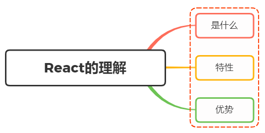
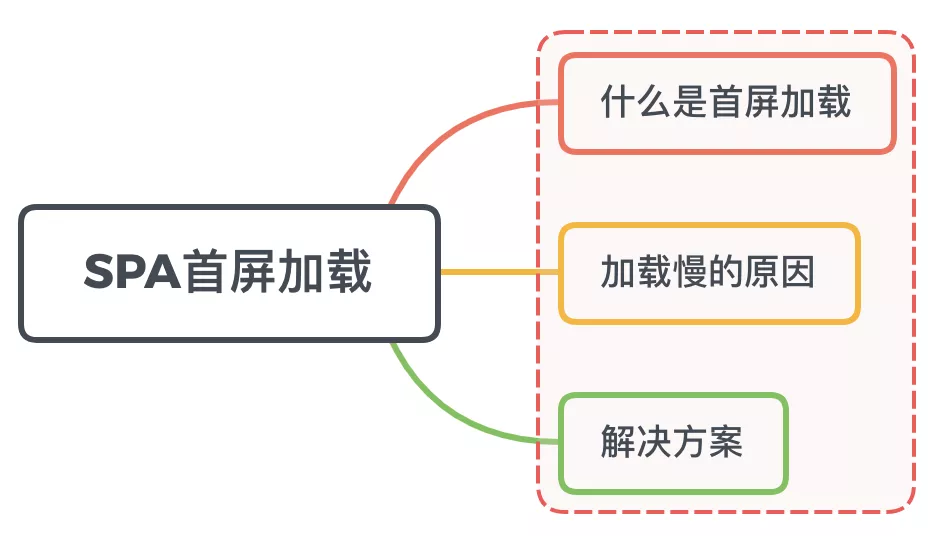

# 面试官系列

### 问题1：说说对 React 的理解？有哪些特性？



**一、是什么**

React，用于构建用户界面的 JavaScript 库，只提供了 UI 层面的解决方案

遵循组件设计模式、声明式编程范式和函数式编程概念，以使前端应用程序更高效

使用虚拟 `DOM` 来有效地操作 `DOM`，遵循从高阶组件到低阶组件的单向数据流

帮助我们将界面成了各个独立的小块，每一个块就是组件，这些组件之间可以组合、嵌套，构成整体页面

`react` 类组件使用一个名为 `render()` 的方法或者函数组件`return`，接收输入的数据并返回需要展示的内容

```jsx
class HelloMessage extends React.Component {
  render() {
    return <div>Hello {this.props.name}</div>;
  }
}

ReactDOM.render(
  <HelloMessage name="Taylor" />,
  document.getElementById("hello-example")
);
```

上述这种类似 `XML` 形式就是 `JSX`，最终会被 `babel` 编译为合法的 `JS` 语句调用

被传入的数据可在组件中通过 `this.props` 在 `render()` 访问

**二、特性**

`React` 特性有很多，如：

- JSX 语法
- 单向数据绑定
- 虚拟 DOM
- 声明式编程
- Component

着重介绍下声明式编程及 Component

**声明式编程**

声明式编程是一种编程范式，它关注的是你要做什么，而不是如何做

它表达逻辑而不显式地定义步骤。这意味着我们需要根据逻辑的计算来声明要显示的组件

如实现一个标记的地图：

通过命令式创建地图、创建标记、以及在地图上添加的标记的步骤如下：

```js
// 创建地图
const map = new Map.map(document.getElementById("map"), {
  zoom: 4,
  center: { lat, lng },
});

// 创建标记
const marker = new Map.marker({
  position: { lat, lng },
  title: "Hello Marker",
});

// 地图上添加标记
marker.setMap(map);
```

而用 `React` 实现上述功能则如下：

```jsx
<Map zoom={4} center={(lat, lng)}>
  <Marker position={(lat, lng)} title={"Hello Marker"} />
</Map>
```

声明式编程方式使得 `React` 组件很容易使用，最终的代码简单易于维护

**Component**

在 `React` 中，一切皆为组件。通常将应用程序的整个逻辑分解为小的单个部分。 我们将每个单独的部分称为组件

组件可以是一个函数或者是一个类，接受数据输入，处理它并返回在 `UI` 中呈现的 `React` 元素

函数式组件如下：

```jsx
const Header = () => {
  return (
    <Jumbotron style={{ backgroundColor: "orange" }}>
      <h1>TODO App</h1>
    </Jumbotron>
  );
};
```

类组件（有状态组件）如下：

```jsx
class Dashboard extends React.Component {
  constructor(props) {
    super(props);

    this.state = {};
  }
  render() {
    return (
      <div className="dashboard">
        <ToDoForm />
        <ToDolist />
      </div>
   );
  }
}
```

一个组件该有的特点如下：

- 可组合：每个组件易于和其它组件一起使用，或者嵌套在另一个组件内部
- 可重用：每个组件都是具有独立功能的，它可以被使用在多个 UI 场景
- 可维护：每个小的组件仅仅包含自身的逻辑，更容易被理解和维护

**三、优势**

通过上面的初步了解，可以感受到 `React` 存在的优势：

- 高效灵活
- 声明式的设计，简单使用
- 组件式开发，提高代码复用率


### 问题2： 说说 Real DOM 和 Virtual DOM 的区别？优缺点？

**区别**

两者的区别如下：

- 虚拟 DOM 不会进行排版与重绘操作，而真实 DOM 会频繁重排与重绘
- 虚拟 DOM 的总损耗是“虚拟 DOM 增删改+真实 DOM 差异增删改+排版与重绘”，真实 DOM 的总损耗是“真实 DOM 完全增删改+排版与重绘”

**优缺点**

真实 `DOM` 的优势：

- 易用

缺点：

- 效率低，解析速度慢，内存占用量过高
- 性能差：频繁操作真实 DOM，易于导致重绘与回流

使用虚拟 `DOM` 的优势如下：

- 简单方便：如果使用手动操作真实 `DOM` 来完成页面，繁琐又容易出错，在大规模应用下维护起来也很困难
- 性能方面：使用 Virtual DOM，能够有效避免真实 DOM 数频繁更新，减少多次引起重绘与回流，提高性能
- 跨平台：React 借助虚拟 DOM，带来了跨平台的能力，一套代码多端运行

缺点：

- 在一些性能要求极高的应用中虚拟 DOM 无法进行针对性的极致优化
- 首次渲染大量 DOM 时，由于多了一层虚拟 DOM 的计算，速度比正常稍慢

### 问题3：生命周期

只有class组件才有生命周期，函数组件没有，在函数组件中类似的功能是副作用函数，相当于是class组件中`componentDidMount`，`componentDidUpdate` 和 `componentWillUnmount` 这三个函数的组合。
useEffect() 副作用函数；异步执行
默认情况下，它在第一次渲染之后和每次更新之后都会执行；

useLayoutEffect
所有的 DOM 变更之后同步调用 effect

### 问题4：SPA首屏加载速度慢的怎么解决？



**一、什么是首屏加载**

首屏时间（First Contentful Paint），指的是浏览器从响应用户输入网址地址，到首屏内容渲染完成的时间，此时整个网页不一定要全部渲染完成，但需要展示当前视窗需要的内容

首屏加载可以说是用户体验中**最重要**的环节

**首屏时间**

可以简单的理解为白屏时间+第一次渲染的用时;

浏览器提供的两个API：`MutationObserver`、`performance` 。

mutationObserver

`MutationObserver` 给我们提供了监听页面DOM树变化的能力;

```js
// 注册监听函数
const observer = new MutationObserver((mutations) => {
  console.log('时间：', performance.now(),'ms', '，DOM树发生变化啦！增加了这些节点:');
  for (let i = 0; i < mutations.length; i++) {
    console.log(mutations[0].addedNodes);
  }
})
// 开始监听document的节点变化
observer.observe(document, {
  childList: true,
  subtree: true
});
```

performance
`performance` 目前的兼容性虽然没有 MutationObserver 那么好，不过主流浏览器也基本已经支持。

可以通过浏览器提供的 `performance` 接口查询到当前页面的资源加载情况


**二、解决方案**

- 减小入口文件体积

  路由懒加载

- 静态资源本地缓存

  后端返回资源问题：

  - 采用`HTTP`缓存，设置`Cache-Control`，`Last-Modified`，`Etag`等响应头
  - 采用`Service Worker`离线缓存

  前端合理利用`localStorage`

- 图片资源的压缩

  将图片格式换成webP、压缩图片，减轻`http`请求的压力。

- 开启GZip压缩

- 使用SSR

  SSR（Server side ），也就是服务端渲染，组件或页面通过服务器生成html字符串，再发送到浏览器

  从头搭建一个服务端渲染是很复杂的


重排？重绘？