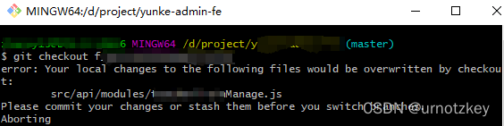
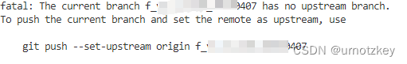

### git常用操作

1、从master仓库拉取

```
git clone 地址
```

2、查看所有分支

```
git branch -a
```

3、切换到目标分支

```
git checkout 某分支名
```

报错1 ：



解决方法（亲测有效）：

```
git stash #封存修改

/* 你想进行的其他操作 */

git stash pop #把修改还原
```

4、拉取目标分支更新内容

```
git fetch origin 某分支名
```

5、提交代码

①查看本地操作（添加、修改、删除）了的文件

```
git status
```

②从远程拉取最新修改

```
git pull
```

③将本地改动了的文件添加到暂存区

```
git add 文件路径（上面status里查到的）
```
④添加评论

```
git commit -m "说明内容"
```
⑤将暂存区的文件提交到远程分支上

```
git push
git push origin 分支名
```
6、git push时若远端没有你的分支，则会报错
错误：



解决办法：
```
git push --set-upstream origin 你的分支名 
git push -u origin 你的分支名 // 自动创建该分支并与本地分支进行关联
```
7、新建本地分支
```
git checkout -b 新分支名
```
把新分支推送到远端
```
git push origin 新分支名
```
将本地分支与远端分支进行关联
```
git branch --set-upstream-to=origin/新分支名
```
8、合并master分支到自己的本地分支

```js
git checkout master //切换本地分支为master
git pull  //拉取master最新代码
git checkout 你的分支名  //切换到自己的分支
git merge master  //合并master到自己的分支
git push //提交merge合并后的分支
```


9、回退版本
方式一：reset，回退之后后面的版本就找不到了
```
git log //查看提交记录，获取到版本号
git reset --hard 目标版本号 //回退到指定版本
git push -f //强制提交
```
方式二：revert，回退之后后面的版本就找不到了
```
git log //查看提交记录，获取到版本号
git revert -n 目标版本号 //回退到指定版本
git commit -m xxxx //提交
git push //推送到远程
```

