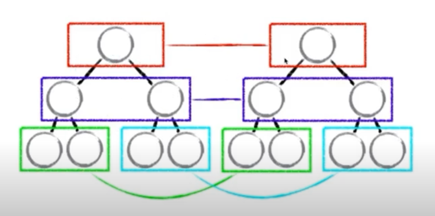
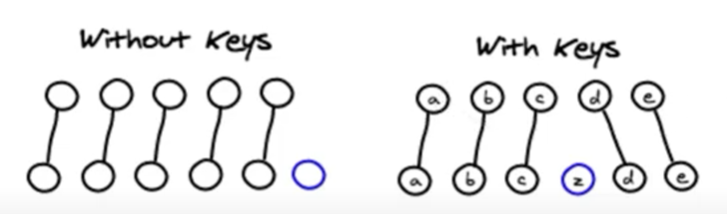
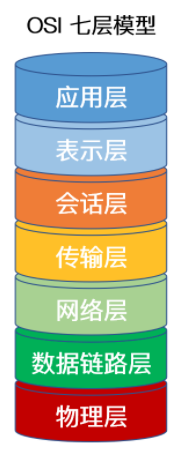
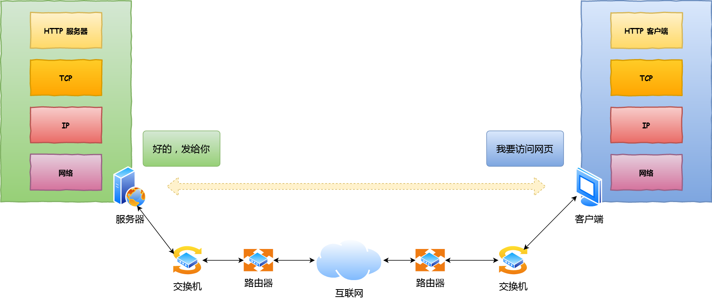
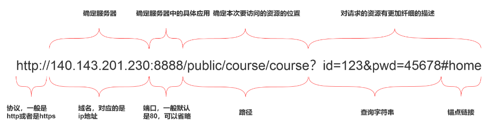
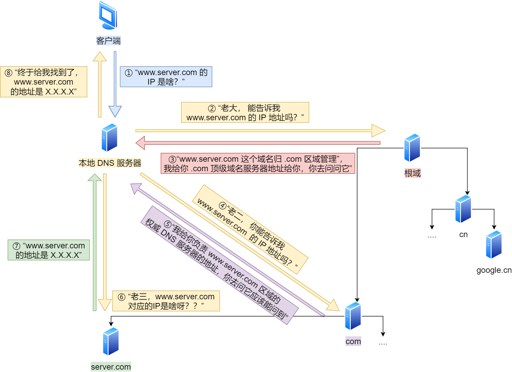

# 常考题目

## HTML篇

## CSS篇

## JS篇

## React篇

- **1. 说说React diff的原理是什么？**

  - **虚拟DOM**（==面试：虚拟DOM是什么？==）

    react底层简单实现：

    方案一：

    1. state 数据
    2. JSX 模板
    3. 数据 + 模板 结合，生成真实的DOM，来显示
    4. state 数据发生改变
    5. 数据 + 模板 结合，生成真实的DOM，替换原始的DOM（耗性能）

    缺陷：

    第一次生成了一个完整的DOM片段

    第一次生成了一个完整的DOM片段

    第二次的DOM替换第一次的DOM，非常耗性能

    

    方案二：

    改进

    1. state 数据
    2. JSX 模板
    3. 数据 + 模板 结合，生成真实的DOM，来显示
    4. state 数据发生改变
    5. 数据 + 模板 结合，生成真实的DOM，并不直接替换原始的DOM
    6. 新的DOM （DoncumentFragment，文档碎片在内存中，并未真实的挂载到页面）和原始的DOM 做对比，找差异
    7. 找出`input`框发生了变化
    8. 只用新的DOM中的input元素，替换掉老的DOM中的input元素

    缺陷：性能提升并不明显

    提升了替换原始DOM的性能，但是在新DOM与原始DOM做比对时也会损耗性能，性能提升不大。

    

    方案三：虚拟DOM方案

    1. state 数据

    2. JSX 模板

    3. 数据 + 模板 结合，生成真实的DOM，来显示

       ```html
       <div id='abc'><span>内容部分</span></div>
       ```

    4. 生成虚拟DOM（虚拟DOM就是一个JS对象，用它来描述真实DOM）（==损耗性能（小）==）

       JS对象包含3个参数，标签、属性、children

       ```js
       ['div', {id:'abc'}, ['span', {}, '内容部分']]
       ```

    5. state 数据发生改变

    6. 数据 + 模板 结合，生成新的虚拟DOM（虚拟DOM就是一个JS对象，用它来描述真实DOM）（==极大的提升了性能==）

       性能提升原因：生成真实DOM性能损耗较大，但是生成一个虚拟DOM即一个JS对象，JS对象的创建性能损耗极低，

       JS对象包含3个参数，标签、属性、children

       ```js
       ['div', {id:'abc'}, ['span', {}, '改变数据']]
       ```

    7. 比较原始虚拟DOM和新的虚拟DOM的区别，找到区别是span中的内容（==极大的提升了性能==）

       性能：原来是两个真实DOM进行比对，现在是两个JS对象进行比对，性能损耗小。

    8. 直接操作DOM，改变span中的内容

    虚拟DOM能提升性能的原因：--》react底层性能提升

    - 减少了真实DOM的创建、真实DOM之间的对比
    - 创建的是JS对象，对比的也是JS对象（虚拟DOM本质上就是JS对象）

  - **深入了解虚拟DOM**

    react虚拟DOM底层实现

    1. state 数据

    2. JSX 模板

    3. 数据 + 模板 结合，生成虚拟DOM（虚拟DOM就是一个JS对象，用它来描述真实DOM）（==损耗性能（小）==）

       ```js
       ['div', {id:'abc'}, ['span', {}, '内容部分']]
       ```

    4. 用虚拟DOM的结构生成真实的DOM，来显示

       ```html
       <div id='abc'><span>内容部分</span></div>
       ```

    5. state 数据发生改变

    6. 数据 + 模板 结合，生成新的虚拟DOM（虚拟DOM就是一个JS对象，用它来描述真实DOM）（==极大的提升了性能==）

       ```js
       ['div', {id:'abc'}, ['span', {}, '改变数据']]
       ```

    7. 比较原始虚拟DOM和新的虚拟DOM的区别，找到区别是span中的内容（==极大的提升了性能==）

    8. 直接操作DOM，改变span中的内容

    JSX —》　createElement—》 虚拟DOM（JS对象）—》真实的DOM
    ```react
    render(){
      return <div>item</div>
    	// 等价于  下面更偏向于底层实现  
      return React.createElement('div', {}, 'item')
    }
    ```

    优点：

    - 性能提升（DOM的比对变成了JS对象的比对）
    - 使得跨端应用得以实现。React Native  （虚拟DOM在PC端转成DOM，在移动端转成组件）

  - **虚拟DOM中的Diff算法**

    两个虚拟DOM（JS对象）比对的方式就叫做diff算法。Diffrence

    数据变化（state或props变化）才会有虚拟DOM的比对，因为props是父组件的state变化引起的，所以最终还是state变化引起比对。

    **Diff算法**

    

    ==同级比较==，在数据发生变化时，生成新的虚拟DOM，然后做同层比较，如果第一层不同，则会把原来的虚拟DOM第一层下面的节点都删除，采用新的虚拟DOM替换，假设只有第一层节点不同，但是后面节点相同，这样会造成DOM节点渲染浪费，但是采用同层比对算法比较简单、比对速度快，大大降低了两个虚拟DOM比对上算法的性能消耗。

    `react`中`diff`算法主要遵循三个层级的策略：

    - tree层级

      `DOM`节点跨层级的操作不做优化，只会对相同层级的节点进行比较。

    - conponent 层级

      如果是同一个类的组件，则会继续往下`diff`运算，如果不是一个类的组件，那么直接删除这个组件下的所有子节点，创建新的虚拟DOM。

    - element 层级

      对于比较同一层级的节点们，每个节点在对应的层级用唯一的`key`作为标识。

      提供了 3 种节点操作，分别为 `INSERT_MARKUP`(插入)、`MOVE_EXISTING` (移动)和 `REMOVE_NODE` (删除)。

      **注意：**在虚拟DOM节点比对完成后，`diff`过程还没完，还会整体遍历老集合中节点，看有没有没用到的节点，有的话，就删除。

    

    给每个虚拟节点加上key值，虚拟DOM的比对==根据key值做关联==，提高虚拟DOM比对性能。

    - 采用index作为key值的弊端

      ```react
      <TodoItem
        key={index}
        content={item}
        >
      </TodoItem>
      当我们添加内容a b c
      a 0 b 1 c 2
      删除a后，会变成
      b 0 c 1
      这样会造成key值不稳定
      ```

    **补充：**`setState()`设置成异步函数的原因（提高性能）

    在调用`setState()`时，若连续三次调用并且时间间隔较短，react不会做三次数据改变比对虚拟DOM，react会把三次`setState`合并成一个`setState()`然后做一次虚拟DOM比对，更新一次DOM，这样就会省去另外两次DOM比对造成的性能耗费。

- **2. ref的使用**

## 计算机网络

- **一、如何理解OSI七层模型?**

  

  - 应用层

    作用：通过==应用程序==间的交互来完成特定的==网络应用==，该层协议定义了应用程序之间的交互规则，通过不同的应用层协议为不同的网络应用提供服务。

  - 表示层

    作用：数据转换。使通信的应用程序能够解释交换数据的含义。

    🦈表示管理、表示转换，

  - 会话层

    作用：通信管理，负责建立和断开通信连接。

    🦈会话管理，比如建立会话、维持会话

  - 传输层

    作用：管理数据传输，数据可靠传输。（主要传输协议`TCP` `UDP`）

  - 网络层

    作用：选择合适的网间路由和交换节点，确保数据按时成功传送（协议为`IP`和路由协议）

  - 数据链路层

    作用：传送和识别数据帧。

  - 物理层

    作用：实现计算机节点之间比特流的透明传送

  **传输过程：**

- **二、TCP/IP 网络模型有哪几层？**

  

  - 应用层

    `TCP/IP` 模型将 `OSI`参考模型中的会话层、表示层和应用层的功能合并到一个应用层实现，通过不同的应用层协议为不同的应用提供服务。

    🦈主要是为用户提供应用功能，比如 HTTP、FTP、Telnet、DNS、SMTP等。当两个不同设备之间进行通信时，就需要把应用数据传给传输层。

    ==在传输层提供的进程到进程的可靠通信基础之上，实现各种网络应用==

    协议： HTTP、FTP、Telnet、DNS、SMTP

  - 传输层（进程到进程的区分）

    提供端对端的通信功能；传输控制协议（TCP）和用户数据报协议（UDP）

    🦈为应用层提供网络支持，保证数据完整性。作为应用间数据传输的媒介。

    - 在主机到主机传输的基础上，完成进程到进程的区分（区分进程）
    - 把网络层提供的可能不可靠的服务转成可靠服务，（加强网络层提供的服务）

    协议：TCP UDP

  - 网络层（端到端 源主机  目标主机）

    选择合适的网间路由和交换节点，确保数据按时成功传送

    🦈数据的实际传输；==在链路层提供的相邻两点之间数据传输基础上，传输以分组为单位的端到端的数据传输。==功能：转发、路由

    协议：IP 路由选择协议

  - 数据链路层（相邻两点之间）

    传送和识别数据帧。数据链路层在两个相邻节点传输数据时，将网络层交下来的IP数据报组装成帧，在两个相邻节点之间的链路上传送帧。

    🦈传送和识别数据帧。相邻两点（P2P如计算机与交换机）之间传输以帧为单位的数据，

  - 物理层

    负责数据传输的硬件；保证数据可以在各种物理媒介上进行传输，为数据的传输提供可靠的环境。

    🦈发送端接收链路层传过来的数据帧，将比特转换成物理信号，通过介质传送给对方，接收端把物理媒体上承载的物理信号（光信号/电磁波信号）还原回比特。

  

  协议的实现通过下层所提供的服务才能实现，协议的目的是向上层提供更好的服务

- **三、url由哪些部分组成？**

  协议：一般是http或https协议

  域名：确定服务器

  端口号：确定服务器中的具体应用

  资源路径：确定要访问资源的位置

  查询字符串：对请求的资源更详细的描述查询

  

  简单的分析，从输入 `URL`到回车后发生的行为如下：

  

- **四、DNS（域名服务器）查询**

  在`Url`解析生成`http`消息后，需要通过操作系统把消息发送给 服务端，但是在发送之前需要知道对端的`Ip`地址。这时就需要DNS查询。

  DNS域名服务器是什么呢？是进行域名和与之对应的IP地址进行转换的服务器。

  **查询过程**（回答的时候参考[面试官系列](https://vue3js.cn/interview/http/DNS.html#%E4%B8%89%E3%80%81%E6%9F%A5%E8%AF%A2%E6%96%B9%E5%BC%8F)也行）下面的叙述利于理解

  迭代查询，只指路不带路

  1. 客户端首先会发出一个 DNS 请求，问 www.server.com 的 IP 是啥，并发给本地 DNS 服务器（也就是客户端的 TCP/IP 设置中填写的 DNS 服务器地址）。

  2. 本地域名服务器收到客户端的请求后，如果缓存里的表格能找到 www.server.com，则它直接返回 IP 地址。如果没有，本地 DNS 会去问它的根域名服务器：“老大， 能告诉我 www.server.com 的 IP 地址吗？” 根域名服务器是最高层次的，它不直接用于域名解析，但能指明一条道路。

  3. 根 DNS 收到来自本地 DNS 的请求后，发现后置是 .com，说：“www.server.com 这个域名归 .com 区域管理”，我给你 .com 顶级域名服务器地址给你，你去问问它吧。”

  4. 本地 DNS 收到顶级域名服务器的地址后，发起请求问“老二， 你能告诉我 www.server.com 的 IP 地址吗？”

  5. 顶级域名服务器说：“我给你负责 www.server.com 区域的权威 DNS 服务器的地址，你去问它应该能问到”。

  6. 本地 DNS 于是转向问权威 DNS 服务器：“老三，www.server.com对应的IP是啥呀？” server.com 的权威 DNS 服务器，它是域名解析结果的原出处。为啥叫权威呢？就是我的域名我做主。

  7. 权威 DNS 服务器查询后将对应的 IP 地址 X.X.X.X 告诉本地 DNS。

  8. 本地 DNS 再将 IP 地址返回客户端，客户端和目标建立连接。

     

     **域名缓存**

     浏览器会先看自身有没有对这个域名的缓存，如果有，就直接返回，如果没有，就去问操作系统，操作系统也会去看自己的缓存，如果有，就直接返回，如果没有，再去 hosts 文件看，也没有，才会去问「本地 DNS 服务器」。

- **五、TCP 可靠传输**

  - TCP报文头部格式

  - 三次握手

    客户端与服务端都先创建传输控制块；服务端主动监听某个端口，处于监听`LISTEN`状态

    1. 客户端发送连接请求，进入同步已发送状态，连接请求报文段为`SYN=1`，表示连接请求状态。
    2. 服务端接收连接请求，向客户端发送连接请求确认报文段，进入同步已接收状态，`SYN,ACK = 1`
    3. 客户端接收到连接请求确认报文段，向服务器发送一个普通`TCP`确认报文段，进入连接已建立状态，服务器接收到确认报文段后也进入连接已建立状态。

    注：不能使用两次握手：防止已失效的连接请求报文段又传到服务器，服务器进入链接已接收状态，一直等待客户端发来请求，浪费资源。

  - 四次挥手

    1. 客户端发送连接释放报文段，进入终止等待1状态
    2. 服务器接收连接释放报文段，发送一个普通的确认报文段，进入关闭等待状态，客户端接收到确认报文段进入终止等待2状态。
    3. 当服务器无数据传输时，发送一个连接释放报文段，进入最后确认状态
    4. 客户端接收连接释放报文段，发送一个普通的确认报文段，进入时间等待状态，服务器接收该报文段进入关闭状态，而客户端等待2MSL后进入关闭状态。

- **六、IP 远程定位**

  TCP 模块在执行连接、收发、断开等各阶段操作时，都需要委托 IP 模块将数据封装成**网络包**发送给通信对象。

- **七、MAC 两点传输**

  生成了 IP 头部之后，接下来网络包还需要在 IP 头部的前面加上 **MAC 头部**。

  发送方的`MAC`地址生产时写入到ROM里，可以读出来写道MAC头部。

  接收方的`MAC`地址需要获取，首先根据`IP`路由定位到把数据报发送给谁，然后知道发送给谁后，我们就通过`ARP`获取它的`MAC`地址。

  `ARP`获取`MAC`地址的方式，在以太网中以**广播**的形式发送`IP`地址，然后找到`IP`地址对应的路由器，路由器把`MAC`地址发送过去，写入MAC头部。

  ARP缓存

  在发包时：

  - 先查询 ARP 缓存，如果其中已经保存了对方的 MAC 地址，就不需要发送 ARP 查询，直接使用 ARP 缓存中的地址。
  - 而当 ARP 缓存中不存在对方 MAC 地址时，则发送 ARP 广播查询。

- **八、网卡出口**

  网络包是存储在内存中的二进制数字信息，没有办法直接发送给对方，还需要将数字信号转变成电信号，这时就需要网卡处理，网卡中的驱动程序，将网络包复制到网卡内的缓冲区中，会在开头加上包头和起始帧分界符，在末尾加上用于检测错误的帧校验序列；将网络包转成电信号，通过网线发送出去。

  - 起始帧分界符：表示包起始位置的标记
  - `FCS`帧校验序列：用来检查包传输过程是否损坏。

- **九、交换机**（二层网络设备）

  网卡与交换机的区别：网卡具有MAC地址、交换机的端口不具有MAC地址

  电信号达到网线接口，交换机里的模块进行接收，然后将电信号转成数字信号，通过`FCS`帧校验序列，检查包传输过程是否损坏，没有则放到缓冲区，交换机的端口不具有MAC地址，内部有一张MAC地址与网线端口的映射表，交换机根据MAC地址表查找MAC地址，然后将信号发送到对应的端口。

  问题：当 MAC 地址表找不到指定的 MAC 地址会怎么样？

  找不到MAC地址可能是因为具有该地址的设备没有向交换机发送过包，或者长时间未工作被地址表删除。这时候交换机会把包发送到除源端口外的所有端口，只有相应的接收者才接受包，其他设备会忽略这个包。发送包之后目标设备会做出响应，返回响应包，交换机就可以将该设备的MAC地址写入MAC地址表，下次就不需要把包发到所有端口了，直接可以查找到对应端口，所以不会有网络拥塞（另外局域网每秒传输上千包，多出一两个无碍）。

- **路由器**（三层网络设备）

  路由器与交换机的区别：交换机是二层网络设备基于以太网设计的，交换机的端口不具有MAC地址；路由器是三层网络设备是基于IP设计的，路由器的各个端口都具有MAC地址盒IP地址。

  接收：电信号到达网线接口将电信号转成数字信号，通过包末尾的`FCS`校验，路由器都有自己的MAC地址，会检查包MAC头部中的接受方 MAC 地址，确认包是不是传给自己的，是就放到缓冲区，不是就丢弃。只接收与自身地址匹配的包

  输出：接收后，去掉包开头的MAC头部（作用就是将包送达到路由器），根据IP头部的内容进行转发操作；
  	转发：查询路由表判断转发目标

  发送：包的发送操作，先根据路由表的网管列判断对方的地址，

  - 如果网关是一个 IP 地址，则这个IP 地址就是我们要转发到的目标地址，**还未抵达终点**，还需继续需要路由器转发。

  - 如果网关为空，则 IP 头部中的接收方 IP 地址就是要转发到的目标地址，也是就终于找到 IP 包头里的目标地址了，说明**已抵达终点**。

    知道接收方IP地址后，先在ARP缓冲查找该IP地址是否有对应的接收方MAC地址，没有则根据ARP协议查询MAC地址，作为接收方MAC地址；发送方的MAC地址填写输出端口的 MAC 地址。还有一个以太类型字段，然后将网络包转成电信号并通过端口发送出去，经过层层转发之后，网络包就到达了最终的目的地。

  注：在网络包传输的过程中，**源 IP 和目标 IP 始终是不会变的，一直变化的是 MAC 地址**，因为需要 MAC 地址在以太网内进行**两个设备**之间的包传输。

- **服务器 与 客户端 解析**解析过程查一查

  - 首先解析MAC地址，查看是否是服务器自己的MAC地址符合
  - IP地址解析，根据 IP 头中协议项，知道自己上层是 TCP 协议。
  - TCP解析，
  - HTTP

- **浏览器输入`baidu.com`（`Url`）到开始渲染之间网络发生了什么**

  - URL解析
  - DNS 查询
  - TCP 连接
  - HTTP 请求
  - 响应请求
  - 页面渲染

  1. URL解析；生成HTTP消息
  2. DNS查询；解析后，将消息发送给web服务器，但是在发送之前必须知道服务器域名对应的IP地址，这时就需要DNS查询，

- **三、tcp三次握手 四次挥手 为什么多一次 多一次是干嘛的 可以省略吗 省略了有什么问题**

- http和https的区别？

## 设计模式

- **说说你对发布订阅、观察者模式的理解？区别**

  一对多的关系，当一个对象的状态发生变化时，所有依赖于它的对象都将得到通知。

  属于行为型模式，关注的是对象之间的通讯。

  代码实现

  - 被观察者模式（主体）

    


# 面试中的问题