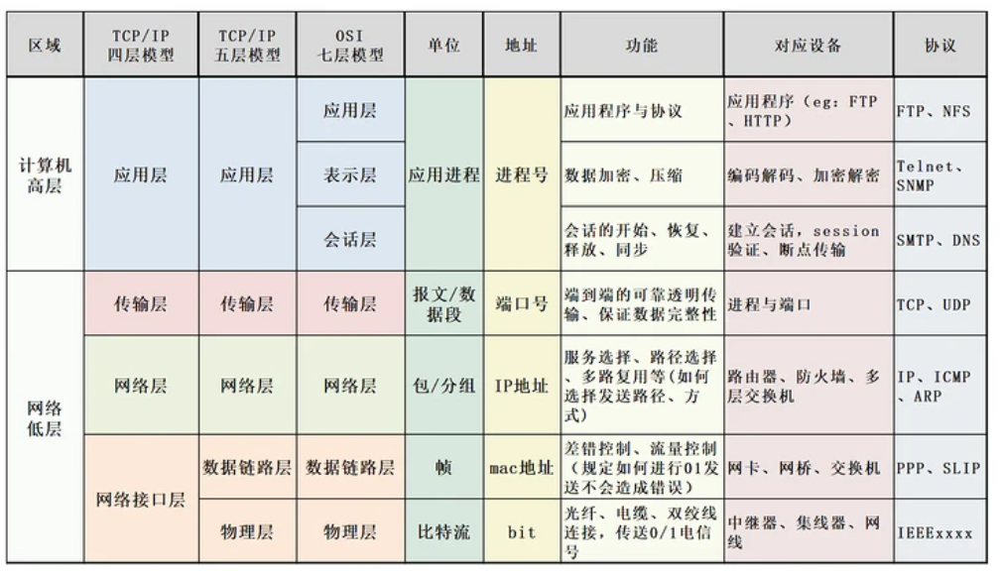

# 常考题目

## HTML篇

## CSS篇

## JS篇

## React篇

- **1. 说说React diff的原理是什么？**

  - **虚拟DOM**（==面试：虚拟DOM是什么？==）

    react底层简单实现：

    方案一：

    1. state 数据
    2. JSX 模板
    3. 数据 + 模板 结合，生成真实的DOM，来显示
    4. state 数据发生改变
    5. 数据 + 模板 结合，生成真实的DOM，替换原始的DOM（耗性能）

    缺陷：

    第一次生成了一个完整的DOM片段

    第一次生成了一个完整的DOM片段

    第二次的DOM替换第一次的DOM，非常耗性能

    

    方案二：

    改进

    1. state 数据
    2. JSX 模板
    3. 数据 + 模板 结合，生成真实的DOM，来显示
    4. state 数据发生改变
    5. 数据 + 模板 结合，生成真实的DOM，并不直接替换原始的DOM
    6. 新的DOM （DoncumentFragment，文档碎片在内存中，并未真实的挂载到页面）和原始的DOM 做对比，找差异
    7. 找出`input`框发生了变化
    8. 只用新的DOM中的input元素，替换掉老的DOM中的input元素

    缺陷：性能提升并不明显

    提升了替换原始DOM的性能，但是在新DOM与原始DOM做比对时也会损耗性能，性能提升不大。

    

    方案三：虚拟DOM方案

    1. state 数据

    2. JSX 模板

    3. 数据 + 模板 结合，生成真实的DOM，来显示

       ```html
       <div id='abc'><span>内容部分</span></div>
       ```

    4. 生成虚拟DOM（虚拟DOM就是一个JS对象，用它来描述真实DOM）（==损耗性能（小）==）

       JS对象包含3个参数，标签、属性、children

       ```js
       ['div', {id:'abc'}, ['span', {}, '内容部分']]
       ```

    5. state 数据发生改变

    6. 数据 + 模板 结合，生成新的虚拟DOM（虚拟DOM就是一个JS对象，用它来描述真实DOM）（==极大的提升了性能==）

       性能提升原因：生成真实DOM性能损耗较大，但是生成一个虚拟DOM即一个JS对象，JS对象的创建性能损耗极低，

       JS对象包含3个参数，标签、属性、children

       ```js
       ['div', {id:'abc'}, ['span', {}, '改变数据']]
       ```

    7. 比较原始虚拟DOM和新的虚拟DOM的区别，找到区别是span中的内容（==极大的提升了性能==）

       性能：原来是两个真实DOM进行比对，现在是两个JS对象进行比对，性能损耗小。

    8. 直接操作DOM，改变span中的内容

    虚拟DOM能提升性能的原因：--》react底层性能提升

    - 减少了真实DOM的创建、真实DOM之间的对比
    - 创建的是JS对象，对比的也是JS对象（虚拟DOM本质上就是JS对象）

  - **深入了解虚拟DOM**

    react虚拟DOM底层实现

    1. state 数据

    2. JSX 模板

    3. 数据 + 模板 结合，生成虚拟DOM（虚拟DOM就是一个JS对象，用它来描述真实DOM）（==损耗性能（小）==）

       ```js
       ['div', {id:'abc'}, ['span', {}, '内容部分']]
       ```

    4. 用虚拟DOM的结构生成真实的DOM，来显示

       ```html
       <div id='abc'><span>内容部分</span></div>
       ```

    5. state 数据发生改变

    6. 数据 + 模板 结合，生成新的虚拟DOM（虚拟DOM就是一个JS对象，用它来描述真实DOM）（==极大的提升了性能==）

       ```js
       ['div', {id:'abc'}, ['span', {}, '改变数据']]
       ```

    7. 比较原始虚拟DOM和新的虚拟DOM的区别，找到区别是span中的内容（==极大的提升了性能==）

    8. 直接操作DOM，改变span中的内容

    JSX —》　createElement—》 虚拟DOM（JS对象）—》真实的DOM
    ```react
    render(){
      return <div>item</div>
    	// 等价于  下面更偏向于底层实现  
      return React.createElement('div', {}, 'item')
    }
    ```

    优点：

    - 性能提升（DOM的比对变成了JS对象的比对）
    - 使得跨端应用得以实现。React Native  （虚拟DOM在PC端转成DOM，在移动端转成组件）

  - **虚拟DOM中的Diff算法**

    两个虚拟DOM（JS对象）比对的方式就叫做diff算法。Diffrence

    数据变化（state或props变化）才会有虚拟DOM的比对，因为props是父组件的state变化引起的，所以最终还是state变化引起比对。

    **Diff算法**

    

    ==同级比较==，在数据发生变化时，生成新的虚拟DOM，然后做同层比较，如果第一层不同，则会把原来的虚拟DOM第一层下面的节点都删除，采用新的虚拟DOM替换，假设只有第一层节点不同，但是后面节点相同，这样会造成DOM节点渲染浪费，但是采用同层比对算法比较简单、比对速度快，大大降低了两个虚拟DOM比对上算法的性能消耗。

    `react`中`diff`算法主要遵循三个层级的策略：

    - tree层级

      `DOM`节点跨层级的操作不做优化，只会对相同层级的节点进行比较。

    - conponent 层级

      如果是同一个类的组件，则会继续往下`diff`运算，如果不是一个类的组件，那么直接删除这个组件下的所有子节点，创建新的虚拟DOM。

    - element 层级

      对于比较同一层级的节点们，每个节点在对应的层级用唯一的`key`作为标识。

      提供了 3 种节点操作，分别为 `INSERT_MARKUP`(插入)、`MOVE_EXISTING` (移动)和 `REMOVE_NODE` (删除)。

      **注意：**在虚拟DOM节点比对完成后，`diff`过程还没完，还会整体遍历老集合中节点，看有没有没用到的节点，有的话，就删除。

    

    给每个虚拟节点加上key值，虚拟DOM的比对根据key值做关联，提高虚拟DOM比对性能。

    - 采用index作为key值的弊端

      ```react
      <TodoItem
        key={index}
        content={item}
        >
      </TodoItem>
      当我们添加内容a b c
      a 0 b 1 c 2
      删除a后，会变成
      b 0 c 1
      这样会造成key值不稳定
      ```

    **补充：**`setState()`设置成异步函数的原因（提高性能）

    在调用`setState()`时，若连续三次调用并且时间间隔较短，react不会做三次数据改变比对虚拟DOM，react会把三次`setState`合并成一个`setState()`然后做一次虚拟DOM比对，更新一次DOM，这样就会省去另外两次DOM比对造成的性能耗费。

- **2. ref的使用**

## 计算机网络

- **一、如何理解OSI七层模型?**

  

  - 应用层

    作用：通过==应用程序==间的交互来完成特定的==网络应用==，该层协议定义了应用程序之间的交互规则，通过不同的应用层协议为不同的网络应用提供服务。

  - 表示层

    作用：数据转换。使通信的应用程序能够解释交换数据的含义。

    🦈表示管理、表示转换，

  - 会话层

    作用：通信管理，负责建立和断开通信连接。

    🦈会话管理，比如建立会话、维持会话

  - 传输层

    作用：管理数据传输，数据可靠传输。（主要传输协议`TCP` `UDP`）

  - 网络层

    作用：选择合适的网间路由和交换节点，确保数据按时成功传送（协议为`IP`和路由协议）

  - 数据链路层

    作用：传送和识别数据帧。

  - 物理层

    作用：实现计算机节点之间比特流的透明传送

  **传输过程：**

- **二、TCP/IP 网络模型有哪几层？**

  

  - 应用层

    `TCP/IP` 模型将 `OSI`参考模型中的会话层、表示层和应用层的功能合并到一个应用层实现，通过不同的应用层协议为不同的应用提供服务。

    🦈主要是为用户提供应用功能，比如 HTTP、FTP、Telnet、DNS、SMTP等。当两个不同设备之间进行通信时，就需要把应用数据传给传输层。

    ==在传输层提供的进程到进程的可靠通信基础之上，实现各种网络应用==

    协议： HTTP、FTP、Telnet、DNS、SMTP

  - 传输层（进程到进程的区分）

    提供端对端的通信功能；传输控制协议（TCP）和用户数据报协议（UDP）

    🦈为应用层提供网络支持，保证数据完整性。作为应用间数据传输的媒介。

    - 在主机到主机传输的基础上，完成进程到进程的区分（区分进程）
    - 把网络层提供的可能不可靠的服务转成可靠服务，（加强网络层提供的服务）

    协议：TCP UDP

  - 网络层（端到端 源主机  目标主机）

    选择合适的网间路由和交换节点，确保数据按时成功传送

    🦈数据的实际传输；==在链路层提供的相邻两点之间数据传输基础上，传输以分组为单位的端到端的数据传输。==功能：转发、路由

    协议：IP 路由选择协议

  - 数据链路层（相邻两点之间）

    传送和识别数据帧。数据链路层在两个相邻节点传输数据时，将网络层交下来的IP数据报组装成帧，在两个相邻节点之间的链路上传送帧。

    🦈传送和识别数据帧。相邻两点（P2P如计算机与交换机）之间传输以帧为单位的数据，

  - 物理层

    负责数据传输的硬件；保证数据可以在各种物理媒介上进行传输，为数据的传输提供可靠的环境。

    🦈发送端接收链路层传过来的数据帧，转换成物理信号，通过介质传送给对方，接收端把物理媒体上承载的物理信号（光信号/电磁波信号）还原回比特。

  

  协议的实现通过下层所提供的服务才能实现，协议的目的是向上层提供更好的服务

- **三、tcp三次握手 四次挥手 为什么多一次 多一次是干嘛的 可以省略吗 省略了有什么问题**

- url由哪些部分组成？

- 浏览器输入`baidu.com`（`Url`）到开始渲染之间网络发生了什么

- http和https的区别？

# 面试中的问题