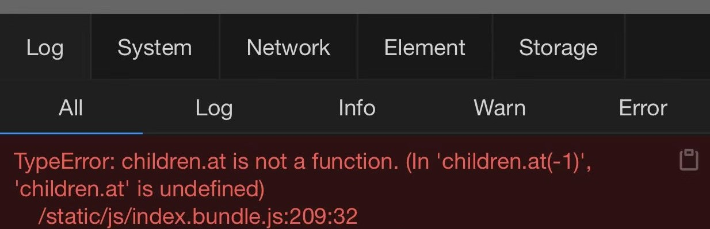
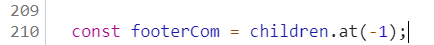
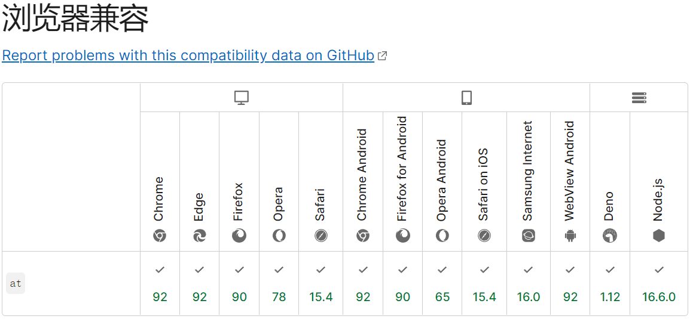
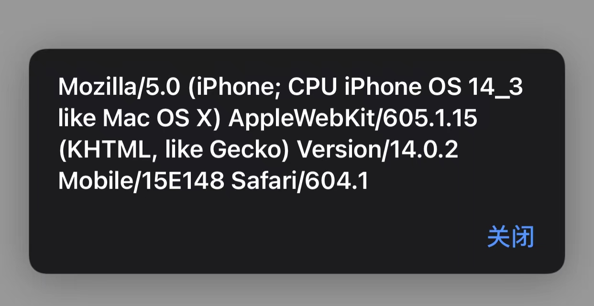

# 修复移动端适配bug

## 一、存在问题：

采用谷歌devTool调试时正常显示，采用手机无法正常显示，只显示白屏；采用同学的手机也可以正常显示。

## 二、移动端调试

**调试方法：**vConsole 调试「是在手机端调试，不是在 PC 端调试」

`vConsole` 会在你网页中加一个悬浮的小按钮，可以点击它来打开关闭调试面板，并查看 `DOM`、`Console`、`Network`和 `本地存储` 等信息。

使用步骤：

1. 引入：

   (1) 通过 npm 安装

   ```js
   npm install vconsole
   ```

   在页面引入

   ```react
   import VConsole from 'vconsole';
   
   const vConsole = new VConsole();
   // or init with options
   const vConsole = new VConsole({ theme: 'dark' });
   
   // call `console` methods as usual
   console.log('Hello world');
   
   // remove it when you finish debugging
   vConsole.destroy();
   ```

   (2) 直接在需要的页面引入CDN 的 js 文件

   ```javascript
   <script src="https://unpkg.com/vconsole@latest/dist/vconsole.min.js"></script>
   <script>
     // VConsole will be exported to `window.VConsole` by default.
     var vConsole = new window.VConsole();
   </script>
   ```

2. 移动端报错

   移动端查看报错提示

   

   定位到报错部分

   

   代码表示获取数组的最后一个元素，查询`mdn`，兼容的`safari` 浏览器版本至少为15.4

   

   查看当前移动端版本号为14.3，所以在当前移动端浏览器.at方法不可用。

   查询版本方法：

   ```js
   // 方法一：采用userAgent
   alert(this.navigator.userAgent)
   // 方法二：vConsole中的System会给出系统信息
   ```

   

## 三、解决方法

1. 不使用`Array.prototype.at()`方法获取数组的最后一个元素，直接使用

   ```js
   // 方法一：length
   const footerCom = children[children.length - 1]
   //方法二：slice()，slice()方法是浅拷贝，不会影响到源数组
   const footerCom = children.slice(-1) 
   ```

2. 手动实现`Array.prototype.at()`方法，以适配当前版本

   简单实现

   ```js
   <script>
     ;(function(){
       Array.prototype.at = function(index){
         if(index >= 0) {
           return this[index]
         }else {
           return this.slice(index)
         }
       }
     })()
   </script>
   ```

⭐⭐⭐**采用手机调试**

在同一wifi下（即同一局域网）访问ip地址，进行本地调试