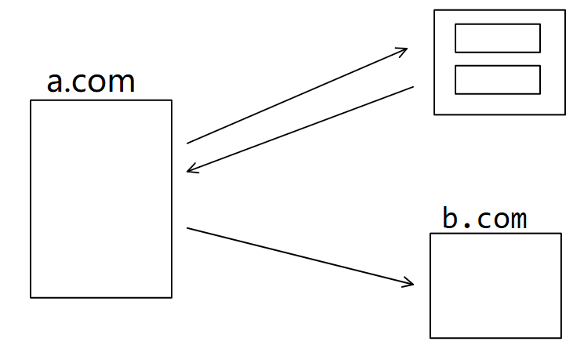
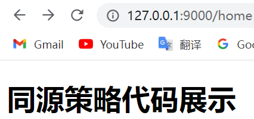
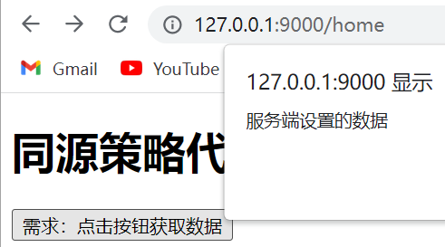
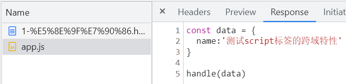
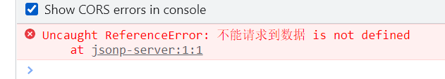
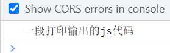
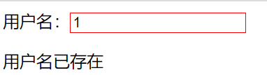
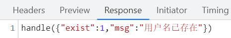
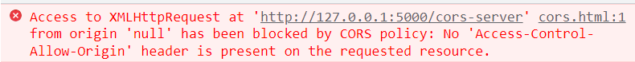
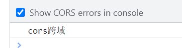

## 🦈跨域

### 面试题

1. 讲一下跨域？为什么服务端没有同源限制？

2. 跨域了解吗

3. 怎么解决跨域

4. 浏览器存储，能否跨域？

   localstorage使用时的注意点，能存储哪些数据类型，cookie如何设置？

   跨域的方式，优缺点？

   CORS的细节？

5. ajax的步骤

6. ajax缺点

7. script标签的方法叫什么名字jsonp 有什么缺点

8. 后台获取到的数据怎么插到页面上

9. ajax使用js的什么技术

10. 说一下跨域请求如何携带cookie

### 1. 同源策略

#### 什么是跨域？

同源策略(Same-Origin Policy)最早由 Netscape 公司提出，是浏览器的一种==安全策略==。同源： 协议、域名、端口号 必须完全相同。

==违背同源策略就是跨域==。🦈不同源之间的请求就是跨域操作，协议、域名、端口号有一个不同就是不同源。

#### 为什么会有跨域？

1. 单台服务器服务是有上线的，性能是有瓶颈的，所以需要增加服务器去提供服务，就形成跨域。

#### 为什么要跨域限制（同源策略）？

1. 可以保证用户信息的安全，防止恶意的网站窃取数据，减少XSS、CSRF等攻击。

#### 同源策略限制的内容

1. 无法读取非同源网页的 Cookie、LocalStorage 和 IndexedDB
2. 无法接触非同源网页的 DOM
3. 向非同源地址发送 AJAX 请求浏览器会拒绝响应
   axios默认遵循同源策略（不满足同源策略是无法发送Ajax请求）

#### 同源策略举例

- 如：网页请求服务端数据时，同源策略即必须协议、域名、端口号 必须完全相同。
  如下图访问网页，我们请求的目标资源和网页资源都是来自同一台服务器的同一个服务，所以是同源。但是你在a.com网页向b.com发送了一个请求就是跨域的。
  
- 举例：同源策略，页面和服务端都是从同一个服务器获取的，不存在跨域情况。


- 代码演示

  **首先创建服务端代码**

  ```js
  // 服务端代码
  // 1. 引入express
  // const {request, response} = require('express')
  const express = require('express')
  // 2. 创建对象
  const app = express()
  // 3. 创建路由
  app.get('/home', (request, response)=>{
    // 返回响应---加绝对路径是什么意思
    response.sendFile(__dirname + '/index.html')
  })
  // 响应数据
  app.get('/data', (request, response)=>{
    // 返回响应数据
    response.send('数据数据数据数据数据')
  })
  // 4. 监听端口
  app.listen(9000, ()=>{
    console.log("服务已经启动, 9000 端口监听中....");
  })
  ```

  在127.0.0.1：9000地址请求页面。

  

  **创建前端页面代码**

  ```html
  <!DOCTYPE html>
  <html lang="en">
  <head>
    <meta charset="UTF-8">
    <meta http-equiv="X-UA-Compatible" content="IE=edge">
    <meta name="viewport" content="width=device-width, initial-scale=1.0">
    <title>Document</title>
    <!-- 引入axios；crossorigin="anonymous"解决跨域问题 -->
    <script crossorigin="anonymous" src="https://cdn.bootcdn.net/ajax/libs/axios/0.26.1/axios.js"></script>
  </head>
  <body>
    <h1>同源策略代码展示</h1>
    <button>需求：点击按钮获取数据</button>
    <script>
      // 获取对象
      const btn = document.querySelector('button')
      // 绑定事件
      btn.onclick = ()=>{
        // 原生AJAX方法
        /* // 1.创建xhr对象
        const xhr = new XMLHttpRequest()
        // 2.初始化
        xhr.open('GET','/data')
        // 3.发送请求
        xhr.send()
        // 4.绑定事件
        xhr.onreadystatechange = ()=>{
          if(xhr.readyState === 4){
            if(xhr.status>=200 && xhr.status<300){
              alert(xhr.response);
            }
          }
        } */
  
        // axios方法---前提是需要引入axios包
        axios({
          // axios通用方法: 请求方法 url 请求头Headers 请求体data  其他配置params
          method:'GET',
          url:'/data',
  
        }).then(response=>{
          console.log(response);
          console.log('axios方法请求的数据为=' + response.data);
        })
      }
    </script>
  </body>
  </html>
  ```

  

### 2. 如何解决跨域

#### 2.1 JSONP

在网页有一些标签天生==具有跨域能力==，比如：img link iframe script。

JSONP是非官方解决方案，仅支持get请求，借助script标签**没有跨域限制**实现跨域。

- **jsonp实现跨域的原理**
  服务端返回的结果的形式是一个函数调用，而函数handle的参数是想给客户端返回的结果数据。---即返回函数调用，并且把参数放到里面，并且**函数要在前端提前声明**。

- **JSONP优缺点**

  JSONP优点是简单兼容性好，可用于解决主流浏览器的跨域数据访问的问题。**缺点是仅支持get方法具有局限性,不安全可能会遭受XSS攻击。**---不知道怎么被攻击的就别说。

- **JSONP使用步骤**

```js
// 1.创建script标签
const script = document.createElement('script')
// 2.给script标签绑定src属性
script.src = 'http://127.0.0.1:5000/check-username'
// 3.将script标签添加到文档
document.body.appendChild(script)
```

- **引入：script标签具有跨域特性的例子**

下面的axios是一个跨域请求，协议、域名、端口都不一样。---这个例子可以说明script标签本身具有跨域特性。

```html
<script crossorigin="anonymous" src="https://cdn.bootcdn.net/ajax/libs/axios/0.26.1/axios.js"></script>
```

> src属性指向一个外部 JavaScript 文件，src 属性规定外部脚本文件的 URL。

采用http请求引入文件，有跨域仍然可以实现---说明script标签具有跨域特性。

```html
<script src="http://127.0.0.1:5500/DemoMe/7-%E8%B7%A8%E5%9F%9F/%E5%A4%8D%E4%B9%A0/2-JSONP/js/app.js"></script>
```

- **引入jsonp解决跨域问题**

  原理：引入js文件，在页面中解析

小结：

1. 以上代码中，定义了一个js外部文件，该文件中定义了数据和函数调用，在前端页面引入js文件，浏览器对齐进行解析并执行。
2. 使用script引入外部js文件，该script标签采用http请求，会有跨域现象，但仍能正常执行。

定义外部js文件

```js
// js返回结果是一个数据+函数的调用
const data = {
  name:'测试script标签的跨域特性'
}
handle(data)
```

定义html文件

```html
<!DOCTYPE html>
<html lang="en">

<head>
  <meta charset="UTF-8">
  <meta http-equiv="X-UA-Compatible" content="IE=edge">
  <meta name="viewport" content="width=device-width, initial-scale=1.0">
  <title>Document</title>
  <style>
    #result {
      width: 300px;
      height: 100px;
      border: solid 2px #78a;
    }
  </style>
</head>
<body>
  <div id="result"></div>
  <script>
    function handle(data) {
      const result = document.getElementById('result')
      result.innerHTML = data.name
    }
  </script>
  <!-- 引入外部js文件 -->
  <!-- <script src="./js/app.js"></script> -->
  <!-- 采用http请求引入js文件（模仿跨域） -->
  <script src="http://127.0.0.1:5500/DemoMe/7-%E8%B7%A8%E5%9F%9F/%E5%A4%8D%E4%B9%A0/2-JSONP/js/app.js"></script>
</body>
</html>
```

查看返回结果，返回数据+一个函数调用



- **使用script标签请求express服务器数据**（跨域）

  原理：采用script标签引入地址，只有服务端返回js代码时，才能正确解析。

前端页面代码（在上面的基础上更改script标签）

```html
<body>
  <div id="result"></div>
  <script>
    //前端提前定义好回调函数
    function handle(data) {
      const result = document.getElementById('result')
      result.innerHTML = data.name
    }
  </script>
  <!-- 请求jsonp数据 -->
  <script src="http://127.0.0.1:5000/jsonp-server"></script>
</body>
```

服务端express代码

```js
// 服务端代码的准备
//1. 引入express
const { request, response } = require('express');
const express = require('express');
//2. 创建应用对象
const app = express();
//3. 创建路由规则
// jsonp服务
app.all('/jsonp-server', (request, response)=>{
  response.send('不能请求到数据')
})
//4. 监听端口启动服务
app.listen(5000, ()=>{
    console.log("服务已经启动, 5000 端口监听中....");
});
```

返回结果是一串自定义的字符串，script标签无法解析。（返回标准的js代码）



需要返回标准的js代码才能正确解析

```js
app.all('/jsonp-server', (request, response)=>{
  // 返回js代码
  response.send("console.log('一段打印输出的js代码')")
})
```



所以script标签发送请求后，返回的是需要是==一段函数调用的内容（一段js代码）==。这样才能正确输出。

- 采用回调函数形式。将返回的数据进行处理。

==jsonp实现跨域的原理==：返回的结果的形式是一个函数调用，而函数handle的参数是想给客户端返回的结果数据。---即返回函数调用，并且把参数放到里面，并且**函数要在前端提前声明**。

```js
app.all('/jsonp-server', (request, response) => {
  // js对象---想要返回的数据
  const data = {
    name:'返回函数调用，参数就是想要返回的数据'
  }
  // 将数据转化为字符串
  let str = JSON.stringify(data);
  //返回结果(end不会加特殊响应头)
  response.end(`handle(${str})`);
  /* 
  返回的结果的形式是一个函数调用,而这个函数的参数就说我们想给客户端返回的结果数据
  handle是前端已经定义好的函数,这里直接调用并传实参
  */
})
```


- **jsonp实现跨域的完整代码**

  重点：jsonp的使用流程

  ```js
  // 1.创建script标签
  const script = document.createElement('script')
  // 2.为script标签添加src属性
  script.src = 'http://127.0.0.1:5000/jsonp-server'
  // 3.将script添加到文档中
  document.body.appendChild(script)
  ```

  **前端代码**

  ```html
  <!DOCTYPE html>
  <html lang="en">
  <head>
    <meta charset="UTF-8">
    <meta http-equiv="X-UA-Compatible" content="IE=edge">
    <meta name="viewport" content="width=device-width, initial-scale=1.0">
    <title>Document</title>
    <style>
      #result {
        width: 300px;
        height: 100px;
        border: solid 2px #78a;
      }
    </style>
  </head>
  
  <body>
    <div id="result"></div>
    <script>
      function handle(data) {
        const result = document.getElementById('result')
        result.innerHTML = data.name
      }
    </script>
    <!-- 使用jsonp的流程 -->
    <script>
    // 1.创建script标签
    const script = document.createElement('script')
    // 2.为script标签添加src属性
    script.src = 'http://127.0.0.1:5000/jsonp-server'
    // 3.将script添加到文档中
    document.body.appendChild(script)
    </script>
  </body>
  </html>
  ```

  **服务端代码**

  ```js
  // 服务端代码的准备
  //1. 引入express
  const { request, response } = require('express');
  const express = require('express');
  //2. 创建应用对象
  const app = express();
  //3. 创建路由规则
  // jsonp服务
  app.all('/jsonp-server', (request, response) => {
    // js对象---想要返回的数据
    const data = {
      name:'返回函数调用，参数就是想要返回的数据'
    }
    // 将数据转化为字符串
    let str = JSON.stringify(data);
    //返回结果(end不会加特殊响应头)
    response.end(`handle(${str})`);
    /* 
    返回的结果的形式是一个函数调用,而这个函数的参数就说我们想给客户端返回的结果数据
    handle是前端已经定义好的函数,这里直接调用并传实参
    */
  })
  //4. 监听端口启动服务
  app.listen(5000, () => {
    console.log("服务已经启动, 5000 端口监听中....");
  });
  ```

  

小结：借助script标签向服务端发送请求，返回结果是一个handle函数的调用，浏览器解析器检测能够执行，直接执行并处理数据。

- **JSONP原生实践**

  需求：输入用户名存在则边框变为红色并且输出一段提示文字

  **前端代码**

  ```html
  <!DOCTYPE html>
  <html lang="en">
  <head>
    <meta charset="UTF-8">
    <meta http-equiv="X-UA-Compatible" content="IE=edge">
    <meta name="viewport" content="width=device-width, initial-scale=1.0">
    <title>Document</title>
  </head>
  <body>
    <!-- 需求：输入用户名存在则边框变为红色并且输出一段提示文字 -->
    用户名：<input type="text"  id="username">
    <p></p>
    <script>
      // 获取元素
      const input = document.querySelector('input')
      const p = document.querySelector('p')
  
      // 定义回调函数，回调函数必须提前定义在前端页面里
      const handle = function(data){
        // 处理函数要设置边框和添加文字
        input.style.border = 'solid 1px #f00'
        p.innerHTML = data.msg
      }
      // 绑定事件
      input.onblur = function(){
        // 获取用户的输入值---？这一步是干什么的？
        let username = this.value
        // 利用script采用jsonp方法发送请求
        // 1.创建script标签
        const script = document.createElement('script')
        // 2.给script标签绑定src属性
        script.src = 'http://127.0.0.1:5000/check-username'
        // 3.将script标签添加到文档
        document.body.appendChild(script)
      }
  
    </script>
  </body>
  </html>
  ```

  **服务端代码**

  ```js
  // 服务端代码的准备
  //1. 引入express
  const { request, response } = require('express');
  const express = require('express');
  //2. 创建应用对象
  const app = express();
  //3. 创建路由规则
  // jsonp实践
  app.all('/check-username', (request, response)=>{
    // 定义要返回的数据
    const data = {
      exist:1,
      msg:'用户名已存在'
    }
    // 将数据转换成json字符串
    const str = JSON.stringify(data)
    // 返回结果
    response.end(`handle(${str})`)
  })
  //4. 监听端口启动服务
  app.listen(5000, () => {
    console.log("服务已经启动, 5000 端口监听中....");
  });
  ```

  

  

🦈总结：

1. JSONP方法解决跨域是借助script标签向服务端发送请求
2. 服务端返回是一个回调函数的调用，
3. 返回结果是一个handle函数的调用，浏览器解析器检测能够执行，直接执行并处理数据。

#### 2.2 CORS

官方跨域解决方案；

前面的AJAX请求，axios-ajax请求都是采用的cors跨域解决方案，设置响应头。

设置跨域方法：客户端不做任何处理，在服务端设置响应头，允许跨域既可以。

```js
response.setHeader('Access-Control-Allow-Origin', '*')
```

实际案例：

需求：点击按钮，打印输出一下就行

**前端代码**

```html
<!DOCTYPE html>
<html lang="en">
<head>
  <meta charset="UTF-8">
  <meta http-equiv="X-UA-Compatible" content="IE=edge">
  <meta name="viewport" content="width=device-width, initial-scale=1.0">
  <title>Document</title>
</head>
<body>
  <button>发送请求</button>
  <script>
    // 获取元素
    const btn = document.querySelector('button')
    // 绑定事件---处理请求的数据
    btn.onclick = function(){
      // 发送AJAX请求的四步
      // 1.创建xhr对象
      const xhr = new XMLHttpRequest()
      // 2.初始化（设置请求方法和url）
      xhr.open('GET', 'http://127.0.0.1:5000/cors-server')
      // 3.发送请求
      xhr.send()
      // 4.绑定事件,处理响应结果（返回的数据怎么处理）
      xhr.onreadystatechange = function(){
        if(xhr.readyState === 4){
          if(xhr.status>=200 && xhr.status<300){
            // 处理成功数据
            console.log(xhr.response);
          }
        }
      }
    }
  </script>
</body>
</html>
```

**服务端代码**

```js
// 服务端代码的准备
//1. 引入express
const { request, response } = require('express');
const express = require('express');
//2. 创建应用对象
const app = express();
//3. 创建路由规则
// cors跨域
app.all('/cors-server', (request, response)=>{
  // 设置允许跨域---后面填写允许跨域的url，*号表示允许所有url
  // response.setHeader('Access-Control-Allow-Origin', 'http://127.0.0.1:5000')
  // 一般设置三个，允许跨域、可以自定义头信息、随意定义请求方法
  response.setHeader('Access-Control-Allow-Origin', '*')
  response.setHeader('Access-Control-Allow-Header', '*')
  response.setHeader('Access-Control-Allow-Method', '*')
  response.send('cors跨域')
})
//4. 监听端口启动服务
app.listen(5000, () => {
  console.log("服务已经启动, 5000 端口监听中....");
});
```

不设置响应头（存在跨域问题）



添加响应头（正常输出）



mdn文档：https://developer.mozilla.org/zh-CN/docs/Web/HTTP/CORS


常用HTTP响应头

Access-Control-Allow-Origin 设置源，哪些页面可以给我们发请求，

Access-Control-Expose-Headers返回结果哪些头信息是可以暴露的

Access-Control-Max-Age预请求的结果缓存。加一个时间，该时间内直接去请求，而不会做一个预检查。

Access-Control-Allow-Credentials 跨域请求时是否可以携带验证信息。

Access-Control-Allow-Methods 设置请求允许的方法

Access-Control-Allow-Headers 头信息

#### 2.3 package  （可以）

在package.json中加上proxy代理配置处理跨域请求

`"proxy":"http://localhost:3004"`

==在发送post请求时，记得在请求后面加catch(err=>{})==

```js
axios.post('/items', newItem).then((response) => {
  console.log(response);
}).catch(err => {
	
})
```


#### 2.4 代理插件 http-proxy-middleware

安装：`npm install http-proxy-middleware --save`

在src文件下配置`setupProxy.js`文件

```js
const { createProxyMiddleware } = require('http-proxy-middleware');
module.exports = function(app) {
  app.use(
    // 过滤拼接
    '/ajax', //请求的路径，以api开头的都是开始路径 /api/center--查找target拼接的接口
    createProxyMiddleware({
      target: 'https://i.maoyan.com/',//要访问的地址，用以匹配拼接的头部
      changeOrigin: true,
    })
  );
};
```

#### 2.5 采用node作为中间人(Proxy代理)

服务器之间不存在跨域，采用服务器代理转发请求数据；


