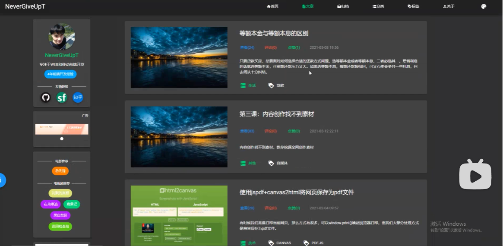

# oneshark🦈

主题借鉴


IndexRouter文件夹，存放所有路由组件

views放与路由相关的组件

views文件夹下创建路由文件夹，可以单独存放自己的js、css或者和自己相关的组件。

components 子组件或者页面共享的组件

## 1. 项目启动

### 1.1 搭建脚手架

```
npx create-react-app sharkblog
```


index.js项目模块入口

### 1.2 CSS模块化

1. 创建样式时命名方式采用xx.module.css
   注意：对于标签选择器没有作用，需要用class或者id选择器才有作用。

   使用方法：
   **定义样式**

   ```css
   .item{
     width: 200px;
     background: red;
   }
   ```

   引入样式（采用style引入）

   ```js
   import React from 'react'
   import style from './Child.module.css'
   export default function Child() {
     return (
       <div>
         Child
         <ul>
           <li className={style.item}>444</li>
           <li className={style.item}>555</li>
           <li className={style.item}>666</li>
         </ul>
       </div>
     )
   }
   ```

   

### 1.3 Sass应用

sass安装 cnpm i --save sass 


文件名改为.scss

```scss
$width:100px;
ul{
  .item{
    width: $width;
    background: red;
  }
}
```


### 1.4 反向代理应用

解决跨域问题---这里的反向代理采用的是react的proxy模块

安装axios：cnpm i --save axios 

* react集成了反向代理模块；[Proxying API Requests in Development | Create React App 中文文档 (bootcss.com)](https://create-react-app.bootcss.com/docs/proxying-api-requests-in-development/)

  1. 安装http-proxy-middleware小模块：cnpm
     i --save-dev http-proxy-middleware

  2. 在src文件夹下创建setupProxy.js文件，src/setupProxy.js，

  3. 在setupProxy.js文件下配置代码

     ```js
     const { createProxyMiddleware } = require('http-proxy-middleware');
     // 每次请求新的api，会代理到localhost:5000端口号取数据
     module.exports = function(app) {
       app.use(
         '/api',
         createProxyMiddleware({
           target: 'https://i.maoyan.com',
           changeOrigin: true,
         })
       );
     };
     ```

     App组件中

     ```js
     import React, { useEffect } from 'react'
     import Child from './Child'
     import './App.css'
     import axios from 'axios'
     function App() {
       // 请求数据
       useEffect(()=>{
       axios.get('/api/mmdb/movie/v3/list/hot.jsonct=%E5%8C%97%E4%BA%AC&ci=1&channelId=4').then(res=>{
           console.log(res.data);
         })
       },[])
     
       return (
         <div>
           App
           <Child/>
         </div>
       )
     }
     export default App
     ```

### 1.5 路由架构---看一下v6

在src文件夹下单独创建router文件夹，并创建IndexRouter.js文件

下载react-router：cnpm i react-router-dom

分两种模式

1. HashRouter带#号
2. BrowserRouter

### 1.6 antd引入

[文档](https://ant-design.gitee.io/index-cn)


## 2. 首页搭建

### 2.1 导入canvas首页代码

copy别人的canvas代码

### 2.2 设置样式

Home.scss

```css
.common{
  width: 100%;
  height: 100%;
  position: absolute;
  top: 0;
  bottom: 0;
  left: 0;
  right: 0;
  background-color: lightblue;
}
.home{
  position: absolute;
  top: 50%;//距离顶部50%  居中
  width: 100%;
  text-align: center;
  transform: translateY(-50%);//实现垂直方向的居中
  font-size: 0.8rem;//安装lib-flexible插件
  color: #fff;
  font-weight: 500;
}
```


### 2.3 设置字体打印效果

* 安装lib-flexible插件：cnpm i lib-flexible

  用来实现rem，以适配不同窗口大小

* 打印效果

  W_
  We_
  Wel_
  每次都是下面的覆盖上面的

  **代码实现**Home.js

  ```js
  // vue更改⭐
  import React, { useEffect, useState } from 'react'
  import Animatation from '../../components/home/Animatation'
  import './Home.scss'
  import 'lib-flexible'
  export default function Home() {
    const [strs, setStrs] = useState('')
    useEffect(()=>{
      typing()
    },[])
    // 创建函数实现打字效果
    let i = 0
    let intro = ''
    let introTarget = 'Welcome to shark blog🦈'
    function typing(){
      let coding = setInterval(function () {
        intro = introTarget.slice(0, i++) + '_'
        // console.log(intro);
        setStrs(intro)
        if(i > introTarget.length){
          intro = introTarget
          setStrs(intro)
          clearInterval(coding)
        }
      }, 200)
    }
    return (
      <div className='common'>
        {/* 引入Animatation组件 */}
        <Animatation></Animatation>
        <div className='home'>
          {strs}
        </div>
      </div>
    )
  }
  ```


**效果展示**


## 3.Header组件

flex弹性盒，可以控制下级盒子的位置


🦈前端页面采用纯CSS编写，后台管理再借用antd🦈

IndexRouter文件夹，存放所有路由组件

views放与路由相关的组件，views文件夹下创建路由文件夹，可以单独存放自己的js、css或者和自己相关的组件。

components 子组件或者页面共享的组件

## 1. 首页

🦈采用float

**CSS属性书写顺序**

1. 布局定位属性：display / position / float / clear / visibility / overflow（建议 display 写在最前面）
2. 自身属性：width / height / margin / padding / border / background
3. 文本属性：color / font / text-decoration / text-align / vertical-align / white- space / break-word
4. 其他属性（CSS3）：content / cursor / border-radius / box-shadow / text-shadow / background:linear-gradient

**页面布局注意事项**

1. 首先确定页面的版心，即页面的可视区
2. 分析页面的行模块，以及每个行模块中的列模块
3. 编写网页的时候，还是老话哦，遵循先有结构后有样式的原则
4. 运用盒子模型的原理，使用div+CSS布局来空着网页的各个模块

采用普通布局，并根据设备设置响应式布局。

**页面制作**

```css

.homeHeader{
  position: absolute;
  width: 100%;
  height: 100%;
  background-color: #bfa;
}
```

**导航栏头部**

注意：如果一个盒子里面有多个子盒子，如果其中一个盒子浮动了，其他兄弟也应该浮动，避免引起其他的问题。

整体代码home.js

```react
import React from 'react'
import './Home.scss'
import './css/reset.css'

export default function Home() {
  return (
    <div className='homeHeader'>
      {/* 头部 */}
      <header className='hcenter'>
        {/* 头像 */}
        <div className='avatar'>
          
        </div>
        {/* logo */}
        <div className='logo'>
          
        </div>
        {/* 导航菜单部分 */}
        <div className='menu'>
          <ul>
            <li><a href=""></a>首页</li>
            <li><a href=""></a>文章</li>
            <li><a href=""></a>图库</li>
            <li><a href=""></a>分类</li>
            <li><a href=""></a>关于</li>
          </ul>
        </div>
        {/* 搜索部分 */}
        <div className='search'>
          <input className='put' type="text" id="" value="想搜索什么呢" />
          <button className='btn' type="button">按钮</button>
        </div>
      </header>

      <div className='content'>2</div>
      <footer>3</footer>
    </div>
  )
}
```

css样式

```css
.homeHeader {
  // position: absolute;
  width: 100%;
  height: 100%;
  background-color: #bfa;

  .hcenter {
    width: 100%;
    margin: 0 auto;
  }
}

header {
  // position: relative;
  height: 100px;
  // background-color: bisque;

  .avatar {
    float: left;
    margin-left: 80px;
    cursor: pointer;
  }

  .logo {
    float: left;
  }

  .menu {
    float: left;

    ul li {
      float: left;

      a {
        display: inline-block;
        text-decoration: none;
        height: 30px;
        padding: 0 15px;
        color: blueviolet;
      }

      a:hover {
        color: #bfa;
      }
    }
  }

  .search{
    float: right;
    padding-right: 80px;
    padding-top: 15px;
    .put{
      float: left;
    }
    .btn{
      border: none;
      float: left;
    }
    input[value]{
      color: brown;
      padding-left: 5px;
    }
    input:focus,button:focus{
      outline: none;
    }
  }
}
.content {
  height: 800px;
  // background-color: bisque;
}

footer {
  height: 100px;
  // background-color: pink;
}
```


🦈采用flex

思路：采用flex弹性盒布局，设置好导航栏可以。---布局自己设置，ui和一些小组件采用antd。

# shark（重置）

⭐现在主要的目的是把整个项目搭建起来，不需要每一部分都是完美的，不停的完善。

## github提交项目

1. 我们可以通过`git remote add origin https://github.com/oneshark5/blog-oneshark.git  `，来添加一个新的远程仓库，指定了名字origin，我们以后使用时可以通过origin名字代替url。如`get fetch origin`。
2. 在项目文件夹下执行git命令`git push -u origin master`进行提交到分支master上，如果该分支不存在，则自动创建，（**注意**：我们以后在完成项目后，上传时可以通过起名不同的分支，进行记录，然后在github上手动合并。）
   `git push <remote> <branch>`就是将项目提交到哪个分支上。
3. ⭐⭐写完代码  直接 `git push origin main -f`强制更新到main

github合并分支步骤

1. 当项目更新时，会有提示
   

2. 点击New Pull request进行合并

3. 可以点击分支`master`，查看所更新分支更新的内容

   


常用命令

`git init` 初始化本地版本库

`git status` 查看状态

`git diff` 查看变更内容

`git add .` 跟踪改动过的文件

`git add <file>` 跟踪指定文件

`git commit -m "信息"` 提交所有更新过的文件

`git remote -v` 查看远程版本库信息

`git remote add <remote> <url>` 添加远程版本库

`git push <remote> <branch>` 上传代码及快速合并


遇到问题，解决方法

1. [方法一，强制更新](https://blog.csdn.net/nixiang_888/article/details/114458330)
2. [方法二，将默认分支main改为master](https://www.jianshu.com/p/e8342a72c101)


* views中存放的是页面级、视图级的组件---view是放的是大的页面
* component存放的是公共的，公共的选项卡、导航栏、轮播组件---放页面中的小块

## 1. 首页

明天任务：把头部导航栏重新引入，重新设置，气死了👿

可以把底部设置为固定定位，（参照于浏览器视口进行定位）

粘滞定位：比如一个需求是滚动时，让导航栏一直固定到一个位置。


* NavLink + Route 实现 二级路由 跳转
* 采用className={`${'listcheck2'} ${appStyle['listcheck']}`}给一个元素设置多个样式名。
* box-sizing 属性定义如何计算一个元素的总宽度和总高度，主要设置是否需要加上内边距(padding)和边框。设置为border-box则==内容区的实际宽度是 width 减 去(border + padding) 的值==。
* **在**`react`**中想要动态添加**`className`**时，通过就会使用**`classnames`**这个库。**

**App页面**

该页面仅设置了

`display:block; `元素将显示为块级元素，此元素前后会带有换行符。

`block-sizing:border-box;`内容区的实际宽度是 width 减 去(border + padding) 的值。

**导航栏Nav**

布局
`position：fixed；`固定定位永远参照于浏览器的视口进行定位


后端


文章页




# 使用[GitHub](https://so.csdn.net/so/search?q=GitHub&spm=1001.2101.3001.7020)和vscode管理项目

1. 在本地创建ssh，命令：ssh-keygen -t rsa -C oneshark5@163.com


**代码提交**

1. 先克隆`git clone`
2. 


